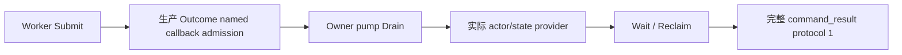

# CK3 1.20.0.2：转换结果查询的 R5 命名入口

2026-10-01 的独立验证达到 `static-ready`，没有访问 CK3，没有提交转换，也没有实机结果声明。EXE SHA-256 为 `AE1BA6FF060BA603842F6F4A2DED0AF4B7D3666B3DD271F75FB01B0DA8E81B2D`。领域字段与原生证据复用已冻结的 [结果查询专题](ck3-1.20.0.2-religion-conversion-outcome-query.md)、actor 和 state 组件。

R5 生产队列新增 `permitted_executor_religion_conversion_outcome12002`。新 wrapper 先包含共享头文件，再将旧 fixture 的 primary 赋值 token 映到该精确字段；旧 20 文件保持冻结。wrapper 将旧 `main` 重命名，仅复用其对象、getter fixture 和 owner pump，自己的入口只运行一个实际队列 case。它在同一个 mailbox 上执行前后均检查 primary 为 `nullptr`，named callback 为 `ExecutePlayerReligionConversionOutcomeMailbox12002`。

唯一新增 `/O2 /W4 /WX` case 首次 GREEN：11 checks，worker Submit、生产命名入口、owner Drain、实际 provider、Wait/Reclaim 与完整 serializer 均执行。读取由 native-shaped fixture callback 提供；这不替代真实 paused snapshot。原 `/Od`、`/O2` 各 48 checks、8 cases 的夹具与 provider 矩阵未重跑。

复现命令：`tools/.venv/Scripts/python.exe research/conversion_outcome12002_named_tests.py --artifacts <Z盘输出目录>`。生产查询仍使用 `query-player-religion-conversion-outcome-v1`，默认关闭的 `XAR_CK3_ENABLE_G2_RELIGION_CONVERSION_PRIVATE_QUERY_V1`，没有新增 action。

证据为 `artifacts/g2-offline-2026-10-01/religion-conversion-outcome/named-permit/attempt-1/result.json`，SHA-256 `618cb65a408287aec1b7f36333eff8a46e3ecb292e85583614ba512ca9189c99`；其中记录实际编译依赖、定义、source/EXE/完整 packet SHA。日报与 W40 周报应记录这次入口达到 `static-ready`，剩余 root 的 paused 实机转换前后事实观测。`target_reached` 仍只表示完整 Rite 身份匹配；费用、Fulfillment 和三个 flag 不推算固定收益或全部效果完成。
