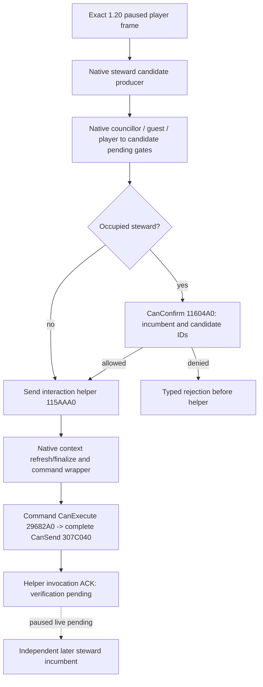

# CK3 1.20.0.2 council assignment

Status: `static-ready`. The exact frozen-file native chain, typed assignment/runtime, private transport and combined offline source-chain fixture are implemented. No CK3 process, desktop, pipe, save or Steam access is part of this work.

Frozen executable SHA-256: `AE1BA6FF060BA603842F6F4A2DED0AF4B7D3666B3DD271F75FB01B0DA8E81B2D`. The machine ABI is `ck3_autonomous_player/native_bridge/research/council_assign12002_abi.json`. Its instruction spans and relative edges are read from the frozen executable, rather than translated old addresses.

The authored standard steward position still uses stewardship and the final stock candidate trigger. This port preserves the existing `CouncilCompositionCandidatesPublicV1`, assignment request, helper-only ACK and independent receipt. Swap, guest recruitment and other council positions remain outside this existing v1 scope.

The `set_position` registration at `0x115B27B` resolves the new handler `0x115B250`. Its vacant branch calls `0x115AAA0` with candidate full CharacterID in ECX and active council task full ID in EDX. The helper reads the current player, builds an interaction context at `0x3076C90`, writes the active task into the payload, refreshes/finalizes, constructs the native command and invokes `0x9E16B0`. The helper returns void; native queue acceptance is not observable through this seam, so the existing ACK semantics remain `native_helper_invoked_verification_pending`.

Occupied replacement constructs a `0x140` byte confirmation, whose fields `+0x130/+0x134` hold incumbent/candidate CharacterIDs. The new native `CanConfirm` derives the incumbent's active task from its unlanded state. Copying the old confirmation size or substituting the active task ID for the candidate field would call the wrong native branch. The exact four-gate receiver is documented independently in `ck3-1.20.0.2-council-gates.md`.

The final command's primary vtable `+0x30` reaches `0x29682A0`, which forwards its embedded context to the already frozen 1.20 complete native `CanSend` at `0x307C040`. Request-time gates do not replace that command-time validation. A successful action receipt must observe the requested candidate as the same active steward task's incumbent on a distinct later paused frame.

The frozen installation contains `gui/window_council.gui` but does not contain the old `window_council_potential_councillor.gui` path. The new handler is therefore evidenced by its exact executable `set_position` registration and branch, not by claiming the absent old GUI file was checked. This does not change the typed action's scope.

The implementation is `ck3_12002_council_assign.cpp` plus `ck3_12002_council_runtime.cpp`. The former binds the actual new helper. The latter composes the new candidate producer, same-transaction four native gates, the existing version-neutral v1 request transaction, pending ACK, and later receipt. No cached candidate or fixture verdict is substituted for the native recheck in production. The old action entry point retains the old SHA; an explicit expected-build argument lets the new binder reuse the transaction without presenting the new executable as the old one.

The runtime uses the existing mailbox executor ABI and v1 wire serializer. Only the candidate serialization's build provenance is supplied by the new provider; request IDs, helper-only ACK and receipt fields preserve their existing meaning. `ck3_12002_council_transport.cpp` ports the five existing private query/final-gates/assignment/receipt/status steps to the new reader and retains pending identity across separate submit and receipt worker requests. Status polls the original mailbox ticket without submitting another query or changing its revision, consumes a completed envelope once, and then returns idle. Public advertisement and formal autonomous assignment remain unqualified until the real four-gate scenes, assignment state change and subsequent turn/checkpoint/cold behavior are observed.

The assignment PE verifier is GREEN for six native spans, seven call/jump edges, the final-validation vtable slot, and two frozen stock files. The unchanged old semantic action fixture remains GREEN after extracting the build argument. The existing old application-main fixture also passes 6/6 with actual compiler and executable return codes zero after extracting the candidate serializer payload; its receipt is `artifacts/g2-offline-2026-10-01/council/old-main-regression/result.json`. Candidate fixtures pass 35/35 and gate fixtures pass 25/25 in both unoptimized and optimized builds.

The actual combined C++ source-chain fixture passes 18/18 under MSVC C++20 `/W4 /WX /Od` and `/O2`, with each compiler and executable returning zero. It calls the new candidate reader, four native gate adapters, shared typed transaction, new submit adapter, independent receipt verifier and actual wire serializer. It covers isolated rejection by each gate without helper invocation, occupied/vacant helper-only ACKs, rejection of a same-frame receipt, failure on a later frame with an unchanged incumbent, success only after the actual task `+0x40` incumbent changes, frame drift during native gating and a disappeared candidate before gating. Sixteen actual wire JSON files are available to the Python/MCP normalizer at `artifacts/g2-offline-2026-10-01/council/source-chain/wire/`.

The source-chain receipt is `artifacts/g2-offline-2026-10-01/council/source-chain/result.json`, SHA-256 `4f94bf9dac4562e3c912c5519eb69894792e8a8d15771b5533a208a1ea683a47`. It pins the compiled sources, fixture header, binaries, logs and emitted wires.

The private transport fixture also calls the actual `HandleCouncilPrivate12002`, registers the actual new executor in production slot 41, drains it through `ObserveMainThreadPumpAndDrain`, and consumes it through the actual status handler. The existing full candidate fixture combines with an owned core frame; the actual `SnapshotRequest` produces `native:13 / public 13 / native 13` and two ready candidate rows. Generated wires cover query pending, status pending, status available, status idle and a separate no-task unavailable result. Status is tested with payload `{}` and revision zero, without submitting another ticket or reading the adapter's full snapshot.

The same Handle fixture then submits the typed assignment through slot 41 and receives a helper-only ACK. The fixture helper records candidate/task without changing the incumbent. An independent owned frame changes core date by one, uses `native:14 / 14 / 14`, and changes the actual task buffer's `+0x40` incumbent; the real receipt route re-reads it, returns `applied` and clears the pending ACK while helper count remains one. Its 16 transport wires include assignment/receipt pending, pending status, ACK/receipt and idle. The final receipt is `artifacts/g2-offline-2026-10-01/council/transport/result.json`, SHA-256 `3089ea1dfff6fb2e5f390cbf43323946c3c95454f8b52e3a43960eb0c7fd0d22`; the earlier query-only GREEN receipt is retained at `transport/query_handle_green_result.json`.

Initial standalone-link/recipe harness failures, the candidate fixture's initial stack-overflow attempt and the transport fixture's missing compile flag attempt are retained in their artifact directories; they are not capability failures or live evidence. The final transport run uses the existing private-route build flag rather than bypassing registration. Real paused candidate/gate truth, natural denial scenes, actual command effects and next-turn/checkpoint/cold qualification remain live work; this offline port does not change G2's 3/8 score.
