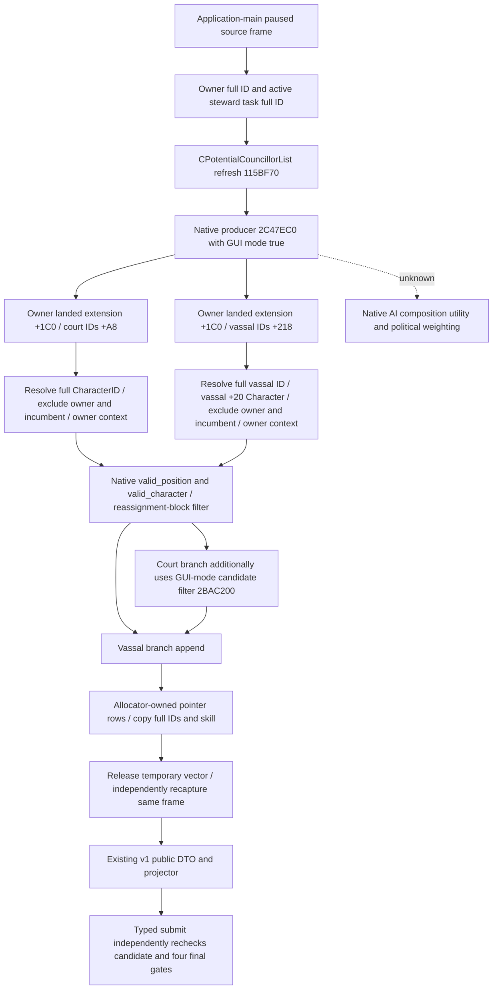

# CK3 1.20.0.2 steward candidate provider

## Frozen native input

This port uses CK3 `1.20.0.2`, EXE SHA-256
`AE1BA6FF060BA603842F6F4A2DED0AF4B7D3666B3DD271F75FB01B0DA8E81B2D`.
The source image and stock files are the frozen
`artifacts/migrations/2026-09-30/post-update-1.20.0.2/installation/` snapshot.
Only executable-file and fixture-memory evidence is used. There is no paused
production artifact for this port yet. Old R693 evidence remains specific to
`1.19.0.6`; it does not admit these new addresses.

The native producer, vector allocation and release chain was mapped and frozen
in [council_candidates12002_abi.json](../../ck3_autonomous_player/native_bridge/research/council_candidates12002_abi.json)
before writing the provider. The matching verifier checks the full image hash,
function spans, instruction bytes, RIP-relative globals, allocator vtable,
source constants and frozen stock input hashes. Disassembly and selected stock
source excerpts are retained under
`artifacts/g2-offline-2026-10-01/council/candidates/`.

## Native source tree

The stock steward definition at
`game/common/council_positions/00_council_positions.txt:139` uses stewardship
as its main skill. `valid_position` excludes the landless-adventurer and nomadic
government flags. `valid_character` uses the ministry-specific branch when
applicable and the stock steward predicate otherwise, followed by the native
ceremonial-liege exclusion. The latter predicate includes availability, adult,
capable, imprisonment, war-with-liege, blocked-hire and travel-character rules.
Gender and current-role conditions remain opaque stock final results; this port
adds no religious state or policy.

The native function accepts `(owner CCharacter*, ActiveCouncilTask*, bool GUI,
vector*)` in RCX/RDX/R8B/R9. The GUI passes `R8B=1` at `0x115C084` and calls
`0x2C47EC0` at `0x115C08A`. It consumes `active_task+0x18 -> task_type+0x40`
for the position and `active_task+0x40` for the incumbent. The court branch calls
`0x31BCED0` and `0x31BCF90` for the compiled position and candidate predicates,
then the native reassignment-block and GUI-mode filters before appending.
The vassal branch uses the same compiled predicates and reassignment-block
filter; it obtains Character pointers through the native vassal component
chain. The port invokes this complete producer rather than reconstructing the
two collections or translating script predicates into C++.

Native producer acceptance is the existing v1 candidate eligibility reason.
`assign` versus `replace` is derived from the same task's vacancy sentinel `-1`.
These fields do not assert that a councillor reassign, guest recruitment,
pending interaction or blocked incumbent can be submitted through the ordinary
typed route. The four final gates remain separate, current-frame checks in the
typed assignment module. The provider supplies no invented native AI score.

## Exact layout and allocator lifetime

| Value | New exact-build source |
|---|---|
| Candidate producer | `0x2C47EC0` |
| Character storage / fallback slots | `0x5C67568` / `0x5C67570` |
| Active task storage / fallback slots | `0x5D1DEA0` / `0x5D1DDF8` |
| Owner landed extension / active-task IDs / count | `+0x1C0` / `+0x230` / `+0x23C` |
| Task identity / type / owner / incumbent | `+0x10` / `+0x18` / `+0x44` / `+0x40` |
| Task type position pointer / stable key | `+0x40` / `+0x18` MSVC string |
| Character stewardship | `+0xE0`, signed int32 points |
| Skill source | `0x28B16B0`: effective array `+0xD8`, stewardship enum `2` |
| Vector | `0x18` bytes: pointer `+0`, capacity int32 `+8`, count int32 `+0xC`, allocator pointer `+0x10` |
| Inline allocator object / vtable | `0x210` bytes / `0x452D0A8` |
| Inline bytes / initial capacity | allocator `+8` / `64` Character pointers |
| Fallback pointer / object | allocator `+0x208` / `0x54DEDE0` |
| Initialize / release | `0x98B8C0` / `0x855830` |

The initializer returns data `allocator+8` and capacity `64`. Producer growth
calls allocator vtable `+8`, copies old pointer rows, then releases the old span
through vtable `+0x10`. The terminal GUI release uses the same vtable entry and
element size `8`. `0x855830` treats inline data as a no-op; grown data uses the
fallback getter at vtable `+0x38`, whose exact leaf reads `allocator+0x208`, then
the fallback allocator's release at `+0x10`. The port owns an aligned allocator
and vector until its one terminal release, including a failed producer or a
collection larger than the existing 64-row DTO. No native pointer is published.

## Provider and acceptance

`ck3_12002_council_candidates.hpp/.cpp` now provides the actual migrated reader.
`BindCouncilCandidates12002(base, sha)` calculates exact native bindings;
`ReadCouncilCandidates12002` consumes the existing request/frame and publishes
the existing public DTO through its unchanged pure projector. It independently
resolves the active steward task from the captured owner and the new component
storage. It copies full candidate IDs and native stewardship, derives vacancy
and route from the same task, releases the vector, then independently captures
the full frame and incumbent again before publication. Missing skill or partial
collections cannot make readiness true.

`ResolveCouncilCharacter12002`, `ReadCouncilMemory12002` and
`CaptureCouncilCandidatesFrame12002` are shared with the migrated four gates
and typed action. Fixture callbacks are explicit, fixture-only substitutions
for native calls; production bindings point to the new producer and allocator
functions. The test-only `src/ck3_12002_council_fixture.hpp` owns component
storage, Character/task/position objects and pointer rows, so the combined
runtime fixture can consume the same production provider rather than handcraft
a public query JSON.

`SerializeCouncilCandidates12002` retains
`xar.ck3.council-composition-candidates/v1` and the existing capability key. It
uses the existing pure codec's validation/escaped status-payload suffix and
constructs its own `1.20.0.2` / EXE SHA provenance prefix. No old native reader
or old-build admission is used.

Acceptance at `artifacts/g2-offline-2026-10-01/council/candidates/`:

- `abi-verification.json`: GREEN; 10 frozen spans, 39 exact instructions,
  6 global loads, 8 allocator vtable entries, 13 source constants and 3 stock
  input hashes. No CK3 process was used.
- `fixture-verification.json`: GREEN; `/std:c++20 /W4 /WX`, `/Od` and
  `/O2 /DNDEBUG` each pass 35 explicit checks. Occupied/vacant/complete-empty
  rows, new stewardship offset, full ID and exact-pointer generation lookup,
  canonical sort with retained native ordinals, task identity/owner, failed
  producer/oversized vector/release, and independent frame/incumbent reads are
  exercised. Native output pointers remain private.
- `fixture-verification-first-attempt.json`: retained harness RED. The first
  `/Od` test main held many oversized owned-memory fixtures in its stack and
  exited with `0xC00000FD`; `/O2` passed. Reducing the test backing Character
  count from 96 to the 24 actually sufficient for these cases closes it. No
  production provider change was needed. The local build script now checks
  signed nonzero exit codes correctly.

This provider is **static-ready**, and the original candidate/v1 DTO row bound
remains 64. A native collection above that bound returns unavailable after
release rather than publishing a truncated collection. A stable paused
production query and actual typed assignment postcondition remain live work;
neither ACK nor this offline provider makes M4 or an OODA loop complete.
