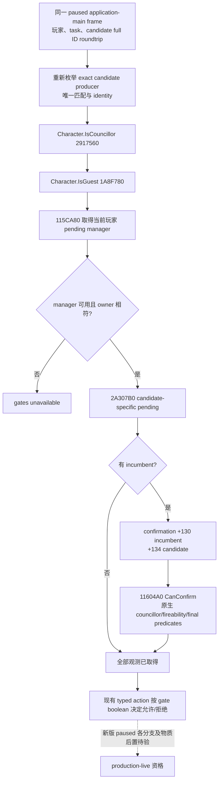

# CK3 1.20.0.2 council 四类 native final gates

本专题只迁移 `councillor_steward` 候选的 final gates。冻结 CK3 `1.20.0.2` EXE SHA-256 `AE1BA6FF060BA603842F6F4A2DED0AF4B7D3666B3DD271F75FB01B0DA8E81B2D`；来源是 `artifacts/migrations/2026-09-30/post-update-1.20.0.2/installation/binaries/ck3.exe`。本轮全部为离线文件分析，尚无新版 paused/live gate 或任命后置证据。旧版实机资格不迁移到新版。

## 原生树与 ABI（实现前冻结）

| gate | 1.20.0.2 exact RVA | 输入与语义 |
|---|---:|---|
| `Character.IsCouncillor` | `0x2917560` | `RCX=CCharacter*`，原生通过 character `+0x1B8`、unlanded `+0xF0` 和 ActiveCouncilTask storage 完整 generation 解析；不是简单 extension 非空 |
| `Character.IsGuest` | `0x1A8F780` | 同一候选指针；调用原生 role enum `0x28C1690`，仅 `EAX==1` |
| 玩家→候选 pending | setup `0x115CA80`；predicate `0x2A307B0` | 零初始化临时 window footprint `0x5E8`；setup 输出 manager 到 `+0x5D8`，`+0x5E0` 必须为零。manager 的 `+0x8` owner full ID 等于当前玩家，predicate 的 EDX 为候选 CharacterID |
| occupied replacement | `0x11604A0` | 零初始化 `0x140` confirmation；`+0x130`=incumbent CharacterID，**`+0x134`=candidate CharacterID**，不是 active task ID；返回完整原生最终 boolean |

registration→handler→leaf 的 evidence 为 `IsCouncillor`: `0x56ADE0→0x2918890→0x2917560`，`IsGuest`: `0x558A20→0x28CECC0→0x1A8F780`，pending: `0x15C450→0x11612C0→0x115D0E0→0x2A307B0`。新版 registration 用 scalar/SIMD 从 literal 拷贝短字符串，而非旧版 LEA pointer。

当前 played CharacterID 全局槽为 `0x54DBC00`；pending setup 从 GameState slot `0x5C68C50` → data `+0xA0` → manager pointer array `+0xCF88`、signed count `+0xCF94`，逐项比较 manager `+0x8` 的 played full ID。predicate 遍历 manager `+0x10/+0x1C` 的 pending full-ID vector，完整 generation 解析后比较 pending `+0x2F4` 与候选 full ID。

`CFireFromCouncilConfirmation` constructor `0x115F740` 的 `EDX/R8D` 分别写 `+0x130/+0x134`。occupied `set_position` 的 `0x115B382` 明确把 `CharacterListItem+0x8` 的候选 full ID 放入 R8D。其 vtable `0x452D470` 的 `+0x38` 槽指向 `0x11604A0`。CanConfirm 把 `+0x134` 送入 Character storage `0x5C67568` 并比较 Character `+0x18`；因此将 task ID 写入此字段与原生不符。active task 由 incumbent 的 unlanded `+0xF0` 解析；frame 的 task identity 仍由候选 provider 验证。

CanConfirm 再调用 `0x2C477E0` 的原生 fireability，及 `0x31BCED0/0x31BCF90` 的最终原生判断。这里只使用最终结果，不自行重写它们的内部策略；它不读取 confirmation view `+0x138`，也没有调用 submit。stock 冻结树没有独立 `window_council_potential_councillor.gui`，本专题不把旧版 GUI 文件误称为新版来源；函数语义由新版 EXE registration、constructor 和调用链绑定。

## 交付与验证

实现为 [ck3_12002_council_gates.cpp](../../ck3_autonomous_player/native_bridge/src/ck3_12002_council_gates.cpp) 与[独立头文件](../../ck3_autonomous_player/native_bridge/include/xar_bridge/ck3_12002_council_gates.hpp)。`BindCouncilGates12002(module_base, sha)` 只安装新版 RVA；`EvaluateCouncilGates12002(environment, frame, candidate_id, resolved_candidate, final_legality)` 复用现有 DTO，保留 provider 的 owner/task/position/candidate/unique-match/identity 字段，仅填四类 gates 及 availability。生产 callback 真实指向上述 native 函数；offline fixture override 仅在 `offline_fixture=true/module_base=0` 时使用。

pending manager 缺失或 owner 不符返回 unavailable；不能把没有 manager 当作无 pending。候选 CharacterID 由同一 resolved pointer `+0x18` 读回；played ID 在 native gate 调用前后与 frame owner 一致。空席不调用 CanConfirm；occupied 构造上述正确的新 payload。当前最高资格为 **`static-ready`**。

[`council_gates12002_abi.json`](../../ck3_autonomous_player/native_bridge/research/council_gates12002_abi.json) 与[`verify_council_gates12002.py`](../../ck3_autonomous_player/native_bridge/research/verify_council_gates12002.py) 绑定 15 段 code span、13 条 relative edge、1 个 vtable slot、4 个 literal、9 条 layout 指令、6 个生产绑定和两份 frozen stock 文件。stock authored `can_be_steward_trigger`/`can_be_fired_from_council_trigger` 继续由 native 最终结果处理，未复制这些规则到本地策略。

生产函数 fixture 在 MSVC C++20 `/W4 /Od`、`/W4 /O2` 下均 **25/25 GREEN**：包括完整 16 种 native boolean 组合、vacancy、pending manager 缺失及 owner 不符、完整 generation ID 不符、played owner 变化、ABI binding，以及 confirmation 的 `+0x134` 必须为 candidate 而非不同的 task ID。测试验证 unavailable 与已观测的 false 不被混淆，候选 provider 字段保持原值。

持久 artifact 位于 `Z:/ck3_mod_rewrite/artifacts/g2-offline-2026-10-01/council/gates/`：`native-disassembly.txt`、`pe-verification.json`、`fixture-od.json`、`fixture-o2.json`、两份 compiler log、以及 source/artifact pins 的 `result.json`。本包没有启动 CK3、访问 pipe/desktop/Steam、或改中央 CMake/bridge/router；中央接线与最终联编由协调者完成。新版实际 paused 的四门 allow/deny、合法任命后的独立内阁读回、next-turn/规定 cold 仍待既有 runner 验收。离线阳性组合不充作自然场景实机证据。
