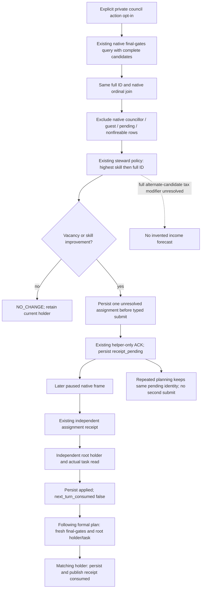

# CK3 1.20.0.2 private council formal consumer

2026-10-01. Native query/assignment chain is the existing exact-build port; the new Python formal consumer is `static-ready`. Its focused tests consume preserved production SDK DTOs. This worker did not launch, inspect or connect to CK3, its pipe, desktop or Steam. Root owns the real paused sessions and shared integration.

The native source is fixed to CK3 `1.20.0.2`, EXE SHA-256 `AE1BA6FF060BA603842F6F4A2DED0AF4B7D3666B3DD271F75FB01B0DA8E81B2D`. Candidate production, full CharacterID roundtrips, same-frame incumbent/skills and allocator release are defined in [the candidate port](ck3-1.20.0.2-council-candidates.md); the actual four native gates in [the gate port](ck3-1.20.0.2-council-gates.md); helper-only ACK and independent receipt in [the assignment port](ck3-1.20.0.2-council-assignment.md). The consumer does not add a native predicate, numeric tax evaluator, public capability or advertisement.

The existing formal strategy accepts public candidate-query history only when both public council capabilities are advertised. The production private SDK methods have no corresponding private formal consumer. Consequently, a private query/ACK alone could not be consumed by a subsequent ordinary council turn. Root authorized the missing private leaf and delegated the shared service/driver hooks separately.

[private_council_formal_consumer_v1.py](../../ck3_autonomous_player/src/xar_autoplayer/private_council_formal_consumer_v1.py) exposes `plan_council_private(driver, planned, snapshot, history, available_steps, *, state_dir=None)`, `submit_council_private(driver, *, plan, expected_revision)`, `read_council_receipt_private(driver, *, pending, expected_revision)` and `read_council_ledger(state_dir)`. The default opt-in is the existing driver `allow_private_council_action`; when false the planner returns its input without a query or ledger access. Shared hooks use lazy imports and preserve existing nonwar priorities.

The selected steps remain `private-assign-councillor-v1` and `private-query-assign-councillor-receipt-v1`. Plan fields carry `council_private_query`, `council_decision`, `council_pending_action`, `council_observation_consumed` and, after a successful follow-up, `council_receipt_consumed`. The original complete query is retained for submission; final-gate filtering affects policy ranking only. The native submission still rechecks the exact provider and gates.

The durable file `private-council-formal-v1.json` stores the actual source decision, request, pending ACK and applied receipt. A second plan cannot submit while that assignment is pending. An `applied` receipt also requires an independently queried campaign-root steward holder; its task, target, frozen state and progress are retained. The following planner reads current native gates and an independent root again before persisting `next_turn_consumed=true`. A new process may restart native revisions at one; the current holder is observed directly. Cached receipt revisions do not substitute for that observation.

## R10 current scene: retain the existing steward

Root's real R10 SDK batch at `targeted-sdk-r10/r10-core-council-sway-readonly-20261001T151027Z` reports paused actor `29829`, date raw `53169360`, native revision `1`. The complete final-gates payload has thirteen candidates, ten of which pass the action gates. IDs `33435`, `34333` and `34867` are already councillors. All thirteen report `candidate_is_guest=false`, `pending_character_interaction=false`, and incumbent fireability true.

The incumbent is `33433`, stewardship `15`, running `task_collect_taxes`, with no target and `frozen=false`. The highest legal alternative is `32716`, stewardship `11`; the existing policy therefore returns `NO_CHANGE` with skill difference `-4`. No assignment is justified by this frame. The actual root monthly income is Q100000 raw `592492`, and actual player gold raw `45790783`; the external helper records the ordinary `10000000` reserve and remaining `35790783`. The narrow council action exposes no numeric spend quote. These actual values do not imply a measured alternate-candidate income forecast.

One active war exists in the real snapshot. It is retained as background state; this package does not call a war planner, research war inputs or execute a war action. The root-owned normal follow-up uses the existing nonwar dispatch, never `ck3_plan_turn` or `ck3_auto_turn`.

## Focused production DTO fixture and remaining live work

[The new focused test](../../ck3_autonomous_player/tests/unit/test_private_council_formal_consumer_v1.py) uses [nine preserved SDK DTOs](../../ck3_autonomous_player/tests/fixtures/private_council_formal12002_actual.json), each pinned to its source packet SHA-256. The earlier real positive scene has incumbent `32716` skill `11` and legal candidate `33433` skill `15`; its actual native pending ACK and independent later receipt feed the new production functions. Only the request correlation token is echoed for the fixture caller. No native verdict, candidate, skill, gate or holder is invented.

The two cases verify the complete positive consumer chain, pending re-planning without a second submit, independent holder plus `task_collect_taxes`, actual R10 re-observation at native revision one, current `NO_CHANGE`, and default OFF with zero queries. Both pass in the current Python runtime, exit code zero. The first attempted pytest invocation lacked the S/src import root and stopped during collection; the wrapper fixes that harness path and retains the failure classification. No old matrix was rerun.

Evidence is under `artifacts/g2-offline-2026-10-01/m4-council-live-next/`: `consumer-fixture-result.json`, `consumer-fixture.log`, the actual R10 selection receipt and the root-executable `council_live_next.py` helper. The helper's `inspect` stage is offline; live stages are reserved for root. Existing SDK native query/typed assign/receipt are reused, and current R10 has no improving assignment. Shared hooks, a fresh integrated Python runtime, an actual formal following-turn receipt, and a root checkpoint/cold observation remain integration/live work. The frozen L9 source and current R9 DLL were not changed or hot-swapped. This leaf does not itself increase G2 or close M4.
