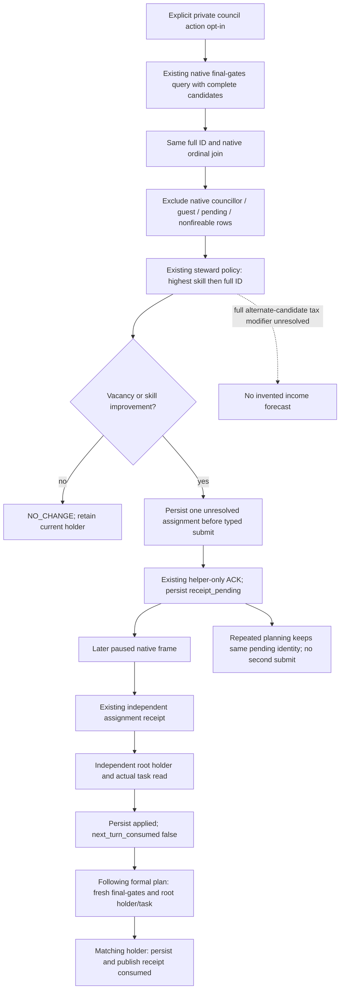

# CK3 1.20.0.2 private council formal consumer

2026-10-01. Native query/assignment chain is the existing exact-build port; the new Python formal consumer is `static-ready`. Its focused tests consume preserved production SDK DTOs. This worker did not launch, inspect or connect to CK3, its pipe, desktop or Steam. Root owns the real paused sessions and shared integration.

2026-10-02 continuation: the migrated exact Steam1.20.0.3 consumer has one actual Murchad **production-live loop** below, covering a legal vacant-seat assignment, independent holder/task receipt, successful following-plan consumption and normal nextsave. The original .2 research, focused results and failed attempts remain historical evidence. This closes the narrow Council subcondition, not overall G2 M4.

The native source is fixed to CK3 `1.20.0.2`, EXE SHA-256 `AE1BA6FF060BA603842F6F4A2DED0AF4B7D3666B3DD271F75FB01B0DA8E81B2D`. Candidate production, full CharacterID roundtrips, same-frame incumbent/skills and allocator release are defined in [the candidate port](ck3-1.20.0.2-council-candidates.md); the actual four native gates in [the gate port](ck3-1.20.0.2-council-gates.md); helper-only ACK and independent receipt in [the assignment port](ck3-1.20.0.2-council-assignment.md). The consumer does not add a native predicate, numeric tax evaluator, public capability or advertisement.

The existing formal strategy accepts public candidate-query history only when both public council capabilities are advertised. The production private SDK methods have no corresponding private formal consumer. Consequently, a private query/ACK alone could not be consumed by a subsequent ordinary council turn. Root authorized the missing private leaf and delegated the shared service/driver hooks separately.

[private_council_formal_consumer_v1.py](../../ck3_autonomous_player/src/xar_autoplayer/private_council_formal_consumer_v1.py) exposes `plan_council_private(driver, planned, snapshot, history, available_steps, *, state_dir=None)`, `submit_council_private(driver, *, plan, expected_revision)`, `read_council_receipt_private(driver, *, pending, expected_revision)` and `read_council_ledger(state_dir)`. The default opt-in is the existing driver `allow_private_council_action`; when false the planner returns its input without a query or ledger access. Shared hooks use lazy imports and preserve existing nonwar priorities.

The selected steps remain `private-assign-councillor-v1` and `private-query-assign-councillor-receipt-v1`. Plan fields carry `council_private_query`, `council_decision`, `council_pending_action`, `council_observation_consumed` and, after a successful follow-up, `council_receipt_consumed`. The original complete query is retained for submission; final-gate filtering affects policy ranking only. The native submission still rechecks the exact provider and gates.

The durable file `private-council-formal-v1.json` stores the actual source decision, request, pending ACK and applied receipt. A second plan cannot submit while that assignment is pending. An `applied` receipt also requires an independently queried campaign-root steward holder; its task, target, frozen state and progress are retained. The following planner reads current native gates and an independent root again before persisting `next_turn_consumed=true`. A new process may restart native revisions at one; the current holder is observed directly. Cached receipt revisions do not substitute for that observation.

## 2026-10-03 actual `.3` read rejection and focused recovery

ROOT's immutable Python `38b43747` normal-once attempt
`m5-family/robert-fresh-child-38b4-actual-normal-once-02` exited1 before
Family planning, with zero formal turns and zero elapsed game days. Its
original result, traceback, sent packets and seven received command-result
frames remain preserved. The failure reached the default Steward read in
`plan_council_private → query_council_final_gates_private_v1` and was exposed
as `private council operation command_result is unavailable`.

The raw sequence identifies the actual rejection: Chancellor final-gates
with expected native revision10 returned available, query-sequence21 and
fourteen rows; the following explicit `councillor_steward` read still sent10
and received `ok=false` with
`nonwar private snapshot revision is stale or malformed`. All three relevant
Council native macros are ON in the v21 build and the `.3` registrar/provider
path is present. This is a real outer native rejection before provider
execution, not a timeout, missing role/flag or the clergy query's lawful
`CanReassign=false` result.

The native dispatcher requires both the expected state revision and the
current/previous native snapshot binding to match. Consumer and transport
already take a snapshot per role; the defect was loss of the actual rejection
and no read recovery when that binding expired between capture and send.
The preserved attempt exports no after `state_snapshot`, so neither a
specific successor revision nor an actual10→11 transition is asserted.

The minimal source fix is confined to `council_private_transport_v1.py`.
Only a matching request's exact stale rejection for readonly candidates or
final-gates is classified for recovery. Within the existing command timeout
it waits for a changed binding, rebuilds the full request once, and uses that
fresh before-frame for the original normalization and post-binding checks.
Public revision and snapshot identity may refresh together with native
revision. Submit, receipt and status are not retried; native guards, action
policy, consumer, driver, service, MCP and provider remain unchanged.

One new `test_council_readonly_fresh_frame_v1.py` case passed in0.73s through
the real consumer → NativeDriver → transport/normalizer route. It uses the
actual stale-response shape, then a **synthetic fixture** successor
native11/public3, verifies a freshly bound Steward quote and current plan,
and rejects the old cached root before querying the new root. The11/3 values
belong to that fixture, not to the failed live attempt. No old suites or
native fixtures were rerun. This fix is **static-ready**, pending ROOT's
normal production-flow confirmation; no native patch or DLL rebuild is
required and no assignment or extra day is credited here.

[Release inventory](Z:/ck3_mod_rewrite/artifacts/g2-maintainer-2026-10-02/resume-12003/m4-council/actual-final-gates-unavailable-38b/Python/OWNED-RELEASE-INVENTORY.json)
and [focused receipt](Z:/ck3_mod_rewrite/artifacts/g2-maintainer-2026-10-02/resume-12003/m4-council/actual-final-gates-unavailable-38b/Python/python-focused-01-receipt.json)
pin the two source paths, original raw packets, single test, minimal diff and
separate actual/fixture timeline. Native closure is recorded in
`actual-final-gates-unavailable-38b/native/readout.json`. Closed Robert
Chancellor action/next/cold proofs stay at their prior scope and are not
replayed for this transport repair.

### V22 closed ordinary turn: readonly flow restored

The first closed normal window after the `b594` / v22 deployment is
`m7-robert/ewan0801-following-normal30-b594-v22-actual-01`. One bounded offline
extraction of its closed summary, actual turn and command-result stream is in
[the current report fields](../../../artifacts/g2-maintainer-2026-10-02/resume-12003/m4-council/actual-final-gates-unavailable-38b/actual-v22-normal-01/REPORT-FIELDS.json).

The actual production planner completed both Chancellor and Steward final-gates
reads: query sequences `17` and `18`, each available, each with fourteen
candidates and exact native revision `5`. The ordinary plan recorded
`council_observation_consumed=true`; the Steward decision was `NO_CHANGE`.
The independent current root and existing receipt-consumption record retained
Chancellor `43696` with `task_foreign_affairs`, and the original `d660…` action
remained `next_turn_consumed=true`. Those holder/task observations belong to
the planning frame at raw date `53222304`, not to a newly sampled post-clock
Council frame.

The following formal `life-advance` succeeded for **three actual days**:
native `5` / public revision `2` / raw `53222304` became native `8` / public
revision `5` / raw `53222376`. The sent-packet record contains **zero new
Council assignment submissions**. The next natural modal stopped the wider
window with `existing_consumer_not_ready`; it does not negate the completed
Council reads or the executed advance. No Family submission is credited from
this window.

This establishes an actual production normal turn through the released
Council readonly path. The packet contains **zero stale rejections**, so the
new stale-recovery branch was **not exercised in this actual window**; its
specific rejection-to-refresh behavior remains covered by the one focused
production-path test. Native `11` / public `3` remain synthetic fixture values.
The original failure artifact remains retained; broad M4 and the requested
thirty-day window remain incomplete.

## R10 current scene: retain the existing steward

Root's real R10 SDK batch at `targeted-sdk-r10/r10-core-council-sway-readonly-20261001T151027Z` reports paused actor `29829`, date raw `53169360`, native revision `1`. The complete final-gates payload has thirteen candidates, ten of which pass the action gates. IDs `33435`, `34333` and `34867` are already councillors. All thirteen report `candidate_is_guest=false`, `pending_character_interaction=false`, and incumbent fireability true.

The incumbent is `33433`, stewardship `15`, running `task_collect_taxes`, with no target and `frozen=false`. The highest legal alternative is `32716`, stewardship `11`; the existing policy therefore returns `NO_CHANGE` with skill difference `-4`. No assignment is justified by this frame. The actual root monthly income is Q100000 raw `592492`, and actual player gold raw `45790783`; the external helper records the ordinary `10000000` reserve and remaining `35790783`. The narrow council action exposes no numeric spend quote. These actual values do not imply a measured alternate-candidate income forecast.

One active war exists in the real snapshot. It is retained as background state; this package does not call a war planner, research war inputs or execute a war action. The root-owned normal follow-up uses the existing nonwar dispatch, never `ck3_plan_turn` or `ck3_auto_turn`.

## Focused production DTO fixture and remaining live work

[The new focused test](../../ck3_autonomous_player/tests/unit/test_private_council_formal_consumer_v1.py) uses [nine preserved SDK DTOs](../../ck3_autonomous_player/tests/fixtures/private_council_formal12002_actual.json), each pinned to its source packet SHA-256. The earlier real positive scene has incumbent `32716` skill `11` and legal candidate `33433` skill `15`; its actual native pending ACK and independent later receipt feed the new production functions. Only the request correlation token is echoed for the fixture caller. No native verdict, candidate, skill, gate or holder is invented.

The two cases verify the complete positive consumer chain, pending re-planning without a second submit, independent holder plus `task_collect_taxes`, actual R10 re-observation at native revision one, current `NO_CHANGE`, and default OFF with zero queries. Both pass in the current Python runtime, exit code zero. The first attempted pytest invocation lacked the S/src import root and stopped during collection; the wrapper fixes that harness path and retains the failure classification. No old matrix was rerun.

Evidence is under `artifacts/g2-offline-2026-10-01/m4-council-live-next/`: `consumer-fixture-result.json`, `consumer-fixture.log`, the actual R10 selection receipt and the root-executable `council_live_next.py` helper. The helper's `inspect` stage is offline; live stages are reserved for root. Existing SDK native query/typed assign/receipt are reused, and current R10 has no improving assignment. Shared hooks, a fresh integrated Python runtime, an actual formal following-turn receipt, and a root checkpoint/cold observation remain integration/live work. The frozen L9 source and current R9 DLL were not changed or hot-swapped. This leaf does not itself increase G2 or close M4.

## Actual Steam1.20.0.3 Murchad formal loop

Root's actual `artifacts/g2-maintainer-2026-10-02/resume-12003/m7-murchad/formal-v8-01` uses frozen `production-source-50e353bf`, Steam1.20.0.3/build25652598 EXE SHA `94B55397ABB687A3DCD436805A5D885E6BE90FA6C693FEB44A9E3BBEEADE02A6`, and ordinary actor31853/episode `native-31853-af642d76cb41`, XAR off. The existing MCP `--private-council-action` opts in both Council query and action; `--nonwar-only`, state/pipe/environment and the ordinary succession lifecycle remain bound to this campaign. The older `native-auto-run` lifestyle/construction/family flags do not enable Council; that CLI has no Council switch. This observation uses the existing formal service planner/auto path, without a new policy or runner.

Turn001 at native:3/date53327160 has a **vacant** Steward seat. The native-final-gated selector chooses39761 with effective stewardship8 over legal alternative36403's7;36567 is excluded as already councillor. The outcome is `ASSIGN_REQUIRED`, not replacement of an incumbent. The existing action `council-formal-91a92a6ad4264b029ff829ebd33ecb78` is submitted once through the production formal consumer. Its pending helper ACK is not counted as completion.

Turn004 at native:12/date53327640 obtains an `applied` receipt with `postcondition_verified=true` and independently reads campaign-root holder39761 on `task_collect_taxes`. That receipt's original **`next_turn_consumed=false` is retained**. Turn006's successful `life-advance` plan includes `council_receipt_consumed.next_turn_consumed=true`, with the same receipt identity and independently current holder39761/task_collect_taxes. Its fresh Council decision is `NO_CHANGE`: current stewardship8 exceeds remaining legal candidate36403's7, gain−1. There is no repeated assignment. Turn006 advances30days; the complete bounded ordinary loop advances50days.

The final existing normal checkpoint is `saved`, date53328360/history2013, size111736694, SHA `47cada95586efa7092c74e402867b2bbb33c32afcda908c192c4cb77da299b09`. This closes one **production-live loop** for lawful vacancy assignment → independent receipt/holder/task → successful later formal-plan consumption → normal nextsave. Alternate-candidate tax utility and an isolated appointment income effect were not measured. Overall M4 remains subject to its other requirements, and this loop does not qualify other-role appointments or multiple episodes.

Exact closed evidence and hashes are in `artifacts/g2-maintainer-2026-10-02/resume-12003/m4-council/spymaster-readonly/MURCHAD-COUNCIL-V8-REPORT-FIELDS.json`, linking `formal-v8-01/turn-001/result.json`, `turn-004/result.json`, `turn-006/result.json` and `checkpoint.json`. The same runtime's later paused readonly `murchad-v8-peaceful-readonly-01` independently retains Steward8 over legal7 and [Spymaster14 over legal4](ck3-1.20.0.3-spymaster-candidates.md); both are `NO_CHANGE`. The Council worker ran each saved-packet comparison once and performed zero live connections/actions. All previous RED artifacts and the intermediate unconsumed receipt remain available; later success does not overwrite them.
