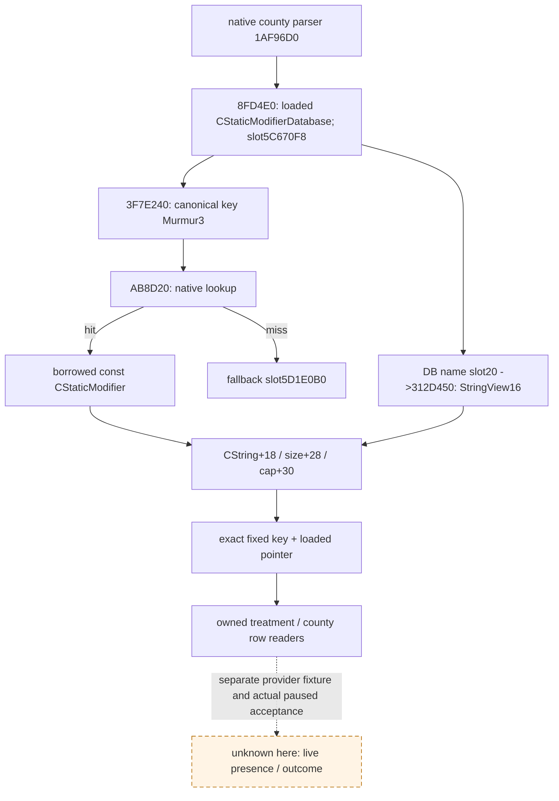

# 1.20.0.2：疫情治疗与县恢复共用 loaded modifier 定义

本包闭合三个固定 key 的 **CStaticModifier 定义查询 ABI**，为新[治疗专题](event12002_physician_epidemic_events_1000.md)和[恢复专题](event12002_epidemic_events_0110.md)的各自 provider 提供常量。资格为 **static-ready ABI**；不等于新版 paused presence 或疫情物质结果。复用 gift/FAMILY 的实际 stable hash 与 CString 方法，但 `COpinionModifierDatabase` 并不是本包的 `CStaticModifierDatabase`，不能复用其 DB slot/lookup。

## Exact build 与冻结证据

CK3 `1.20.0.2 Crozier / Steam25588574`，EXE SHA-256 `AE1BA6FF060BA603842F6F4A2DED0AF4B7D3666B3DD271F75FB01B0DA8E81B2D`，101,039,736 bytes，image base `0x140000000`。读取的是冻结 EXE 文件，没有启动 CK3、读任何游戏进程、pipe、UI 或 Steam。

[ABI manifest](../../ck3_autonomous_player/native_bridge/research/event12002_loaded_modifier_definition_abi.json)与[验证器](../../ck3_autonomous_player/native_bridge/research/event12002_loaded_modifier_definition_abi.py)冻结 **8 个 native spans、18 条语义指令、4 条直接 call、6 条 RIP 绑定、3 组 RTTI 与一个 DB vtable 前缀**。最终[验证 receipt](Z:/ck3_mod_rewrite/artifacts/g2-offline-2026-10-01/events12002/loaded-modifier-definitions/verification.json) **44/44 GREEN**，SHA-256 `39D1B26204E5BC2EFA8C771960E4ED81734BFCA53E04383A1985948CC3110363`。[原首轮失败](Z:/ck3_mod_rewrite/artifacts/g2-offline-2026-10-01/events12002/loaded-modifier-definitions/attempt-001-verifier-rex-prefix-red.json)保留为 harness RED：名称 fallback load 实际用 `4C 8B`，验证器只接受 `48 8B/8D`；修正 REX 前缀列表后只重跑该受影响 ABI 验证。不是 capability RED。

## 可直接绑定的调用合同

| 输入/查询 | 新 RVA / layout | 真实调用形状 |
| --- | --- | --- |
| 已加载 static modifier DB | getter `0x8FD4E0`，slot `0x5C670F8` | `void* GetStaticModifierDatabase()` |
| stable key hash | `0x3F7E240` | `uint32_t(void* ignored_or_database, const char* bytes, uint32_t length)`；RCX 不影响哈希，字符串在 RDX、长度在 R8D |
| 已加载 definition lookup | `0xAB8D20` | `const void*(void* database, int32_t hash_bit_pattern)`；保留 unsigned 哈希的全部 32 bits 传入，不作数值截断 |
| 不存在定义的 fallback | slot `0x5D1E0B0` | lookup miss 返回共享 null definition；不能当成存在目标 modifier |
| 以 numeric definition index 取名称 | `0x312D450`，DB virtual slot `+0x20` | `StringView16*(void* database, StringView16* output, int32_t definition_index)`；RCX=db、RDX=out、R8D=index；返回 out |
| definition numeric index | `+0x10` | county parser 读取 int32 index；不是角色/县 full-generation ID |
| canonical key CString | storage `+0x18`、length `+0x28`、capacity `+0x30` | 沿既有 CString 的 16-byte union 与 64-bit length/capacity；capacity `<16` 用 inline bytes，`>=16` 取 storage 内 heap pointer |

native 名称查询从同一 definition 读取 `+0x30` 的 64-bit capacity，用 `definition+0x18` 定位 storage，读 `+0x28` 的低 32-bit 长度生成 `StringView16`：data pointer `+0`、uint32 length `+8`、zero byte `+0xC`，其余 padding 无语义承诺。新 provider 保留已有自进程 exact CString key 比对即可，不必额外调用 by-index 名称函数。

`has_county_modifier` 的 parser `0x1AF96D0` 实际调用 **getter `0x8FD4E0` → hash `0x3F7E240` → lookup `0xAB8D20`**，把返回 definition 存到 trigger object `+0x60`。其 constructor `0x1AF7440` 先从 `0x5D1E0B0` 填 fallback；因此县 getter 使用本包同一 loaded key/definition 表，不能把 opinion modifier 或枚举数值代入。

同一 parser 在 `0x1AF9718` 读取 definition `+0x38` 的 `0x4744624F`（ObDG）作为原生已加载有效性标识。名称 getter 本身不作这个判定；本包没有要求新增每帧 RTTI/tag 门禁。原有“非 null/fallback，且 canonical key 精确匹配”仍是三个固定 key 的 provider 路径。lookup 根据 DB 当前阶段使用引擎既有 read lock，不能把锁行为说成纯内存无副作用；它不发送任何游戏动作。

RTTI 互证：`CStaticModifierDatabase` type descriptor `0x5B22F28` / primary COL `0x4F82148` / vtable `0x48C04A8`，ctor `0x3129960` 的 `0x31299A9` 将该 vtable 装入实例。definition `CStaticModifier` type descriptor `0x55C2618` / COL `0x4F82080`；null definition type descriptor `0x5AF56F8` / COL `0x4F57F68`。这些是 exact-build 定位证据，不是我方新增 runtime 限制。

## 三个固定 key 与既有原版证据

| key | Murmur3 uint32 | 原版定义 |
| --- | --- | --- |
| `ce1_unorthodox_epidemic_treatment` | `0x22A483B2` | `06_ce1_modifiers.txt:896–900`；resistance `+10`、zealot opinion `-10`；原事件 native `1` 设置五年 |
| `county_epidemic_recovered_minor_modifier` | `0x3E54A9F3` | `:26–29`；development growth `+2` |
| `county_epidemic_recovered_tiny_modifier` | `0x0C37024D` | `:31–34`；development growth `+1` |

以上同一 `common/modifiers/06_ce1_modifiers.txt` 的既有 1.20 source-review SHA-256 为 `63FEB33C8C5BF825E3D186E841D07235C98D6AED27C47375E495EA832255C52B`，三定义旧/新一致。治疗 block SHA `A36050C992004B580EE44BF243269073FE218650498681DCCC0CAE0B28E4C822`，minor block SHA `B8FA2B0FEC56875A90E8140999938A68C3B523572ED41BB75FF0081313154CF1`，tiny block SHA `0497745AD65BA006057EA5AA31E789CAA6F66B5A83A16AB3CE7038629FD34832`。冻结安装 A 的局部 game copy 缺该文件，本包直接复用事件 owners 已冻结的新版 source review，没有重新搜索完整安装或声称 fresh-copy 读过它。

独立[完整 Mermaid](../../ck3_autonomous_player/native_bridge/research/event12002_loaded_modifier_definition_abi.mmd)另保留 inline/heap 分支。历史 `0x88F370` / `0x3B8B000` / `0xA41F10` / `0x570C968` 不被新版 adapter 沿用；名称 `+0x18` 虽相同，已由本版实际名称函数重新证明。

本包不新增共享 production helper；两个域 owner 直接在各自新 binder 中绑定上述常量并复用原 DTO/serializer。modifier presence 的不同存储、县/title identity、remaining days、事件前后 material、next turn 与 cold 属于各自后续，不能由这里的定义 lookup 或固定 hash 通过推断完成。
