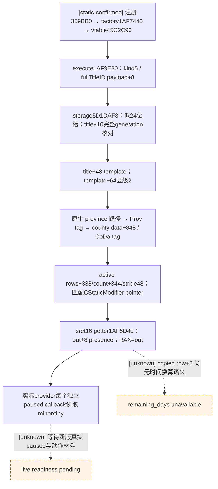

# CK3 1.20.0.2：疫后恢复县修正 ABI

2026-10-01，**static-confirmed ABI**。仅读取冻结 EXE；未访问 CK3 进程、pipe、桌面或 Steam。本子包为 `.0110` 的实际新版 provider 提供完整 Title 身份、县级判定及当前 minor/tiny 修正存在性调用，provider 与 fixture 由事件实现代理接入。它没有新增 live 资格，也不证明县修正持续时间。

Exact build：`1.20.0.2 Crozier / Steam25588574`，EXE SHA-256 `AE1BA6FF060BA603842F6F4A2DED0AF4B7D3666B3DD271F75FB01B0DA8E81B2D`。机器合同为 `ck3_autonomous_player/native_bridge/research/event12002_recovery_county_modifier_abi.json`；同名前缀 `.py` 仅读磁盘验证，`.mmd` 保存同源树。artifact 位于 `artifacts/g2-offline-2026-10-01/events12002/recovery-county-modifiers/`。旧布局及材料缺口见[旧县修正研究](m2-0110-county-modifier-observer-abi-2026-09-22.md)与[事件源迁移](event12002_epidemic_events_0110.md)。

一次 ABI 验证 **PASS**：8 段 exact native bytes、61 条指令、6 个 direct call/jump edge、11 个 RIP edge、2 个 vtable slot、3 个 RTTI 绑定以及19项 decisive call-shape检查。机器合同 SHA-256 `50976f688a6462eb7bfb9346493440576fdd69f19199ca7a22ee8bbf64161453`，实际结果为上述 artifact 目录中的 `verification.json`。这些是磁盘 ABI 检查，不是 fixture-live 或 paused 实机。

## 新版实际入口与身份

`has_county_modifier` 字符串 RVA `0x45C1588` 的注册器为 `0x359BB0`。注册 factory vtable `0x45C4128` 的 slot1 指向 `0x1AF7440`；factory 生成 vtable `0x45C2C90`，slot25 指向 `0x1AF9E80`。RTTI COL `0x4C11478`、type descriptor `0x5833B30` 的实际名称为 `.?AV?$CHasModifierTrigger@USCountyModifierTraits@@@@`，因此不是根据旧地址位移猜测入口。

执行器 `0x1AF9E80–0x1AF9ED5` 要求 `EventTarget16.kind==5`，读取 payload `+8` 的完整 LandedTitleID，按下表解析当前对象，并以 `title+0x10` 比较完整 ID，保留 generation。随后读取 trigger 对象 `+0x60` 的已解析 CStaticModifier 定义指针，尾调 **Boolean** helper `0x1AF5BB0`。`0x1AF8B17` 的另一实际消费者则调用 **sret16** helper `0x1AF5D40`，并直接读取 out `+8` 的 presence；两种 ABI不能混用。

| Provider 输入 | 1.20.0.2 已证值 | 精确指令入口 |
| --- | --- | --- |
| Title storage / fallback slot | `0x5D1DAF8` / `0x5D1DAE0` | `1AF9E96` / `1AF9EC5`；现有 title map resolver `A847F7` / `A8482A` 同源 |
| storage slots / capacity | `+0x20` / `+0x2C` | `1AF9EAF` / `1AF9EAA` |
| index / slot stride / pointer | fullID `&0x00FFFFFF`；`0x10`；slot `+8` | `1AF9EA4` / `1AF9EB3–1AF9EB6` |
| full identity / type tag | Title `+0x10`；`+0x14==0x4C616E64` (`Land`) | `1AF9EC0`；`1AF5D54/1AF5D6F` |
| Title template / county tier | **`+0x48`** → template **`+0x64==2`** | `1AF5D78–1AF5D80`；title map `230F900/230F904` 同源 |
| native province / county data | Province `+0x85C==0x50726F76` (`Prov`)；county data pointer `+0x848` | `1AF5DFD/1AF5E0D` |
| county data validity | `+0x3E0==0x436F4461` (`CoDa`) | `1AF5E14` |
| active modifiers / count / stride | **`+0x338`** / **`+0x344`** / `0x48` | `1AF5E24/1AF5E2B/1AF5E45` |
| active row identity / opaque time | row `+0` definition pointer；row `+8` native time | `1AF5E40/1AF5E63` |

旧 `0x1942CB0`、Title `+0x160`、template tier `+0x5C`、county data `+0x850` 和 active array `+0x320/+0x32C` 均不能直接复用于此构建。现有新版 title map 的 storage/generation/template 合同可复用；没有执行 camera 或导航动作。

## 当前存在性的调用形状

新版 **`CountyModifierResult* (*)(CountyModifierResult* out, void* title, void* definition)`** 地址为 **`0x1AF5D40`**，完整函数止于 `0x1AF5EEA`（末端不含）。MSVC x64 的 `RCX=out`、`RDX=Title*`、`R8=CStaticModifier*` 分别由 `1AF5D61/1AF5D5E/1AF5D5B` 保存；`1AF5ED7` 返回同一 out 地址。

结构仍为16字节：`+0` 的8字节 opaque native time、`+8` 的1字节 presence、7字节填充。查到当前 active row 时 `1AF5E63–1AF5E6C` 复制 row `+8` 到 out `+0`，再将 presence置1；合法未命中或原生无效对象路径置0。正常未命中不会初始化 time，因此 provider 应零初始化结构，只消费 presence 0/1，并先核对当前完整 Title 身份与 county tier。一次查询调用一次 getter读取当前数组；后置材料必须由后继 paused callback 再查询，不能复用旧 result 或队列 ACK。

实际消费者 `1AF8B0E` 从 trigger `+0x60` 取 CStaticModifier 到R8，`1AF8B12` 将栈16字节 out 放入RCX，`1AF8B17` 调新 getter，`1AF8B1C` 比较 out `+8`。这直接证明 sret/presence ABI。Boolean helper `0x1AF5BB0` 则返回AL，不能把它转型成旧16字节函数调用。

Definition 子包独立冻结实际 **CStaticModifier** 库。parser `0x1AF96D0` 将该库查得的 pointer写入 trigger `+0x60`；factory `1AF748D` 从 `0x5D1E0B0` 读取相同 fallback。其 DB/hash/lookup/name 由 `event12002` modifier definition ABI 子包提供；OpinionModifier 库用于赠礼／拉拢，不能替换 county 的 CStaticModifier pointer。此子包只复用同表证明，不重复扫描 definition 注册。

ABI 验证只证明冻结字节、full-generation/县级读取、真实 call shape 和 loaded modifier pointer关系。完整 provider 自进程 fixture、MCP 发布及新版本 paused／同日动作前后县材料由各责任人记录。事件 after 会清空原列表，因此先冻结县ID、动作后按同一完整ID查询；已有修正的 presence不能证明续期，`remaining_days` 仍须保持 unavailable。本子包不改 event policy、不开展战争研究。
