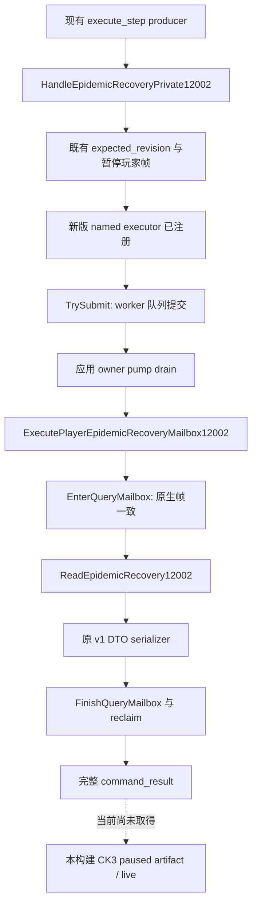

# CK3 1.20.0.2：疫病恢复县材料实际 mailbox 入口

2026-10-01，R4 增量；状态 **static-ready**。冻结 CK3 1.20.0.2 / Steam build 25588574，EXE SHA-256 `AE1BA6FF060BA603842F6F4A2DED0AF4B7D3666B3DD271F75FB01B0DA8E81B2D`。本轮仅执行编译器与夹具自身进程，未读取、启动或操作真实 CK3。

新增 `ck3_12002_epidemic_recovery_mailbox.hpp/.cpp` 为已冻结 [县材料 provider](ck3-1.20.0.2-epidemic-recovery-material.md) 补齐实际应用主线程 caller。原版 source 树、变量列表、title/generation、CStaticModifier 与 getter ABI 证明复用该专题及其三个 ABI 专题；原 provider 的 22 项验证未重跑，R2/R3 冻源未修改。

## 入口与执行路径

`IsEpidemicRecoveryPrivate12002(step)` 保留 `query-player-epidemic-recovery-v1` 和 `query-player-epidemic-recovery-v1-title-<positive-full-ID>`。`HandleEpidemicRecoveryPrivate12002(adapter, mailbox, published, revision, step, payload, request_id, serialized, failure)` 绑定当前模块的新版 source，委托同一 `HandleEpidemicRecoveryPrivateBound12002` 控制器。夹具只注入自己持有的 objects/function bindings；没有替换 provider、callback 或 serializer。



新 callback 使用 `permitted_executor_epidemic_recovery12002`，保留旧 1.19.0.6 ordinal。控制器直接检查该 named field 等于实际 callback；通用旧 mailbox 的全空 executor fixture 语义不变。中央负责新 default-OFF `XAR_CK3_ENABLE_G2_PLAYER_EPIDEMIC_RECOVERY_PRIVATE_QUERY_V1`、注册、共享 CMake 和 dispatch，本包不编辑这些路径，也不提供 action。

列表模式要求 published 当前 event instance 为正值；既有 Python transport 继续约束 expected instance。原版 `after` 清空列表，所以后查询使用前态冻结的 explicit full title ID，无需 after 仍存在事件或列表。现有 payload 仍只承载 expected revision，不新增协议字段。原 native DTO 保留 revision、日期、full actor、requested title，false 是当前确知 absence，空 counties 是确知空集，null counties 加 reason 是读取失败；duration 仍为 `duration_abi_not_verified`。同日 legitimacy 复用现有 `query_campaign_root_context_v1` 的 `player_legitimacy_v1`，不增加第二个 getter。

输出沿用 transport 的完整 `command_result`：`type/protocol_version/request_id/ok/result`，result 精确包含 `step/accepted/status/query_sequence/observation_revision/snapshot_revision/player_epidemic_recovery/private_build/read_only/advertised/backend_id`。成功 owner observation 标明 private/read-only、`advertised=false`、`backend_id=native-headless`；typed unavailable 仍是完整成功 packet，absence 不会被改写成 unavailable。

## 一次新 caller 验证与 packet

产物根：`Z:\ck3_mod_rewrite\artifacts\g2-offline-2026-10-01\events12002\recovery-mailbox`。`attempt-002/result.json` SHA-256 **`C906B2907C9C883A6205F72E1186A46CB912E41A0485EF81F3D9A34C1F3F1464`**：MSVC `/Od`、`/O2`，各 `/W4 /WX`，各 **13 checks GREEN**。

夹具复用冻结 provider fixture 的 objects/layout/callbacks，但不调用其旧 main。实际 `InstallMainThreadQueryMailboxV1` 把 named executor 复制入 runtime，只改变夹具自己持有的 IAT slot；真实 worker submit、owner pump drain、slot ownership、前后 snapshot capture、实际新版 provider、原 v1 serializer、Wait/Reclaim 和卸载均执行。标准 real-image caller 的 disabled admission 也编译并执行拒绝分支。standalone bare adapter 的 unwrap 映射采用 production bare-adapter identity case；完整 WorkerAdapter 接入由中央构建覆盖。夹具没有执行真实 CK3 RVA。

`attempt-002/O2/wire/` 保存实际 caller 原始完整 packet，未人为修改 native payload；同一 raw packet 在 Od/O2 字节一致。

| Packet | snapshot revision | sequence / owner observation | 当前材料 |
|---|---:|---|---|
| `pre88-two-counties.json` | 88 | 1 / 4 | A 67108866 minor=false/tiny=true；B 83886083 minor=true/tiny=false |
| `post89-county-a.json` | 89 | 2 / 5 | A minor=true/tiny=false；列表已清空、当前事件已退出 |
| `post89-county-b.json` | 89 | 3 / 6 | B minor=true/tiny=true；列表已清空、当前事件已退出 |
| `empty-list.json` | 90 | 4 / 7 | available、counties=[]、不调用县 getter |
| `list-unavailable.json` | 90 | 5 / 8 | unavailable、counties=null、variable_list_unavailable |

三份 near-pair packet 均为 date 53175816、full actor 50331652；前态当前 event instance 73，后态没有当前事件。控制器同时验证：原 selector、注册、actual provider 四次/每县两 getter、expected revision、无事件列表拒绝、disabled 标准 caller、未注册 callback 拒绝、5 次实际 owner execution 与卸载恢复自己的 IAT。

首次 `attempt-001/result.json`（SHA `D2D869D318FCB050E3A95F79FB8F84FFEB9802FB95D2640E7AD7CBAA8979C805`）及 Od/O2 日志保留：编译通过，缺失 named permit 的新 caller 用例 RED。原因是 generic mailbox 保留“所有 executor 空时不限制 callback”的历史夹具语义；只在新 controller 增加实际 named 注册检查，受影响新 caller 验证后 GREEN。没有修改共享语义或展开额外审计。

## 交接与剩余工作

精确 5 source paths/SHA、GREEN/RED proof、packet path/SHA/API 与日周报告字段收口在同目录 `delivery-result.json`。生产中央接入及现有 Python transport/near-pair 消费可继续后台并行。最终 live 仍须在 exact build paused 环境验证实际县列表/full ID、minor/tiny presence、同日 legitimacy 和动作前后结果；本包不宣称 production-live primitive、loop 或 G2 milestone。已有 R0099/R0101 与十五日 legitimacy 历史证据不代替本版本同日 artifact，已存在 modifier 的 duration/renewal 仍不可推断。

复现新 caller（只把新 artifact 目录传给夹具，不传 frozen EXE）：

```text
Z:\ck3_mod_rewrite\tools\.venv\Scripts\python.exe ck3_autonomous_player\native_bridge\research\run_ck3_12002_epidemic_recovery_mailbox_fixture.py --output <new-recovery-mailbox-attempt>
```
