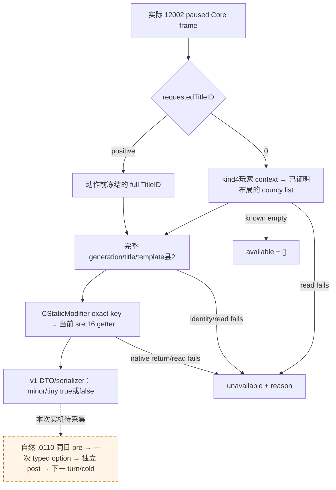

# CK3 1.20.0.2 `.0110`：实际县材料 provider

资格：独立新版 provider 与实际 C++ v1 wire **`static-ready`**。未运行 CK3、未增加 G2/live credit；新版自然 paused pre/action/post、下一 turn 与 cold 资格须以本次真实材料记录。此页接续[来源与最初输入缺口](event12002_epidemic_events_0110.md)：初次交接中旧 ABI 缺口现由本文独立实现闭合，不改写已冻结的历史证据。

绑定 CK3 `1.20.0.2 Crozier / steam25588574`，EXE SHA-256 `AE1BA6FF060BA603842F6F4A2DED0AF4B7D3666B3DD271F75FB01B0DA8E81B2D`。此前新版[十三块／七回调来源审阅](ck3-1.20.0.2-nonwar-events.md)与有限 authored3/native2 选择直接复用，不重复 policy 或历史 live 矩阵。

## 真实原生输入与新版差异

由三条并行 exact-build 工作包先证明 source、机器码、调用约定，再接入生产 provider：

| 输入 | 新版实际 source/binding | 证据 |
| --- | --- | --- |
| 玩家与 paused 日期 | `CoreBindings` / `ReadCoreSnapshot`；完整 CharacterID、当前玩家、存活、地图、暂停、同 raw 日期 | 既有 12002 core，沿原合同复用 |
| 变量 key/context | `0x3F8A800` table、`0x3F8A680` lookup、`0x3F8A6F0` name、`0x370EB10` context；kind4/full CharacterID | [variable-list ABI](../../ck3_autonomous_player/native_bridge/research/event12002_recovery_variable_list_abi.json) |
| `formerly_infected_counties` 列表 | context rows `+0x30` / signed count `+0x3C`；行 `0x48`、key `+8`、elements `+0x10` / count `+0x1C`；EventTarget16 的 kind5、subtype、完整 payload | 新 EXE 的 contains / insertion 比较证实旧行读取器布局可复用；provider 不调用任何 mutator |
| 完整县 title | storage `0x5D1DAF8`，store slots `+0x20` / capacity `+0x2C`、stride `0x10` / object `+8`；低24位仅索引，title `+0x10` 核完整 generation；Land tag `+0x14` | [county/title ABI](../../ck3_autonomous_player/native_bridge/research/event12002_recovery_county_modifier_abi.json) |
| 正确县层级 | **title template `+0x48`、template tier `+0x64 == 2`**，替换旧 `+0x160 / +0x5C` | 新 native getter 与 county-capital resolver 实指令 |
| 实际 CStaticModifier 定义 | getter `0x8FD4E0`、hash `0x3F7E240`、lookup `0xAB8D20`、fallback `0x5D1E0B0`；定义 CString `+0x18` / size `+0x28` / capacity `+0x30` | [loaded modifier ABI](../../ck3_autonomous_player/native_bridge/research/event12002_loaded_modifier_definition_abi.json)；与 COpinionModifier 库不同 |
| 当前 minor/tiny presence | **`0x1AF5D40` sret16**，RCX out / RDX title / R8 definition，RAX 返回同 out；当前 Boolean 在 out `+8` | getter 的 active-row 查询以及真实 caller 栈16B与返回 byte 检查；不用旧 `0x1942CB0`，不用 Boolean getter `0x1AF5BB0` 冒充 sret |

县 getter 自己经当前 province `+0x848` county-data、data `+0x338/+0x344` modifiers 容器、行步长 `0x48` 比较 exact modifier definition 指针；命中时置 presence1，原生正常不存在置0。原生复制的 time 保持 opaque，未解释为剩余天数。

同日正统性沿[已迁 campaign provider](ck3-1.20.0.2-nonwar-campaign-context.md)复用：`ck3_12002_nonwar_metrics.cpp` 读取 Character `+0x1C8` 数据 `+0x28` 的 int64 Q100000，`ck3_12002_campaign.cpp` 发布 `player_legitimacy_v1`，现有 observer 通过 `query_campaign_root_context_v1`取得；本包不新增第二套 legitimacy reader、不重跑其已通过矩阵。来源 `-20` 是新 wrapper 条件式效果，仍不把原生任意同日差值写成无条件成功。

## 实际 provider 与既有消费者

[header](../../ck3_autonomous_player/native_bridge/include/xar_bridge/ck3_12002_epidemic_recovery.hpp) / [production source](../../ck3_autonomous_player/native_bridge/src/ck3_12002_epidemic_recovery.cpp) 的 `epidemic_recovery::BindImage(base, EXEsha)` 只绑定上述 exact image；`ReadEpidemicRecovery12002(bindings, revision, date, playedCharacterID, requestedTitleID)` 使用新版 Core snapshot，返回原 `PlayerEpidemicRecoveryV1` DTO。没有修改 policy、registry、公共能力广告或 shared mailbox/CMake。

- `requestedTitleID=0`：当前玩家角色变量列表，输出完整县 ID 和各县 minor/tiny 当前值。缺 list key 或 count0 为 **available + 空列表**；读取 context/vector 失败为 **unavailable + reason**，不是空列表。已知空集合无需读取不存在的目标县或调用 modifier getter。
- `requestedTitleID>0`：按动作前冻结的完整县 ID 查询，因此原版 `after` 清空列表后仍能读材料。县身份或层级读失败明确 unavailable；每个 modifier 的原生 presence0 是真实 false，不是 unknown。
- 两种模式前后都核对当前 paused 日期/玩家；共享 owner callback负责现有 revision/执行戳。v1 serializer、私有 transport 与 formal near-pair observer原样复用。`remaining_days` 仍按原 DTO 明确 unavailable；已有修正前后皆存在时不能证明续期。



## 一次必要验证与剩余实机条件

[fixture](../../ck3_autonomous_player/native_bridge/src/ck3_12002_epidemic_recovery_test.cpp) 直接执行 production provider、已迁 core/variable bindings、原 v1 list reader 与 serializer，使用 fixture 自己的原生对象/callback；没有读取真实 CK3 进程。MSVC **`/Od`、`/O2` 各22 checks GREEN，`/W4 /WX`**。覆盖两个县完整 generation、合法零 identifier、true/false presence、列表清空后的显式县查询、both absent、known-empty／missing key、list/definition/getter读取失败、县 generation／tier、不跨 paused 日期，以及实际 Binder 的新版地址。

实际 C++输出九类 wire：`two-counties`、`explicit-title-after`、`explicit-title-b-after`、`both-absent`、`empty-list` 与 `list/definition/presence/version-unavailable`。前态 revision88，两个 explicit-title 后态 revision89，日期/角色相同，列表已清空；下游 near-pair可直接消费这些原始 C++ payload，无需修改 payload 伪造后态。这是 fixture wire，没有把 callback 替身或 C++ ACK 当作 paused 读数。第一次 runner 有打印列表括号 SyntaxError，未启动 compiler/fixture；[harness-red-001.json](<Z:/ck3_mod_rewrite/artifacts/g2-offline-2026-10-01/events12002/recovery-provider/harness-red-001.json>)保留。修复后两模式21 checks通过保存为 attempt-002；为真实 near-pair 补第二县和较新 revision wire，仅重跑受影响 fixture，最终22 checks通过。没有重复既有 ABI/policy 矩阵。

[成功 result](<Z:/ck3_mod_rewrite/artifacts/g2-offline-2026-10-01/events12002/recovery-provider/attempt-003-same-day-wire/result.json>) SHA-256 `616AECE8CDCC6470A03438B07E8CD63F7C2D3299377D0950155B31E154099F2F`；源与 ABI 索引在同目录上层 `source-bindings.json`，精确交付清单在 `delivery-result.json`。构建重放命令：

```text
python ck3_autonomous_player/native_bridge/research/run_ck3_12002_epidemic_recovery_fixture.py --output <Z artifact/new attempt>
```

共享接线由中央 owner 在本包 API 上接入既有 CE1 selector/owner callback；本包保持独占五文件，不另开协议。接线后剩余证据是本次新构建 paused list/presence 读回，以及下一次自然 `.0110` 的既有同日 observer 流程。R0099/R0101 与十五日 `283→263` 旧证据不改名；未自然出现时不强制事件、不专门等待 worker。县 presence可证明新出现的材料，duration／续期继续保留未知边界。
