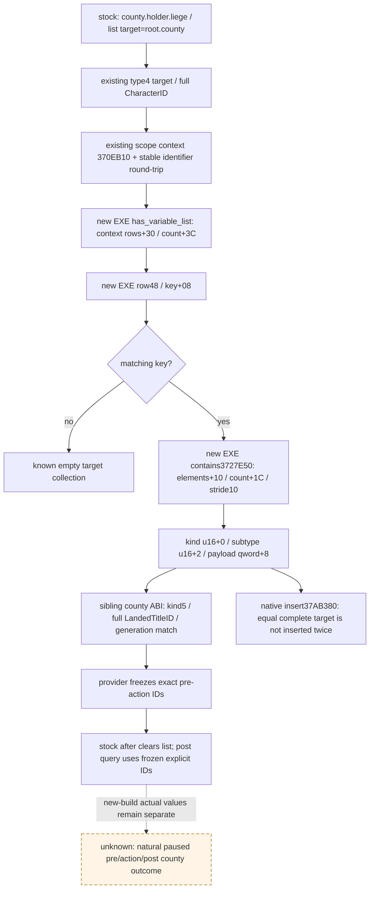

# 1.20.0.2 `.0110`：恢复县变量列表 ABI

新 EXE 的原生查询、插入和 target 比较已经证明，恢复县列表仍采用 context `+0x30/+0x3C`、`0x48` 行、行内 `+0x10/+0x1C` 与 `0x10` 元素。该结论来自 **1.20.0.2 实指令**，没有把旧版偏移直接改名。它为同一 recovery provider 的事件前县 ID 采集解除列表布局缺口；最高资格为 **`static-ready`**，尚无新版自然 `.0110` paused 列表或物质后置。

Exact build 为 CK3 `1.20.0.2 Crozier / Steam25588574`，EXE SHA-256 `AE1BA6FF060BA603842F6F4A2DED0AF4B7D3666B3DD271F75FB01B0DA8E81B2D`，文件大小 `101039736`。研究只读冻结 EXE、当前原版 source 和现成 ABI 合同，未启动游戏、连接 pipe、读取游戏进程或调用原生 target 代码。

## 原版 source 与查询链

当前 `common/scripted_effects/06_dlc_ce1_epidemics_effects.txt:865–871` 的 `plague_recovery_event_effect` 在 `county.holder.liege` 上写 `formerly_infected_counties`，target 是 `root.county`，期限十年。当前 `events/dlc/ce1/epidemic_events.txt:745` 要求该变量列表，native 2 的两条强度分支在 `:936/:946` 消费它，`:965` 的 `after` 清空列表。source 的文件 SHA 与十个逐行锚点包含在[本次 ABI JSON](../../ck3_autonomous_player/native_bridge/research/event12002_recovery_variable_list_abi.json)。这说明事件前应采集领主 Character 的 list；事件后必须使用先前冻结的明确县 ID，不能再从已清空列表恢复目标。

复用已闭合的 [PhaseDefinitionBindings](../../ck3_autonomous_player/native_bridge/research/ck3_1_20_0_2_phase_definitions.json)：`VariableContextForScope(const EventTarget16*)` RVA `0x370EB10`、variable identifier table `0x3F8A800`、lookup `0x3F8A680` 和 name `0x3F8A6F0`。provider 输入是 `EventTarget16{kind=4, subtype=0, padding=0, payload=当前玩家完整 CharacterID}`，通过现成 lookup/name round-trip 取得 `formerly_infected_counties` 的 int32 identifier。本包没有重扫这四个 getter。

Character kind4、scope payload 与 full Character generation 直接复用[新版 event-window 合同](../../ck3_autonomous_player/native_bridge/research/ck3_1_20_0_2_event_window_context.json)：type4 注册 `0x43FB20`，resolver `0x225E000`；完整 Character ID 在对象 `+0x18`。县 target kind5 与完整 LandedTitle generation 直接复用并行完成的[县 modifier ABI](../../ck3_autonomous_player/native_bridge/research/event12002_recovery_county_modifier_abi.json)，该合同 SHA-256 `50976F688A6462EB7BFB9346493440576FDD69F19199CA7A22EE8BBF64161453`。三个合同只核对引用 SHA，不重跑旧 ABI/fixture 矩阵。

| 原生链 | 本次冻结 RVA 与证据 |
| --- | --- |
| `has_variable_list` 注册与执行 | 字符串 `0x4934000` ← RIP `0x722261`；factory table `0x4936AE8` slot1 → `0x37898C0`；factory 生成 vtable `0x4935BA8`，slot25 → readonly executor `0x378A630` |
| `has_variable_list` 正路径 | `0x378A64B` 调现成 context getter；`0x378A75F` 读 context `+0x30` rows，`:763` 读 signed count `+0x3C`；`:774` 比较 row key `+8`；`:779` 每次前进 `0x48`；未找到 row 返回 false，找到 row 返回 true |
| 列表中的 target 查询 | readonly `0x3727E50(context, listIdentifier, EventTarget16*) → bool` 查同样的 row key，再在 `:0x3727E83/:E87` 读取 row `+0x10` 元素指针和 `+0x1C` signed count；`:E8B/:EBB` 用 `0x10` stride |
| 原生插入只作布局证据 | `add_to_variable_list` 注册 `0x720B81` → factory `0x3771020` → vtable `0x49322A8` slot22 → executor `0x3776B50`。正路径 `0x3776CD2` 调 `0x3727C10(context, identifier, target*, duration)`，后者定位同 key row，调用 `0x37AB380` 插入。provider 不调用这些修改函数 |
| 原生清空只作来源证据 | 注册 `0x720551` → factory `0x3770B40` → vtable `0x4931EA0` slot22 → executor `0x3779060`；正路径 `0x377918C` 调 `0x3727D50(context, identifier)`。provider 不调用清空 |
| row 构造与大小 | `0x3728D8E` 写 row `+8` identifier；`:D95/:D9A` 初始化元素 vector；既有 has/add/contains 的迭代均证明 row stride `0x48` |

`has_variable_list` 的 found 只说明 row 存在，并没有检查该 row 的 element count。provider 仅读布局，缺 key 或元素 count 为零时输出合法空集合；context/vector/row/element 未能读取时输出读取失败，不能把后者写成空集合。

## 可交给 provider 的精确布局

| 对象 | 字段 / 类型 | 偏移或步长 |
| --- | --- | --- |
| variable context | list rows 指针 / signed int32 count | `+0x30 / +0x3C` |
| list row | row stride / int32 identifier | `0x48 / +0x08` |
| list row | elements 指针 / signed int32 count | `+0x10 / +0x1C` |
| target element | stride | `0x10` |
| target element | uint16 kind / uint16 subtype | `+0x00 / +0x02` |
| target element | padding / uint64 payload | `+0x04 / +0x08`；padding 不参与原生 equality |

`0x3727EA0`、`:EAB`、`:EB5` 分别比较 kind、subtype、**完整 qword payload**。`0x37AB3B0/:3BB/:3C6` 的插入查找使用同样三项，`:3E1` 在发现相同 target 时跳到返回路径 `0x37AB480`，不会再次插入。因此原生唯一性属于完整 target，不能只按低24 storage index 比较。

县的 GenericValue kind 是 `5`。并行县合同中 `0x1AF9E86` 检查 kind5，`0x1AF9E8C` 读取 payload `+8` 的低32位完整 LandedTitleID；resolver 仅以低24位选 storage slot，之后 `0x1AF9EC0` 用 title `+0x10` 与完整 ID 核对 generation。列表 provider 应保留完整 ID，再走该已闭合 title resolver；payload 不是 title 指针。本包没有凭空为其它 generic kind 建解码器，也不对 `+0x04` padding 添加语义。

元素过期/剩余时长不在本包证明范围。`formerly_infected_counties` 的十年 source 期限不等于某元素的当前剩余时长；当前县 presence 查询不依赖该数值。本包不重新扫描完整变量系统或开启变量修改能力。

[独立 Mermaid](../../ck3_autonomous_player/native_bridge/research/event12002_recovery_variable_list_abi.mmd)与 JSON 一同交给 provider owner。现有旧版 `ReadEpidemicRecoveryListRowsV1` 的布局可以按本次证据用于 1.20 adapter；真正 production reader/serializer fixture 与新版 paused 值由 provider 包另行记账，不由 ABI 静态 proof 代替。

## 一次验证、artifact 与后续

[文件 verifier](../../ck3_autonomous_player/native_bridge/research/event12002_recovery_variable_list_abi.py)的一次实际运行通过 **13 个 spans / 27 条 semantic instructions / 6 条 call edges / 9 条 RIP edges / 6 个 vtable slots / 10 个 stock anchors / 3 个复用合同 pins**。ABI JSON SHA-256 `4B5765787284ABDF727D50ABD18A015A3E2B6D0EB6C66D2EE5DED00E670D9A44`；verifier SHA-256 `21FF54C0C65FCC88734758E28FF97A6442A997AD006C07802C74F2CCE2DBB746`。receipt 与所选 native disassembly 留在 `Z:/ck3_mod_rewrite/artifacts/g2-offline-2026-10-01/events12002/recovery-variable-list/`。

首轮预冻结 helper 把并行交接中的 title comparison base register 写成 `rax`，实际是 `rcx`，故报 `ValueError`。这是未生成最终合同前的 **harness RED**，失败记录为同目录 `attempt-001-harness-red.json`；最终改为直接引用 sibling 已验证的县合同，避免重复扫描/验县 getter，没有 capability RED 或生产行为改动。

下一步是 recovery provider 的当前 source reader fixture、实际 C++ wire 和同一 MCP 接线，随后在正常非战争继续中自然 `.0110` paused 帧采集 pre-list 与县前值，动作后按已冻结完整县 ID 验证独立 modifier presence，再由下一 turn 消费。已存在 modifier 的续期仍不能由 presence 单独证明；R0101 历史窗口消失与十五日正统性差值保持旧资格。本包没有新增实机、日期、动作、G2 credit 或完整 OODA 资格。
