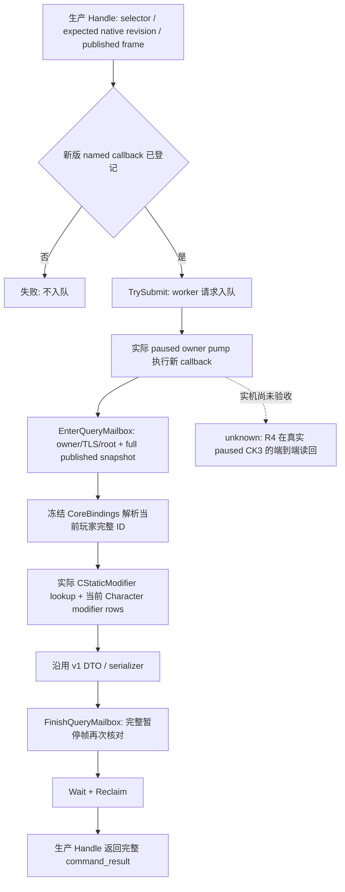

# CK3 1.20.0.2 当前玩家 CE1 治疗 presence：owner callback 与完整调用封装

2026-10-01，本包交付 `static-ready`。新增生产 Handle、distinct named callback 和真实 mailbox caller fixture 已闭合；中央 R4 的默认关闭构建开关、运行期登记和真实 paused 游戏验收由集成/live owner 继续。此处没有 CK3 实机 artifact，不宣称 `fixture-live`、`production-live primitive` 或完整 CE1 OODA。

冻结构建为 CK3 **1.20.0.2 Crozier / Steam 25588574**，EXE SHA-256：

`AE1BA6FF060BA603842F6F4A2DED0AF4B7D3666B3DD271F75FB01B0DA8E81B2D`。

直接复用 [治疗 presence provider](ck3-1.20.0.2-epidemic-treatment-presence.md)、[新版 rows ABI](ck3-1.20.0.2-epidemic-treatment-modifier-rows.md)、[CStaticModifier 定义库](ck3-1.20.0.2-epidemic-modifier-definitions.md) 及 [原版事件迁移](event12002_physician_epidemic_events_1000.md)。provider 的五份文件和已有 Debug/Release 各 26 项矩阵保持冻结；本轮不重复 provider 矩阵、不扩展 remaining-days ABI。

## 实际调用链与注册身份

`HandlePlayerEpidemicTreatmentPrivate12002(adapter, mailbox, published, revision, step, payload, request_id, serialized, failure)` 保留标准调用形状。正常调用使用 `NativeAdapter12002(adapter)` 和冻结 EXE 对应的 `BindTreatmentPresenceImage12002`。仅离线 fixture 可以传入末尾默认 `nullptr` 的 bindings 参数；它替换 fixture 所有的内存根与原生 getter 回调，Handle、提交、owner 验证、provider 与 serializer 仍为生产函数。

选择器沿用 `query-player-epidemic-treatment-presence-v1`，固定 key 为 `ce1_unorthodox_epidemic_treatment`。请求必须带正整数 `expected_revision`，等于当前发布 native snapshot revision；当前帧要求 paused、map-ready、当前玩家存活且带完整 Character ID。过期请求在入队前返回失败。

新 callback 的唯一身份为 **`ExecutePlayerEpidemicTreatmentMailbox12002`**。它要求中央实际登记的 named field **`permitted_executor_epidemic_treatment12002`** 精确匹配自己，然后由既有 mailbox 完成提交、暂停泵 owner、TLS/root stamp、执行、等待和 reclaim。旧 1.19.0.6 ordinal callback 身份不变。中央开关为默认关闭的 **`XAR_CK3_ENABLE_G2_PLAYER_EPIDEMIC_TREATMENT_PRIVATE_QUERY_V1`**；本包没有改共享声明、CMake 或 MCP 路由。

## wire 与输入边界

输出是生产 Handle 生成的完整 `command_result`。`result` 精确复用 Python transport 的 11 个字段：`step`、`accepted`、`status`、`query_sequence`、`observation_revision`、`snapshot_revision`、`player_epidemic_treatment_presence`、`private_build`、`read_only`、`advertised`、`backend_id`。元数据分别为 `accepted=true`、`private_build=true`、`read_only=true`、`advertised=false`、`backend_id="native-headless"`。`query_sequence` 来自真实 mailbox ticket；`observation_revision` 来自真正 owner 执行 stamp 的 pump epoch，不能用 published snapshot revision 替代。

内层沿用 `SerializePlayerEpidemicTreatmentPresenceV1`。wrapper 的 `status` 与 DTO 均为 `available` 或 `unavailable`。合法空 extension / 零 count 对应 `available/present=false`；实际读取失败对应 `unavailable/present=null+reason`。`remaining_days` 仍为 `{status:"unavailable",value:null,unavailable_reason:"duration_abi_not_verified"}`，不能把脚本期限当作当前剩余天数。

必要输入来自同一 paused CoreBindings 当前玩家及已经冻结的 CStaticModifier lookup、definition canonical key、Character extension 和 modifier rows。没有新策略、事件动作、通用角色查询或宗教/战争研究。

## 一次新增链验证与 artifact

运行入口：`ck3_autonomous_player/native_bridge/research/run_ck3_12002_epidemic_treatment_mailbox_fixture.py --output-dir <新的 Z 盘 artifact 目录>`。fixture 可执行文件唯一 positional argument 是自己的 wire 输出目录；不能把冻结 CK3 EXE 传为此参数。

最终 proof：`Z:\ck3_mod_rewrite\artifacts\g2-offline-2026-10-01\events12002\treatment-mailbox\attempt-003\result.json`。Debug `/Od /MDd` 与 Release `/O2 /MD` 都使用 `/W4 /WX`，分别 **31 项 GREEN**；两个构建的三个实际 Handle caller packet 逐字节一致：

| packet | 实际结果 |
| --- | --- |
| `Release\wire\present.json` | 当前玩家 modifier 存在，available/true |
| `Release\wire\absent.json` | 当前玩家 extension 合法为空，available/false |
| `Release\wire\definition-unavailable.json` | lookup 返回 fallback，unavailable/null，保留正确 frame |

三个 packet 的 native snapshot revision 为 **123**，date_raw 为 **53350560**，完整玩家 ID 为 **0x03000004 / 50331652**，query_sequence 为 **1**，owner observation_revision 为 **3**。request_id 包含一个引号，用实际 JSON 输出证明转义；Python fixture 只需按它的请求 ID seam 替换该字段。

额外的 wrapper 必要检查覆盖了 owner snapshot 变动后不返回成功包、真实 mailbox reclaim、缺失/过期 revision、新 named callback 未登记以及 offline bindings seam 范围。FrameAdapter 的 native unwrap 使用明确 fixture shim；尚未覆盖真实 Worker adapter 的解包、游戏的原生 getter 调用和中央完整 R4 注册，因此不把 fixture 误写成实机完成。

保留 `attempt-001` 与 `attempt-002` 的 Debug/Release compile logs：第一次夹具不必要地链接完整 `game_adapter.cpp`，先暴露 Windows `max` 宏编译冲突；设置 `NOMINMAX` 后第二次暴露该完整 TU 的无关 parser/adapter factory 依赖。移除不必要的 TU，使用本来 inline 的 `game::ReadSnapshot` 后，仅重跑受影响的新 wrapper 构建与 fixture，第三次 GREEN。两次均是 **harness RED**，没有执行 provider，也没有形成 capability RED。

## 交接与报告字段

中央下一步为 R4 启用构建 source、默认关闭 flag 与新 callback 登记；Python owner复用三个 actual caller packet 和已有私有 transport；live owner 在真实 paused frame 验收 presence false/true 及 consumer 读回，才可提升为实机 primitive。旧第一批 22 source 文件与 provider 五文件不回写，R2/R3 冻结不变。

2026-10-01 日报 / 2026-W40 周报字段：完成新版治疗生产 Handle→mailbox→owner callback→provider→serializer→完整结果包；目的为解除 CE1 治疗 marker 观测调用链缺口；readiness 仍为 static-ready，新增 caller 链 fixture GREEN，provider 既有证据复用；测试为 Debug/Release 各31项、三包 same-byte，失败两轮均 harness RED 且保留；遗留为中央R4登记和真实paused CK3/Python读回；commit/push由中央集成填写，本包不操作Git，也不占用本地CK3。
