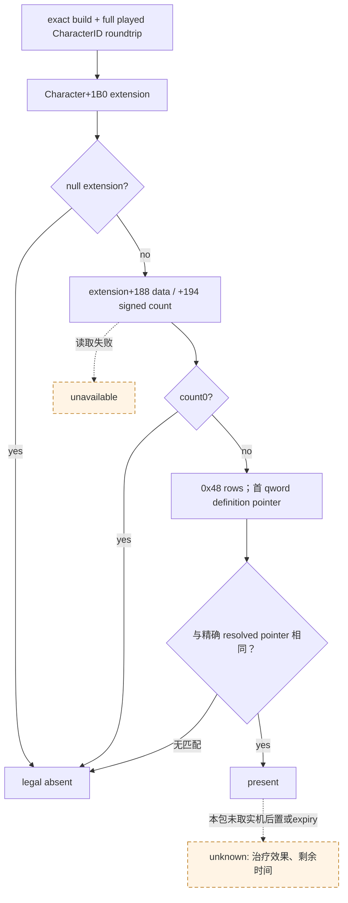

# CK3 1.20.0.2：疫情治疗 modifier 的角色行 ABI

2026-10-01，**static-confirmed rows ABI**，尚无新版治疗 modifier paused/live 后置。本包只冻结实际角色 extension、modifier vector 与原生 pointer membership；固定 definition 的数据库/哈希/名称由独立子包负责，provider/fixture 由治疗 presence 子包负责。没有读取 CK3 进程、pipe、桌面或 Steam。

冻结 EXE 为 CK3 `1.20.0.2 Crozier / Steam25588574`，SHA-256 `AE1BA6FF060BA603842F6F4A2DED0AF4B7D3666B3DD271F75FB01B0DA8E81B2D`。路径 `artifacts/migrations/2026-09-30/post-update-1.20.0.2/installation/binaries/ck3.exe`。旧 [presence 专题](physician-epidemic-modifier-presence-v1.md)绑定 1.19 的 `Character+1A8`，不能沿用到当前版本。

## 实际 native 来源

新 `has_character_modifier` trigger 函数为 RVA **`0x1AFA160`**，读取角色 typed scope，按 full CharacterID 解析对象，然后直接比较 modifier definition pointer。入口与行扫描已经存在于 [1.20 phase misc ABI](../../ck3_autonomous_player/native_bridge/research/ck3_1_20_0_2_phase_misc.json)，本包复用其定位，补齐 null extension、空 vector 和最终返回分支；不重复其他 phase 研究。

| ABI | exact 指令位置与语义 |
| --- | --- |
| 当前角色 storage | `0x1AFA176`，RIP load 指向 `0x5C67568`；storage slots `+0x20`、count `+0x2C`；低24位仅作索引，slot stride `0x10`，object pointer `+0x08` |
| 完整角色身份 | `0x1AFA1A2`，`cmp dword ptr [rax+0x18], edx`；必须核对完整 generation ID |
| 错误角色 native fallback | `0x1AFA1A7` RIP load `0x5C67570`；我方沿已有 CoreBindings 的合法玩家解析，不把 fallback 作为实际玩家 |
| Character extension | `0x1AFA1AE`，`mov rdx, qword ptr [rax+0x1B0]` |
| 合法无 extension | `0x1AFA1B5` test；`0x1AFA1B8` 非空跳转到 rows；否则 `0x1AFA1BA` 清 `al`，`0x1AFA1BC` return false |
| modifier vector data | `0x1AFA1BD`，`mov rcx, qword ptr [rdx+0x188]` |
| modifier vector count | `0x1AFA1C4`，`movsxd rdx, dword ptr [rdx+0x194]`，signed int32 |
| 目标 definition 表示 | `0x1AFA1CB`，`mov rax, qword ptr [r9+0x60]`；已准备好的 trigger definition pointer |
| end pointer | `0x1AFA1CF` 计算 `count*9`，`0x1AFA1D3` 再乘8，故 `end=data+count*0x48` |
| row identity | `0x1AFA1E0`，`cmp qword ptr [rcx], rax`，首成员 `+0x00` 为 definition pointer，不是 numeric ID 或 inline key |
| row stride | `0x1AFA1E5`，`add rcx, 0x48` |
| membership 返回 | 扫描到 end 时将结果指针置零，否则 `setne al`；count0 的 begin=end 也返回 false |

Character extension **从旧 `+0x1A8` 变为新 `+0x1B0`**；rows 的 data/count/stride 分别仍为 `+0x188/+0x194/0x48`，但这些值由上述新 EXE 指令重新证明。当前 Feast 已验证的 prestige getter `0x28BE040` 和 stress getter `0x28BC580` 也使用 `Character+0x1B0`，只是同一 extension 的独立互证。[gift opinion](ck3-1.20.0.2-gift-opinion.md)读取的是关系组内 active opinion 对象，不能把其 opinion row 布局用于 character modifier 行。

## 最小 producer 合同

读取者先经当前 `CoreBindings` 解析真实 played CharacterID 并核对对象 `+0x18` 的 full ID；再读取 `+0x1B0` extension。成功读到 null extension 就是 **available / present=false**，无需调用任何构造或 mutation。非 null extension 时，读取 data/count；合法 count0 同样 available / absent，即使 data 为 null。非空合法 rows 按 `0x48` 遍历首 qword，与独立 definition 子包得到的精确 pointer 比较。

读 extension 失败、负 count、非零 count 却没有 data、row 读取失败，以及实际玩家 ID 无法解析均为 unavailable。沿既有 scanner 的有限读取约束即可，不把读失败伪装成 absent，也不引入额外机制。definition 是否 resolved、fallback/wrong-key 的判定由独立 definition 子包给出，不在这里重做。

此包没有证明 expiration 字段；`remaining_days` 保持 `unavailable / duration_abi_not_verified`。五年是原事件 authored duration，当前 presence 读取不能声称其剩余时间或已经给玩家施加治疗效果。

精确机器合同和单次 ABI 验证入口：[manifest](../../ck3_autonomous_player/native_bridge/research/event12002_treatment_modifier_rows_abi.json)、[verifier](../../ck3_autonomous_player/native_bridge/research/event12002_treatment_modifier_rows_abi.py)、[独立逻辑图](../../ck3_autonomous_player/native_bridge/research/event12002_treatment_modifier_rows_abi.mmd)。单次冻结 EXE 验证 **GREEN**：1 个唯一入口签名、30 条实际指令、2 个 RIP targets、4 个分支 targets，并核对新生产 header 的 5 个实际常量。没有运行旧 phase 全矩阵或访问 CK3。

[abi-verification.json](Z:/ck3_mod_rewrite/artifacts/g2-offline-2026-10-01/events12002/treatment-modifier-rows/abi-verification.json) SHA-256 `ED19CB30D8945FACE35A19A65B2BC559A2106A3F55BC21A9C888372867189A6F`，记录验证时 `include/xar_bridge/ck3_12002_epidemic_treatment_presence.hpp` 的源哈希。新 header 后续添加独立 definition binder 字段时不需要重跑本 rows ABI；5 个被冻结常量若变更才需相应核对。rows ABI 与源常量合同 **static-ready**，provider scanner fixture、完整 query/serializer 接线和实际 paused presence 分别按其子包记录，不由此 receipt 代签；实机 actor / presence before-after / 下一 turn 由 root 继续。
