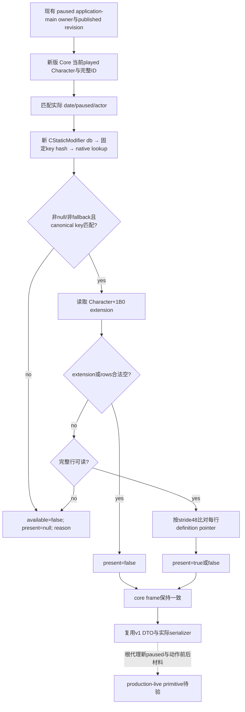

# 1.20.0.2 医师治疗修正：实际固定 key presence provider

2026-10-01。**组件 static-ready**：已实现新版当前玩家的实际 modifier definition lookup／行扫描，Debug 与 Release fixture 各 **26 checks GREEN**，六份实际 C++ JSON 两配置逐字节相同。它接续 [`.1000` source migration](event12002_physician_epidemic_events_1000.md)，为原 R0089 缺失的独立治疗修正材料提供施工完成的 reader。中央原生 owner／既有 private transport 的接线和真实 paused 查询由相应 owner 收口；本包未访问 CK3，没有新增 live 或 G2 credit。

冻结为 CK3 **1.20.0.2 Crozier / Steam25588574**，EXE SHA-256 `AE1BA6FF060BA603842F6F4A2DED0AF4B7D3666B3DD271F75FB01B0DA8E81B2D`。旧 [v1 provider](physician-epidemic-modifier-presence-v1.md)的 1.19 ABI 与证据保持原资格；这里使用新 `CoreBindings`、新 `CStaticModifier` definition 链和新角色扩展，复用稳定的 v1 DTO 与 serializer。

## 先闭合的实际 source／ABI

原版固定定义 `common/modifiers/06_ce1_modifiers.txt:896–900` 的文件 SHA-256 `63FEB33C8C5BF825E3D186E841D07235C98D6AED27C47375E495EA832255C52B`，block SHA-256 `A36050C992004B580EE44BF243269073FE218650498681DCCC0CAE0B28E4C822`。其 `epidemic_resistance=10`、`zealot_opinion=-10` 不变；`.1000` native 1 添加该修正，`years=5` 是 authored duration。

两条独立冻结 ABI 为实际 reader 的输入，均先取得 GREEN 后执行本包 fixture：

| 链 | 新版来源 | 证据 |
| --- | --- | --- |
| 当前玩家／角色身份 | 现有 `CoreBindings → ReadCoreSnapshot → ResolveCoreCharacter`；完整 CharacterID storage roundtrip `+0x18` | 复用 1.20 foundation/core，本包 fixture 实际链接 `ck3_12002.cpp` |
| 角色 modifier 行 | `has_character_modifier` trigger `0x1AFA160`；Character `+0x1B0` extension；vector data `+0x188`、signed count `+0x194`、stride `0x48`、row definition pointer `+0` | [row ABI](../../ck3_autonomous_player/native_bridge/research/event12002_treatment_modifier_rows_abi.json)与 verifier：1 signature、30 指令、2 RIP、4 分支；真实新 header 的五个 layout 常量相符 |
| modifier definition | 真正的 `CStaticModifier` 库 getter `0x8FD4E0`，stable hash `0x3F7E240`，lookup `0xAB8D20`，fallback slot `0x5D1E0B0` | [definition ABI](../../ck3_autonomous_player/native_bridge/research/event12002_loaded_modifier_definition_abi.json)：8 spans、18 指令、4 calls、6 RIP、3 RTTI，44/44 GREEN；不借用 gift 的 OpinionModifier 库 |
| canonical key | definition CString `+0x18`；size `+0x28`、capacity `+0x30`；capacity `<16` inline，其他使用 heap pointer | 实际 database name-by-index `0x312D450` 的 decoder 链；固定 key native hash `0x22A483B2` |

`GetStaticModifierDatabase` 的原型为 `void*()`；hash 为 `uint32_t(void* ignored_or_db, const char*, uint32_t length)`；lookup 接收 database 和完整 32-bit hash pattern。本包使用 `bit_cast<int32_t>` 传递 pattern，未改变有效位。loaded definition 的 `+0x38` tag 是 parser ABI 的事实，当前查询复用已有非 null／非 fallback 和 exact canonical key 核对，不新增 tag／RTTI 的每帧判定。

row 证据：[abi-verification.json](Z:/ck3_mod_rewrite/artifacts/g2-offline-2026-10-01/events12002/treatment-modifier-rows/abi-verification.json)，SHA-256 `ED19CB30D8945FACE35A19A65B2BC559A2106A3F55BC21A9C888372867189A6F`。definition 证据：[verification.json](Z:/ck3_mod_rewrite/artifacts/g2-offline-2026-10-01/events12002/loaded-modifier-definitions/verification.json)，SHA-256 `39D1B26204E5BC2EFA8C771960E4ED81734BFCA53E04383A1985948CC3110363`。后者名称 fallback 前缀的首次 harness RED 由 ABI owner 原样保留；本包两个 fixture 配置首轮即 GREEN。

## 实际 reader 与中央接线接口

[header](../../ck3_autonomous_player/native_bridge/include/xar_bridge/ck3_12002_epidemic_treatment_presence.hpp)和 [reader](../../ck3_autonomous_player/native_bridge/src/ck3_12002_epidemic_treatment_presence.cpp)提供：

```cpp
TreatmentPresenceBindings12002 BindTreatmentPresenceImage12002(
    uintptr_t module_base, string_view executable_sha256);

ck3_11906::PlayerEpidemicTreatmentPresenceV1 ReadPlayerEpidemicTreatmentPresence12002(
    const TreatmentPresenceBindings12002&,
    uint64_t snapshot_revision, int32_t date_raw, int32_t played_character_id);
```

binder 仅依据冻结 EXE 身份计算新函数与 root 地址。reader 在现有 paused application-main owner 内使用实际 current core：确认当前地图、在世玩家、paused、date 与完整玩家 ID；解析固定 key 的实际 loaded definition；读取新角色 extension／modifier 行；复制 presence；再次核对 core frame。传入的 actor 必须与实际 played actor 一致，provider 不开放任意角色或任意 key。

`ScanTreatmentModifierRows12002` 与实际 query 使用相同生产实现；通过自身进程的 `ReadProcessMemory` 读取行。definition 不可解析、fallback 或 key 不符输出 unavailable。原生 trigger 已直接证明 null extension 是 false；零 count 与 null data 为合法 empty。非零 count 配 null data、负 count、无法读的 extension／row 输出 unavailable，不能冒充 false。



当前 selector 继续为 `query-player-epidemic-treatment-presence-v1`，固定 key 为 `ce1_unorthodox_epidemic_treatment`。DTO 使用已有 `snapshot_revision/date_raw/played_character_id/available/present/unavailable_reason`；实际 `SerializePlayerEpidemicTreatmentPresenceV1` 输出稳定 schema `player-epidemic-treatment-presence-v1`：available 时 `present=true|false`，unavailable 时 `present=null` 加 reason。

`remaining_days` 始终保留 `{status: unavailable, value: null, unavailable_reason: duration_abi_not_verified}`。本次不研究 expiry，不把 authored 五年说成实测时长。旧 DTO 的 namespace 是其代码位置，当前 reader 没有调用旧 definition／角色 native reader。

## 实际 fixture／wire 与剩余实机工作

[fixture](../../ck3_autonomous_player/native_bridge/src/ck3_12002_epidemic_treatment_presence_test.cpp)链接未替换的实际 core、新 reader、旧稳定 serializer。native DB getter/hash/lookup callback 与对象内存位于 fixture 自身进程；它们没有调用 CK3 EXE 中的函数。测试覆盖真正的 Core current-player 解析、wanted definition 命中与排除、合法无 extension／空 rows、真实 failed row read、negative count、definition null／fallback／wrong canonical key、DB unavailable、非 paused、完整 ID 代际差异、实际 Core 日期变更及 frozen-image binder 地址。

[runner](../../ck3_autonomous_player/native_bridge/research/run_ck3_12002_epidemic_treatment_presence_fixture.py)用 MSVC `/W4 /WX`、Debug `/Od /MDd` 与 Release `/O2 /MD` 并发编译／运行，各 **26 checks**；Python 解析实际六份 C++ wire，核 schema/key、revision `123`、date `53350560`、完整 actor `0x03000004`、true／false／null 区分和原 duration 结构，Debug／Release 各 wire 的 SHA 一致。六份名称为 `present`、`absent`、`empty-extension`、`empty-rows`、`rows-unavailable`、`definition-unavailable`。它们供 Python owner 复用到实际既有 private transport envelope 测试，不是 synthetic mock 添字段掩盖生产 wire。

机器回执：[fixture-final/result.json](Z:/ck3_mod_rewrite/artifacts/g2-offline-2026-10-01/events12002/treatment-provider/fixture-final/result.json)，SHA-256 `29A14A4C6A71722A7C65BE357DAD07C83C454EFECC02AD7C77F47B08DA3307D5`。每份 wire、fixture EXE、实际编译源与日志的完整路径和 hash 均在回执中。

```text
python ck3_autonomous_player/native_bridge/research/run_ck3_12002_epidemic_treatment_presence_fixture.py --output-dir Z:/ck3_mod_rewrite/artifacts/g2-offline-2026-10-01/events12002/treatment-provider/fixture-final
```

中央复用现 selector 和 owning-thread mailbox，替换旧 build binding 为本包 binder／reader，再由既有 private transport 消费该 DTO。此专题没有修改 CMake、shared Worker、MCP registry 或 compile permits，具体接线资格由中央回执记录。

后续根代理实机取得新版真实 paused 的 current presence，并在自然 `.1000` 出现时冻结动作前材料、一次 typed native 1 选择、独立 after presence 和下一 turn／规定 cold。本 query 证明玩家当前是否具有该修正；它不单独证明来源必为这个事件，不补出 stress／fulfillment／医师与反对者关系的完整后果，也不凭 ACK／窗口消失闭合 R0089 或 G2-M2。自然阳性未出现时复用已有窗口继续流程，不派专用等待 worker。
