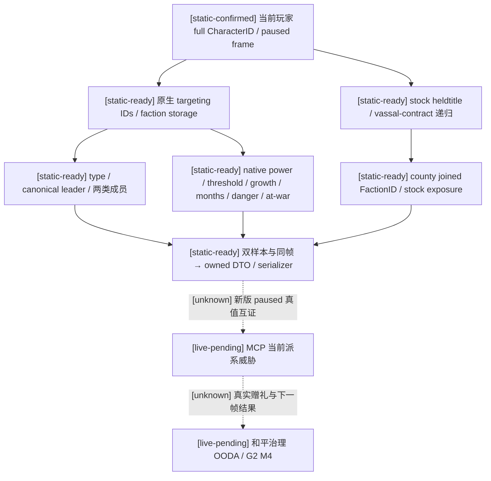

# CK3 1.20.0.2：完整派系威胁只读来源

2026-10-01 离线迁移；版本 `1.20.0.2` / Crozier，EXE SHA-256 `AE1BA6FF060BA603842F6F4A2DED0AF4B7D3666B3DD271F75FB01B0DA8E81B2D`。本包为 **static-ready**，已实现真实 native 来源、版本绑定、完整 DTO、application-main mailbox 与实际 serializer fixture；没有查询、启动、注入或操作本地 CK3，不能称为新版 live，也没有完成 G2 M4。

旧生产 `player_faction_alerts_v1.cpp` 只有 targeting count；详细行原先来自 fixture。新版 `ck3_12002_faction_alerts.cpp` 直接读取当前玩家 land-state 的完整派系 ID，解析真实 faction storage，复制 canonical leader、角色成员和县领成员，并调用该构建的最终 power、动态阈值、增长、月份、at-war 和危险规则。它复用旧的 `game::PlayerFactionAlertsV1` DTO、语义投影和 serializer，旧版 `1.19.0.6` 分支保持原行为和 provenance。

## 原生来源与已修正的迁移差异

权威 ABI 索引在 [`ck3_12002_faction_alerts_abi.json`](../../ck3_autonomous_player/native_bridge/research/ck3_12002_faction_alerts_abi.json)。独立证据分别是 [布局与身份](ck3-1.20.0.2-faction-layout.md)、[最终指标与原版危险规则](ck3-1.20.0.2-faction-metrics.md)、[县领曝光来源](ck3-1.20.0.2-faction-county-exposure.md)。

| 输入 | 新版真实来源 | 语义 |
|---|---|---|
| Targeting rows | `CCharacter+0x1C0 → land+0x120/data,+0x12C/count` | 完整代际 FactionID；合法空数组与读取失败分开 |
| Faction identity/type | storage `0x5D1DE90`，fallback `0x5D1DE10`；`+0x10` identity，`+0x20` definition，key `definition+0x18` | faction type 是 opaque 稳定 key，不展开宗教域 |
| Canonical leader | faction `+0x44`，Character storage 完整身份回查；人类玩家查询 `0x2BAA710(full CharacterID)` | 允许真实无领袖；不把 portrait 的 special character 代作 leader |
| 角色成员 | faction `+0x48/+0x54`，stride `0x20`，成员 ID `+8`，owner FactionID `+0x0C` | 完整复制所有成员；不从列表位置猜 leader |
| 县领成员 | faction `+0x60/+0x6C`，stride **`0x18`**，TitleID `+8`，owner **CFaction 指针 `+0x10`** | 不能套用角色成员的 stride/owner 字段；无角色成员仍可有真实兵力 |
| Power / threshold | native `0x2601EF0` / `0x26021A0`，均 `CFaction* → out int64*` | 原生百分比点 Q100000，例如 `110% → 11000000`、`80% → 8000000`；阈值读取最终 scripted value |
| Discontent / monthly growth | faction `+0x28` / native `0x2601B50` | 原生点数 / 点每月 Q100000；`FactionItem` GUI ratio 小 100 倍，不能混用 |
| Months / dangerous | native `0x2601C60` / `0x1D65BF0(faction,faction)` | 月份 literal 0 也可表示增长非正；危险 final 来自当前原版 scripted rule，不声称准确 ultimatum 日期 |
| At war | native `0x2603AB0(CFaction*)` | 新版解析 WarID `+0x8C`，内联检查 CWar identity 与 `War_` tag；旧虚表 IsAlive 链已经变化 |

当前 stock `is_dangerous_faction_trigger` 为人类 leader，或 peasant 原生剩余月份不超过 12，或其他类型原生增长为正。生产调用最终 native 规则结果，并与已冻结的解释字段一致后发布；已有 war 的行交给 war handoff，不当作新增和平赠礼候选。`exact_ultimatum_timing_ready` 继续是 `false`。

## 县领曝光已经接入真实来源

原版提醒按 `every_sub_realm_title` 的 county 分支检查 `any_title_joined_faction`。新版 reader 按同一原生来源递归玩家 held TitleID 数组 `land+0x1E0/count+0x1EC` 和直属 vassal ContractID 数组 `land+0x218/count+0x224`；contract storage `0x5D1EB88`、identity `+8`、vassal `CCharacter*+0x20`，在县领分支沿用 native `0x230D850` 已证明的有领土条件 `title+0x11C > 0`。

对每个县领调用 `title_province 0x230F900`，再读取 `Province+0x848 → CountyData+0x3B0/count+0x3BC` 的真实 joined FactionID。每个 joined faction 都独立解析，然后执行 stock `populist_faction && power > threshold && target != player`。查询不假定 target 必须是玩家的祖先。现有 DTO 每县领一行，因此以完整 ID 排序后的首个匹配派系解释该县领的存在性提醒；原版提醒本身也是存在性判定。

两次完整 owned sample 和相同 paused frame通过后，`targeting_rows_ready`、`county_exposure_ready`、`stock_dangerous_predicate_ready` 与 `alert_ready` 可以真实变为 `true`，完整已知空来源也可得到 `present=false/dangerous=false`。需要赠礼 receipt 时，`ReadFactionEntityV1` 从独立 faction storage 查询 persisted full FactionID，区分 `available / known_absent / unavailable`；玩家 targeting vector 中消失不会被当作 faction dissolved。

## 离线验证与实机边界

`ck3_12002_faction_alerts_test.cpp` 通过生产 reader 的内存读取与 native 函数接口产生真实 serializer JSON，未使用 DTO fixture 输入绕过来源。7 个聚焦 case 已在 MSVC `/Od`、`/O2`、`/W4 /WX` 下通过：完整行与指标、leaderless county-only 威胁、直属 vassal contract 递归和非祖先 target 县领曝光、已知空列表、独立实体 receipt、recycled generation、阈值相等排除、负增长 watch、人类 leader/war handoff、真实源 drift 与新版 county owner 布局。旧版 reader 和 serializer 原有 fixtures 通过；新版 mailbox 对象编译通过。

实际 wire：`artifacts/g2-offline-2026-10-01/factions/fixture.json`；两模式 receipt：`artifacts/g2-offline-2026-10-01/factions/production-source-fixture-receipt.json`；旧版与 mailbox receipt：`artifacts/g2-offline-2026-10-01/factions/mailbox-legacy-receipt.json`。ABI/layout/metrics/county 的独立 frozen-EXE 验证保存在同目录的 `layout/`、`metrics/`、`county/`。

接线使用既有 `query-player-faction-alerts-v1` 与专属的 application-main executor，candidate 默认关闭。下一项真正需要游戏的是新版受控 paused snapshot：核对当前自然派系行、最终原生指标和 stock 提醒真值，然后验收赠礼与独立后置结果。ACK、离线 JSON 和这些 tests 都不替代实机证据。
