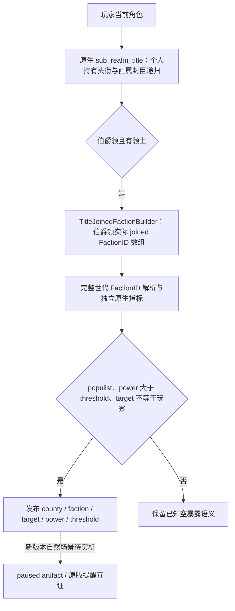

# CK3 1.20.0.2：玩家领内伯爵领的民粹派系暴露来源

本页补齐 `player_faction_alerts_v1` 的 county exposure 原生来源。目标是实现原版提醒使用的“我的领内伯爵领加入了以其他角色为目标、力量已超过门槛的民粹派系”查询。只统计针对玩家的派系，或只检查玩家上级的 targeting faction 数组，都不能替代这项来源。

证据为冻结 CK3 **1.20.0.2 / Crozier** EXE，SHA-256 **AE1BA6FF060BA603842F6F4A2DED0AF4B7D3666B3DD271F75FB01B0DA8E81B2D**。这次只读取磁盘 EXE 与原版脚本，没有读取运行中的 CK3、连接 pipe、注入、操作界面或调用 Steam。状态为 **static-ready**；新版本的 paused snapshot 与自然暴露场景仍待实机。

ABI 与逐段原始字节在 [ck3_12002_faction_county_exposure_abi.json](../../ck3_autonomous_player/native_bridge/research/ck3_12002_faction_county_exposure_abi.json)，本地证据在 `Z:\ck3_mod_rewrite\artifacts\g2-offline-2026-10-01\factions\county\county-source-proof.json`。

## 原版判定与来源

`game/common/important_actions/00_realm_actions.txt` 的该条提醒先枚举 `every_sub_realm_title`，仅保留 county，再枚举 `any_title_joined_faction`，检查 `populist_faction`、`faction_power > faction_power_threshold` 和 `faction_target != root`。这里的 faction type 只作为 opaque key 使用，没有展开宗教或文化系统。

## `title_joined_faction` 的直接原生数组

列表注册入口 RVA `0x36F100` 引用 `title_joined_faction`；`CAnyInScriptedListTrigger<CTitleJoinedFactionBuilder>` vtable 为 `0x461EB70`。判定包装 `0x1C3BD10` 经 `0x1C3F110`、`0x1C3C480` 到 `0x1C3D660`，先把 scope tag **5** 中的完整 TitleID 解析成当前 title，再调用 builder `0x1C38D30`。

`0x1C38D30` 从 title 的 template `+0x48`、tier `+0x64` 检查 county/barony；tier 高于 county 不能用于此列表。county 分支在 `0x1C38DF6`：

| 字段或函数 | exact-build 位置 | 语义 |
|---|---|---|
| Title → Province | RVA `0x230F900` | 复用已迁移的 title province getter |
| Province tag | `Province+0x85C == 0x50726F76` | builder 使用的 Province 类型检查 |
| Province → County component | `Province+0x848` | 伯爵领状态组件指针 |
| joined FactionID data | `County+0x3B0` | 实际加入派系的完整 int32 ID 数组 |
| joined count | `County+0x3BC` | 原生数组元素数 |
| 元素大小 | 4 字节 | 不是 faction 指针或县成员行 |
| 脚本派系 scope | tag `0x19` | `0x1C38E80` 将完整 ID 写入 scope payload |
| Title storage / fallback | RVA `0x5D1DAF8` / `0x5D1DAE0` | 标准完整世代解析，title identity `+0x10` |

`+0x3B8` 可对应已证实的 Pdx vector capacity 布局，但本条原生 builder 直接读取的是 **data 与 count**，不据此声称它调用过 capacity getter。当前 provider 不必为了使用该数组引入 GUI 列表对象或临时 scripted-list vector。

**没有证据要求这些 joined faction 的目标一定是伯爵领持有者的祖先。** 查询必须先读实际 joined 数组，再保留原版 `target != root` 条件；不得从上级 targeting 数组反推全集并将其称为完整原生暴露来源。

## `sub_realm_title` 的原生枚举

注册入口 RVA `0x3712A0`、列表名字符串 `0x4650208`、原版说明 `0x464FE70` 对应 `CLandedTitlesBuilder<0>`。其 `CAny` vtable `0x4642F80` 经 `0x1CD2050`、`0x1CEFB10`、`0x1CD7B10`、`0x1CE2690` 进入递归 walker **`0x1CEDE10`**。

walker 从角色 `+0x1C0` land state 读取持有头衔 ID 数组 `+0x1E0`、count `+0x1EC`，用当前 title storage 和完整 ID 解析头衔。它调用 `0x230D850` 排除没有领土的头衔后，输出 tag **5** 的 TitleID。对 tier **2** 的伯爵领，这个谓词在 `0x230D884` 返回 `title+0x11C == 0`；也就是其实际枚举必须有至少一个头衔 child（data `+0x110`、count `+0x11C`）。

随后 walker 从 land state `+0x218` / count `+0x224` 读取直属封臣 **contract IDs**。contract storage / fallback RVA 分别为 `0x5D1EB88` / `0x5D1EB40`，contract identity 是 `+0x08`，所属封臣角色指针是 `+0x20`；每项完整世代解析后，用该角色递归调用 `0x1CEDE10`。这不是可以直接当成 CharacterID 使用的数组。

实现可以直接复用这条持有头衔与封臣 contract 的只读递归，或使用已注明适用政府范围的等价 county membership 来源。世界 title store 扫描时仍应保留 tier **2**、当前完整 TitleID、当前 holder 身份、玩家领内归属以及有 child 的 county 条件，不能把所有 DB 中的 county template 都当成当前玩家领土。不同政府的所有权关系未实测时，应记在对应政府适配账本，不能在本页宣称通用政府等价证明完成。

## 发布语义与后续实机

同一伯爵领可以加入多个派系；只对同一个 `(county_title_id, faction_id)` 去重。已知空 joined vector 表示可用且没有暴露，读取失败不能转换成零暴露。每个 FactionID 都经过当前 Faction store 的完整身份解析，再复用独立原生 power 与 threshold 最终结果，保留真实 target 身份。该来源不要求有角色 leader 或 character member，因而不会把 county-only 民粹派系错误清空。

新增 provider 的实际接线、序列化和 fixture 状态以父工作包的实现文档为准；本页只声明上述直接 native 来源及其静态字节证据。实机下一步是同一暂停帧比对该数组、正式 MCP 输出和原版 important action，至少覆盖合法空数组、多 joined factions 和目标不等于玩家的民粹暴露。G2 M4 完成仍要求实际治理动作及独立结果观测。
