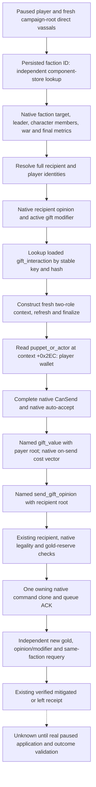

# 1.20.0.2 faction gift source and action migration

Status: **static-ready**. These are source and offline native-layout fixtures;
no new paused gameplay observation, command application, or faction outcome
has been certified. The G2 M4 milestone remains open.

The frozen target is CK3 1.20.0.2 Crozier, Steam build 25588574, executable
SHA-256 `AE1BA6FF060BA603842F6F4A2DED0AF4B7D3666B3DD271F75FB01B0DA8E81B2D`.
The executable and vanilla files were read from the migration archive. No
process discovery, process read, pipe, desktop, launcher, or workshop access
was used for this work.

## Native source and decision inputs

The previous faction-gift action, request, ACK, independent receipt, and
persisted identity ledger are retained. The new source is
`ck3_12002_faction_gift.hpp/.cpp`, backed by the version-specific generic
interaction context, `ck3_12002_faction_alerts` independent entity reader,
and `ck3_12002_gift_opinion` receiver/evaluator. The 1.19 native source remains
a separate legacy implementation; its addresses are not accepted by this
binder.

The source follows the existing player-bound recipient requirements: a real
leader or character member of the selected peacetime targeting faction, a
living AI direct landed vassal, and no existing gift opinion. It does not
invent recipients for factions whose native leader/member sets are empty.
The existing gift policy and minimum-gold-reserve selection are unchanged.

The full faction reader returns `unavailable`, `known_absent`, or `available`.
Absence in the player's current targeting vector does not mean the entity was
destroyed. Both receipt and cold requery resolve the stored full-generation
faction ID directly. A faction can remain present after the gift is applied;
the receipt then reports `mitigated` with `threat_resolved=false`.

The full native faction metrics use percentage **points** in Q100000, e.g.
110 percent is raw `11000000`, not the old GUI ratio `110000`. The gift policy
does not compare these values to a ratio threshold; the source preserves the
native points and scale without a lossy conversion.

## Actual gift cost and payer

The frozen `common/character_interactions/00_gift.txt`, SHA-256
`D62A80DD8ED0F666A1223BA5BA68EA4362A8259E54C795C4D215C5EB7D0DF0F2`, checks
`scope:puppet_or_actor.gold >= gift_value` in final legality and pays
`gift_value` through `pay_short_term_gold` inside `on_accept` (lines 89–102 and
167–174). It does not make the generic ten-slot `on_send` cost vector the
actual gift payment. The named `gift_value` definition is in the frozen
`common/script_values/00_scheme_values.txt`.

Accordingly, the preview reads the actual named `gift_value` as signed native
Q100000 with the payer as root. It keeps fractional raw gold rather than
rounding through an integer. `send_gift_opinion` uses the recipient as root
while preserving the prepared actor/recipient aliases. The compiled generic
cost block is separately evaluated at definition `+0x40`; this existing
gold-only receipt is supported when all ten on-send entries are zero. A
nonzero extra currency/payment is unavailable to this narrow receipt, rather
than silently ignored. The stock definition reviewed here has no authored
generic on-send cost.

The context's `+0x2EC` field is the native `puppet_or_actor` scope, proved by
the alias registration and refresh instructions. A fresh ordinary two-role
context initializes it from the actor. The provider checks its finalized
value equals the player whose gold is read. Puppet payments are outside this
player-wallet action; this is a limit of the existing receipt, not a new
general puppet policy.

## Context and command ABI

The generic context proofs are in
[gift context native tree](ck3-1.20.0.2-gift-context-native.md),
`research/ck3_12002_gift_context_abi.json`, and its verifier. The new database
getter is `0x89DA60`, stable hash is `0x3F7E240`, lookup is `0xA055E0`, and
the ordinary two-role constructor is `0x3076C90`. That constructor still
uses its six-argument two-role ABI; marriage's separate all-role entry is
not used here. Gift's stable hash is `0x776D7835`.

The context lifecycle, final validator, cost/trigger evaluators and send
command constructor reuse the already migrated 1.20 `ContextBindings`.
Native command submission uses the new owning clone/queue, followed by
destruction of the caller-owned copied context and prepared context. The
old direct singleton submit ABI is not called. A true submit result is only
queue acknowledgement and becomes `submitted_verification_pending` in the
existing action core.

The actual new opinion and named-value layouts, native source descriptor,
scope cloning and cleanup are documented in
[gift opinion provider](ck3-1.20.0.2-gift-opinion.md). The independent total
opinion query is also reused by Sway. This migration does not create another
pending ledger or generic policy framework.

## Offline evidence and next live entry

Evidence is under `artifacts/g2-offline-2026-10-01/gift/`:

- `context-abi-verification.json`: 19 exact anchors, six span hashes, 62
  instructions/operands, four production constants and two command vtables;
  frozen executable/stock validation passed.
- `opinion-fixtures/result.json`: the actual opinion/named provider compiled
  with `/Od` and `/O2`, `/W4 /WX`, and passed 151 assertions in each mode.
- `provider-fixtures/result.json`: actual preview, payer, final CanSend,
  owning queue, independent source capture, action-produced pending ACK and
  independent receipt fixtures, compiled with `/Od` and `/O2`, `/W4 /WX`.
  The fixture demonstrates zero generic on-send gold with nonzero actual
  `gift_value`; the ACK alone fails receipt verification.
- `router-fixtures/result.json`: the four actual private entry paths passed
  22 checks in each `/Od` and `/O2` configuration, with a simulated paused
  mailbox and the actual gift, opinion, faction entity and typed command
  providers. Eight byte-identical wire snapshots per mode cover preview,
  complete CanSend rejection, known empty, pending ACK, unchanged/applied
  receipt, and persisted/dissolved cold-source requery. These wire snapshots
  are input fixtures for the existing Python transport and ledger consumers.

The four existing private query/submit/receipt/cold selectors use their
existing slot 34 and stable DTOs. Their production wrapper and serializer
are in `ck3_12002_faction_gift_router`; exact-build metadata is changed to
the new executable while legacy metadata is retained for legacy dispatch.

The remaining live entry is a genuine paused 1.20 faction with an eligible
direct-vassal recipient: preview first, one typed submit, then independent
same-date gold/payment, gift modifier and stored faction readback. A new-PID
cold requery must preserve those stored IDs. Faction threat reduction and
departure require observed outcomes; fixtures and ACKs do not close them.

## R8 minimum execution preparation, 2026-10-01

The file-only execution packet is
`artifacts/g2-offline-2026-10-01/gift-execution-preparation/`.
Its external runner accepts root's actual MCP launch plan; it does not guess
the future R8 runtime, start/stop/restore CK3, or advance game time. The saved
h98 packet is a baseline only: actor 29829, date 53169360, gold raw 45790783,
piety raw 15550000. None of those historical fields qualifies a new quote.

The existing native tree above remains the input ledger and the existing
Python gift policy remains unchanged. A fresh same-frame root and faction
query precede native final CanSend/auto-accept, actual `gift_value` payment,
and `send_gift_opinion` preview. The ordinary reserve is still 100 gold.
This source publishes one native selected recipient; this is a useful
intervention primitive, with no claim of the best recipient across a priced
catalog. The ten generic on-send entries are evaluated and the existing
source supports the all-zero case; the wire does not publish their raw
vector. That output limitation adds no gate to the supported actual gold
quote and is not a reason to postpone the existing one-gift primitive.

One typed submit only produces pending. The independent receipt must read
the same-date newer native frame, exact gold decrease, native gift modifier,
and persisted source faction/recipient identities. An unchanged faction
with a real gift effect is `mitigated`, not a proved faction departure or
threat resolution. Root can then use its existing normal-life advance and
this runner's read-only next-frame stage; the runner makes no war decision.

The existing Python receipt resolver clears durable pending after success.
The cold resolver expects that matching pending still exists. Therefore a
supported cold completion is: one ACK pending, root saves the applied post
frame without first retiring pending, root's official restore/rebind, then
the existing cold query resolves the stored pair. After an already resolved
same-process receipt, replaying its old pending through that resolver is
not a valid cold sequence. No ledger is recreated or rewritten to simulate
this lifecycle. Independent post-restore facts for an already retired pair
remain a separate outcome observation, and have not been certified here.

Fresh R8 actor/faction/recipient, current final legality, gold/opinion quote,
material application, next frame, and genuine post-restore observations
remain unclosed actual fields. The M4 milestone additionally needs the
construction and council changes with the real intervention inside its
two-game-year window; this gift alone cannot mark M4 complete.

Root's real R8 first gift observation attempt is retained at
`artifacts/g2-offline-2026-10-01/gift-live-next/root-candidate-r8-01/`.
Its optional public faction-alert read returned `native player faction alert
query returned a malformed envelope`, before any gift submit. The production
cause is the `ReadOnlyFrame` formatter in `ck3_12002_nonwar_router.cpp`: it
emitted private/read-only/advertised fields and omitted
`player_faction_alerts_ready`, while the existing public SDK expects eight
specific fields. `protocol_version` was already correct. The R9 source fix
only restores the faction-alert envelope and preserves other route shapes.
Frozen R8 remains unchanged.

The exact frozen/fixed formatter leaves were compiled and consumed by the
production `NativeHeadlessGameplayDriver` query method with the already saved
native faction DTO. The frozen producer reproduces the actual error; the
fixed producer is admitted and the other generic route is unchanged. The
receipt is `gift-execution-preparation/alert-envelope-reproduction/result.json`.
This deterministic production-path reproduction is not a new live packet or
quote. The external gift runner now reads campaign root and gift directly,
so this optional alert route cannot delay the supported gift primitive. It
calls no war tools.

Root's fresh `gift-live-next/root-candidate-r8-02/` campaign-root read is
**production-live observation**, with actor 29829, date 53169360, paused and
map-ready, native revision 4. It proves `player_targeting_faction_count=0`.
The supported result is `native_targeting_factions_known_empty` and zero
formal submit calls. No recipient or quote is fabricated, no gift material
application is claimed, and M4 remains open. The original malformed-envelope
attempt is retained separately from this successful observation.
