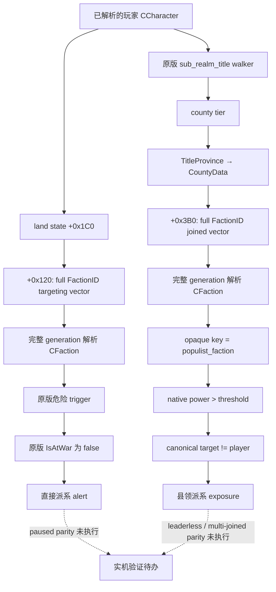

# CK3 1.20.0.2 派系身份、成员与县领暴露布局

2026-10-01 冻结 EXE 静态逆向，状态为 **static-ready**。本轮只读取迁移冻结目录中的 EXE 和原版脚本；没有访问 CK3 进程、pipe、桌面或 Steam，也没有运行原生函数。运行时 paused parity 尚未执行，不能据此声明 fixture-live 或 production-live。

版本为 `1.20.0.2`，EXE 长度 `101039736`，image base `0x140000000`，SHA-256 为 `AE1BA6FF060BA603842F6F4A2DED0AF4B7D3666B3DD271F75FB01B0DA8E81B2D`。下文地址全部为 RVA。机器可验证的字节、SHA、RTTI 和 RIP 引用见 [ABI manifest](../../ck3_autonomous_player/native_bridge/research/ck3_12002_faction_layout_abi.json)。1.19 的 target/member/at-war 资料只作为定位先验；本页结论来自新 EXE。

静态验证报告位于 `artifacts/g2-offline-2026-10-01/factions/layout/verify-faction-layout.json`：**53 个字节区段、13 个 RIP global、7 个 RTTI 类 GREEN**。完整反汇编为同目录 `faction-layout-disassembly.txt`，可重跑取证工具为 `probe.py`、`finalize_layout.py`。

## 原版两条威胁路径

冻结原版 `game/common/important_actions/00_realm_actions.txt:351–408` 将直接针对玩家的派系和玩家子领地县领加入的民粹派系分开计算。直接分支要求原版危险 trigger，并排除已有 `faction_war`；县领分支依次要求 `every_sub_realm_title`、county tier、`any_title_joined_faction`、`populist_faction`、`faction_power > faction_power_threshold` 和 `faction_target != root`。**县领分支没有 IsAtWar 条件，也没有“目标必须为县领持有者的祖先”条件。**

危险 trigger 位于冻结原版 `game/common/scripted_triggers/00_scripted_triggers.txt:206–221`：人类领袖，或农民派系距最高不满不超过 12 月，或非农民派系每月不满增长大于零。两个脚本的完整文件 SHA 和该段原文已绑定在 manifest。力量、阈值、不满和原版危险最终结果复用 [metrics ABI](../../ck3_autonomous_player/native_bridge/research/ck3_12002_faction_metrics_abi.json) 的独立证据，本页不重新推算这些数值。

## 完整身份与对象字段

组件存储共享寻址规则：低 24 位 ID 为 index，storage `+0x20` 为 slots，`+0x2C` 为 capacity，每个 slot `0x10` 字节，object 指针在 slot `+8`。解析必须将对象保存的**完整 generation ID**与输入 ID 比较。原生解析失败时返回各自的 null object；外部读取失败与合法 null/空数组要分别表达。

| 对象 | storage global slot | fallback global slot | full ID offset | kind |
|---|---|---|---|---|
| CFaction | `0x5D1DE90` | `0x5D1DE10` | `+0x10` | `+0x14 = 0x46616374` (`Fact`) |
| CCharacter | `0x5C67568` | `0x5C67570` | `+0x18` | `+0x1C = 0x43686172` (`Char`) |
| CLandedTitle | `0x5D1DAF8` | `0x5D1DAE0` | `+0x10` | 本页不额外推断 title kind |
| CWar | `0x5D1DE58` | `0x5D1DE40` | `+8` | `+0xC = 0x5761725F` (`War_`) |

`FactionItem.GetFaction` 注册 `0x21C4F0` 绑定 `0xF49D20–0xF49D59` 的完整 ID resolver。CFaction 构造器 `0x2600860–0x2600984` 证明主 vtable `0x4743520`、对象 `+8` 的副 vtable `0x4743510`，以及 ID、kind、数组和 null sentinel 的初始化。

| CFaction 字段 | 偏移 | 新 EXE 直接来源 |
|---|---|---|
| 类型定义 CFactionType* | `+0x20` | 构造器、targeting builder 的 native type filter |
| canonical target full CharacterID | `+0x40` | `CFactionTargetLink` slot 4 → `0x1B9ACE0–0x1B9AD3E` |
| nullable canonical leader full CharacterID | `+0x44` | `CFactionLeaderLink` slot 4 → `0x1B9AD80–0x1B9ADDE`，原生 getter `0x2601B10` |
| character member array | `+0x48` | `FactionItem.GetCharacterMembers` callback `0x14B0750` |
| county member array | `+0x60` | `FactionItem.GetCountyMembers` callback `0x14B07E0` |
| full WarID | `+0x8C` | `faction_war` link `0x1B9ADE0` 与 IsAtWar final leaf |
| special portrait character ID | `+0x90` | 独立 special-character/leader getter 路径；不能代替 canonical leader |

空领袖是合法状态，特别是县领成员驱动的民粹派系。空 character members 不能据此推导没有派系威胁。

## 两种成员行的 owner 编码不同

两个嵌入数组都采用 data `+0`、capacity `+8`、**signed count `+0xC`**。角色数组绝对 count 在 CFaction `+0x54`，县领数组为 `+0x6C`。UI callback 借出底层数组，bridge 必须在本次同步读取中复制完整的 typed rows，不能把部分读取当成完整成员列表。

| 成员 | stride | row vtable | member full ID | owner |
|---|---|---|---|---|
| CFactionCharacterMember | `0x20` | `0x4743450` | row `+8` CharacterID | row `+0xC` **uint32 full FactionID** |
| CFactionCountyMember | `0x18` | `0x47434D8` | row `+8` TitleID | row `+0x10` **CFaction 指针**；row `+0xC` 是 bool |

角色加入路径 `0x2603E66–0x2603E80` 将 CFaction `+0x10` 写入 row `+0xC`，将 Character `+0x18` 写入 row `+8`；reserve/copy `0x2605210` 与 slice `0x14BF580` 独立证明 `0x20` stride。角色 `GetMember` resolver 为 `0xDA74A0`。

县领加入路径 `0x26049F0–0x2604BF2` 将 Title `+0x10` 写入 row `+8`，把 row `+0xC` 初始化为零，并把当前 CFaction 指针写入 row `+0x10`；slice `0x14BF190` 证明 `0x18` stride。县领 `GetMember` resolver 为 `0x1194C40`。这些行必须与解析出的 owner 对应，不能把县领 bool 读成 FactionID。

## targeting 与 county joined 的真实源向量

`CTargetingFactionBuilder` `0x1C38A70–0x1C38C3A` 从 Character `+0x1C0` 的 land state 读取 `+0x120` 数组：data `+0`、signed count `+0xC`、**uint32 full FactionID stride 4**。无 land state 时使用原生 fallback vector RVA `0x545AD08`。它还证明有效 GDbO 类型过滤器通过 CFaction `+0x20` 比较定义指针；读取完整列表不需要 UI 的 FactionsWindow refresh。

`CTitleJoinedFactionBuilder` `0x1C38D30–0x1C38F8D` 则从 Title definition `+0x48 → tier +0x64` 检查 tier 不超过 county，再调用 `TitleProvince 0x230F900`。Province `+0x85C = Prov` 时读取 `+0x848` 的 CountyData，随后读取 CountyData **data `+0x3B0`、signed count `+0x3BC`、uint32 full FactionID stride 4**。非 Province fallback global slot 为 `0x5D21900`。Title scope wrapper `0x1C3D660` 再次证明 title storage 是 `0x5D1DAF8`。

县领加入派系的原生 mutation 为该结构提供交叉证明：`0x2604BAB` 检查 CountyData `+0x3E0 = 0x436F4461` (`CoDa`)，`0x2604BBA` 调用 `0x24D3B00` 将 CFaction full ID 加入同一 `+0x3B0` vector。该 mutation 仅作为磁盘证据，本轮没有执行。

玩家子领地枚举复用 [county exposure ABI](../../ck3_autonomous_player/native_bridge/research/ck3_12002_faction_county_exposure_abi.json) 的原版 `CLandedTitlesBuilder<0>`：`0x1CEDE10` 递归 held titles 和 generation-checked vassal-contract owners。Title holder `+0x128` 已由 1.20 campaign/nonwar realm 模块证明。实际 joined vector 才是县领派系成员来源，不能只查玩家/祖先的 targeting vectors 再反推出县领暴露。

## 类型 key、战争状态和人类领袖 ABI

CFactionType 构造器 `0x309E190` 将同一 key 输入计算 hash，写入 `+0x14`，再复制到 **std::string `+0x18`**；size 为对象 `+0x28`，capacity 为 `+0x30`，kind 为 `+0x38 = GDbO`。`0x309F927` 的真实读者以 capacity `<16` 判定 inline，其他情况解引用字符串 data 指针，并将结果传给 `faction_type.cpp` 的原生诊断。这是 opaque 类型 key，不要求展开 faith/doctrine 等宗教结构。

`Faction.IsAtWar` callback `0x2605960` 在 `0x2605972` 调用 **`bool __fastcall(const CFaction* RCX)` at `0x2603AB0`**。最终 leaf 解析 CFaction `+0x8C` full WarID，并内联检查 War kind 和 identity 非 `0xFFFFFFFF`。1.20 不能照搬旧版本 virtual IsAlive 的地址或调用形态。

人类玩家判断是 **`bool __fastcall(uint32_t full_character_id ECX)` at `0x2BAA710`**。它读取 global game `0x5C68C50 → +0xA0 GameData`，在 data `+0x22358`、signed count `+0x22364`、stride 4 的人类控制角色 full-ID 列表中搜索输入。`CIsAITrigger` vtable `0x4802700` 的 slot `+0xD8` 指向 `0x2B79CD0`：先解析 scope 4 的 Character、检查 kind/full ID/death marker `+0x1D0`，再调用该 receiver 并取反。bridge 应在领袖解析通过后传入**完整 ID**，不能传 CCharacter 指针。

下一次用户允许实机时，需要在 paused snapshot 对照 targeting full IDs、两类完整成员 span、合法空领袖的县领暴露、人类领袖 bool 和 IsAtWar 原生结果。当前静态合同与 provider 集成可继续并行；本页没有 live readiness 声明。
