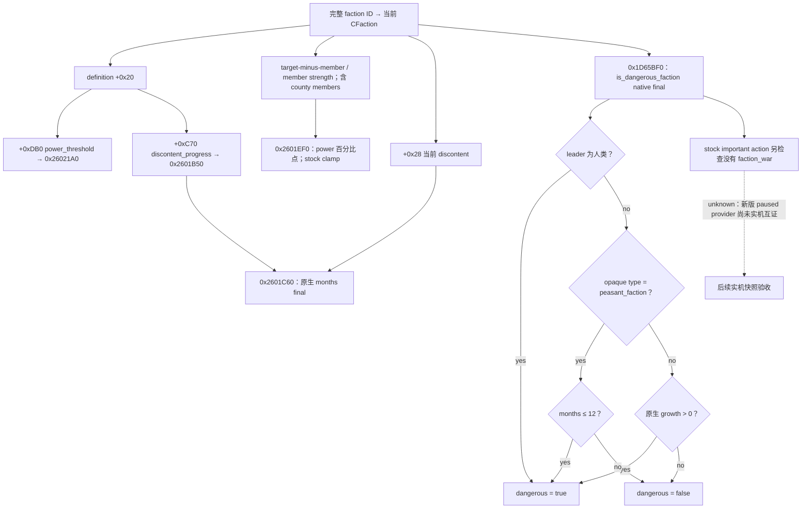

# CK3 1.20.0.2：派系原生最终指标

2026-10-01，冻结 CK3 **1.20.0.2 Crozier / Steam build 25588574**，EXE SHA-256 `AE1BA6FF060BA603842F6F4A2DED0AF4B7D3666B3DD271F75FB01B0DA8E81B2D`。本项为 **static-ready**：仅静态读取冻结 EXE 和原版脚本，没有查询、注入、启动或操作本地 CK3。完整 RVA、ABI、函数范围、SHA 和指令检查见 [ABI 合同](../../ck3_autonomous_player/native_bridge/research/ck3_12002_faction_metrics_abi.json)。本专题承接 [派系与叛乱原生树](factions-and-rebellions.md)，供应现有派系观测口，不另建查询协议。

| 我方需要的值 | exact-build 原生来源 | ABI / 单位 |
|---|---|---|
| power | `0x2601EF0` | `int64_t*(CFaction*, int64_t*)`；百分比点 Q100000，100% = 10000000 |
| power threshold | `0x26021A0` | 同 ABI；definition `+0xDB0` 的 `power_threshold` 最终脚本求值 |
| current discontent | `CFaction+0x28` | signed Q100000 点数；原生 scalar getter `0x2601C20` 同字段 |
| discontent per month | `0x2601B50` | `int64_t*(CFaction*, int64_t*)`；definition `+0xC70` 的 `discontent_progress` 最终点数/月 |
| months until max | `0x2601C60` | `int32_t(CFaction*)`；原生向上取整，0 有两类合法含义 |
| dangerous | `0x1D65BF0` | `bool(ignored RCX, CFaction* RDX)`；callback `0x2605B20` 实际复制同一 faction 到两个参数 |

所有表中调用均使用 MSVC x64 fastcall。CFaction 必须来自当前完整代际 ID 的已有原生解析器；调用在现有 paused application-main observer 中执行。`FactionItem` 与 `CFaction` 是不同 receiver，不可混传。power/threshold 返回调用者提供的 output 指针；growth 同样如此。

## 原生树和真正的危险判定

危险规则来自冻结 `common/scripted_rules/00_rules.txt:354`，其最终调用 `common/scripted_triggers/00_scripted_triggers.txt:206–220`。native leaf 从游戏 rule container `+0xEF0/+0xB60` 读取规则，以 scope type `0x19` 和完整 faction ID 求值；它没有把危险定义为一个我方猜测的固定兵力或不满阈值。`common/important_actions/00_realm_actions.txt:351–365` 对告警另外排除已有派系战争；该条件不属于 `IsDangerous` 本身。

原版默认 `power_threshold = 80` 不是全局恒定值：`common/factions/00_factions.txt` 的 hard-rule perk 及 `dynamic_power_threshold_scripted_modifier` 改变最终值；peasant、nomadic 等定义也可取 0。直接调用 `0x26021A0` 保留原生最终结果。这里只把类型当 opaque identity，不扩展宗教域。

## 单位、缓存和 getter 名称

`FactionItem.GetPower` 的 callback `0x14B0E40` 调用 `0x14AAD50`，输出的是 **strength ratio Q100000**，100% 对应 raw `100000`。CFaction 原生 final power `0x2601EF0` 把该比值乘以 100，输出 **百分比点 Q100000**，并原生 clamp 至 0–1000%。分母非正时 final 原生值为 1000%；不得改成零。DTO 的 power 与 threshold 应使用同一百分比点单位。

`FactionItem.GetDiscontent` 的 callback `0x14B0DC0` 调用 `0x14ABCD0`，将 `CFaction+0x28` 除以 100 后输出 GUI 归一化 Q100000。满 100 点时 UI raw 为 `100000`；直接将它和原生点数/月 growth 相除会错误 100 倍。读取原生 `+0x28` 点数保留低两位精度。原生 months getter 正确处理这两种来源；当 discontent 已满 **或** growth 非正时都返回 0，所以单独的 0 不表示马上提出要求。

所请求的 `FactionItem.GetPowerThreshold`、`FactionItem.GetDiscontentPerMonth` 名称在冻结注册表中不存在。实际 GUI 名为 `GetPowerThresholdPosition`，callback `0x14B0710` 调用 `0x14AA970` 返回 GUI position vector；它不能作为数值阈值。增长的真正最终 receiver 是上述 CFaction `0x2601B50`，它也被 `FactionItem.IsDiscontentIncreasing/Decreasing` 和 months 链调用。

缓存 `+0x30` / `+0x38` 是当前原生百分比点 power / threshold。`0x2602D20` 先调用 final power / threshold evaluator 写 staged `+0xA0/+0xA8`；`0x2602F50` 发布到当前 `+0x30/+0x38`。`FactionItem.HasEnoughPower` callback `0x14B1240` 对这两个当前字段做 signed 比较。该发布链证明单位，无需把 UI vector 或默认 80 猜成阈值。

member-strength final `0x26020B0` 同时计入 character vector 和 county vector，后者通过 `0x26000B0` 求值。因此 county 派系没有 character leader/member 仍可能有兵力、增长和真实危险；空名单不意味着不存在威胁。

## 边界与可复现证据

artifact 位于 `Z:\ck3_mod_rewrite\artifacts\g2-offline-2026-10-01\factions\metrics`，含 PE 只读定位脚本、literal registration 结果、完整 disassembly 和一次静态核验 receipt。`0x2601DA0` 的 MSVC `.pdata` 首段只有 14 字节，必须合并其 7 段 `UNW_FLAG_CHAININFO`；实际完整范围为 `0x2601DA0..0x2601EF0`，长度 `0x150`，合同使用完整 SHA。

本项闭合真实 native 来源和调用签名；不是 paused artifact、fixture-live 或 production-live 证据。接线及 serializer 由派系工作包维护者负责。下一步先以已有 production source fixture 验证 receiver 和单位，再用新版本真实 paused snapshot 对照原生告警、派系行和 county 成员；不得用 ACK 替代原生观测。精确 ultimatum 日期仍需独立原生时序证据，本项不将 stock months estimate 升级成精确 ultimatum readiness。
