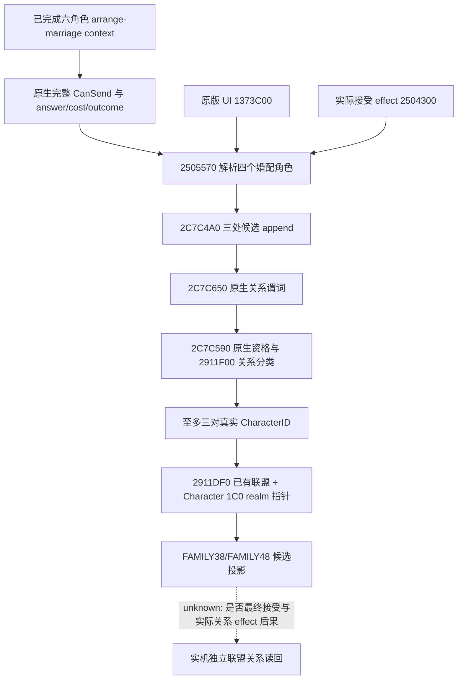

# CK3 1.20.0.2 婚配候选联盟投影

更新于 2026-10-01。状态为 **static-ready**；本工作包仅读取冻结 EXE、编译与运行合成内存 fixture，没有启动、连接或操作本地 CK3。它恢复 FAMILY38/FAMILY48 所需的候选上下文投影施工，不把离线结果记为新版本 live 验收。

冻结构建为 1.20.0.2 Crozier，EXE 大小 `101039736`，SHA-256 `AE1BA6FF060BA603842F6F4A2DED0AF4B7D3666B3DD271F75FB01B0DA8E81B2D`。输入文件为 `artifacts/migrations/2026-09-30/post-update-1.20.0.2/installation/binaries/ck3.exe`；完整实际字节、span hash、调用边、原生布局和源码常量绑定存于 [ABI 合同](../../ck3_autonomous_player/native_bridge/research/fixtures/ck3_12002_family_projection_abi.json)。

## 原生输入与执行链

| 来源 | 1.20.0.2 RVA | 原生证据及用途 |
|---|---|---|
| 原版 UI 联盟预览 | `1373C00` | `1373D0B` 调用候选角色 wrapper |
| 实际婚姻接受后的联盟消费 | `2504300` | `2504398` 调用同一个 wrapper；未执行此 effect |
| 已完成上下文的角色 wrapper | `2505570` | 从 `2D8/2DC/2E0/2E4` 读取 actor、recipient、secondary actor、secondary recipient，解析完整 CharacterID，再于 `2505689` 调用生成器 |
| 三对候选关系生成器 | `2C7C4A0` | 三处条件 append；每一处先调用原生 `2C7C650` 谓词，没有我方推测联盟双方 |
| 原生候选关系谓词 | `2C7C650` | 双方不同且两次 `2C7C590` 资格谓词成立；直接婚配当事人对成立，否则两次 `2911F00` 关系分类均为正且 signed sum 不超过运行时槽 `5C69E0C`。不假定槽的当前配置值 |
| 原生已有联盟谓词 | `2911DF0` | 使用 Character 的 `1A8` 关系对象、其原生 ID 容器和 fallback 关系 getter；由原生最终 bool 提供结果 |
| matrilineal option 读取/选择 | `3078880` / `30788E0` | StringID 槽为 `5D4BDBC`；原版 UI callback `1374A30` 于 `1374A42` 加载该槽、`1374A5B` 读取旧值、`1374A60` 反转 bool、`1374A6D` 调用 setter。在一次性已完成上下文上使用同一 setter，读回选中位 |
| 三行 inline owner | vtable `454E6E8` | initializer `855AC0` 明确设置 data=`owner+8`、capacity=`3`；pair stride=`32`，header=`24`，owner=`104` 字节 |

这里的资格 helper 保持原生调用，未给尚未由调用者命名证明的内部判定强加语义；本历史投影没有新增 faith/doctrine/tenet 查询或策略。项目所有者于 2026-10-02 已全面开放宗教研究与实现，原宗教暂缓限制撤销。需要解释宗教对联盟资格或婚姻接受度的实际影响时，下一施工入口是当前 exact-build 的资格谓词与最终婚姻判定调用分支，补同帧 faith/rite 与相关 doctrine/tenet 只读输入，接 bridge/MCP 后在罗贝尔婚配上下文验收；旧 opaque 结果和合成 fixture 不代替这项 live 证据。授权不提升该投影 readiness，也不解除罗贝尔唯一入口或战争研究停止、执行 OFF。

## 关键迁移差异与输出边界

Character 的 realm 指针从旧版 `1B8` 移至 **`1C0`**。实际消费者 `250442C` 与 `250443A` 的 `cmp qword ptr [...+1C0],0` 直接证明该偏移；合成 fixture 同时在旧偏移设置非零、在新偏移设置零，确认 provider 读的是新版字段。

pair wrapper、三对生成器、已有联盟谓词和 inline owner 均使用新的 RVA；只保留旧 serializer 的输出值类型，不调用旧版 provider，不使用旧上下文选项元素布局。五项输出均由本次实际回调/内存提供：双方完整 ID、原生已有联盟 bool、双方 realm 指针是否存在，以及当前 matrilineal option 位；空原生 vector 是合法的空候选结果。

**既有 wire 字段 `would_attempt_if_accepted` 的语义须收窄说明。** 为保持调用方结构，它仍为 `!already_allied && both_have_realm_data`，但反汇编证明实际消费者的这些条件控制玩家提示分支。所有对应条件分支都汇合到 `25044D6`，随后仍调用 `25044DC → 28BC320` 与 `25044FA → 25F2ED0`。因此该字段不能解释为完整联盟创建合法性、接受概率或必然新增联盟。原生候选对本身来自实际 effect 使用的原生生成器；真实成功仍须接受与世界关系读回。

provider 的调用方须在同一个 paused application-main 帧建立上下文、读取原生最终 legality/answer/cost/outcome，并在读后核对公开帧与人物关系。这些由统一 FAMILY provider 实现。本 adapter 额外核对输入四个完整角色 ID、生成的 secondary 双方及读后的上下文角色；它不会构造命令、发送婚姻或执行接受 effect。

## 离线验证与下一项实机入口

- [实际 EXE verifier](../../ck3_autonomous_player/native_bridge/research/verify_ck3_12002_family_projection.py)：逐字节检查原生 spans、实际 direct-call targets、inline owner vtable，以及源码常量在真实指令中的 operands。
- [adapter](../../ck3_autonomous_player/native_bridge/include/xar_bridge/ck3_12002_family_projection.hpp) 与 [实现](../../ck3_autonomous_player/native_bridge/src/ck3_12002_family_projection.cpp)：`BindFamilyProjectionImage`、`ReadFamilyAllianceProjectionV1`、`SelectFamilyMatrilinealOptionV1`。
- [fixture](../../ck3_autonomous_player/native_bridge/src/ck3_12002_family_projection_test.cpp) 和 [MSVC runner](../../ck3_autonomous_player/native_bridge/research/run_ck3_12002_family_projection_tests.py)：Debug/Release，`/W4 /WX`，17 项功能检查通过，包括三个不同候选对、实际已有联盟结果、新 realm 偏移、原版 option 选择/拒绝、合法空结果、角色绑定与读后漂移。
- 本次产物：`Z:/ck3_mod_rewrite/.task-tmp/family-projection-12002-build/result.json`、`abi-result.json`、两模式编译与运行日志。统一非战争候选构建由协调者绑定全部 FAMILY dependencies 后冻结；本模块不单独广告新的 production-live readiness。

当允许占用本地 CK3 后，使用新版统一候选，在同一 paused 帧经正式 private38/48 入口读取正常候选及 matrilineal 候选，再比较原版 UI 的实际联盟双方；婚姻接受后复用既有独立关系读回。该实机入口仍待执行，离线施工无须占用游戏。
