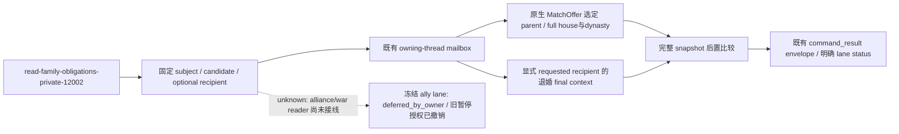

# 1.20.0.2 家庭非战争输入的 owning-thread 查询与 wire

2026-10-01 15:13 Asia/Shanghai 收口。状态为 `static-ready`，本轮没有读取、枚举、注入或操作本地 CK3，也没有新增实机资格。原生来源及调用树见 [家庭观测专题](ck3-1.20.0.2-family-obligations.md)。版本冻结为 1.20.0.2 Crozier / Steam 25588574，EXE SHA-256 为 `AE1BA6FF060BA603842F6F4A2DED0AF4B7D3666B3DD271F75FB01B0DA8E81B2D`。

2026-10-03 授权更新：战争与战斗的研究、实现、策略和实机验收已全面开放，旧仅非战争及战争暂停限制撤销。下文 `deferred_by_owner` / `war_research_deferred_by_owner` 是冻结实现仍返回的历史原因，不能再作为施工拒绝；ally lane 仍缺真实 alliance/war reader，应按当前 exact build 的原生树补观测、接线并取得 paused 证据。授权不提升 readiness；实机保留唯一原普通罗贝尔 `29829` campaign、原生 AI 研究优先、exact-build 绑定与最小化/noFocus，由 ROOT 单一 owner 操作。

本查询复用既有 `QueryMailboxEnvelope`。worker 只解析具体 full CharacterID、提交固定 callback 和序列化结果；原生 child-house preview 与退婚 final terms 在已建立的 application owner thread 读取。查询前后都用选定 1.20.0.2 adapter 比较完整 published snapshot。它不提交婚姻、退婚或其他游戏命令。

公开 wrapper 为 `HandleFamilyObligationsPrivate12002(adapter, mailbox, published, revision, step, payload, request_id, serialized, failure)`，固定 executor 为 `ExecuteFamilyObligationsMailbox12002`，matcher 为 `IsFamilyObligationsPrivateStep12002`。新的 private flag 是 `XAR_CK3_ENABLE_G2_M5_FAMILY_OBLIGATIONS_PRIVATE_QUERY_V1`，默认 OFF；编译需要既有家庭 projection flag。中央 bridge 注册、CMake 和 Python/MCP consumer 由各自工作包接线，此专题不把 standalone fixture 当成中央接线验收。

请求必填 `subject_character_id`、`candidate_character_id`；`request_matrilineal_option` 默认为 false。`break_recipient_character_id` 可省略，省略后不调用退婚 provider，状态为 `not_requested`。`expected_snapshot_revision` 可携带，携带时必须匹配 worker 提供的 revision。旧 `ally_character_id` 参数若携带，冻结 callback 仍只返回 `deferred_by_owner` 与 `war_research_deferred_by_owner`，不调用任何 alliance/war reader；省略时为 `not_requested`。这是尚未迁移/接线的实现事实，旧暂停授权已撤销；该缺口不阻断已可读取的输入。

`command_result.result` 直接包含 `schema_version: 1`、`kind: ck3_12002_family_obligations_private_v1`、exact-build 身份、`frame` 和三项 lane。冻结实现的 `query_status` available / partial / unavailable 只计算实际请求的非战争 lane；它不是总效用、未来收益或全 M5 readiness。消费方必须按自身决策检查对应 lane，不能把未请求或未接线项当成已读取。

`native_child_house_preview` 分开输出 requested / selected matrilineal option、effective outcome、final CanSend、原生选定 parent 与 house / dynasty。原生 `CanSend=false` 是合法的负观测；无 house / dynasty 也可合法输出 null，不能混为读取失败。退婚的 native send charge 10 槽向量与 `outcome_resource_penalty` 分开：后者保留 stock branch projection 的来源、资源惩罚可用性及 `effects_complete`，不冒充 loaded override 的完整效果或实测资源变化。

一次必要验证使用 `research/run_ck3_12002_family_obligations_wire_tests.py --build-root <Z盘输出目录>`，4 个独立 native suite 并行通过 `/Od` 与 `/O2`、`/W4 /WX`。真实 reader → owner mailbox → serializer fixture 验证选定 parent、完整世家 ID、selected/effective option 区别、原生 no-betrothal 负观测、worker 不能执行 native read、完整帧后置漂移不被接受，以及暂停的 ally 参数不拒绝无关非战争查询。独立 wire fixture 验证 send charges 与 stock outcome loss 区别；该 fixture 的 penalty DTO 是明确构造的输入，不宣称由实际游戏读取。

最终 receipt：`Z:\ck3_mod_rewrite\artifacts\g2-offline-2026-10-01\family-obligations\wire\build-release-ready\result.json`，SHA-256 `f78fb3763042684a8a01780e724aad4dac35d10a6b10b24618597e7419569290`。仓库冻结的 native wire 和 provenance 在 `ck3_autonomous_player/native_bridge/research/fixtures/ck3_12002_family_obligations_{mailbox,wire}_wire.*`。此前失败保留在同目录 `build`、`build-final`、`build-final2`：分别是 fixture 对 JSON 控制字符转义的预期、fixture namespace 拼接与后置漂移触发次数问题，均为 harness RED，没有实机 capability RED。

后续实机资格仍需 exact-build paused query、真实 final context/选择项/资源语义与同帧实证；这些任务已获授权，由 ROOT 在唯一罗贝尔 campaign 中按实际接线执行。G2 分母和完成数没有因本轮 fixture 或新授权改变。
