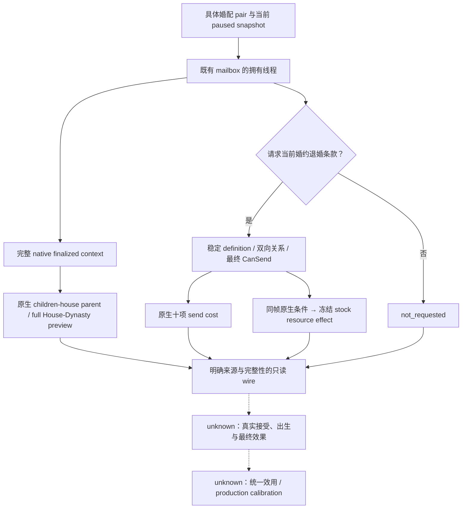

# CK3 1.20.0.2：非战争婚配长期输入的后台迁移

本工作包给已迁移 FAMILY38/FAMILY48/68/69 增加两个可独立使用的非战争观测：具体婚配的原生子代 House 预览，以及当前
婚约的完整原生退婚 CanSend、发送费用和有条件 stock 声望后果。没有改变现有婚姻策略或统一效用，也没有操作 CK3。
当前状态是 `static-ready`，不升级 G2 M5、整局 OODA、出生结果或自然退婚结果的实机状态。

构建固定 `1.20.0.2 (Crozier)` / Steam `25588574`，EXE SHA-256
`AE1BA6FF060BA603842F6F4A2DED0AF4B7D3666B3DD271F75FB01B0DA8E81B2D`。
现有 current lineage、fertility、ranked candidate、bilateral/outbound/betrothal fulfillment 原语不在本包重新施工或重验。

| 输入 | 具体原生来源与可用价值 | 保留的边界 |
|---|---|---|
| `native_child_house_preview` | finalized 六角色 context → 实际 selected option → `MatchOffer.GetChildrensHouse` 的原生 parent getter `0x13753A0` → full House/Dynasty；可比较具体默认/母系提案的 native prospective result | 没有出生、怀孕概率或最终子女状态；selected option 与 effective lineality 独立保留 |
| `betrothal_break_terms` | 原生 stable definition lookup → redirect/current bilateral pair → complete CanSend → 十项原生发送成本；同帧 native traits/variables/kin/tier/婚配必要判定驱动冻结 stock 的 conditional prestige/-level branch | 发送费用与 on_accept 后果独立；stock branch projection 不是 loaded override 或已经扣款，完整 opinion/unity/event 后果未完成 |
| 已冻结的盟友战争 source | 暂停前已完成具体双向联盟/实际 WarIDs/side/原生征召 gates 的静态来源 | 用户暂停战争研究后立即冻结；排除当前 candidate 的实际 callback，不继续研究、注册或调用 |

原生树与 exact ABI 在 [子代 House 预览](ck3-1.20.0.2-marriage-child-house-preview.md) 和
[退婚原生条款](ck3-1.20.0.2-betrothal-break-terms.md) 当场落盘。
盟友已完成资料保留于 [冻结战争观测专题](ck3-1.20.0.2-alliance-war-obligations.md)，不作为本轮可执行接口。

## Query 与 ownership

新增 private step `read-family-obligations-private-12002` 继续使用现有 application-main `QueryMailboxEnvelope`：当前公开 snapshot
身份 → typed 请求 → 既有拥有线程 callback → 只读原生 query → full snapshot 后置检查 → wire。没有新游戏动作、命令队列或输入。
入口由 `XAR_CK3_ENABLE_G2_M5_FAMILY_OBLIGATIONS_PRIVATE_QUERY_V1` 控制，默认关闭；native lineage 使用已迁移的
`XAR_CK3_ENABLE_G2_M5_ALLIANCE_PROJECTION_PRIVATE_QUERY_V1` 家庭 query 绑定（该历史 flag 名称不授权战争施工）。

具体 `subject_character_id`、`candidate_character_id` 为必需完整 ID，`request_matrilineal_option` 默认 false。
退婚 lane 仅在指定 `break_recipient_character_id` 时读取；遗漏 lane 标记 `not_requested`，不让不相关缺项阻断可读 House 预览。
native complete CanSend=false 是可观察的负路径，不能混写为 native query 不可用；可读预览也不能授权一个非法提案。

当前存档仍存在待决的 Guy 提案或未成年首继承人婚约时，本工作包不会重发、不解除或替换任何关系。
查询仅观察已选择的具体 pair/current terms；原有 pending、receipt、独立关系读回和 cold resume 合同保持由既有消费者管理。

## 验证与仍需实机的范围

子代 reader 的 `/Od`、`/O2`、`/W4 /WX` fixture 与 **7 spans / 17 instructions / 3 vtable entries** 的 exact EXE 验证 GREEN。
退婚 reader 的 native final source、conditional stock resource observer 及实际 composition 使用各自独立 fixture；证据统一落在
`artifacts/g2-offline-2026-10-01/family-obligations/`，具体数目与结果以对应专题和结果 JSON 为准，不重复旧矩阵。

新增实际 domain → owning mailbox → wire **4/4 GREEN**，见 [正式 wire 合同与源路径](ck3-1.20.0.2-family-obligations-wire.md)。
`wire/build-release-ready/result.json` SHA-256 `f78fb3763042684a8a01780e724aad4dac35d10a6b10b24618597e7419569290`。
实际 lineage provider 的完整 mailbox packet 已进一步经过 Python query 和 MCP SDK，六项针对性 case GREEN；SDK 不发布盟友战争参数。
全面退婚 DTO 的 serializer fixture 明确标注 wire-contract 作用域，不能借它宣称全面原生 penalty callback 或实机资源后置。

当前 native source 与新 query 的 material positive path 均需未来实际 paused artifact：具体合法婚配的 House 预览和母系选择、
已有婚约的 final CanSend/send charge/有条件 prestige branch 同帧读回，以及真实新 SDK/MCP → owning callback → wire 的实例结果。
未来若授权实际退婚，资源和关系后置仍应独立观察；query/ACK 不替代最终结果。当前没有用于更新整局 readiness 的新增实机 artifact。
