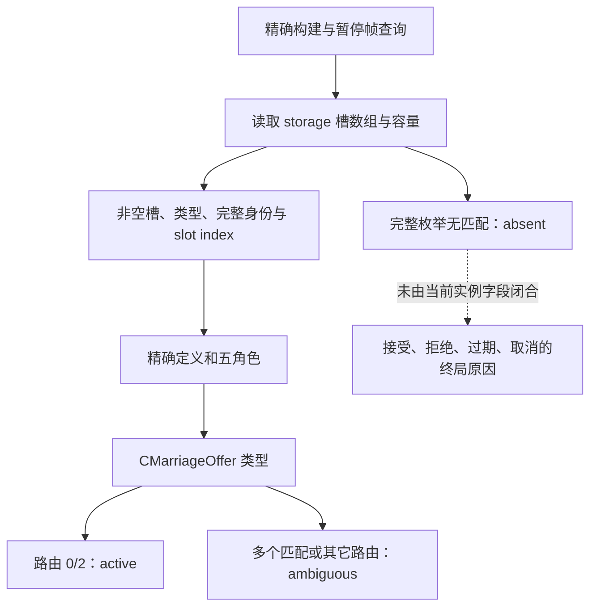

# CK3 1.20.0.2：发送婚约后的待处理实例字段证明

状态：**static-ready**。只读取冻结磁盘 EXE；本工作没有启动游戏、附加进程、访问 pipe、桌面、userdir、存档或工坊。实际暂停帧查询和婚配结果仍待实机验证。

精确构建：CK3 `1.20.0.2`，EXE SHA-256 `AE1BA6FF060BA603842F6F4A2DED0AF4B7D3666B3DD271F75FB01B0DA8E81B2D`。证明文件为 [ABI fixture](../../ck3_autonomous_player/native_bridge/research/fixtures/ck3_12002_family_outbound_fields_abi.json)，复核入口为 [离线 verifier](../../ck3_autonomous_player/native_bridge/research/verify_ck3_12002_family_outbound_fields.py)。现有婚约履行的定义数据库绑定复用 [fulfillment fixture](../../ck3_autonomous_player/native_bridge/research/fixtures/ck3_12002_family_fulfill_abi.json)。

| 原生内容 | 新版绑定与逐指令证据 |
|---|---|
| Pending storage | 全局 slot `0x5D1EC80`；`storage+0x20` 槽数组，`+0x2C` 容量；槽 stride `0x10`，对象指针在槽 `+0x08` |
| 完整实例身份 | 对象 `+0x10`；构造器 `0x2A32790` 保留高 8 位并递增代际，发布完整 ID；原生 resolve/delete 均比较完整 ID |
| Pending 类型 | 主 vtable `0x4759240`；`+0x08` 子对象 vtable `0x4759278`；RTTI `.?AVCPendingCharacterInteraction@@`，TypeDescriptor `0x59FEEC0` |
| 婚姻专用类型 | `CMarriageOffer` vtable `0x44B9928`；TypeDescriptor `0x56947C8`，COL `0x4A59130`；factory `0xB197D0` 分配 8 字节并写入此 vtable |
| 定义与角色 | 定义指针 `+0x18`；actor `+0x2F0`、recipient `+0x2F4`、secondary_actor（subject）`+0x2F8`、secondary_recipient（candidate）`+0x2FC`、intermediary `+0x300`；均由内嵌 context `+0x18` 的原生 copy `0x3076B80` 证明 |
| Arrange 定义 | 全局数据库 slot `0x5C67538`，数据库 `+0xF30` 定义指针；不是 UI 文本匹配 |
| 婚姻 special | 实例 `+0x348` 指针，必须匹配上述 `CMarriageOffer` vtable |
| 年龄与 AI 截止 | `age_days +0x5B8`；`ai_reply_cutoff_days +0x5BC`，构造器写入 `0x2A328FE`，每日逻辑 `0x2A2FD14/1A` 加载并比较 |
| Routing | **dword** `+0x5C0`；0/2 到 recipient，1 到 intermediary，3 是 intermediary 拒绝分支；不能按 byte 读 |
| 通知字节 | `+0x5C6` 是 auto-accept notification；`+0x5C4/+0x5C5` 保留为未分类原始内部字节，不能命名为终局拒绝状态 |
| 身份初始化 leaf | `0x1731C10`，`83 79 08 FF 0F 95 C0 C3`；对 pending `+0x08` 调用，只证明完整 ID 不等于 -1 |
| 枚举与删除 | 枚举器 `0x2A32970` 遍历容量和非空槽；删除 `0x2A2F880` 先校验完整代际 ID，调用 destructor，将释放 ID 标记并把槽对象指针清零 |

初始化 leaf 本身不证明对象仍在存储中。正式 scanner 还要求槽非空、对象类型正确、完整 ID 的低 24 位等于槽 index，并精确匹配定义、actor/recipient/subject/candidate 和 intermediary `-1`。多个精确匹配实例返回 `ambiguous`。成功完整枚举且无匹配实例才返回 `absent`。

`absent` 不能替代配偶／婚约关系后置条件，也不能区分接受、拒绝、过期和取消。原生 response transition `0x2A2F980` 与 expiry 分支会移除实例；不能把“对象消失”或发送 ACK 写成成功婚配。历史 resolution journal 属于单独证据，当前只读 cold snapshot 不需要安装 hook。

本次 verifier GREEN：**10 个唯一签名、3 张 vtable、64 条指令、7 段原生函数、3 项 RTTI 绑定、17 项正式 provider 常量及 4 项带类型的存储读取**。结果位于 `artifacts/nonwar/2026-10-01/ck3-12002-family-outbound-fields-abi-result.json`。这些检查闭合静态 ABI 和生产绑定，不提升为 `fixture-live` 或 `production-live`。

## 正式 provider 与离线夹具

实现为 [ck3_12002_family_outbound.hpp](../../ck3_autonomous_player/native_bridge/include/xar_bridge/ck3_12002_family_outbound.hpp) 和 [ck3_12002_family_outbound.cpp](../../ck3_autonomous_player/native_bridge/src/ck3_12002_family_outbound.cpp)，命名空间 `xar::ck3_12002`。`BindFamilyOutboundImage(module_base, executable_sha256)` 绑定上述新版 storage、定义数据库和原生初始化 leaf；`ReadMarriageOutboundPendingSnapshotV1(bindings, actor, recipient, subject, candidate, output)` 直接读取全局存储。返回值继续使用原有 `MarriageOutboundPendingSnapshotV1`，因此 pending ID、年龄、截止与 active/absent/ambiguous 的 wire 语义不变。外围 FAMILY 查询仍负责 owning thread 与同一暂停帧校验。

MSVC x64 `/std:c++20 /EHsc /W4 /WX` 编译和 [production scanner 夹具](../../ck3_autonomous_player/native_bridge/src/ck3_12002_family_outbound_test.cpp) 通过。夹具直接调用正式全局读取入口，未创建或安装旧 resolution journal，验证冷恢复可见的真实匹配实例、五角色及定义、完整 pending ID 与槽 index、原生 leaf 接收 `pending+0x08`、婚姻 special 类型、重复实例、合法 ID 零以及读取失败结果清空。路由 `256` 用于确认正式读法是 dword；年龄和截止 `0` 保留为合法观测。完整扫描后的 absence 保留为未知终局原因。

构建与测试记录位于 `artifacts/nonwar/2026-10-01/family-outbound-build/compile.log` 和 `test.log`。剩余实机工作是完整 FAMILY 入口的真实暂停帧查询、冷恢复后的 pending 变化以及配偶／婚约关系后置条件，当前后台包未触碰本地游戏。
