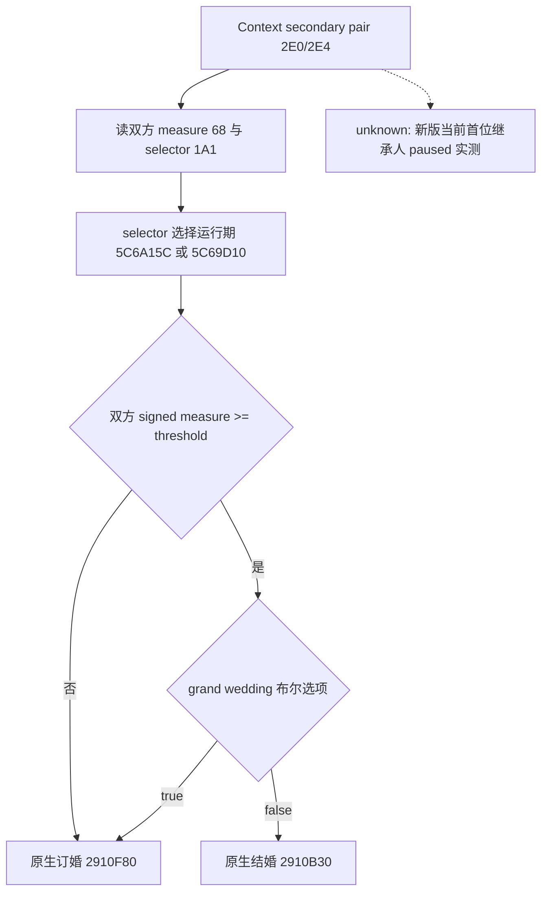

# CK3 1.20.0.2 当前首位继承人婚约只读 ABI

2026-10-01 的离线派生；状态为 `static-ready`，没有打开进程、连接 pipe、注入、操作桌面或运行游戏。供新版当前首位继承人查询复用，不能代替新版 paused snapshot 验收。

冻结目标：Crozier `1.20.0.2`，Steam build `25588574`，EXE `101039736` 字节，SHA-256 `AE1BA6FF060BA603842F6F4A2DED0AF4B7D3666B3DD271F75FB01B0DA8E81B2D`。证据、可执行验证器和 C++ 常量分别为 `native_bridge/research/ck3_12002_family_query_abi.json`、`verify_ck3_12002_family_query.py` 和 `include/xar_bridge/ck3_12002_family_query_abi.hpp`。

## 对象与关系集合

| 原生字段 | 新版布局与冻结指令 |
|---|---|
| 家族对象 | `CCharacter+0x1A8`；`0x1B971C5: 48 8B 88 A8 01 00 00` |
| 婚约对象 ID | `Family+0x10`；`0x1B971D6: 44 8B 49 10` |
| 主配偶 ID | `Family+0x14`；`0x1B9727E: 8B 42 14` |
| 配偶集合 | `Family+0x20`，CArray 数据 `+0`、容量 `+8`、数量 `+0xC`；`0x1375993: 48 8D 78 20`，数量读取 `0x13759AB: 48 63 47 0C` |
| 死亡对象 | `CCharacter+0x1D0`，沿用已迁移 foundation ABI；旧 `+0x1C8` 不适用 |
| 完整角色 ID | `CCharacter+0x18`；存储槽按低 24 位索引，返回对象完整 ID 必须匹配 |

新版婚姻 production reader 已用以上集合布局。首位继承人查询复用该布局，对继承人与婚约/配偶逐一读双向关系，随后在同一 paused frame 再采样；不能把过滤掉的失效原始 ID 当作“没有婚约”。原始 `-1` 才表示空身份。

## 成年输入与原生结果

旧 `0x2282DE0` 结果分派函数的唯一完整前缀迁移到新版 `0x2503C60`。其主体仍先从 context `+0x2E0/+0x2E4` 解析 secondary pair，再按下表直接比较输入：

| 输入或分支 | 冻结原生证据 |
|---|---|
| 成年 measure | `CCharacter+0x68`，有符号 `int16`；`0x2503D59: 0F BF 4F 68`，另一方 `0x2503D61: 0F BF 43 68` |
| selector | 新版 `CCharacter+0x1A1`，`uint8`；`0x2503CF6: 44 0F B6 B3 A1 01 00 00`；旧 `+0x199` 不适用 |
| selector 0 阈值 | RIP 读取 `0x2503D44` → `0x5C6A15C`，运行期有符号 `int32` |
| selector 1 阈值 | RIP 读取 `0x2503D4E` → `0x5C69D10`，运行期有符号 `int32` |
| 阈值选择与比较 | `cmovne`，有符号 `cmp` + `jl`；成年为 `measure >= threshold` |
| 布尔选项读口 | `0x3078880`，`bool(context, uint32 option_id)` |
| 母系选项 ID | RIP `0x2503D19` → `0x5D4BDBC` |
| 大婚选项 ID | RIP `0x2503D2B` → `0x5D4C0B4` |
| 结婚结果分支 | 双方成年且大婚选项为 false，`0x2503D9D` 调 `0x2910B30` |
| 订婚结果分支 | 否则 `0x2503ED7` 调 `0x2910F80` |

阈值必须读运行期 define，不得用常量“16 岁”替代。当前已有婚约的成年观测可独立读双方实际 measure/selector/threshold；原生 complete-can-send、接受度、费用和结果判定继续走 finalized context。



## 真正接收者与完整判定

`00_marriage_interactions.txt:94–161` 的 `redirect` 使用原生 `matchmaker`：保留配对双方为 secondary_actor/secondary_recipient，将 matchmaker 作为 actor 或 recipient。这里的婚姻接收者不是教育 guardian，也不能由“父母/雇主”猜算。脚本文件及 redirect 块哈希冻结在 JSON。

新版 `0x3148DE0` 有六个角色指针，加上 definition 为七参。native marriage caller `0x1AA80D5` 给新增角色写 `-1`，`0x1AA80E2` 传其指针，`0x1AA810D` 调 redirect，`0x1AA8151` 调 `0x3076E50` all-role constructor。读取已有继承人婚约时，以当前玩家 actor、继承人 secondary_actor、婚约对象 recipient/secondary_recipient 初始化，并让 native redirect 决定实际接收者。

构造后的角色字段仍为 actor `+0x2D8`、recipient `+0x2DC`、secondary_actor `+0x2E0`、secondary_recipient `+0x2E4`、intermediary `+0x2E8`；constructor 的五次写入均已冻结。必须检查配对双方仍是目标身份。

final answer evaluator 新版为 `0x307BC80`，ABI `uint8(context, uint8, uint8, void*, void*)`，由 complete validate `0x307C08E` 直接调用。接受度 score 使用已迁移 `0x307C460`，费用复用 production 十资源 evaluator。接受度原始值不是概率，命令 ACK 也不能替代关系完成观测。

宗教保持婚姻原生最终合法性中的 opaque 结果；本工作没有展开宗教系统。

## 验证与待验收

离线验证通过 6 个唯一签名、39 条指令、18 个 C++ 常量和 17 个直接原生操作数绑定。结果存于 `Z:/ck3_mod_rewrite/artifacts/nonwar-offline/2026-10-01/family-query-abi-result.json`。可复现命令：

```text
tools\.venv\Scripts\python.exe ck3_autonomous_player\native_bridge\research\verify_ck3_12002_family_query.py --exe artifacts\migrations\2026-09-30\post-update-1.20.0.2\installation\binaries\ck3.exe
```

待实机的是新版当前首位继承人双向关系、双方运行期阈值、成年婚约的最终角色/合法性/接受度/费用/结果。这里只收口原生 ABI 派生；不能把它称为已实测婚约完成 OODA。
