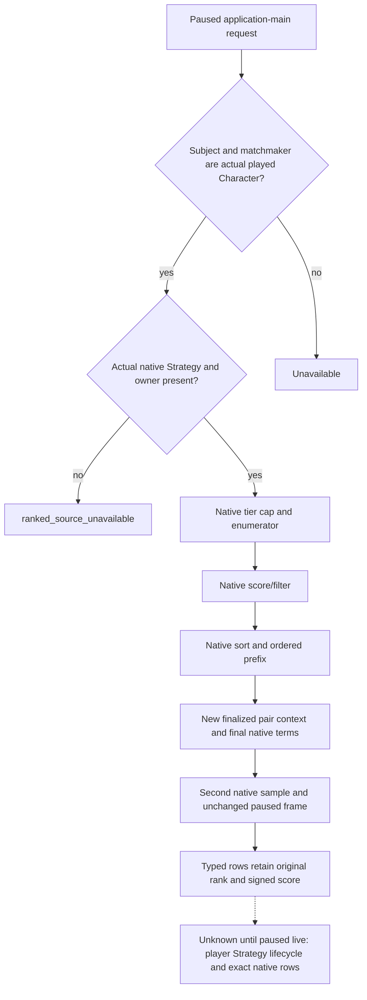

# CK3 1.20.0.2 ranked marriage query migration

Status: `static-ready`; no new live evidence and no running CK3 access. This
package implements the actual ranked producer used by private mailbox slot 38.
It is separate from the rankless first-heir/player-child candidate query.

The admitted build is CK3 `1.20.0.2`, Steam build `25588574`, EXE size
`101039736`, SHA-256
`AE1BA6FF060BA603842F6F4A2DED0AF4B7D3666B3DD271F75FB01B0DA8E81B2D`.
The existing [marriage tree](marriage-and-alliance.md) and the new
[native producer proof](ck3-1.20.0.2-family-ranked-producer.md) are the input
ledger. No scoring policy or general religion query is added.

## Actual producer and ranking

The played Character's living extension is `+0x1B0`, followed by Strategy
`+0x278`. Strategy `+0x18` must reference that same actual Character and
`+0x20` must contain its ready owner. A player without this native Strategy
returns `ranked_source_unavailable`, with source failure `strategy_unavailable`;
this observation is distinct from an available producer returning zero rows.
The provider creates no substitute Strategy or synthetic score.

The native tier helper `0x28AC6B0` indexes enumeration cap table slot
`0x5449F10`. Non-positive signed caps become zero. Enumerator `0x1A3BD40`
receives `(strategy, 0, true, native_cap, pool_header)`; the returned-row limit
does not replace this native cap. Score/filter `0x1A3C670` and gate/score
`0x1A3C800` consume the real native parameters: marriage definition, subject
pointer twice, signed age byte from living `+0x310 → +2` compared with 30,
and minimum score 1. The native scorer applies its own scoring cap table
`0x5449B30` internally.

**Score/filter alone does not sort.** The stock debug caller invokes sort
`0x1123AA0` at `0x111EA08`; the stock production caller invokes it at
`0x1AA85A5`. The new provider calls that same native sort after scoring and
before publishing any rank. Its small-list comparator at `0x112E430` uses
signed score descending, then unsigned full CharacterID descending on ties.
Large lists retain the stock wrapper's merge path. The bridge does not
reimplement ordering. The sort's opaque functor reads one byte; the bridge's
eight-byte scratch allocation is a caller storage choice, not a native type
size claim.

Rows have stride `0x10`, native row vtable `0x4528100`, full CharacterID at
`+8`, and signed int32 score at `+0xC`. The query copies at most eight rows
from the native ordered prefix and generation-resolves each copied candidate.
A candidate filter is applied to that prefix while retaining its original
rank: filtering native rank 2 returns rank 2, and a candidate beyond an
explicit limit remains outside that query's result.

## Native containers and per-pair evaluation

Candidate/scored header layout remains data `+0`, signed capacity `+8`,
signed count `+0xC`, owner `+0x10`, header size `0x18`. Their embedded owner
storage is `0x410/0x210` bytes and inline capacity is `128/32`. New owner
vtables are `0x45284A8/0x4528460`, with backing allocator objects
`0x54DEBB8/0x54E1420`. Candidate initializer is `0x9B4F80`, scored constructor
is `0x1121DA0`, and buffer release is `0x855830` with alignment 8.

The scored constructor clears data and capacity/count before its subsequent
reads. Reusing that constructor to dispose of a populated header discards the
original spilled buffer. The new provider follows the real caller at
`0x111EB39..0x111EBB6`: retain original scored data, invoke row destructor
`0x8863D0` with deleting flags 0 for every row, clear count, release the
original scored buffer, clear data/capacity, then clear candidate count and
release its original buffer. The offline fixture exercises both buffers
spilling beyond inline capacity and checks the original pointers are released.

Each copied row is evaluated through the migrated
`PrepareFamilyPairContextV1 / ReadFamilyPairTermsV1` APIs. They supply the
new six-role redirect, actual finalized recipient/intermediary, complete
CanSend, native recipient acceptance and final answer, runtime adulthood,
and marriage/betrothal prediction. Actual negative legality/acceptance remains
observable. Rank does not grant send permission or establish an outcome.
The legacy wire's acceptance field is int32: a real int64 native operand
outside that range returns `acceptance_score_overflow` instead of truncation.
The absent intermediary retains the native uint32 `0xFFFFFFFF` sentinel.

## API, evidence and integration

`ck3_12002_family_ranked.hpp` exposes `FamilyRankedBindings`,
`BindFamilyRankedImage(base, sha)`, `FamilyRankedAccessV1` with caller-owned
frame/owning-thread callbacks, and `ReadMarriageMatchmakingObservationV1`.
The output uses `bridge::MarriageMatchmakingObservationV1` as a wire value
only; no old native binder, observer admission, Strategy offsets or producer
functions are called. False means a typed unavailable observation, including
Strategy absence. It does not turn a completed query into a transport failure.
True means an available observation, including an actual native empty result.
The central slot 38 mailbox owns thread routing and public/native revision
identity; its existing pure renderer updates the old serializer's
`exact_build` field to `1.20.0.2`.

Frozen proof lives in the two `research/fixtures/ck3_12002_family_ranked_*_abi.json`
contracts. `research/verify_ck3_12002_family_ranked.py` verifies the producer
and container source together: 81 producer instructions, 59 native call
edges, 15 producer spans and 12 directly bound producer constants; plus
71 lifecycle instructions, 19 vtable/allocator edges, 12 lifecycle spans
and 9 directly bound lifecycle constants. The scratch allocation constant
is intentionally not described as a native ABI field.

The MSVC `/W4 /WX` fixture verifies the actual production provider with
fixture-owned objects/functions: native sort and cap, original ranks under
filter/limit, missing Strategy, concrete pair terms, both spilled buffers,
int64 acceptance overflow, same-frame drift and player identity. Its raw
wire artifact passes through the real pure serializer and central build
renderer. Result files are under
`artifacts/nonwar-offline/2026-10-01/family-ranked-*.{json,log,exe}`.

Remaining live work is a paused slot 38 read on this exact EXE/DLL, actual
Strategy absence/presence, native ordered rows where available, and redirected
pair terms. The historical R720 Strategy absence is evidence for 1.19's
player lifecycle, not new 1.20 live acceptance. This package neither submits a
marriage command nor claims a production marriage or complete OODA loop.
