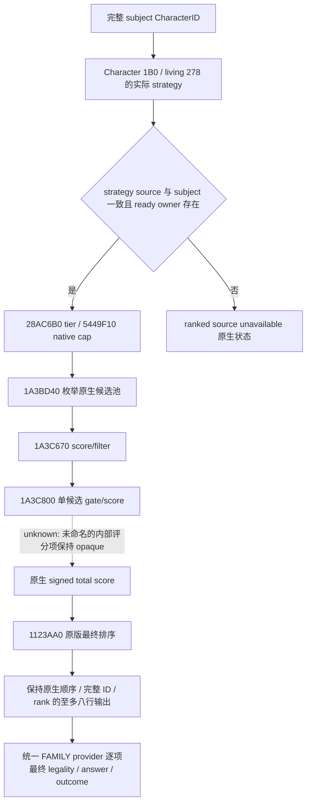

# CK3 1.20.0.2 婚配原生候选与排序生产链

2026-10-01 离线施工；状态 **static-ready**。本包仅读取冻结 1.20.0.2 EXE，并核对新版 provider 常量，没有启动、连接或操作本地 CK3。冻结 EXE 大小 `101039736`，SHA-256 `AE1BA6FF060BA603842F6F4A2DED0AF4B7D3666B3DD271F75FB01B0DA8E81B2D`。

实际字节与布局合同为 [ck3_12002_family_ranked_producer_abi.json](../../ck3_autonomous_player/native_bridge/research/fixtures/ck3_12002_family_ranked_producer_abi.json)。[verifier](../../ck3_autonomous_player/native_bridge/research/verify_ck3_12002_family_ranked_producer.py) 已检查 15 个完整 spans、81 条指令、59 条实际调用边、12 个新版源码常量及其原生 operand 绑定；结果为 `artifacts/nonwar-offline/2026-10-01/family-ranked-producer-abi-result.json`。统一 provider 的编译、合成 fixture 与 private application-main 集成由 FAMILY 施工协调者合并。

## 原生生产链

| 入口或来源 | 1.20.0.2 地址／布局 | 已闭合证据 |
|---|---|---|
| `CalculateSpouseCandidates` 注册 | 字符串 `4528970`；callback `1122C20` | 实际字符串与注册字节，`1122C29 → 111E830` |
| 原版 debug core | `111E830..111EBD9` | 从窗口 `A8` 的完整 CharacterID 解析角色，读取该角色自己的 matchmaking strategy |
| 角色 strategy | Character `1B0` → living `278` | strategy `18` 为 source Character，`20` 为 ready owner；原生 core 的 `111E8C0` 检查 ready owner |
| 原生候选枚举 | `1A3BD40` | debug `111E9D3`、生产 `1AA7D63` 调用同一原生枚举器；参数 selector=`0`、mode=`true`、native cap |
| 原生 score/filter | `1A3C670` | debug `111E9F7`、生产 `1AA8526` 调用；score/filter 自身没有完成最终排序 |
| 原生单候选 gate/score | **`1A3C800`** | score/filter 的 `1A3C751` 与 `1A3C7CD` 调用，实际完整范围 `1A3C800..1A3CA0B` 为 523 字节，跨 5 段 chained `.pdata`。`1A3C820` 位于指令内部，不能作为函数入口 |
| 原生 tier | `28AC6B0..28AC73C` | debug `111E994`、score/filter `1A3C6B0` 调用 |
| 原生枚举 cap | pointer slot `5449F10` | debug `111E99C` 加载按 tier 索引的 signed int32；非正值取零 |
| 原生评分 cap | pointer slot `5449B30` | score/filter `1A3C6BE` 使用独立的按 tier 索引 signed int32；不能混用枚举 cap |
| 原生最终排序 | `1123AA0` | debug `111EA08`、生产 `1AA85A5` 都在 score/filter 后调用 |

## 参数与排序差异

原版 debug caller 构造 32 字节参数：interaction definition 在 `0`；strategy source Character 在 `8` 与 `10`；`18` 是 younger-than-thirty bool；`1C` 是 minimum score=`1`。年龄输入来自新版 living `310` 的比较对象，其 `2` 为 **signed int8**；`111E90D` 的 signed `<30` 与 `111E910` 的 `setl` 直接证明比较方式。这不是替换角色正式年龄字段的通用读法，只用于复用该原生候选评分参数。

旧 container adapter 的 `enumerate → score/filter` 组合缺少原版调用者的 **最终 native sort**。新版 provider 必须调用 `1123AA0`，再截取输出上限和生成 rank。该 wrapper 在至多 32 行时调用 `112E430`；真实比较指令证明 signed score 降序，同分时完整 CharacterID 按 unsigned 降序。超过 32 行使用 wrapper 自己的递归／merge 路径；我方不重写排序、不另加 tie-break。

sort 的第二参数由原生 caller 作为无业务字段的 functor 存储传入，wrapper 只读一个 opaque byte；provider 使用八字节本地 scratch 属于调用方分配方式，不能称为原生结构有八字节业务布局。

输出保留原生 scored row：stride=`16`、完整候选 ID 在 `8`、signed int32 score 在 `C`。共享生命周期 adapter 负责候选和评分容器的精确 owner、allocator、每行析构与 buffer 释放；该模块不把源码中的常量或 fixture ACK 当成实机 ranked 查询成功。

## Readiness 与实机入口

真实角色没有 ready matchmaking strategy 时，原版 debug core 自身跳过生成。统一 provider 应保留 `ranked_source_unavailable`，不能借用其他 AI 的 strategy，也不能给人类玩家人工造一个“原生排名”。该条件是已闭合的原生运行状态分支；候选最终合法性、成本、lineality、家族与生育值仍走已施工的独立 FAMILY 查询。

下一项实机验收是在允许占用 CK3 后，用新候选的正式 private ranked 查询入口采集同一个 paused frame，确认实际 strategy 状态、原生容器顺序、最终 pair predicates 与独立关系观测。若所选角色的原生 strategy 不可用，应保存这一真实状态，并以原版支持的候选源继续观测施工；不得把这次离线合同称为已验证 human-ranked OODA。

这里的评分子项和信仰影响只保留原生最终值及 opaque 分支。没有展开通用宗教研究或策略。
