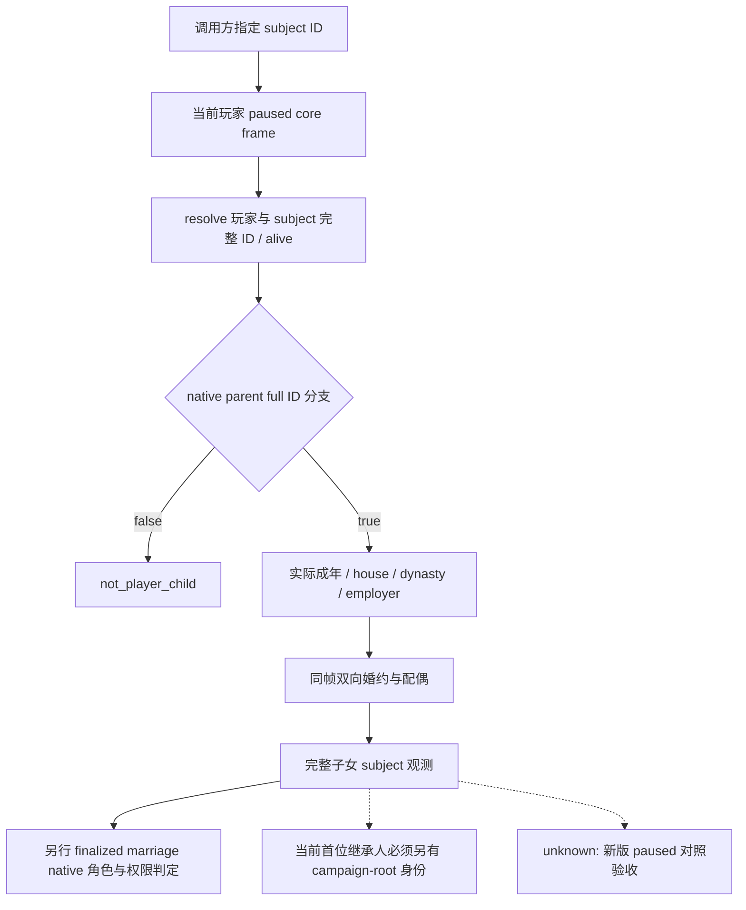

# CK3 1.20.0.2 指定玩家子女与家族集合观测

2026-10-01 离线施工；`static-ready`。这项工作补齐非首位继承人、调用方指定玩家子女的真实观测依赖，便于接回交接中的 Guy formal consumer；不会使 Guy 历史 outbox 重用默认开启，也不会把“是玩家子女”当成“是当前首位继承人”或“有权发送婚姻”。

冻结目标为 `1.20.0.2 Crozier`，Steam build `25588574`，EXE SHA-256 `AE1BA6FF060BA603842F6F4A2DED0AF4B7D3666B3DD271F75FB01B0DA8E81B2D`。实现为 `native_bridge/include/xar_bridge/ck3_12002_family_subject.hpp` 与 `src/ck3_12002_family_subject.cpp`，原生证据为 `research/ck3_12002_family_subject_abi.json`。本次没有启动、附加、注入、连接 pipe 或操作本地 CK3。

## 原生子女资格与真实集合

新版 stock `is_child_of` 注册名 `0x47F6610` → 注册 `0x5A8AF0` → factory vtable `0x47F7758` → factory `0x2B6FC40` → predicate vtable `0x47F6ED8` → wrapper `0x2B6EDC0`。新版把旧二角色 helper 内联在 wrapper；不能将这个 trigger wrapper 强转为旧 `bool(child,parent)` ABI。

查询直接镜像已冻结的原生分支：双方先按完整 CharacterID resolve；`0x2B6EEF4` 读目标 parent `+0x18`，`0x2B6EEFC` 读 child `+0x1A8` 的 FamilyData，比较 FamilyData `+0/+4` 的两个完整 parent ID。任一相等才是实际子女。没有 family 返回 false；不能按同 house、继承位次或名字猜算。

真实子女数组已经从 stock `child` iterator 完整回链到 collector，而不是依据内存 header 形状命名：

| 环节 | 新版 exact-build 原生入口 |
|---|---|
| 注册与说明 | 注册 `0x36EB00`，名 `child` 在 `0x449DCB4`，说明 `Iterate through all children` 在 `0x4615B40` |
| 构造、factory | constructor `0x1C1C560`；factory vtable `0x461E418` → `0x1C27700` |
| iterator、collector | iterator vtable `0x461A2B8` 的 `+0xD8` → `0x1C2FCE0`，call `0x1C2FD1B` → `0x1C11B50` |
| 家族对象 | `0x1C11BB4: 48 8B 80 A8 01 00 00`，CCharacter `+0x1A8` |
| 子女集合 | `0x1C11BC0: 48 83 C0 38`，FamilyData **`+0x38`** |
| 数据、数量、步长 | data `+0`；`0x1C11BD0` 读 signed count `+0xC`；int32 步长 4；每行按完整 CharacterID resolve |
| 独立 count reader | `0x1C11B39` 读 family；`0x1C11B45` 直接读 FamilyData `+0x44`，对应 `+0x38 + count+0xC` |

旧 `ReadPlayerFamilyArrayProbeV1` 只试探 `0x20/30/40/50/60/70`，错过了真实 `+0x38`。新版诊断只发布已命名的 spouse `+0x20` 与 children `+0x38`，保留 count、原始 sample ID 和 generation-valid 标志。capacity `+8` 沿用原生 CArray header 布局；本 collector 本身没有读取 capacity，不把它说成已由该消费点单独证明。诊断集合仍不代替子女资格或提案权限。

## 子女 subject 的具体字段

| 字段 | 已冻结新版布局与语义 |
|---|---|
| 当前玩家与指定子女 | 新版 core paused frame、完整 generation ID、死亡指针 `+0x1D0`；玩家本人不能是自己的子女 subject |
| 子女资格 | 上述原生 `is_child_of` 分支镜像 |
| 成年 | 复用[新版婚约 ABI](ck3-1.20.0.2-family-query-abi.md)：signed int16 measure `+0x68`、selector `+0x1A1`、两种运行期 int32 threshold、signed `>=` |
| House | CCharacter `+0x158`；storage/fallback `0x5D1DAF0 / 0x5D1DAE8`；对象完整 ID `+0x10` |
| Dynasty | House `+0x2C`；storage/fallback `0x5D1DE78 / 0x5D1DE28`；对象完整 ID `+0x10` |
| Employer | CCharacter court relation `+0x1B8` → employer full ID `+0xC8`；再按 character store resolve |
| 当前婚约/配偶 | 复用新版双向关系 reader；两次同帧读取，保留合法空关系与 unavailable 的区别 |

House 与 dynasty 的 `-1` 是合法空值；非空必须是实际 generation 匹配对象。Employer 直接读 court relation。`0x28BFC70` 的整个 context helper 也能返回 liege 或 self，因此不能把它当作 employer getter。

`PlayerChildMarriageSubjectRead12002` 继承旧 private serializer 的值类型，保留原字段；新增真实 selector、threshold、is_adult 与 `subject_is_player_child`。未成年子女仍是 available 的完整 subject 观测，不能因“不能结婚”隐藏其年龄与关系。read failure 会清空半帧结果，保持原有 failure enum 和具体 unavailable reason。

## 离线验收与剩余实机工作

`verify_ck3_12002_family_subject.py` 通过 70 条 literal 原生指令、11 个冻结字节区段、4 条 vtable 边、3 个 stock 字符串、14 个源码常量及 12 个直接原生操作数绑定。结果为 `artifacts/nonwar-offline/2026-10-01/family-subject-abi-result.json`。

`ck3_12002_family_subject_test.cpp` 已用 MSVC `14.51` 编译和运行，验证了两个父母槽、完整 parent ID、minor/adult/相等阈值/有符号负值、两种运行期阈值、实际 house/dynasty/employer、真实 children `+0x38`、合法空关系、旧 serializer base prefix、非子女与玩家本人、同帧变化处理。测试仅使用调用方拥有的离线内存和回调；没有婚姻命令或游戏行为。

实机待办只包括：当前玩家的已知真实子女与非子女对照，原生 children 集合与独立子女 predicate 对照，实际年龄/运行期阈值/house/dynasty/employer/双向关系 paused 读取。正式提案的合法性、接受度、成本与结果另由 native finalized context 和 material receipt 证明。宗教继续保持婚姻最终结果中的 opaque 边界。
