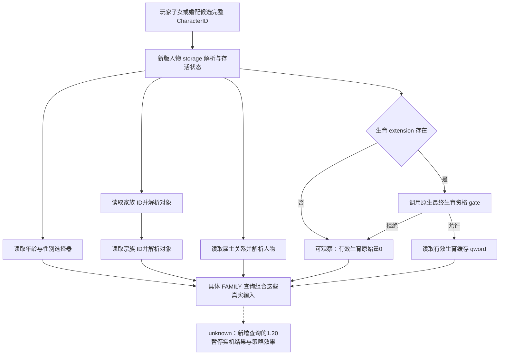

# CK3 1.20.0.2：婚配所需的人物数值与家系观测

状态：`static-ready`。本包只读取冻结 EXE、编译新 provider 并运行离线对象夹具，没有启动、附加或查询本地 CK3。冻结构建为 Crozier `1.20.0.2`，EXE SHA-256 为 `AE1BA6FF060BA603842F6F4A2DED0AF4B7D3666B3DD271F75FB01B0DA8E81B2D`。

这项施工为玩家子女婚配和候选联盟查询补齐年龄、性别选择器、家族、宗族、雇主和生育原生输入。它不决定候选排序，也不把离线字段读取称为实机 OODA。

## 原生输入与新版布局

| 原生输入 | 1.20 来源 | 核验入口 |
|---|---|---|
| 年龄原始量 | `CCharacter+0x68`，有符号 `int16` | 婚姻接受效果 `0x2503D59 / 0x2503D61` |
| 性别选择器 | `CCharacter+0x1A1`，原生值 `0 / 1` | 婚姻接受效果 `0x2503CF6 / 0x2503D0F` |
| 家族完整 ID | `CCharacter+0x158` | `0x9D56E1`；家族 storage `0x5D1DAF0`，fallback `0x5D1DAE8` |
| 宗族完整 ID | 家族对象 `+0x2C` | `0xC78CDB`；宗族 storage `0x5D1DE78`，fallback `0x5D1DE28` |
| 雇主完整 ID | `CCharacter+0x1B8 → CourtRelation+0xC8` | `0x28BFC77 / 0x28BFCB2` |
| 生育资格最终判定 | `bool(void* character)`，`0x28BB4E0` | 原生有效生育 getter `0x28C6360` 的调用点 `0x28C637A` |
| 有效生育原始量 | `CCharacter+0x1B0 → extension+0x2E0`，`int64` | `0x28C6383 / 0x28C638A` |

家族和宗族通过原生 component storage 的 `slots+0x20 / capacity+0x2C / stride0x10 / object+0x08` 解析，必须匹配对象 `+0x10` 的完整 ID。人物和雇主复用新版 `ResolveCoreCharacter`。只有 `-1` 表示无对象；完整 ID 为 `0` 是合法状态，不能转换成读取失败。

原生有效生育 getter 的真实分支为：extension 不存在时返回零；extension 存在则调用原生资格 gate；gate 拒绝时仍返回零；gate 允许时返回 extension `+0x2E0`。新 provider 原样复用这个 gate 和缓存 qword，并区分 `available`、`extension_present`、`native_gate_evaluated` 和 `native_gate_allows`。它没有将缺失字段永久保留为 `null`，也没有以资格拒绝伪装成观测失败。

原始量作为原生输入保留。原生调整计算的固定点分母 `100000` 已在[生育输入专题](ck3-family-fertility-12002.md)通过原生商、残差与 14 个有符号整数向量核验。它不能单独证明一对人物未来的出生概率；配对概率、未来年龄变化与候选质量仍需要相应原生输入。宗教只保留原生婚姻最终结果所需的 opaque 边界，本包不采集 faith、doctrine、tenet 或 fervor。

## 实现与验证

实现为 `include/xar_bridge/ck3_12002_family_value.hpp` 和 `src/ck3_12002_family_value.cpp`，命名空间 `xar::ck3_12002::family_value`。`BindImage` 只进行 exact SHA 对应的地址计算；`ReadCharacterValue` 在 application owning thread 读取一个人物，外层 FAMILY 查询承担当前暂停帧与结果重复读取。

离线 verifier `research/verify_ck3_12002_family_value.py` 通过 **6 个唯一签名、24 条反汇编指令、13 项源码常量和 13 项原生来源绑定**。ABI 冻结在 `research/fixtures/ck3_12002_family_value_abi.json`。它把字段来源和 RIP global 直接绑定到 provider 的常量，覆盖本次发生的布局迁移。

MSVC x64 `/std:c++20 /EHsc /W4 /WX` 编译与 `src/ck3_12002_family_value_test.cpp` 通过。夹具检查真实 gate 回调接收解析后的人物指针，覆盖允许、拒绝、合法零、无 extension、家系完整 ID、无家系、完整 ID 零、雇主以及读取失败结果清空。

可核验输出：

- `artifacts/nonwar/2026-10-01/ck3-12002-family-value-abi-result.json`
- `artifacts/nonwar/2026-10-01/family-value-build/compile.log`
- `artifacts/nonwar/2026-10-01/family-value-build/test.log`

剩余实机工作仅是 provider 经完整 FAMILY 入口读取真实暂停帧及后续婚配结果。此包没有新增 live claim，也不要求在后台施工阶段占用游戏。
