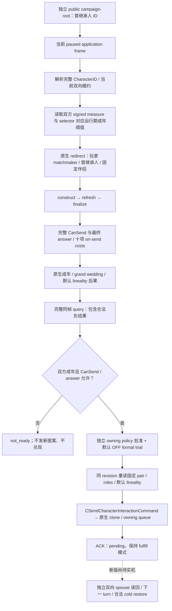

# CK3 1.20.0.2 FAMILY：婚约、候选、联盟与 typed 提案

截至 2026-10-01，本包是 **static-ready**：新版原生字段、固定婚约 query / fulfillment、subject-specific 候选、原生 ranked `38`、联盟 / 谱系 / 生育数据、新提案 typed provider、指定儿童 subject 与 outbound 冷恢复查询已实现并通过离线 MSVC 测试；没有查询、注入、启动或操作本地 CK3。原生 AI ranked `38` 保持独立查询，不能由无排名候选替代。旧 [非战争维护者交接](../handover/2026-09-30-nonwar-maintainer-vacation-handoff.md) 的 R0407 属于 **1.19.0.6 production-live private observation primitive**，不能提升新版的验收等级。

冻结构建为 CK3 **1.20.0.2 Crozier**，Steam build `25588574`，EXE SHA-256：
`AE1BA6FF060BA603842F6F4A2DED0AF4B7D3666B3DD271F75FB01B0DA8E81B2D`。
只从冻结 EXE 和随包原版婚姻交互读取资料；信仰只由原生最终婚姻合法性判定消费，本包不实现通用宗教字段或策略。

## 原生树与迁移依据

原生 existing-betrothal fulfillment 入口 `0x1AA8250` 从 `CCharacter +0x1A8` 的 family 读取当前婚约，并建立完整 arrange-marriage context。它调用完整 `CanSend`，随后构造 `CSendCharacterInteractionCommand` 并提交拥有副本的原生队列。它不是直接写入 spouse/betrothal，也不是复用玩家本人的新提案权限。

完整 `CanSend` 为 `0x307C040`，最终 answer 为 `0x307BC80`；负 CanSend 不等于观测失败，`final_legality_sampled=true` 和 `complete_can_send=false` 必须同时保留。成人 measure 使用有符号 `int16`，阈值取当前 selector 对应的原生 define，而不是将 `16` 写死到策略中。具体指令与原版 matchmaker 解释见 [query ABI](ck3-1.20.0.2-family-query-abi.md)。

| 原生输入 | 1.20.0.2 来源 |
| --- | --- |
| family / death / CharacterID | `CCharacter +0x1A8 / +0x1D0 / +0x18` |
| betrothed / primary spouse / spouse array | family `+0x10 / +0x14 / +0x20` |
| adult measure / selector | Character `+0x68 / +0x1A1` |
| 运行期成年阈值 | slot `0x5C6A15C / 0x5C69D10` |
| 当前提案角色 | context `+0x2D8 / +0x2DC / +0x2E0 / +0x2E4 / +0x2E8` |
| redirect ABI | `0x3148DE0`，新增第六个角色 ID 指针，初值 `-1` |
| 完整 CanSend / 最终 answer | `0x307C040 / 0x307BC80` |
| 母系 / grand-wedding StringID | slot `0x5D4BDBC / 0x5D4C0B4` |
| Boolean option reader | `0x3078880` |
| on-send cost | 已迁移 `ContextBindings.evaluate_cost`，definition `+0x40` / scope context `+0x08` |
| typed command | constructor `0x2968170`，vtable `0x448BCE0 / 0x448BCB0` |
| 原生拥有队列 | clone primary-vtable `+0x40` → `0x37F06F0`，embedded manager `0x5CC1240` |

十项成本保留有符号 Q100000 原值，依次为 gold、prestige、piety、renown、influence、herd、treasury、treasury_or_gold、merit、barter_goods。它们是当前原生发送成本；不能填充战争现金、未来婚约义务或长期联盟收益。

## 实现与正式消费者边界

实现位于 [`ck3_12002_family.hpp`](../../ck3_autonomous_player/native_bridge/include/xar_bridge/ck3_12002_family.hpp) 与 [`ck3_12002_family.cpp`](../../ck3_autonomous_player/native_bridge/src/ck3_12002_family.cpp)。`BindFamilyImage` 只接受本次 EXE SHA，所有原生函数来自新版 `ContextBindings` / `CommandBindings`；旧 `ck3_11906` 命名空间仅复用字段结构、纯双向关系检查和 pending 模式准备器，不调用旧原生 binder 或旧地址。

- `ReadCurrentFirstHeirRelationshipV1`：读取首继承人和所有实际关系 peer，验证完整 ID、存活、互惠及两次同帧稳定性。无 family 是合法空关系；失效 ID、单向关系或 malformed spouse array 不被过滤成空关系。
- `ReadCurrentFirstHeirBetrothalActionabilityV1`：只评估当前固定婚约，无候选扫描、选项更改或命令生成。保留 minor / 拒绝场景中的成年、完整 CanSend、answer、成本与默认后果。
- `SubmitCurrentFirstHeirBetrothalFulfillmentV1`：重新读取 fixed pair，与 owning consumer 的缓存逐字段一致；调用现有纯 typed preparation，保留 `fulfill_existing_betrothal=true`，不借新提案或玩家本人权限。发送前核 source context 和 copied command context 的实际角色、成年后果与默认有效母系选项。
- `ReadFamilyBilateralRelationshipV1`：供动作前与独立动作后观测。发送 ACK、保留原婚约及 `accepted_pending` 均不构成新婚姻；只有真实双向 spouse 才满足 fulfillment 的物质后置。
- `ReadArrangeMarriageFamilyCandidatesV1`：原生角色 redirect 与完整 CanSend 确定实际可提案的 subject / candidate / recipient，最终 answer、年龄、已解析宗族与 realm-backend 位来自同一帧；不给人类玩家虚构 native AI rank。
- `ReadMarriageMatchmakingObservationV1`：独立 ranked `38` producer 读取实际 played Character 的 native Strategy、tier cap 与原生候选集合；调用评分后排序，再发布原 rank / signed score，逐 pair 用新版 final context 求合法性与成年后果。玩家缺少实际 Strategy 时仍是 `ranked_source_unavailable`，不是空结果或我方虚构排名。原生 scored rows 与 spilled buffers 的实际销毁 / 释放已实现；见 [ranked 迁移](ck3-1.20.0.2-family-ranked-migration.md)与[原生排序 producer](ck3-1.20.0.2-family-ranked-producer.md)。
- `ReadMarriageCandidateAlliancePrivateV1`：从具体合法行重建 disposable context，读取成本、两成年阈值、grand wedding、默认或显式母系选项、实际双方关系、家族 / 宗族及生育输入；调用新版原生 pair generator 读取最多三个 projected alliance pairs。实现和原生消费者树见 [联盟投影](ck3-1.20.0.2-family-alliance-projection.md)、[人物数值](ck3-1.20.0.2-family-value-observation.md)及[生育固定点](ck3-family-fertility-12002.md)。
- `SubmitFamilyMarriageProposalV1`：复用 owning consumer 的 typed subject / roles / pending 合同，再做原生最终合法性与 answer 重读。它保持 new-proposal 模式与 current-betrothal fulfillment 模式分离；已经存在的当前双向婚约不能用新提案重发。指定儿童的默认母系 OFF 和显式母系提案都在 source context 与 copied command 中读回。
- `ReadFamilyAlliancePairV1`：使用新版 `IsAllied` 双向独立读回；两次同帧合法 `false` 是已知非联盟，不能当作查询不可用。Projected pairs、发送 ACK 和原生提示分支都不替代这个实际结果。
- 指定儿童 subject provider：读取当前实际 children 集合、father / mother 完整 ID、谱系、雇主及 runtime 成年阈值，按原生父母关系判断该 subject；真实 children 集合不复用旧偏移。见 [指定儿童迁移](ck3-1.20.0.2-family-subject-migration.md)。
- `ReadMarriageOutboundPendingSnapshotV1`：直接扫描新版全局 pending storage，核 canonical arrange-marriage definition 与完整五角色，不要求先装旧版 resolution journal。实际 active / absent / ambiguous、完整 pending ID、原生年龄与 AI cutoff 可供 Guy / first-heir 冷恢复消费；absent 不被分类为拒绝或其他 terminal cause。见 [outbound 字段证明](ck3-1.20.0.2-family-outbound-field-proof.md)。

原生 accepted-marriage consumer 的 `IsAllied` / 双方 realm 分支控制玩家提示路径，而后仍会到达 relationship effect。历史 wire 字段 `would_attempt_if_accepted` 保持其窄投影条件，不升级成联盟创建合法性或必然结果；具体差异已落在联盟原生树，正式策略没有因此新获联盟物质结果。

主线程 mailbox 保留交接中 **query 68 / fulfillment 69** 的语义。正式 trial 仍由 owning first-heir consumer 的原开关控制，默认 OFF；本 provider 自身不启用策略、不重发 Guy pending outbox、不更改 ledger 或 cold-mode。Guy 和首继承人是两个独立 subject / proposal 权限，不能互借。

## 离线验收

| 验收 | 结果与证据 |
| --- | --- |
| 新版 query ABI | PASS：6 个唯一签名、39 条指令、18 个常量、17 项原生操作数绑定；`artifacts/nonwar-offline/2026-10-01/family-query-abi-result.json` |
| 新版 fulfillment ABI | PASS：18 个唯一签名、2 个 vtable、63 条指令、19 项原生绑定；`artifacts/nonwar/2026-10-01/ck3-12002-family-fulfill-abi-result.json` |
| 实际 provider 离线 MSVC O2 | PASS：current-pair / signed 成本 / 最终 answer / full validation / 新队列 owning copy / pending readback；`artifacts/nonwar-offline/2026-10-01/family-provider-build/result.json` |
| 人物数值 / 生育 ABI | PASS：native gate / cached effective raw / 完整家族、宗族、雇主 ID；`artifacts/nonwar/2026-10-01/ck3-12002-family-value-abi-result.json` |
| 联盟 generator / option setter | PASS：原生 pair producer / accepted consumer / 原版 UI option setter 调用链，MSVC Debug + Release 17 项功能检查；`.task-tmp/family-projection-12002-build/{result,abi-result}.json` |
| 指定儿童 subject | PASS：70 条指令、11 段字节、4 条 vtable 链、实际 children / father / mother 集合与 provider 夹具；`artifacts/nonwar-offline/2026-10-01/family-subject-package-result.json` |
| outbound 冷恢复 | PASS：10 个签名、3 个 vtable、64 条指令、17 项 provider 常量、production global-reader fixture；`artifacts/nonwar/2026-10-01/ck3-12002-family-outbound-fields-abi-result.json` |
| rich / child 实际 wire producer | PASS：原有 bridge JSON body 提取为 `SerializeFamilyAllianceFrameV1`，五个不同 candidate 的实际新版 provider 输出通过同一 serializer；`artifacts/nonwar-offline/2026-10-01/family-wire-provider-five-build/result.json` |
| 原生 ranked `38` | PASS：81 producer 指令 / 59 调用边 / 15 spans，加 71 生命周期指令 / 19 vtable 和 allocator 边 / 12 spans；MSVC 验证实际原生排序、40 scored rows / 130 pool entries 的 spilled 生命周期及同帧 pair terms；`artifacts/nonwar-offline/2026-10-01/family-ranked-package-result.json` |

可复用测试为 [`ck3_12002_family_test.cpp`](../../ck3_autonomous_player/native_bridge/src/ck3_12002_family_test.cpp)。测试使用 caller-owned 仿原生布局对象与回调，并执行实际新版 provider；它不读取游戏进程。代表分支包括 BA5 `14 < 16` 完整负值、成人合法兑现、matchmaker 角色变化、单向婚约、generation 变化、copied lineality 变化、队列拒绝、原婚约仍在但 receipt 仅 pending、grand-wedding 导致 betrothal、frame drift、subject-specific 候选、三 projected pairs、具体 lineage / 零 fertility、显式母系投影、独立实际联盟阴性及新提案不可复用原婚约。测试真实输出的 C++ actionability serializer 负值夹具在 `family-provider-build/native-current-betrothal-negative.json`，是离线输入而非新 paused artifact。

新版 rich `48` 与指定儿童 value 的 C++ wire 夹具分别为 `family-wire-provider-five-build/native-rich48.json`、`native-child-value.json`，各有 source / serializer / test SHA sidecar。Rich 夹具从实际 legal enumeration 取五个不同 candidate，分别重建 context 和原生 projected pairs；child value 保留其原有单行合同。它们来自实际 provider 的 fresh unpaired 状态，保留十项 signed costs、三个 projected pairs、默认或已选母系、合法零生育输入；house / dynasty 的 `null` 在该夹具中表示已经读到合法 `-1` 缺省。[`ck3_12002_family_wire.cpp`](../../ck3_autonomous_player/native_bridge/src/ck3_12002_family_wire.cpp) 沿用原有生产 JSON body，避免原生与 Python 消费者各自手写一份 schema；synthetic IDs 不代表存档或实机结果。最初单行 rich 夹具保留在 `family-wire-provider-build`，它不满足现有五行 transport 输入，属于夹具计数问题，不是 capability RED；没有放宽生产条件或复制 JSON 行。

verifier 使用显式失败返回 / 异常，测试使用不会被 Release 或 `-O` 去除的 `Check`。`open_kaishek` 为 not-applicable：本包验证 EXE 指令、C++ 内存布局和 native command ownership，不执行 Paradox effect 或日期 runtime。

## 下一验收与仍待施工的范围

新版首次允许实机时，先做一次当前首继承人 paused query，核双向当前婚约、两 runtime thresholds、matchmaker roles、负 / 正完整 CanSend、answer、十项成本及默认后果。正常成年合法场景才由原 formal trial 控制器提交一项兑现，并通过独立 spouse 后置、下一 turn 与既有合法 cold pairing 关闭动作链；不能为凑阳性改写当前关系或复用旧 1.19 证据。

Ranked `38`、rich `48`、specified-child subject 与 Guy outbound 的新版 provider 已提供与原 typed serializer 一致的结构；原生函数全部使用本次 exact-build bindings，mailbox 接线及 Python contract 由中央集成和对应消费者分别验收。现有 R0407 `14 < 16 / complete_can_send=false`、Guy pending 与 formal OFF 都保持交接语义。后续必须用新版 paused 帧验证 Strategy 的实际缺省 / 生命周期、排序行和 rich 数据，再由已有 owning policy 决定动作；新发送仍须独立 spouse / alliance 后置与下一 turn / cold pairing。完整 G2 / 自然完整一代人的等级没有因本包提高。
