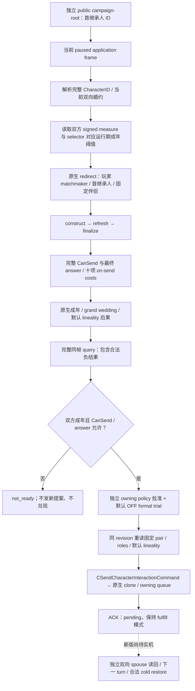
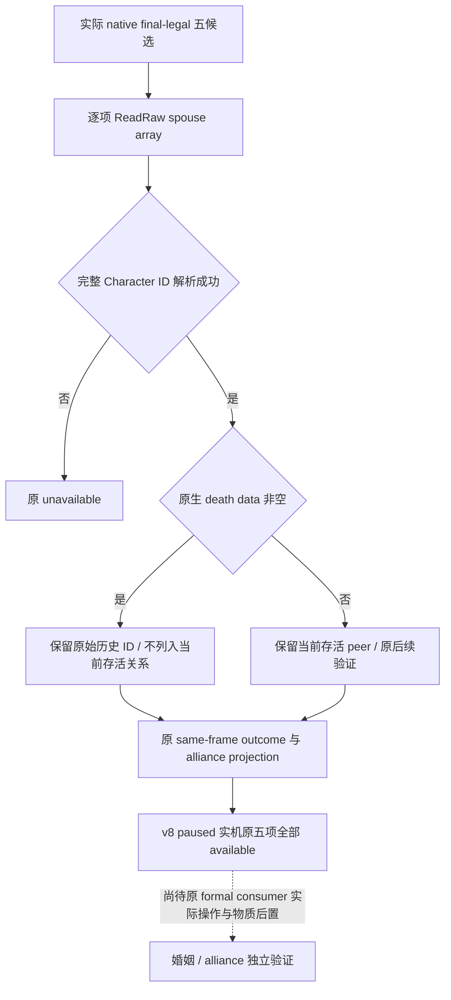
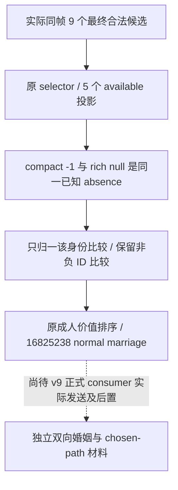
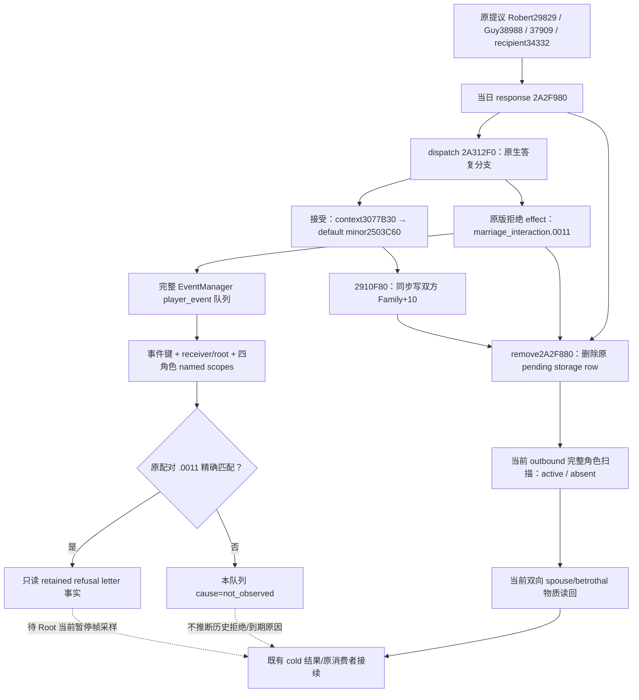

# CK3 1.20.0.2 FAMILY：婚约、候选、联盟与 typed 提案

截至 2026-10-01，本包是 **static-ready**：新版原生字段、固定婚约 query / fulfillment、subject-specific 候选、原生 ranked `38`、联盟 / 谱系 / 生育数据、新提案 typed provider、指定儿童 subject 与 outbound 冷恢复查询已实现并通过离线 MSVC 测试；没有查询、注入、启动或操作本地 CK3。原生 AI ranked `38` 保持独立查询，不能由无排名候选替代。旧 [非战争维护者交接](../handover/2026-09-30-nonwar-maintainer-vacation-handoff.md) 的 R0407 属于 **1.19.0.6 production-live private observation primitive**，不能提升新版的验收等级。

冻结构建为 CK3 **1.20.0.2 Crozier**，Steam build `25588574`，EXE SHA-256：
`AE1BA6FF060BA603842F6F4A2DED0AF4B7D3666B3DD271F75FB01B0DA8E81B2D`。
只从冻结 EXE 和随包原版婚姻交互读取资料；信仰只由原生最终婚姻合法性判定消费，本包不实现通用宗教字段或策略。

## 原生树与迁移依据

原生 existing-betrothal fulfillment 入口 `0x1AA8250` 从 `CCharacter +0x1A8` 的 family 读取当前婚约，并建立完整 arrange-marriage context。它调用完整 `CanSend`，随后构造 `CSendCharacterInteractionCommand` 并提交拥有副本的原生队列。它不是直接写入 spouse/betrothal，也不是复用玩家本人的新提案权限。

完整 `CanSend` 为 `0x307C040`，最终 answer 为 `0x307BC80`；负 CanSend 不等于观测失败，`final_legality_sampled=true` 和 `complete_can_send=false` 必须同时保留。成人 measure 使用有符号 `int16`，阈值取当前 selector 对应的原生 define，而不是将 `16` 写死到策略中。具体指令与原版 matchmaker 解释见 [query ABI](ck3-1.20.0.2-family-query-abi.md)。

| 原生输入 | 1.20.0.2 来源 |
| --- | --- |
| family / death / CharacterID | `CCharacter +0x1A8 / +0x1D0 / +0x18` |
| betrothed / primary spouse / spouse array | family `+0x10 / +0x14 / +0x20` |
| adult measure / selector | Character `+0x68 / +0x1A1` |
| 运行期成年阈值 | slot `0x5C6A15C / 0x5C69D10` |
| 当前提案角色 | context `+0x2D8 / +0x2DC / +0x2E0 / +0x2E4 / +0x2E8` |
| redirect ABI | `0x3148DE0`，新增第六个角色 ID 指针，初值 `-1` |
| 完整 CanSend / 最终 answer | `0x307C040 / 0x307BC80` |
| 母系 / grand-wedding StringID | slot `0x5D4BDBC / 0x5D4C0B4` |
| Boolean option reader | `0x3078880` |
| on-send cost | 已迁移 `ContextBindings.evaluate_cost`，definition `+0x40` / scope context `+0x08` |
| typed command | constructor `0x2968170`，vtable `0x448BCE0 / 0x448BCB0` |
| 原生拥有队列 | clone primary-vtable `+0x40` → `0x37F06F0`，embedded manager `0x5CC1240` |

十项成本保留有符号 Q100000 原值，依次为 gold、prestige、piety、renown、influence、herd、treasury、treasury_or_gold、merit、barter_goods。它们是当前原生发送成本；不能填充战争现金、未来婚约义务或长期联盟收益。

## 实现与正式消费者边界

实现位于 [`ck3_12002_family.hpp`](../../ck3_autonomous_player/native_bridge/include/xar_bridge/ck3_12002_family.hpp) 与 [`ck3_12002_family.cpp`](../../ck3_autonomous_player/native_bridge/src/ck3_12002_family.cpp)。`BindFamilyImage` 只接受本次 EXE SHA，所有原生函数来自新版 `ContextBindings` / `CommandBindings`；旧 `ck3_11906` 命名空间仅复用字段结构、纯双向关系检查和 pending 模式准备器，不调用旧原生 binder 或旧地址。

- `ReadCurrentFirstHeirRelationshipV1`：读取首继承人和所有当前存活关系 peer，验证完整 ID、存活、互惠及两次同帧稳定性。无 family 是合法空关系；失效 ID、单向关系或 malformed spouse array 不被过滤成空关系。原生 spouse array 可保留已亡前配偶；完整 ID 已解析且原生 death data 非空的数组 peer 不属于当前存活配偶，历史原数组保持不变，详见下方 Murchad 实证。
- `ReadCurrentFirstHeirBetrothalActionabilityV1`：只评估当前固定婚约，无候选扫描、选项更改或命令生成。保留 minor / 拒绝场景中的成年、完整 CanSend、answer、成本与默认后果。
- `SubmitCurrentFirstHeirBetrothalFulfillmentV1`：重新读取 fixed pair，与 owning consumer 的缓存逐字段一致；调用现有纯 typed preparation，保留 `fulfill_existing_betrothal=true`，不借新提案或玩家本人权限。发送前核 source context 和 copied command context 的实际角色、成年后果与默认有效母系选项。
- `ReadFamilyBilateralRelationshipV1`：供动作前与独立动作后观测。发送 ACK、保留原婚约及 `accepted_pending` 均不构成新婚姻；只有真实双向 spouse 才满足 fulfillment 的物质后置。
- `ReadArrangeMarriageFamilyCandidatesV1`：原生角色 redirect 与完整 CanSend 确定实际可提案的 subject / candidate / recipient，最终 answer、年龄、已解析宗族与 realm-backend 位来自同一帧；不给人类玩家虚构 native AI rank。
- `ReadMarriageMatchmakingObservationV1`：独立 ranked `38` producer 读取实际 played Character 的 native Strategy、tier cap 与原生候选集合；调用评分后排序，再发布原 rank / signed score，逐 pair 用新版 final context 求合法性与成年后果。玩家缺少实际 Strategy 时仍是 `ranked_source_unavailable`，不是空结果或我方虚构排名。原生 scored rows 与 spilled buffers 的实际销毁 / 释放已实现；见 [ranked 迁移](ck3-1.20.0.2-family-ranked-migration.md)与[原生排序 producer](ck3-1.20.0.2-family-ranked-producer.md)。
- `ReadMarriageCandidateAlliancePrivateV1`：从具体合法行重建 disposable context，读取成本、两成年阈值、grand wedding、默认或显式母系选项、实际双方关系、家族 / 宗族及生育输入；调用新版原生 pair generator 读取最多三个 projected alliance pairs。实现和原生消费者树见 [联盟投影](ck3-1.20.0.2-family-alliance-projection.md)、[人物数值](ck3-1.20.0.2-family-value-observation.md)及[生育固定点](ck3-family-fertility-12002.md)。
- `SubmitFamilyMarriageProposalV1`：复用 owning consumer 的 typed subject / roles / pending 合同，再做原生最终合法性与 answer 重读。它保持 new-proposal 模式与 current-betrothal fulfillment 模式分离；已经存在的当前双向婚约不能用新提案重发。指定儿童的默认母系 OFF 和显式母系提案都在 source context 与 copied command 中读回。
- `ReadFamilyAlliancePairV1`：使用新版 `IsAllied` 双向独立读回；两次同帧合法 `false` 是已知非联盟，不能当作查询不可用。Projected pairs、发送 ACK 和原生提示分支都不替代这个实际结果。
- 指定儿童 subject provider：读取当前实际 children 集合、father / mother 完整 ID、谱系、雇主及 runtime 成年阈值，按原生父母关系判断该 subject；真实 children 集合不复用旧偏移。见 [指定儿童迁移](ck3-1.20.0.2-family-subject-migration.md)。
- `ReadMarriageOutboundPendingSnapshotV1`：直接扫描新版全局 pending storage，核 canonical arrange-marriage definition 与完整五角色，不要求先装旧版 resolution journal。实际 active / absent / ambiguous、完整 pending ID、原生年龄与 AI cutoff 可供 Guy / first-heir 冷恢复消费；absent 不被分类为拒绝或其他 terminal cause。见 [outbound 字段证明](ck3-1.20.0.2-family-outbound-field-proof.md)。

原生 accepted-marriage consumer 的 `IsAllied` / 双方 realm 分支控制玩家提示路径，而后仍会到达 relationship effect。历史 wire 字段 `would_attempt_if_accepted` 保持其窄投影条件，不升级成联盟创建合法性或必然结果；具体差异已落在联盟原生树，正式策略没有因此新获联盟物质结果。

主线程 mailbox 保留交接中 **query 68 / fulfillment 69** 的语义。正式 trial 仍由 owning first-heir consumer 的原开关控制，默认 OFF；本 provider 自身不启用策略、不重发 Guy pending outbox、不更改 ledger 或 cold-mode。Guy 和首继承人是两个独立 subject / proposal 权限，不能互借。

## 离线验收

| 验收 | 结果与证据 |
| --- | --- |
| 新版 query ABI | PASS：6 个唯一签名、39 条指令、18 个常量、17 项原生操作数绑定；`artifacts/nonwar-offline/2026-10-01/family-query-abi-result.json` |
| 新版 fulfillment ABI | PASS：18 个唯一签名、2 个 vtable、63 条指令、19 项原生绑定；`artifacts/nonwar/2026-10-01/ck3-12002-family-fulfill-abi-result.json` |
| 实际 provider 离线 MSVC O2 | PASS：current-pair / signed 成本 / 最终 answer / full validation / 新队列 owning copy / pending readback；`artifacts/nonwar-offline/2026-10-01/family-provider-build/result.json` |
| 人物数值 / 生育 ABI | PASS：native gate / cached effective raw / 完整家族、宗族、雇主 ID；`artifacts/nonwar/2026-10-01/ck3-12002-family-value-abi-result.json` |
| 联盟 generator / option setter | PASS：原生 pair producer / accepted consumer / 原版 UI option setter 调用链，MSVC Debug + Release 17 项功能检查；`.task-tmp/family-projection-12002-build/{result,abi-result}.json` |
| 指定儿童 subject | PASS：70 条指令、11 段字节、4 条 vtable 链、实际 children / father / mother 集合与 provider 夹具；`artifacts/nonwar-offline/2026-10-01/family-subject-package-result.json` |
| outbound 冷恢复 | PASS：10 个签名、3 个 vtable、64 条指令、17 项 provider 常量、production global-reader fixture；`artifacts/nonwar/2026-10-01/ck3-12002-family-outbound-fields-abi-result.json` |
| rich / child 实际 wire producer | PASS：原有 bridge JSON body 提取为 `SerializeFamilyAllianceFrameV1`，五个不同 candidate 的实际新版 provider 输出通过同一 serializer；`artifacts/nonwar-offline/2026-10-01/family-wire-provider-five-build/result.json` |
| 原生 ranked `38` | PASS：81 producer 指令 / 59 调用边 / 15 spans，加 71 生命周期指令 / 19 vtable 和 allocator 边 / 12 spans；MSVC 验证实际原生排序、40 scored rows / 130 pool entries 的 spilled 生命周期及同帧 pair terms；`artifacts/nonwar-offline/2026-10-01/family-ranked-package-result.json` |

可复用测试为 [`ck3_12002_family_test.cpp`](../../ck3_autonomous_player/native_bridge/src/ck3_12002_family_test.cpp)。测试使用 caller-owned 仿原生布局对象与回调，并执行实际新版 provider；它不读取游戏进程。代表分支包括 BA5 `14 < 16` 完整负值、成人合法兑现、matchmaker 角色变化、单向婚约、generation 变化、copied lineality 变化、队列拒绝、原婚约仍在但 receipt 仅 pending、grand-wedding 导致 betrothal、frame drift、subject-specific 候选、三 projected pairs、具体 lineage / 零 fertility、显式母系投影、独立实际联盟阴性及新提案不可复用原婚约。测试真实输出的 C++ actionability serializer 负值夹具在 `family-provider-build/native-current-betrothal-negative.json`，是离线输入而非新 paused artifact。

新版 rich `48` 与指定儿童 value 的 C++ wire 夹具分别为 `family-wire-provider-five-build/native-rich48.json`、`native-child-value.json`，各有 source / serializer / test SHA sidecar。Rich 夹具从实际 legal enumeration 取五个不同 candidate，分别重建 context 和原生 projected pairs；child value 保留其原有单行合同。它们来自实际 provider 的 fresh unpaired 状态，保留十项 signed costs、三个 projected pairs、默认或已选母系、合法零生育输入；house / dynasty 的 `null` 在该夹具中表示已经读到合法 `-1` 缺省。[`ck3_12002_family_wire.cpp`](../../ck3_autonomous_player/native_bridge/src/ck3_12002_family_wire.cpp) 沿用原有生产 JSON body，避免原生与 Python 消费者各自手写一份 schema；synthetic IDs 不代表存档或实机结果。最初单行 rich 夹具保留在 `family-wire-provider-build`，它不满足现有五行 transport 输入，属于夹具计数问题，不是 capability RED；没有放宽生产条件或复制 JSON 行。

verifier 使用显式失败返回 / 异常，测试使用不会被 Release 或 `-O` 去除的 `Check`。`open_kaishek` 为 not-applicable：本包验证 EXE 指令、C++ 内存布局和 native command ownership，不执行 Paradox effect 或日期 runtime。

## 下一验收与仍待施工的范围

新版首次允许实机时，先做一次当前首继承人 paused query，核双向当前婚约、两 runtime thresholds、matchmaker roles、负 / 正完整 CanSend、answer、十项成本及默认后果。正常成年合法场景才由原 formal trial 控制器提交一项兑现，并通过独立 spouse 后置、下一 turn 与既有合法 cold pairing 关闭动作链；不能为凑阳性改写当前关系或复用旧 1.19 证据。

Ranked `38`、rich `48`、specified-child subject 与 Guy outbound 的新版 provider 已提供与原 typed serializer 一致的结构；原生函数全部使用本次 exact-build bindings，mailbox 接线及 Python contract 由中央集成和对应消费者分别验收。现有 R0407 `14 < 16 / complete_can_send=false`、Guy pending 与 formal OFF 都保持交接语义。后续必须用新版 paused 帧验证 Strategy 的实际缺省 / 生命周期、排序行和 rich 数据，再由已有 owning policy 决定动作；新发送仍须独立 spouse / alliance 后置与下一 turn / cold pairing。完整 G2 / 自然完整一代人的等级没有因本包提高。

## 2026-10-02：1.20.0.3 Murchad 已亡前配偶数组实证

冻结游戏为 Steam 1.20.0.3 / build 25652598，EXE SHA-256
`94b55397abb687a3dcd436805a5d885e6be90fa6c693feb44a9e3bbeeade02a6`。
真实 actor **31853** / episode **native-31853-af642d76cb41** 的 v7 nonwar
run 在第 5 turn planning 因五候选观测 unavailable 停止；有 4 个成功 turn、
2 个可见动作及 1 个 checkpoint，日期仍为 **53327160**，没有发送婚姻提案。
原 consumer 只保留统一 reason，具体失败由同档一次 paused targeted 只读采样确认。

该帧实际首继承人为 **36403**。原生产 selector 五候选顺序为
`31749, 47078, 16852491, 16852492, 16827345`；只有前两项返回
`failure=heir_relationship_unavailable`，其余三项 available。这个 failure
名称同时覆盖 heir 和 candidate 的 `ReadRaw`；同 heir 的另外三项成功，因此这次
故障发生在两名 candidate 的关系读取，并未走到它们的 outcome 或 projection。
后三项的实际年龄分别为 25、28、3，heir 为 39、原生成年阈值为 16；前两名
候选的 unavailable 不是成年资格判定，也不允许以另外三项替代五项合同。

同档正常 checkpoint **h1999**、105030396 bytes、SHA-256
`069abe800ad80c4d90c8a768274cf60abc0192b93e0b90cdc96093f6db4486d6`
经外部只读复制和现有 Rakaly melt 后确认：

| 活候选 | 原始 family_data | 被引用角色的真实 dead_data |
| --- | --- | --- |
| 31749 | `spouse=31596`，`former_spouses={31596}` | 31596 于 1082.11.13 死亡 |
| 47078 | `spouse=32513`，`former_spouses={32513}` | 32513 于 1087.7.5 死亡 |
| 36403 | `family_data={}` | 当前存活的首继承人 |

原 `ReadRaw` 将 spouse array 中每个 peer 都要求存活，因此已亡前配偶使合法
候选的关系读取失败。最小修复只在该数组循环中先验证完整 Character ID，再按
真实 `death_data` 排除已亡 peer。`spouse_character_ids` 表示此次 query 的
**当前存活关系**；原生 `family +0x20` 的历史 ID 不被写入、删除或改造，原始历史
由原数组 probe 及本次 hash-bound 存档保留。actor、heir、candidate 自身存活，
婚约/primary scalar、原生最终 CanSend、候选顺序、五项数量、年龄及费用均未改变。
尚无实际材料的存活前配偶/离婚分支保持原语义，未查明，不作为本修复扩展范围。

唯一生产回归使用 `ck3_12002_family_test.cpp`，复现两个历史亡配偶和另外三个
完整候选，直接经过原生合法候选 producer、实际 rich reader 与五行 wire serializer。
链接既有 v7 runtime dependencies，以 `/UNDEBUG` 编译：冻结
`production-source-0b489e68` 的旧 `family.cpp` 编译成功、运行按实际故障 FAIL；
修复源编译成功、五行全部读取并保留原始历史 ID，运行 PASS。静态回归本身只给出
**static-ready**；以下同档 paused 实机材料另行关闭此实际 provider 故障。

可核验外部材料均位于 `artifacts/g2-maintainer-2026-10-02/resume-12003/`：

- `m7-murchad/actual-v7-nonwar-16turns-01/native-auto-run-report.json`
- `m7-murchad/material-cold-03/targeted-five-01/004-five-outcome-lineage-projection.json`
- `m5-family/murchad-h1999-candidate-relationships/candidate-save-blocks.json`
- `m5-family/widow-production-regression/result.json` 及 `old/new` 的 compile/run logs
- `m5-family/widow-production-regression-final-new/result.json`：保留原 CharacterID 正数判定的最终修复源 SHA 与 compile/run PASS；旧版失败证据复用前项

### v8 同档实机复验：production-live primitive

2026-10-02 **07:50:14–07:50:33 Asia/Shanghai**，root 使用最终冻结源
`50e353bfa142194cc2a53372c1aec726ddd98da1` / v8 DLL，在新实际 PID
**74800** 的同一 Murchad episode 采集原有 driver 的只读合法候选和五行投影。
前后均为 paused/map-ready、public revision **3**、native revision **2**、
raw **53327160**，当前 heir 仍为 **36403**。原生产 selector 顺序仍是
`31749, 47078, 16852491, 16852492, 16827345`。

实际投影为 **available**，五行全部 `status=available`、
`failure/projection_failure/outcome_failure=none`。此前失败的两名 candidate
现在各自返回空的当前 spouse array、null 的 primary/betrothal，以及原生最终
`complete_can_send=true`、默认 `effective_matrilineal_if_accepted=false`、
十项发送成本均为 0；原始亡前配偶事实仍保存在 h1999 存档及前述外部材料。

| 候选 | 实际年龄 | 实际 recipient AI accept raw | 若接受的原生后果 |
| --- | --- | --- | --- |
| 31749 | 61 | 5700000 | marriage |
| 47078 | 51 | 5500000 | marriage |
| 16852491 | 25 | 1700000 | marriage |
| 16852492 | 28 | 1700000 | marriage |
| 16827345 | 3 | 1500000 | betrothal |

以上为五候选观测修复的 **production-live primitive**，已解除这一次
`ReadRaw` provider blocker。该 reader 未操作、未发送 proposal、未增加自然日；
候选后果和可能 alliance pair 是原生接受后投影，不是已发生婚姻或联盟。
下一步仍由原 formal consumer 自行决策，实际发送、独立物质后置和完整 M5/G2
loop 另按真实结果判断；此证据不闭合 Rogue 的原 child-pair 行动链。

原始包为 `m5-family/murchad-v8-five-live-01/`；一次离线判读与所有 raw bytes/SHA
在 `m5-family/murchad-v8-five-live-assessment.json`。核心 pins：

| 原始文件 | bytes | SHA-256 |
| --- | --- | --- |
| `001-family-before.json` | 19372 | `2f5f92290afff51845bcf1785c61274cb30f9429641291dcb2bb7358103f43d9` |
| `002-first-heir-native-legality.json` | 11160 | `2bf0ce34209f0bda2b0136e3a48066b5c56ad93f62b49c5c0412d8d07d91bbae` |
| `003-production-five-selection.json` | 3874 | `b592168474ca1561845c390c84c7a8b781997fe77bdfc6a7bc22cf45c471329e` |
| `004-five-outcome-lineage-projection.json` | 12785 | `96cd533fd76fb550d59a0a714338776239ded9f3ff87f738e387ce2f4e24a075` |
| `005-family-after.json` | 19375 | `08f5d5c6d3a0aaa347100afd3bcf9936088e1c1264691aeeb461ab6a6762f142` |

### v8 正式消费者：已知无 Dynasty 的两种 wire 表示

同档 `m7-murchad/formal-v8-01` 正常推进 50 日，最终暂停在 raw
**53328360**。该轮尚未发送婚姻；turn006 的 raw **53327640** / native
**12** 已出现实际消费者故障。原始 `received-command-results.json` 中
legality request `m5-heir-9feded51273849e689871fd88b50e429` 返回 9 个
最终合法候选；projection request `m5-alliance-ae722320b4b042dca009dc23705044c2`
返回原 selector 的五行 `31749, 47078, 16825238, 16852491, 16827345`。
所有五行 available，`value_input_unavailable_count=0`、
`candidate_dynasty_absent_count=7`。

| 成年候选 | compact legality Dynasty | rich projection Dynasty | 旧正式拒绝原因 |
| --- | --- | --- | --- |
| 31749 | -1 | null | `candidate_dynasty_changed_since_ranking` |
| 47078 | -1 | null | `candidate_dynasty_changed_since_ranking` |
| 16825238 | -1 | null | `candidate_dynasty_changed_since_ranking` |
| 16852491 | -1 | null | `candidate_dynasty_changed_since_ranking` |

这是已知 native absence 的表示差异。`ck3_12002_family_wire.cpp:305–321`
把 available lineage 的非负 House/Dynasty ID 原值输出，负值输出 null；
其中 **0 仍为合法 typed ID**。compact reader 使用 -1 表示不存在。
旧 `_candidate_rejection_reasons` 直接比较 null 和 -1，把四个实际可用
成年婚姻全部误判为身份漂移，输出 `no_positive_observed_marriage_opportunity`。

最小修复只在该比较处把来源 -1 归一为 null。未知来源 null 的原 skip 语义、
0 和正 Dynasty 的原身份比较均保留；年龄、原五项、最终合法性、CanSend、
接受判定和费用未改变。原策略的两年年龄差硬限制属于 betrothal 分支；
adult marriage 的已有独立价值是为未配偶的第一继承人建立成年婚姻，
不依赖候选必须属于外部 Dynasty 或存在 realm alliance attempt。

唯一回归 `test_actual_murchad_absent_dynasty_keeps_adult_marriage_value`
读取未改写的实际原始两条 command result fixture，经原
`plan_family_marriage_private` 和原五候选 selector：冻结 `50e353bf` 旧版
**FAIL**（继续 life-advance），修复版 **PASS**（选择 28 岁 candidate
**16825238**，recipient **39761**，normal marriage）。四个成年行不再被拒绝；
3 岁的 **16827345** 仍仅因年龄差超限拒绝。全部十项费用仍为 0，
`realm_alliance_attempt_if_accepted=false`，未把 alliance 投影冒充实际联盟。
回归仅规划，未提交任何 action。

测试 fixture 为 `ck3_autonomous_player/tests/unit/fixtures/`
`murchad_12003_absent_dynasty_comparison.json`，22527 bytes / SHA-256
`f99b1c87cb7a49be944f882727c7e95a38e918f5dac373a22afef431d1327eda`。
原 native 包 240630 bytes / SHA-256
`4d8143b716d31f72870c9ed2ff894bc27b1da595ab8030ce97af724967759f01`。
一次旧/新生产回归日志与源 pins 在
`m5-family/absent-dynasty-production-regression/{old,new}-result.json`；
实际原因与报告字段在 `m5-family/murchad-formal-v8-absence-assessment.json`。
本消费者修复当前为 **static-ready**；v8 已闭合的 reader 仍为
**production-live primitive**。尚待 v9 正常 consumer 自行选择、发送、
双向物质后置；native parenthood / child-House chosen-path 材料及实际出生
后 child identity 属于完整 M5 后续，不能用本次规划回归宣布完成。

### v10 正式消费者已实际发送成年婚姻 proposal

冻结源 `0ccc3f00b741598bc7ef72798a831ed2f7157abf` 的
`m7-murchad/formal-v10-01` turn002，在 raw **53328360** / native **3**
经原正式消费者实际发送唯一 proposal。原五 selector 仍为
`31749, 47078, 16825238, 16852491, 16827345`；选定 actor **31853**、
first heir **36403**、candidate **16825238**、recipient matchmaker
**39761**。发送 request ID 原样为
`m5-heir-action-c478390af4e84302ad2769061e4ef67b`，received 与 sent
原始包各有一条对应记录。

同帧 heir **39** 岁、candidate **28** 岁，成年阈值 **16**；
原生最终 `complete_can_send=true`、recipient answer 允许发送，
十项 on-send generic cost 全为 **0**。玩家与继承人 House **10443** /
Dynasty **2039**，候选的 null House/Dynasty 是已知 absence；
默认 `effective_matrilineal_if_accepted=false`。
既有成人价值 `unpartnered_first_heir_adult_marriage_opportunity`
现在已通过正式执行路径，上一节消费者修复不再仅为离线规划证明。

此时实际 ACK 仍为 `receipt_pending/material_result=false`，原 pending
ledger 尚无 resolved。turn003 正常推进 **10 日**到 raw **53328600**，
turn004 被真实 `event_context_unavailable` 阻断；normal checkpoint
**h2031** / SHA-256
`5789934e31c255740a09ebf71f80429b949147815626a5163ddae6d2dcf23cfc`
已保存。不得把发送 ACK 或后续自然日当作婚姻、联盟或完整 M5 已完成。

实际 proposal、五候选、roles、费用、原 ledger、received/sent pins 在
`m5-family/murchad-v10-actual-proposal-proof.json`。root 后续使用原
formal result consumer 读取同 PID warm receipt 或新 PID cold pair，并在
真实 material 关系成立后读取原 alliance result consumer。
已有 SDK `ck3_query_current_first_heir_relationship_private_v1`
使用每次 fresh `native_revision`，
`ck3_query_family_obligations_private_v1` 使用 fresh public `revision`、
subject **36403** / candidate **16825238** / 普通父系 option；
精确 root capture 配置在 `m5-family/murchad-v10-material-sdk-calls.json`。
receipt 与 actual alliance 尚无单独 MCP 注册，沿用原生产 driver 方法，
不手填 resolved、不重发原 proposal。当前层级为
**production-live action primitive**；双向物质后置与完整 lineage 仍待实际材料。

### v10 独立物质后置与 native chosen-path 已实测

2026-10-02 **08:46:05–08:46:12 Asia/Shanghai**，root 在同一实际 PID
**54636**、同 actor **31853** / episode `native-31853-af642d76cb41`
暂停读取 `m5-family/murchad-v10-material-direct-02`。前后 raw
**53328600** / native **11**，未发送新 proposal、未增加自然日。
原 result consumer 返回 **`status=marriage/material_result=true`**、
pre native **3** → post native **11**、`cold_recovery=false`，身份仍为
heir **36403** / candidate **16825238** / recipient **39761**。

独立 current-first-heir reader 返回 available、
**`bilateral_verified=true`**、primary spouse **16825238**、
spouse IDs **`[16825238]`**、betrothed null。这是当前双向婚姻读回，
并非发送 ACK。既有 consumer 已把原 pending 原样留在
`resolved.source_pending`，当前 `pending=null`、resolved 为 material marriage。

同帧 actual alliance reader 返回 **not_allied**，
player→recipient 和 recipient→player 均 **false**。此次成人婚姻价值
不包含联盟收益；没有形成联盟，不能将其写成 alliance success。
原 preproposal 联盟值为 null，消费者保存的联盟变化为 unknown；
本次双向 false 是当前实测结果，未反填或推测历史联盟状态。

已有 family-obligations reader 已解除此前 selected-path 的只读材料缺口：

| native child-House 字段 | 实际结果 |
| --- | --- |
| `query_status` / preview `status` | available / available |
| subject / candidate | 36403 / 16825238 |
| requested / selected / effective matrilineal | false / false / false |
| `native_selected_parent_character_id` | 36403 |
| `house_id` / `dynasty_id` | 10443 / 2039 |
| 当前 `complete_can_send` | false |

实际 native 选择继承人的 House **10443** / Dynasty **2039**，与玩家主家族
一致，提供此婚姻的原生继承价值投影。`complete_can_send=false` 是已建立
material marriage 后的当前合法性读回；发送时的原最终合法性 true 仍在
原 proposal 包，不改 guard、不重发。该 native preview 不代表孩子已经出生。
原 `source_pending.selected_value_projection` 的 `basis_only_unpriced` / null
预测是提交当时的历史材料，本次已观测结果独立保存，不手工改写该历史。
alliance obligations 和 betrothal break 均为 not_requested；当前无实际联盟，
此对已经是成人婚姻，未新增与当前决定无关的查询。

唯一一次离线 paired 判读、全部 13 个 raw JSON 的 bytes/SHA 和可直接汇合的
报告字段在 `m5-family/murchad-v10-material-assessment.json`，11 项实际一致性
检查全部通过。normal checkpoint 已保存 **h2032**，raw **53328600** /
111634244 bytes / SHA-256
`6d8d084f1a72de4aed44336fd456c63ee187f2f5c7698472ea3419703bf6b2c8`。

`murchad-v10-material-direct-01` 保留为 **harness RED**：外置 reader 刚 attach
时未等待首帧，receipt 尚未执行。修复仅复用既有 driver/SDK 初始 readiness
等待，direct02 正常完成；这不是 marriage capability RED。
当前已确认成年婚姻物质后置与 native 主家族 chosen-path，层级为
**production-live adult-marriage material primitive**。下一正常正式 turn
消费、下一真实新 PID 的独立 cold 验证尚待 root；实际出生/孩子身份不在本次
材料内。该结果不冒充 Rogue 原儿童婚约的成年转婚，原 action ID 链未重发。

### v11 新 PID cold：原成人婚姻与原账本保持

2026-10-02 **09:13:27–09:14:08 Asia/Shanghai**，root 使用冻结源
`ad614bfa167153028e2de0bccbe127961eb10ddc` / v11，正常加载同档后在实际
新 PID **46800** 读取 `m5-family/murchad-v11-material-cold-01`。
原 material PID 为 **54636**；同 actor **31853**、同 episode
`native-31853-af642d76cb41`、同 paused raw **53328600**，新 PID 的本地
native revision 为 **2**。

原 `resolved.source_pending` 经既有 cold recheck 返回
**marriage / material_result=true / cold_recovery=true**，
`cold_absent_relation_unresolved=false`；仍为 heir **36403** / candidate
**16825238** / recipient **39761**。cold 查询的 pre revision **0** 是该
查询模式的原语义，提交当时的 native **3** 与原 pending source 完整保留。
正常 ledger 当前 `pending=null`、resolved 为 material marriage、
**`cold_recovery_verified=true`**，post PID 更新为 **46800**。
`source_pending` 与原 warm material ledger 完全一致，没有重建或手改历史。

独立 current-first-heir reader 再返回 available、
**`bilateral_verified=true`**、primary spouse **16825238**、
spouse IDs **`[16825238]`**、betrothed null。按照原正式消费者对旧 PID
alliance readback 的 stale 判定，新 PID 独立联盟读回仍为 **not_allied**、
双方 **false**，正常消费者保存了新 PID 的实际联盟结果；没有形成联盟。
前述同日期的 native chosen-parent / child-House 价值材料直接复用，未重复查询。

此次没有新 proposal 或自然日推进；normal checkpoint 保存为 **h2037** /
111634323 bytes / SHA-256
`78b9ccd6ea4a6961a523b083a82c932086340fd096f33059f082fd06a41ec8c8`。
唯一离线 paired 判读、11 项通过结果、全部 raw pins 与报告字段在
`m5-family/murchad-v11-cold-assessment.json`。

按原 [G2 要求](../autonomous-agent-progress/g2-requirements-v1.json) 的
`G2-M5.visible_outcome`“至少五个合法候选，选定路径并验证最终后置”与
`NW-FAMILY`“婚姻、继承价值和接受后果”，此成人选定路径已有：

| 原合同材料 | 当前实际状态 |
| --- | --- |
| 至少五个最终合法候选比较 | 原五 distinct candidates 与正式 value decision 已观测 |
| 原正式 typed 选择与操作 | 唯一 zero-cost 成年首继承人婚姻 proposal 已发送 |
| 接受后的独立物质后置 | warm marriage、双向 spouse 与新 PID cold 均通过 |
| 继承价值 | native parent 36403、child-House 10443 / Dynasty 2039 available，吻合玩家主家族 |
| 原选定路径的联盟后果 | 双向实际 not_allied 已读回，不计联盟收益 |
| 持久账本与恢复 | pending null、原 source_pending 保持、cold verified、normal checkpoint 已保存 |
| 下一普通正式 turn 消费与自然续行 | 仍待 root clearing 实际 modal 后验证 `family_marriage_result_consumed` 与零重发 |

当前已满足成人路径的操作、独立后置、chosen-path 投影和冷恢复，正常正式
continuation 尚未闭合，整体 M5 / NW-FAMILY 交付状态由协调者按该实际后续判定。
native child-House 是原生未来投影，未宣称实际孩子出生；更广 family/war
coverage 及另一个 Rogue 儿童婚约的成年路径继续保持各自边界。

### v13 原正式 next-turn 消费与时间 continuation：成人选定路径 complete

root 清理真实 FeastStart modal 后，`m7-murchad/formal-v13-next-01`
返回 **normal-time-target-reached**。同 episode、actor **31853** / PID
**8600**，四个实际正式 turn 依次消费旧 construction receipt、原 family
cold material、原 actual alliance result，然后在 **turn004** 正常
`life-advance`。该 turn 的实际 before-submit plan 包含
**`family_marriage_result_consumed`**，仍为原 **36403 ↔ 16825238**
material marriage、recipient **39761**、`cold_recovery_verified=true`，
原 source_pending / 唯一 proposal request 均保留。

同一个正式 turn 实际推进 **31 个自然日**，raw **53328600 → 53329344**；
本 run **零 family submit**。实际 alliance 仍为 **not_allied**、双方 false。
normal checkpoint 保存为 **h2064 / full2064**，112173468 bytes，SHA-256
`2b8eabdeacd6ca4a60b12550e5e197e7445e5ea20e436f1442478f56309a311c`。
既有只读 parser 仅运行一次，结果在
`m5-family/formal-v13-next-01-family-continuation-assessment.json`，
`adult_path_formal_continuation_observed=true`，成功 turn 为 **4**。

结合已冻结的原五合法候选比较、正式唯一成人 proposal、独立 warm 双向
婚姻、available native parent / child-House 价值、新 PID cold 材料，
原 `G2-M5.visible_outcome` 的“至少五合法候选 → 选定路径 → 独立最终后置”
与 `NW-FAMILY` 的 accepted marriage / inheritance value 已满足，
该**成人首继承人选定路径为 complete / production-live loop**。
逐项合同、先前证据引用、最新 formal pins 与报告字段在
`m5-family/g2-m5-nw-family-adult-contract-closeout.json`，由统一账本 owner
据此更新 G2-M5 / NW-FAMILY 状态。

此完成判定对应原合同的成人选定路径。native child-House 仍为未来投影，
没有宣称实际孩子出生；实际没有形成联盟。通用 family/war、广泛联合机会成本、
未来完整一代人的能力仍在各自账本，Rogue 原儿童婚约保持原链且零重发，
Murchad 自然日不计入 Robert 主线日数。此前 provider / consumer / attach /
自然 FeastStart 的失败 attempt 均保留；本次没有重复 warm/cold 验收或追加测试。

### 2026-10-02 Robert v16：原提议冷读、观察等待与正式消费边界

真实 .3 packet `resume-12003/m5-family/robert-v16-raw-family-direct-01`，ROOT sole execution，PID109676/creation20261002180612.798945+480，原 episode`native-29829-2bc2d599f7f9`/actor29829/raw53220000/native17，初末帧同日、零提议/零推进/零 family consumer/ledger write。官方 driver 生命周期和有限 wire 捕获已闭合；此阶段先保留 M7 baseline/cold 的原三份 ledger，不消费业务状态。

- Guy38988↔37909/recipient34332：actual cold `pending`/material=false，真实 outbound ACTIVE id=-469762048、age3、当前 .3 `ai_reply_cutoff_days=7`。查询的 accepted=true 表示查询处理成功，不能当收件人接受。相同 wire 的 specified-player-child reader `player_child_verified=true`、`bilateral_verified=true`、age13<threshold16、House174/Dynasty174，自身订婚/配偶为空。当前等待有原生对象和有限时限，不是 null/unavailable 阻断；保留 unchanged pending，不重发、不在 active pending 上重排候选。
- 第一继承38822↔38718/recipient32897：actual cold `betrothal`/material=true/`cold_absent_relation_unresolved=false`。exact production `ReadObservedHeirMarriageMaterialStatusV1`122–155 仅在双方 alive/identity round trip、互相订婚、无单边关系及无双方配偶关系时返回此状态；这是实际双向订婚材料，不是成人婚姻或当前联盟。raw结果本身未采年龄；成人履约下一必要输入直接复用已注册 `ck3_query_current_first_heir_relationship_private_v1(expected_native_revision=fresh)`，一次读取已有 actionability/双方年龄/阈值/ready-to-marry/CanSend，当前包不需要新增观测API。

ROOT baseline/cold 冻结原 ledger 后，正式 `query_child_default_result_private` 与 `query_family_marriage_result_private` 消费者负责正常状态持久化；不要手填 raw结果到 pending/resolved。Guy 后续按 existing later-date/native-frame gate 复读；推进1真日的下一 paused点为53220024，当前 cutoff 距离4真日，对应53220096。cutoff 是原生调度输入，不保证该日一定成交；禁止原地重复轮询或按旧10天截止值判断。第一继承当前材料允许随后读取 Robert29829↔recipient32897 的真实联盟；Guy 尚无材料，不读取 after-material recipient34332 联盟。current alliance尚未采，历史 not_allied 不冒充当前结果。

精确 current字段、native/source/wire/input pins 与报告字段：`resume-12003/m5-family/robert-v16-current-family-assessment.json`。这一增量为 Robert `production-live primitive`；没有成人路径闭环/新继承、没有把 Murchad 完成或天数移植给 Robert，G2原分母不变。

### 2026-10-02 Robert +1真日：双方14<16，已有资格观测解除年龄缺口

ROOT current `m7-robert/actual-next-day-root-law-family-02/003-ck3_query_current_first_heir_relationship_private_v1.json` 是已有正式注册只读口的真实 .3 返回，raw53220024/native35、原 episode/actor29829；原38822↔38718仍 `available`/bilateral_verified=true 的订婚、无配偶关系。`betrothal_actionability.status=available`/unavailable_reason=null、adult_readback_available=true，双方真实 age14、threshold16、heir/partner adult=false、ready_to_marry_betrothed=false、final_legality_sampled=true、complete_can_send=false。

原“结果raw没采成年输入”缺口由现有 MCP 一次闭合；这是已知未成年与原生禁止发送，不是 unknown/null/readiness 长期阻断。recipient_acceptance_ready=true、AIraw2300000/answer0、十项发送费用全0、默认父系/预测betrothal，都不覆盖成人/CanSend门，也不代表已经执行接受。当前应保留原订婚并正常继续游戏日，不发送成人履约或重订婚；整数 age14 不能推出确切生日/成熟日。未来原生双方成人与最终 CanSend 成立时才由已有 normal Family 消费/履约路径执行，当前无需新 query/schema/source 修复或联盟查询。

本次没有 Guy 的新结果，不能从推进1日推测 outbound age4或材料成交；Guy 最新closed actual仍为 raw53220000 的 active/age3/cutoff7/materialfalse。ROOT先以 currentcp4053/cold 保存原三份 Family ledger，随后由 proper normal consumer 在实际另3/4天后的 paused帧读取 unchanged原提议，不重发、不手填历史。判读与pins/report_fields：`m5-family/robert-next-day-first-heir-adult-assessment.json`；Robert成人路径未完成，M5总包/count和Murchad原完成边界均不改变。

### 2026-10-02 Robert Guy +4真日：原结果消费者的 child-subject 原生 RED

- 实际包 `artifacts/g2-maintainer-2026-10-02/resume-12003/m5-family/robert-Guy-default-consumer-after-4d-01`：PID101084、native14、raw53220096，正常 `query_child_default_result_private` 只执行一次。原 pending 仍是 Guy38988↔37909、recipient34332、source53219928；wire 的 subject38988/revision14 正确，不是首继承人 ID 或 helper 参数混用。
- 冷恢复所需 `query-player-child-marriage-subject-v1-private` 返回原生 `ok:false` / `player-child marriage subject changed during read`。尚未执行原 pending 结果查询，未得到新的婚约、拒绝、outbound 或接受结果；不能把经过七日回复窗口当成物质结果，也不能重发原提议。
- 原生错误门合并 `after Snapshot` 读取/相等失败和实际 child reader 的 `frame_changed`，当前 wire 不分子原因。`RunFamilyMailbox12002` 失败的默认 child 是 `subject_unavailable`（不是 `frame_changed`）；不能凭这一错误猜 cache、getter 或婚约已经变化。Root 授权同 PID/date 的正常 fresh-frame 原消费者另存 attempt02，只再读一次以判断是否持续；当前单次 RED 不扩诊断或源码补丁。仅实际再次 RED 才补现有错误阶段与有限 before/after core 字段，保留全部原生校验。
- 正常 consumer 的 `_write` 位于结果返回之后；此次异常在其之前，源码证明该写分支未达。未产出 after-ledger artifact，因此独立 post bytes 核验仍未完成，不能写成“已经实际对照 unchanged”。外部细读与 pins：`m5-family/robert-Guy-consumer-red-readout-01/ASSESSMENT.json`；统一报告字段 `REPORT-FIELDS.json`。G2/M5 分母及 complete 计数不变。

### 2026-10-02 Robert Guy：二次 fresh RED 与 b08 现有错误诊断补丁

- Root 保留 attempt01 后，同 PID101084/raw53220096 正常 fresh 读取另存 `m5-family/robert-Guy-default-consumer-after-4d-02`；请求 fresh native15/subject38988，仍返回完全相同原生错误。两次均未到原 pending 结果查询，不能判定接受、拒绝、超时或联盟。此为当前实际持续生产读器故障，G2 完成计数不增加。
- 已按 Root 授权准备外置 `m5-family/robert-Guy-subject-failure-diagnostic-patch-b08-01/family-subject-failure-diagnostics.patch`，base 是 clean immutable `production-source-b08ef3f3`；patch SHA `fe25f905dda40f3d06b30bdf1f4b2251bfe755aad40c42f5e7810409abec1909`。仅现有失败响应增加 `native_diagnostics`：原 `child.failure` 枚举/名称、after 读取与相等结果、两侧八个实际 core 字段，以及原 Snapshot default== 的26个字段变化名称。失败文案、`ok:false`、原 guard 与返回路径不变，未增加原生读取、重试或 endpoint。
- 外置完整生产 `bridge.cpp` TU 使用实际 v18 Ninja 的全部 macros/includes/Release flags 严格 `/W4 /WX` 编译 GREEN；未写 canonical、immutable source 或 Root 唯一 cache。首编译因本补丁 `ostringstream` 缺完整定义而 RED，已保留 `compile-attempt-01`；改用既有字符串拼接后一次修正版 GREEN。完整 pins/统一报告字段在该包 `DELIVERY.json` / `REPORT-FIELDS.json`。这仅为 static-ready，待 Root 合入下一 native v19 后，actual paused 失败将区分 child 内部 frame_changed 与 outer/full Snapshot 变化，再针对实际支路最小修复。

### 2026-10-02 Robert Guy v19：原消费者 GREEN，cold absence 仍 pending

- 新源码716acfe/native v19 的唯一实际原消费者包 `m5-family/robert-Guy-v19-actual-diagnostic-01` GREEN：PID70968/creation20261002204020.352650+480、native4→4、raw53220456保持暂停，同 Robert29829/原 episode。既有 subject38988 与原结果38988↔37909/recipient34332 成功返回；零新提议、零候选替换、零真实时间推进，official driver 正常关闭。
- 当前成功 subject raw 自身也实证：Guy38988 是玩家29829真实 child，House/Dyn174、employer29829、adult measure13/threshold16/adult=false；bilateral_verified=true，自身betrothed/primary spouse皆null、spouses=[]。该帧合法候选185行只为现有依赖读取，没有重排、替换原37909或另发提议。
- 真结果是 `pending/material_result=false/cold_recovery=true/cold_absent_relation_unresolved=true`，原 outbound 查询实际 `absent`，id/age/AI cutoff 皆 null。原生 cold classifier 已核对双方 alive identity 与对称关系，再依互为配偶/婚约决定 material；当前无这些互惠关系且没有 cold 可用终态回执，返回 pending。`accepted=true` 只表示结果查询已处理，不能写成对方接受；outbound 消失和经过天数也不能证明拒绝或 timeout。
- proper consumer 已真实更新正常账本：pending 仍保留、resolved=null，last_checked native4/PID70968/creation 与 last_outbound_pending_state=absent；移除旧 last_consumed_checkpoint_native_revision/date 两字段，其余原提议内容不变。精确差异与 raw pins 见该包 `ASSESSMENT.json`，报告入口 `REPORT-FIELDS.json`。
- 两次旧 RED 均保留，但当前读器已 GREEN，不继续诊断修复或重复查询，也不再将此前错误列为当前 blocker。此次解锁的是原结果消费者 production-live primitive；并未取得 Guy 婚约/婚姻/联盟终态，M5/G2 complete 与分母不变。继续既有 campaign/消费者日程，保留原提议；冷恢复的 absent 本身仍不构成终态证据。

### 2026-10-02 Robert Guy：删除后结果留存的最小原生输入树

这次施工由上述真实 pending 卡住当前 Guy 结果消费触发，冻结 EXE 仍为本节 1.20.0.3 / SHA `94b55397…ade02a6`。三条并行只读研究包在 `m5-family/guy-terminal-research/{outbound-lifecycle,result-storage,consumer-continuation}/`；研究不执行游戏、SDK、管道或账本写入，原 pending 未因此关闭。

- 对本提议的默认、未成年、非 grand wedding 路径，exact `.3` 接受回调 `0x3077B30 → 0x2503C60 → 0x2910F80` 在原 pending 删除前同步写双方 `Family+0x10`（写点 `0x2910FDD`、`0x2911016`）。没有依据再以“关系仍等待另一队列”为该原提议的继续等待理由；这条静态调用链仍不能还原历史接受后是否又解除婚约。证据见 `outbound-lifecycle/DEFAULT-BETROTHAL-SYNCHRONOUS-SUPPLEMENT.md`，SHA `05606f31f50bf4a27c39a9864af481c299c210f855f69ad24bcf88776d8ae215`。
- 原 pending 的 remove 会清 storage slot，没有在该 container 写 terminal tombstone；response、失效检查、expired-queue 路径都可删除，且 expired-queue 的 native validator 也可返回 false。因此当前 absent 或天数不能独立分成 refused、invalidated 或 timeout。未来安装 hook 也不能恢复已经删除的原请求。
- 最小现存只读入口为 `game_state+0xA0` 的 game_data 内嵌 EventManager `+0x34480`，完整队列 vector/capacity/count 为 manager `+0x1F18/+0x1F20/+0x1F24`。`.3` manager serializer `0x29C6430` 遍历它并输出 `player_event`；ActiveEvent serializer `0x25DB2C0` 保留 event key、receiver、root/named scopes、instance ID，但该对象不序列化原 pending full ID 或 source date。`expiration_date` 也不能替代提议日期。
- 原版婚姻拒绝 effect 可发送 `.0011`，接受通知为 `.0010`。结果必须按实际 receiver/root Robert29829，以及 actor29829、recipient34332、secondary_actor38988、secondary_recipient37909 精确匹配；`puppet_or_actor` 如存在保留其实际值。原日期53219928来自原 ledger metadata，不冒充通知对象自带时间。已有当前 event query 只选可呈现的 current event，不能代表完整队列。
- Root 已复用三个 closed normal 批次的摘要：`actual-cold-following-family-sway-01`、`finite-normal-7day-actual-01`、`planning-reuse-412-actual-01` 没有可见 natural modal；这些既有证据不排除隐藏或待呈现 `player_event`，不为证明 absence 重扫历史或导出大体积 state。
- 下一生产输入是完整队列的只读 typed 结果：读完且稳定、匹配记录与 literal 事件种类；无匹配仅表示此当前队列未观察到原信件。外置 Root-only decoder/精确 RVA recipe 已 syntax-ready，尚未实机采样，不能计 live 或 Guy 婚配完成。对 factual request-gone、当前无物质关系的正常消费接续须保持历史原因 `not_observed`，不使用 elapsed guess，不重发原配对；该消费者改动待实际队列材料选择最小支路后施工。

Root 随后只执行一次外置 Windows 只读入口，包 `m5-family/robert-Guy-retained-letter-readprocessmemory-01` **GREEN**：PID70968、native16 的实际原帧、raw53220624，前后 bound native clock 同暂停 Robert29829；EventManager 完整 vector/capacity/count 实际均为0，`queue_read_complete=true/queue_stable=true/matching_original_role_letter_count=0`。句柄正常关闭，零 SDK、pipe、事件选择或消费、提议、游戏推进、账本写入。该独立现存队列观测现在是 production-live primitive；真实结果仅为当前队列没有原信件，`cause=not_observed`，不写拒绝、timeout 或历史无记录。

据此选择最小正常接续 `gone_unmaterialized`：既有 default-child cold 原结果已经独立核当前双方存活 identity、双向无物质关系与完整原角色 outbound absent；新版同一结果查询在既有 Family application-main mailbox 内补读完整 retained queue，并保持原 full Snapshot 前后比较。只有原输入角色的当前观测全部成立且队列无匹配时，返回 factual request-gone / material=false / cause=not_observed。正式消费者保留完整 `source_pending` 并用原 `_write` 收口 pending；历史原因不伪造，下一候选排除记为 attempted 而非 rejected。候选、年龄、成本、原生最终合法性与选值条件不因此改变。外置 provider、桥接 patch 和消费者验证正在准备，尚未整合或实机消费；Guy 成功婚配、联盟与 G2 分母仍没有变化。

外置最小 source 包随后完成：新增 `ck3_12003_family_terminal_events.{hpp,cpp}`、Root-only `root-bridge-cmake.patch`、既有 child transport/default consumer 两文件 patch。完整生产 `bridge.cpp` 在复用原实际 Release flags/61 macros 的 `/W4 /WX` 单次编译 GREEN；没有写 Root build cache 或 canonical native source。唯一 focused 生产函数验证 `consumer-continuation/focused-fixture/REPORT.json`（SHA `ca3c7e77ed55c33ba08cb5e0a8e95665e4d873aa0334e45183ad354ac2a44174`）为 old FAIL/new PASS，使用原 v19 result 与实际空队列派生的预备 native DTO，经真实 `_command` 和正常原 `_write` 写外部临时账本：完整 source pending 不变、pending 关闭、material=false、attempted37909、零提议/联盟动作；下一 planner 已到原 native root-read 入口。该验证明确 mock 了 native transport/身份/帧，没有执行新 native provider 或 live ledger，因此仅为 static-ready。正式候选冻结与同档正常 cold result/消费者的 production-live 接续仍待 Root，不能以该 fixture提升 Guy 或 G2 完成状态。

新 provider 自身单 TU 也在首编译以 `/W4 /WX /c` GREEN（exit0、2.4秒、复用实际宏与716 headers）；`retained-provider-source/compile-attempt-01/COMPILE-RESULT.json` SHA `27a677a4a0ba68f97b0b9f84f2d90a6b51ef3896b27472210c77e337d5c1153a`。结果写盘后的外置 wrapper 打印 GBK 日志发生 `UnicodeEncodeError`，原 compiler bytes log 与 exit0 已保留；这是打印 harness 问题，不将它记为生产编译 RED，也没有重复编译或改 source。两个 provider 文件与上述桥接/消费者包已可供 Root 同批整合冻结。

Root 已将六个源码触点全部应用到 canonical 工作树，未调用新 native 逻辑或修改 live Family ledger；当前 after-pins 位于 `m5-family/guy-terminal-research/CANONICAL-AFTER-PINS.json`。同一已成功 focused fixture 正在整理为仓库内便携 `tests/unit` 回归，原 old FAIL/new PASS 保留，不重复同结论验证。Root 与 Council 功能包统一 publish/freeze/build 后，才在最新真实 paired checkpoint 冷恢复并用原 normal consumer 收口；当前成功源码应用不能替代 production-live 结果消费。

可提交的便携回归已整理为 [`test_player_child_default_gone_unmaterialized.py`](../../ck3_autonomous_player/tests/unit/test_player_child_default_gone_unmaterialized.py)（SHA `e462703ea3b0af5d9d977cb06b3677dcb1701ab72f184bde2b7eab7db1491c39`）和 [`robert_guy_gone_unmaterialized_12003.json`](../../ck3_autonomous_player/tests/fixtures/robert_guy_gone_unmaterialized_12003.json)（SHA `37bad0a8d4d43d975685bb71ced0a8efd4665c59df55daf86a6e641edbadfef6`）。它正常导入生产模块，不依赖本机路径或旧新 source 动态替换；一个 case 复用已通过 focused fixture 的真实 `_command` 与正常临时 `_write`，核完整 source pending、attempted 而非 rejected、material=false、下一 planner 到 existing root-read、零提议与联盟读。仅新增 AST 语法检查 GREEN，没有重复运行该结论的测试；输入 metadata 明示预备 native DTO、实际来源 pins 与此前验证结果，不称该 fixture 为新 provider 实机证据。Family 本轮 source/test/topic 已交 Root 统一提交与冻结，等待真实 normal consumer 后置。
