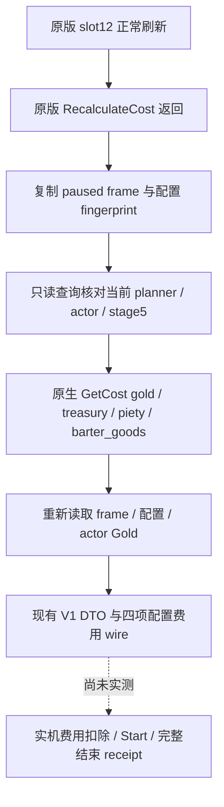

# CK3 1.20.0.2 Feast：四项配置费用与正常刷新捕获

状态：`static-ready`。本工作读取冻结 EXE 并编译调用生产 reader 的内存夹具；没有查询、注入、启动、关闭或操作本地 CK3。Feast 的新版本费用扣除、Start 和完整活动结束仍等待实机验收。

Exact build：CK3 **1.20.0.2 Crozier / Steam 25588574**；EXE SHA-256 **AE1BA6FF060BA603842F6F4A2DED0AF4B7D3666B3DD271F75FB01B0DA8E81B2D**。

## 原生来源

| 原生入口/字段 | 1.20.0.2 证据 | 含义 |
|---|---|---|
| `CActivityPlanner` slot 12 | vtable `0x45325C8 + 12*8 → 0x11B5B30` | 正常界面刷新入口 |
| 已完成费用刷新 | `0x11B5B5A → 0x11BA6D0`，返回 `0x11B5B5F` | 仅在原版刷新返回后复制十项 aggregate |
| planner owner / type / stage | `+0xA0` / `+0x1500` / `+0x1AE8` | constructor、refresh 与 stage getter 的直接字段证据 |
| 当前 planner / HostView | handler `+0x3C0` / `+0x3D8` | native factory 的 `0xB0AB48` / `0xB0AF25` store；这两项保持旧偏移 |
| 配置费用 breakdown | planner `+0x1B10` | `0x11BA6F2 add rcx,0x1B10`，刷新真正的原版 breakdown |
| category rows / count / stride | `+0x1598 / +0x15A4 / 0x10` | `0x11BA8E0` 起的原生遍历 |
| cost option rows / count / stride | `+0x15B0 / +0x15BC / 0x38` | `0x11BA786` 起的原生遍历 |
| `GetCost(name)` | `0x310AE10`；indexed read `0x310AEE5` | 原生字符串查找、原生 index、签名固定点结果 |
| actor Gold | Character `+0x1B0 → +0x100`；`0xC86121` / `0xC86146` | 空资源 extension 的原生语义是合法零值 |

32 条指令、5 个完整/明确前缀 span 和 3 条 vtable 边冻结在 [ABI manifest](../../ck3_autonomous_player/native_bridge/research/ck3_12002_activity_feast_costs_abi.json)，由 [离线 verifier](../../ck3_autonomous_player/native_bridge/research/verify_ck3_12002_activity_feast_costs.py) 直接核对 EXE。原生 planner 的其余字段由 [planner profile](../../ck3_autonomous_player/native_bridge/include/xar_bridge/ck3_12002_feast_planner.hpp) 统一选择；这里没有套用共同 RVA/结构体 delta。



四项语义 key 保持 `gold`、`treasury`、`piety`、`barter_goods`。每项先对 11 个不同的栈 sentinel 调用原生 getter，读取原生 index；**index 10 表示未映射，不是合法零费用**。然后才读取真实 breakdown。`0`、负数及 Q100000 原值保持原样；费用可支付性继续调用原版最终 `CanStart`，不从 Gold 一项自行推断。

十项 `raw_aggregate` 是正常刷新捕获，不能当成四项配置费用。生产夹具明确设置 aggregate Gold `99900000`、named Gold `18500000` 并确认 wire 使用后者。查询本身不调用刷新、推进 stage 或 Start。配置 fingerprint 包括 planner 从 type 到 breakdown 的字段及 category/cost-option 外部行，沿用已有正常刷新语义。

## 施工落点与验证

`activity_cost_slot12_passive_v1`、`activity_stage5_gold_cost_v1`、`activity_stage5_feast_full_cost_v1` 保持现有结果 DTO，并按精确 SHA 选择旧/新 native profile。新 `ck3_12002_activity_feast_cost_private_transport_v1` 提供 Gold 和 FullCost 的 application-main executor 与现有 wire serializer；snapshot 由调用者提供新版 callback，原生地址、RTTI cast、最终 CanStart 和字符串销毁均绑定新版。中央 bridge 必须安装并传入正常刷新 observer；空 observer 不产生费用数据。

最终新 profile 的生产 reader + serializer 夹具 **Od/O2 2/2 GREEN**，覆盖：无正常刷新不读原生费用、四 key、符号保留、配置变化、未映射 index、空 Gold extension、stage2 不读 stage5，以及现有 JSON shape。旧 FullCost 和 passive 夹具在本轮已通过 **Od/O2 4/4**，复用该回归结果。没有把这些夹具标成 live。

可复现命令（仅构建测试程序并读冻结文件）：

```text
python ck3_autonomous_player/native_bridge/research/verify_ck3_12002_activity_feast_costs.py --exe <frozen-exe> --result <result.json>
python ck3_autonomous_player/native_bridge/research/run_ck3_12002_activity_feast_costs_tests.py --output <Z-artifact-directory>
```

本轮 artifact：`Z:\ck3_mod_rewrite\artifacts\g2-offline-2026-10-01\feast\costs`；最终夹具报告 `final-root-profile/fixture-result.json`，原生 ABI 报告 `abi-result.json`；每种优化各保存 FullCost wire、编译日志和测试日志。`attempts.json` 保留首次 namespace 编译失败与随后被 factory 证据替代的临时 root profile；临时 mock 的 GREEN 没有被用作最终新 profile 证据。

尚需实机：确切新版正常刷新被动捕获；同一 paused frame 的四项原生值与最终 CanStart；有真实价值且原生允许的 Feast Start、扣费和完整结束。当前未取得这些证据，M6 活动生命周期不能据此标为 complete。
