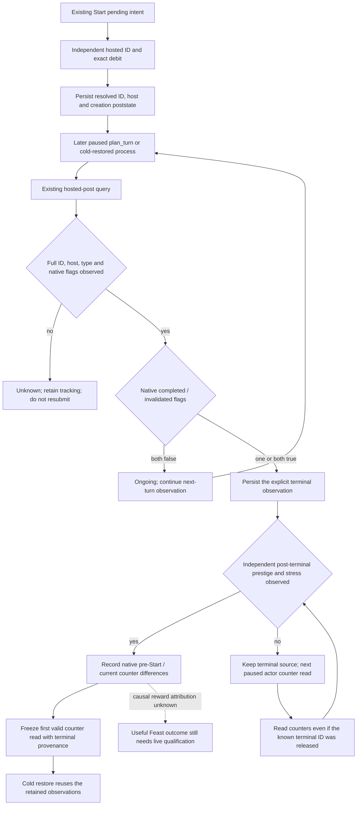

# Durable Feast follow-up in CK3 1.20.0.2

Status: **static-ready**. The existing Start consumer now follows the activity
beyond its creation and first subsequent turn. The production-reader wire
fixtures pass through the real Python transport, durable consumer and
`GameplayBridgeService.plan_turn` entry. This work did not query or operate CK3
and does not qualify a live Feast completion, reward or G2 M6.

The exact build is CK3 1.20.0.2 Crozier / Steam 25588574, EXE SHA-256
`AE1BA6FF060BA603842F6F4A2DED0AF4B7D3666B3DD271F75FB01B0DA8E81B2D`.
The native input tree and checked instruction anchors are in
[`ck3-1.20.0.2-feast-hosted-lifecycle.md`](ck3-1.20.0.2-feast-hosted-lifecycle.md).
That tree was read before this consumer was extended. This package changes
follow-up observation, not Feast utility or the existing Start conditions.

## Existing state and application caller

`activity_feast_stage5_start_formal_consumer.py` retains the existing
`activity-feast-stage5-start-private-v1.json` ledger and schema. A Start ACK
still leaves `pending`; independent same-date hosted identity and exact
four-resource debit resolve creation to `resolved`. The complete activity ID,
host CharacterID, creation date and independent poststate remain in that
receipt. New observations live under `resolved.lifecycle`, so older creation
receipts can be followed without a replacement driver or ledger.
When the native Start inputs carry `outcome_values`, the same persisted
intent also keeps those counters as its pre-Start baseline.

`reconcile_feast_lifecycle_private_v1(driver, snapshot=...)` reads that ID on
later paused frames. No tracked intent means `no_tracking` and no native
query. Existing unresolved Start intents use the established material
reconciliation and never submit again. Consuming the first following-turn
receipt does not stop lifecycle observation.

The service invokes this helper from `plan_turn` only when
`allow_private_activity_feast_lifecycle_observation` is true and the driver has
managed state on a paused frame. This switch is default-off. Its result is
returned as `plan.activity_feast_lifecycle_observation`; it does not choose or
replace `selected_step`, or enable the Start action. The private Feast query
MCP option enables observation separately from that action.



## Terminal source and measured value boundary

The transport's shared `normalize_activity_feast_terminal_outcome_v1` binds
the full activity ID, host and `activity_feast` type. It preserves the native
completion and invalidation flags separately, including when both are true.
Neither a created ID, a Start ACK, nor absence from the manager marks a Feast
completed. Reuse of the same low slot index with a different generation also
remains unknown. Invalidation may release its object before a later sample;
this observer cannot reconstruct that terminal result from absence.

Once an explicit terminal source is persisted, its original revision/date
and exact build provenance survive object release and process restoration.
The recorded result is labelled `lifecycle_terminal_recorded`; it is a
historical observation, not a new paused read. A different played character
does not consume the former host's observation as its own Feast.

For each of the four existing resources, the consumer records the independently
observed current balance and its raw difference from the creation poststate.
Unavailable balances remain `null`. These differences can include income and
other effects and are not attributed to Feast. The value record therefore
keeps `benefit_verified=false`,
`resource_changes_attributed_to_feast=false` and `opinion_change_raw=null`.
The native completion callback, a later conclusion-event choice and a useful
prestige/opinion payoff are separate observations. No utility constants or
reward totals are invented here.

The bounded native counter source is documented in
[`ck3-1.20.0.2-feast-outcome-values.md`](ck3-1.20.0.2-feast-outcome-values.md).
Start inputs and hosted poststates can now also carry these independent values:

| Field | Unit and unavailable meaning |
| --- | --- |
| `prestige_raw` | Signed Q100000; `null` means unavailable. |
| `stress_points` | Native plain integer points; `null` means unavailable. |
| `reveler_present` | Observed trait presence, including a legitimate `false`. |
| `reveler_xp_raw` | Single-track trait XP in Q100000; absent trait or unavailable XP stays `null`. |

The consumer compares these post values with its pre-Start baseline and records
signed counter differences and the observed Reveler presence transition. It
does not substitute zero for missing XP or expose the hidden `reveler_points`
progress variable. `status=observed_counters` and
`post_terminal_counters_observed=true` require independent prestige and stress
reads on a frame at or after the explicit terminal observation. These flags
describe input availability, while `counter_changes_attributed_to_feast=false`
keeps the causal payoff unqualified. Other counter availability remains
explicit in the per-field vector.

The first valid post-terminal counter read is retained and subsequent planning
turns reuse it. If a terminal identity was observed but its counters were not,
the next paused query can fill the counters after that object has been released;
it keeps the original terminal source separate from the current unknown
identity and current counter revision/date. A failed counter read preserves the
known terminal result. Legacy receipts without a counter baseline retain their
existing recorded-terminal path. This follows one known outcome without
repeatedly chasing resource changes or treating a later event choice as paid.

## Offline evidence and remaining real-game work

Run the focused consumer suite without a game process:

```console
python -m unittest discover -s ck3_autonomous_player/tests/unit -p test_activity_feast_stage5_start_formal_consumer.py -v
```

The suite has five existing Start cases, seven lifecycle cases and three
native counter follow-up cases. The lifecycle
cases use
`native_bridge/research/fixtures/ck3_12002_feast_hosted_post_wire.json`, emitted
by the actual hosted-post serializer, and cover following-turn plus restored
identity, completion with unclaimed balance changes, missing/reused/other-host
identity, distinct invalidation and overlapping flags, recorded completion
after release, untracked no-query, and the real service planning caller with
the default-off switch. The test outcome and source hashes are frozen in
`artifacts/g2-offline-2026-10-01/feast/lifecycle/result.json` for the original
12-case receipt. The counter extension uses the actual native provider through
the production serializer's four poststate snapshots in
`native_bridge/research/fixtures/ck3_12002_feast_outcome_values_wire.json` and
its separately emitted `_baseline.json`. It measures +100 prestige, -20 stress
and +5 trait XP in the source fixture, preserves terminal provenance through a
released object and restored process, and verifies that an observed absence
does not create zero XP. The tests supply their bounded guest qualification
and a zero cash floor to exercise follow-up with the fixture's 125-Gold prestate;
they do not qualify a production Start or change its normal budget. This
extended 15-case proof and source hashes are in
`artifacts/g2-offline-2026-10-01/feast/lifecycle/outcome-counters-result.json`.

Remaining qualification requires a real legal and worthwhile Feast Start,
its independently observed creation/debit, a later retained native terminal
identity, a subsequent turn and cold restore, and an independent useful
reward source. A released ID with no observed terminal flag remains an
observation gap. None of those live results is claimed by this package.
