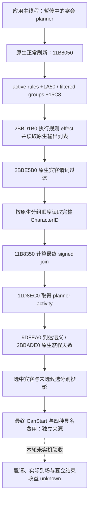

# CK3 1.20.0.2：宴会宾客原生来源迁移

本页绑定 `1.20.0.2 / Steam 25588574`、EXE SHA-256
`AE1BA6FF060BA603842F6F4A2DED0AF4B7D3666B3DD271F75FB01B0DA8E81B2D`。
2026-10-01 的工作只读取冻结 EXE，并编译、执行离线夹具；没有查询、注入、启动或操作本地 CK3。
旧版决策树与真实负例见 [1.19 宾客来源](activity-stage5-feast-guest-read-1.19.0.6.md)、
[候选宾客](activity-stage5-feast-guest-candidate-1.19.0.6.md) 和
[规则来源证明](activity-feast-guest-rule-provenance-1-19-0-6.md)。

## 原生树与调用链

join 是原生最终有符号定点结果。`score > 0` 才是预计愿意参加，不能用原始规则名单、
关系、邀请命令 ACK 或 Start ACK 替代。即使最终 join 为负或预计迟到，指定宾客查询仍返回其真实结果；
自动寻找候选才过滤已选中、非正 join 和迟到行。预计到达并不代表已接受邀请或实际到场。

## Exact-build 地址与布局

| 来源 | 1.19.0.6 | 1.20.0.2 | 本轮证据 |
|---|---:|---:|---|
| 最终 join | `10B0A80` | `11B8350` | 正常刷新调用 `11B5C46`，原生最终求值 `11B848F` |
| planner activity | `10CDA10` | `11D8EC0` | `+9A8` 分支、嵌入接口 `+100`、完整代数活动 ID `+F8` |
| 原生旅程天数 | `28CD180` | `2BBADE0` | 到达构造器调用 `9DFF87` |
| 正常规则刷新 | `28CF3A0` | `2BBD1B0` | 返回地址 `11B8331` |
| 规则 effect | `3380410` | `3765880` | 返回地址 `2BBD32A` |
| 宾客最终过滤 | `28D06C0` | `2BBE5B0` | 谓词调用 `2BBE691` |
| planner 选中行 | `+1678/+1684` | `+16B0/+16BC` | 原生 16 字节行，CharacterID 在行 `+8` |
| planner 过滤分组 | `+1590/+159C` | `+15C8/+15D4` | 分组行 24 字节，完整 ID 行 4 字节 |
| planner 活跃规则 | `+1A18/+1A24` | `+1A50/+1A5C` | 每项 16 字节，定义指针与原生 priority |
| planner 正 join 缓存 | `+1A30` | `+1A68` | `11B5C58` 写入原生 `score > 0` |
| planner host/start/location | `+1538/+1550/+1578` | `+1508/+1520/+15B0` | join 实际调用链 |
| rule effect/list key | `+38/+9C` | `+40/+94` | `2BBD321`、`2BBD32A`；不能按统一偏移平移 |

`ActivityHandler` 的 planner 与 HostView 槽仍为 `+3C0/+3D8`，分别由工厂后的真实 store
`B0AB48` 与 `B0AF25` 闭合；早期按事件号推算出的 `+3E0/+3D0` 不成立，未进入最终实现。
stock 宾客 GUI getter 的真实迁移为 `151CD40 → 165B620`：`165B64E` 读取 window 的 planner 指针
`+D0`，`165B655/165B65C` 再读取 planner 分组 `+15C8/+15D4`。
初次仅匹配同一条 `+1590` load 得到的 `2A48795` 属于另一段函数，已撤回该归属并替换 reader 的 ABI 锚点。
完整旧新 getter 的语义关联与原生调用链是来源证明；单条相同 opcode 并不足以说明对象归属。

原生到达构造器仍使用 activity `+83C` 的记录索引检查范围，但取日期时读取**首条记录** `+38`。
本轮保留这一可复现调用语义，而没有替换为推测的索引记录。没有活动成员记录时调用原生旅程天数，
`INT32_MAX` 仍表示该读口不能给出可用到达时间。日期单位为每一天 24 raw ticks。

## 实现与验收边界

版本选择在既有 `activity_stage5_feast_guest_join_v1.cpp`、
`activity_feast_guest_candidate_v1.cpp`、`activity_feast_guest_rule_provenance_v1.cpp` 内完成，保留既有 DTO、
frame 检查、生产路由和旧版支持。新地址集中在 `ck3_12002_feast_guests_abi.hpp`；
默认 native callback 与显式 private transport 都选择对应版本的 join、activity、travel 函数。
规则来源 observer 只在**原生正常刷新**中捕获 effect 输出，读取查询不主动重新执行 effect。

静态凭据为 `native_bridge/research/ck3_12002_feast_guests_abi.json`：七段原生区域 SHA 与
26 个实际指令锚点。`verify_ck3_12002_feast_guests.py` 输出 33 项检查，绑定冻结 EXE。
`run_ck3_12002_feast_guests_tests.py` 编译运行新版本生产读取路径及三套旧版回归，使用 `/Od`、`/O2`、
`/W4 /WX`。新夹具覆盖选中正 join、未选原生候选、负 join/迟到的指定宾客、无合格候选、
规则原始输出与原生过滤后的 CharacterID 归属。

验收产物保存在 `Z:\ck3_mod_rewrite\artifacts\g2-offline-2026-10-01\feast\guests\`。
状态只按真实离线结果计为 `static-ready`；新版本的 normal refresh、最终 CanStart、typed Start、
宾客实际到场、完成或失效与收益仍需新的 paused/live artifact。旧 R0403 的负 join/迟到记录保留为旧版本证据，
不能改名为本次新版本实机验收；G2 M6 完成数也不因此增加。
