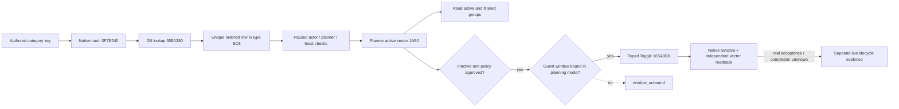

# Feast 宾客规则：1.20.0.2 原生迁移

本项是 `static-ready`：冻结 `1.20.0.2 Crozier`、Steam build `25588574`，EXE SHA-256
`AE1BA6FF060BA603842F6F4A2DED0AF4B7D3666B3DD271F75FB01B0DA8E81B2D`。
全部施工使用冻结文件与夹具，未查询进程、连接 pipe、注入或操作本地 CK3。
旧版 [宾客规则专题](activity-feast-guest-rule-toggle-1-19-0-6.md) 的实机结果保留其原有版本边界。

## 原生来源与版本差异

新版 `ActivityGuestListWindow.ToggleInviteFromRules` 的原生核心是 `0x165A9D0(window, ordered_row)`，
`IsInviteRuleActive` 是 `0x165AB90(window, ordered_row)`。窗口的 planning mode 从 `+0xF8`
移到 `+0xC8`，绑定 planner 从 `+0x100` 移到 `+0xD0`；handler 的当前 planner `+0x3C0`
及 guest window `+0x3F0` 保留。窗口 vtable 为 `module+0x457B1A0`。

字符串 key 的原生 resolver `0x3053BB0` 调用 DB getter `0x3057BC0`，再通过
`0x3F7E240` 对 key 的原始字节计算 hash，调用 `0x305A280(database, hash)`。
DB singleton 是 `module+0x5D33EE8`，missing definition 是 `*(module+0x5D33F48)`；
DB main/sub vtable 分别是 `+0x48B2F20`、`+0x48B2EC0`。constructor `0x304947C`
及 parser `0x3057F22` 共同证明 definition 的 native key hash 仍是 `+0x14`。

`CActivityType` 的 ordered rows 是 `+0xBC8/+0xBD4`：getter `0x3118700` 返回该
vector，parser `0x31138BE` 对它与 `+0xBE0/+0xBEC` defaults 分别排序。
这是逐字段恢复的布局；不能按旧版 `+0xD20` 或其他字段套用统一位移。
每个 ordered row 为 16 字节，首字段为 definition 指针，匹配 authored key 后仍要求唯一 row。

原生 Toggle 要求 `window+0xC8 == -1`，并拒绝 definition 的 `+0x98` 特殊标记。
它把窗口 active rows 复制进 `planner+0x1A50/+0x1A5C`，调用 `0x11B8050` 刷新
`planner+0x15C8/+0x15D4` filtered groups。调用后原生 getter 与复制出的 active vector
必须一致，才能返回 `activated`。只读查询直接读取 planner active vector，不要求额外打开 guest-list 窗口。

## 已接入的消费链

`activity_feast_guest_rule_toggle_v1.cpp` 按 admitted EXE SHA 分派旧版与新版的 ABI、
布局、hash/lookup/getter/toggle。新 `ck3_12002_activity_feast_guest_transport.hpp/.cpp`
提供宾客 candidate、指定 target、route proof、规则读取/切换/provenance 与宾客好感的
真实 application-main executors，复用现有 DTO、serializer 和 mailbox stamp 检查。
它接收显式 module base、SHA 和当前 `GameAdapter` 的 snapshot callback；不创建旧版 `Bindings`。
好感读口复用新版 `ReadCharacterOpinion12002`，方向为 guest 对 actor，不要求 gift modifier 存在。

## 验证与保留边界

新增 `ck3_12002_activity_feast_guest_rule_test.cpp` 覆盖真实 reader/toggle 的 inactive、
active、policy deny、已激活不重复调用、未绑定窗口、重复 definition、失败 postcondition 与
错误 build/入口字节。新旧两组 fixture 均以 MSVC `/Od` 与 `/O2 /W4 /WX` 通过；
新 transport 在开启 provenance 分支时以相同配置编译通过。
记录位于 `Z:\ck3_mod_rewrite\artifacts\g2-offline-2026-10-01\feast\guest-transport\build\result.json`。

新增 `ck3_12002_activity_feast_guest_wire_test.cpp` 调用真实 serializers，并与实际
reader、slot-12、diagnostic、core 和 total-opinion provider 一起链接；`/Od`、`/O2 /W4 /WX`
均通过。它修正了指定目标已经被选中时 route-proof 仍输出
`candidate_selected_membership=false` 的具体错误，覆盖 selected / unselected / unavailable 三态、
target 独立成员回读和 signed/null opinion。结果位于同一 artifact 根目录的
`wire-build/result.json`；首次测试 harness 的依赖文件命名与缺少链接对象 RED 保留在
`wire-build/harness-failures.json`，没有把它们算作能力 RED。

原生证据冻结在 [ABI manifest](../../ck3_autonomous_player/native_bridge/research/ck3_12002_feast_guest_rule_abi.json)；
[只读 verifier](../../ck3_autonomous_player/native_bridge/research/verify_ck3_12002_feast_guest_rule_abi.py)
检查冻结 EXE SHA 和 18 个函数/调用链锚点。fixture 和编译不代表新版实机验收。
仍需新版 paused snapshot 验证 guest-list 绑定、有价值 category 的单次切换、独立回读，以及后续
Feast Start、终局与可见收益。`activated` 仅表示 category 切换及回读，不能当作宾客接受或活动完成。
