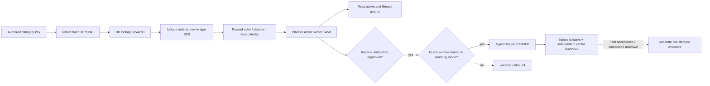

# Feast 宾客规则：1.20.0.2 原生迁移

本项是 `static-ready`：冻结 `1.20.0.2 Crozier`、Steam build `25588574`，EXE SHA-256
`AE1BA6FF060BA603842F6F4A2DED0AF4B7D3666B3DD271F75FB01B0DA8E81B2D`。
全部施工使用冻结文件与夹具，未查询进程、连接 pipe、注入或操作本地 CK3。
旧版 [宾客规则专题](activity-feast-guest-rule-toggle-1-19-0-6.md) 的实机结果保留其原有版本边界。

## 原生来源与版本差异

新版 `ActivityGuestListWindow.ToggleInviteFromRules` 的原生核心是 `0x165A9D0(window, ordered_row)`，
`IsInviteRuleActive` 是 `0x165AB90(window, ordered_row)`。窗口的 planning mode 从 `+0xF8`
移到 `+0xC8`，绑定 planner 从 `+0x100` 移到 `+0xD0`；handler 的当前 planner `+0x3C0`
及 guest window `+0x3F0` 保留。窗口 vtable 为 `module+0x457B1A0`。

字符串 key 的原生 resolver `0x3053BB0` 调用 DB getter `0x3057BC0`，再通过
`0x3F7E240` 对 key 的原始字节计算 hash，调用 `0x305A280(database, hash)`。
DB singleton 是 `module+0x5D33EE8`，missing definition 是 `*(module+0x5D33F48)`；
DB main/sub vtable 分别是 `+0x48B2F20`、`+0x48B2EC0`。constructor `0x304947C`
及 parser `0x3057F22` 共同证明 definition 的 native key hash 仍是 `+0x14`。

`CActivityType` 的 ordered rows 是 `+0xBC8/+0xBD4`：getter `0x3118700` 返回该
vector，parser `0x31138BE` 对它与 `+0xBE0/+0xBEC` defaults 分别排序。
这是逐字段恢复的布局；不能按旧版 `+0xD20` 或其他字段套用统一位移。
每个 ordered row 为 16 字节，首字段为 definition 指针，匹配 authored key 后仍要求唯一 row。

原生 Toggle 要求 `window+0xC8 == -1`，并拒绝 definition 的 `+0x98` 特殊标记。
它把窗口 active rows 复制进 `planner+0x1A50/+0x1A5C`，调用 `0x11B8050` 刷新
`planner+0x15C8/+0x15D4` filtered groups。调用后原生 getter 与复制出的 active vector
必须一致，才能返回 `activated`。只读查询直接读取 planner active vector，不要求额外打开 guest-list 窗口。

## 已接入的消费链

`activity_feast_guest_rule_toggle_v1.cpp` 按 admitted EXE SHA 分派旧版与新版的 ABI、
布局、hash/lookup/getter/toggle。新 `ck3_12002_activity_feast_guest_transport.hpp/.cpp`
提供宾客 candidate、指定 target、route proof、规则读取/切换/provenance 与宾客好感的
真实 application-main executors，复用现有 DTO、serializer 和 mailbox stamp 检查。
它接收显式 module base、SHA 和当前 `GameAdapter` 的 snapshot callback；不创建旧版 `Bindings`。
好感读口复用新版 `ReadCharacterOpinion12002`，方向为 guest 对 actor，不要求 gift modifier 存在。

## 验证与保留边界

新增 `ck3_12002_activity_feast_guest_rule_test.cpp` 覆盖真实 reader/toggle 的 inactive、
active、policy deny、已激活不重复调用、未绑定窗口、重复 definition、失败 postcondition 与
错误 build/入口字节。新旧两组 fixture 均以 MSVC `/Od` 与 `/O2 /W4 /WX` 通过；
新 transport 在开启 provenance 分支时以相同配置编译通过。
记录位于 `Z:\ck3_mod_rewrite\artifacts\g2-offline-2026-10-01\feast\guest-transport\build\result.json`。

新增 `ck3_12002_activity_feast_guest_wire_test.cpp` 调用真实 serializers，并与实际
reader、slot-12、diagnostic、core 和 total-opinion provider 一起链接；`/Od`、`/O2 /W4 /WX`
均通过。它修正了指定目标已经被选中时 route-proof 仍输出
`candidate_selected_membership=false` 的具体错误，覆盖 selected / unselected / unavailable 三态、
target 独立成员回读和 signed/null opinion。结果位于同一 artifact 根目录的
`wire-build/result.json`；首次测试 harness 的依赖文件命名与缺少链接对象 RED 保留在
`wire-build/harness-failures.json`，没有把它们算作能力 RED。

原生证据冻结在 [ABI manifest](../../ck3_autonomous_player/native_bridge/research/ck3_12002_feast_guest_rule_abi.json)；
[只读 verifier](../../ck3_autonomous_player/native_bridge/research/verify_ck3_12002_feast_guest_rule_abi.py)
检查冻结 EXE SHA 和 18 个函数/调用链锚点。fixture 和编译不代表新版实机验收。
仍需新版 paused snapshot 验证 guest-list 绑定、有价值 category 的单次切换、独立回读，以及后续
Feast Start、终局与可见收益。`activated` 仅表示 category 切换及回读，不能当作宾客接受或活动完成。

## 2026-10-02：1.20.0.3 真实 rule_unavailable 与窄原因读回

本次 G2 使用 `1.20.0.3`、Steam build `25652598`，EXE SHA-256
`94B55397ABB687A3DCD436805A5D885E6BE90FA6C693FEB44A9E3BBEEADE02A6`。
root 已在 v4 新 PID `69040`、actor `29829`、raw `53172768` 完成正确 Stage1
选项、一次 Confirm、独立 Stage2 回读及 Province `2619` 选择，进入 Stage5。
真实 full-cost 与 Start-inputs 同帧读到 `final_can_start=true`、Gold 费用
`10000000` raw / 100 Gold，其他三项费用为零，但 selected-nonhost / positive-join
均为零，正式策略 hold 为 `native_guest_route_unqualified`。没有 Start 或扣款。

随后只读 `activity_invite_rule_vassals` 在 `native:9` / public revision `2` 返回
`rule_unavailable`、`invoked=false`，没有 activation。原始包是
`resume-12003/m6-feast/attempt03/live/typed-phases/run-20261001T203654413017Z-rule.json`，
SHA-256 `1d29d09637bd1bd25fa3ee9f9a41a1d92f21a3acd621e724bc36c27a3be5c54f`。
当前 stock `feast.txt:736` 与 `activity_invite_rules.txt:194` 都使用同一 authored
key；它满足现有 key 校验，不能改名来绕开失败。已有 .2→.3 guest-rule ABI comparison
对 18 个 byte anchors、15 个完整函数与 unwind 均 PASS，包含数据库 main/sub vtable
constructor 的 `+0/+0x38`、hash/getter/lookup 和 ordered-row parser；本项不重新扩展 ABI。

真实失败证明需要补充窄原因观测：既有生产 Bind 把数据库绑定/缺失 sentinel、
lookup null/sentinel 和当前活动 ordered rows 无匹配都映射成 `rule_unavailable`。
serializer 在这些分支统一输出 null hash/count，单靠该包不能识别实际分支；
重复同一 typed read 不能提供缺失信息。root 因此授权在现有 result/Bind/serializer
增加 `unavailable_reason`，不打开完整 planner diagnostic、增加 flag 或修改动作。
数据库原有 read 顺序和判定不变，只分别标明 read failure、未初始化或 vtable mismatch；
lookup 标明 `lookup_returned_null` / `lookup_returned_missing`；ordered rows 标明
`ordered_definition_not_found`。仅 `rule_unavailable` 输出静态原因字符串，其他状态为 null。
同一字段不发布原生地址，不把 null active/hash/count 改成合法零值。

Python 的现有 parser 确实要求 exact key set，因此仅接受旧 exact fields 或它们加
该 nullable string；全部 actor/frame、status、counts、invoked 与动作验证保留。
直接调用真实 reader 再调用真实 serializer 的 `/O2 /W4 /WX` fixture 覆盖三个
失败大分支和 observed 的 null reason；Python 原有 transport 加新字段兼容共四项测试
均 GREEN。第一次手动 fixture harness 错列了不存在的辅助 `.cpp`，该编译 RED 已保留，
移除该 harness 参数后通过；没有把它算作能力失败。

测试与稳定源 hash 位于 `resume-12003/m6-feast/guest-rule-reason-build/` 和
`guest-rule-reason-source.json`。组合 v5 DLL 增量编译 GREEN，耗时 10.41 秒，
SHA-256 `ac638ca992d97144594236f499c73379574f8c5831ea2d9c53aacded1bc7eaa3`，
包为 `resume-12003/binaries/native-nonwar-12003-law-feast-v5`，原 `61 ON / 4 OFF`
与 cache 未改。原因字段当前为 **static-ready**，待组合 v5 新 PID
重建合法 Stage5 后单次只读 rule 验收；现有可玩里程碑仅为 Stage1/Stage2/location
的 production-live primitive。宾客规则/route、预算、Start、terminal 与 M6 complete
尚未完成。当前预算还读到 active-war `1` 与 `war_cash_reserve_raw=null`；即使宾客
route 随后合格，也仍须依既有 fresh budget 判定，不得据 CanStart=true 提交 Start。

### v5 实际原因与 v6 nullable missing 修复

组合 v5 的新 PID `95588` 在 raw `53173752`、actor `29829`、`native:8` /
public revision `2` 返回真实 `unavailable_reason=missing_definition_not_initialized`。
DB slot、main/secondary vtable 与 missing-slot 读取均已通过；仅因读到 missing
fallback 为零而提前返回，native hash/lookup 和 ordered-row 匹配尚未执行。
没有 activation。实际包为
`attempt04/live/typed-phases/run-20261001T211420139973Z-rule.json`，SHA-256
`2c0df486839c435b58598e5e71fd7f2691ca69bb554b4e6552aa4f2e4e21fb46`。

只检查既有 guest-rule DB 的三个 exact `.3` 冻结函数即可闭合此假设：
`0x305A37E` 判断查得 row 是否是 sentinel；有效 row 在 `0x305A384` 直接返回
`[row+0x10]`，跳到 `0x305A391`，不读取 missing fallback。仅未命中分支
`0x305A38A` 读取 `module+0x5D33F48`；函数不要求它非零。DB getter `0x3057BC0`
也没有 missing 非零前置。实际 v5 的正常 DB 身份与零 fallback，结合有效 lookup
的独立返回路径，证明我们的非零前置假设会错误阻断正常查找；不是当前 authored
key 错误，也不能据此更改整个 TypeDB 布局。

root 授权的最小 v6 修改只删除 `missing==0` 提前拒绝。保留 missing slot 的
`ReadAt`、DB slot/两 vtable、`definition==0 || definition==missing`、当前活动
唯一 ordered row、actor/frame/stage 与动作约束。零 fallback 下失败 lookup 仍由
`definition==0` 拒绝；非零 fallback 的 sentinel 比较也保留。没有修改 header、
serializer、Python、ABI 或 flags。

既有 focused fixture 直接走生产 reader/serializer：missing `0`、有效 lookup、
唯一 ordered row 返回 `observed_inactive` 且未 invoke；同一零 fallback 下 lookup
返回 `0` 仍为 `lookup_returned_null`；非零 sentinel 仍为 `lookup_returned_missing`。
`/O2 /W4 /WX` 编译执行与四项 Python compatibility tests 均 GREEN。
源码 `activity_feast_guest_rule_toggle_v1.cpp` SHA-256 为
`e7e707ba983fb40e7eaf5918545ab2b2a36a9272ae46f82c71ccc6256af14147`，
fixture SHA-256 为 `82e84f6830f1fa2f8e1779b4029fbdbc0a38c608ed3fa7d2b54c71c04efb3e5d`。
材料位于 `resume-12003/m6-feast/guest-rule-nullable-missing/` 的
`exact-12003-nullable-missing.json/.txt`、`actual-v5-rule-proof.json`、
`source-and-validation.json` 与 `build/result.json`。v6 修复当前仅 **static-ready**，
等待 root 组合 DLL、新 PID paused 实际 lookup/ordered-row/active-state 读回；
fixture 不证明当前 G2 的规则状态、宾客接受、Feast Start 或 M6 完成。
