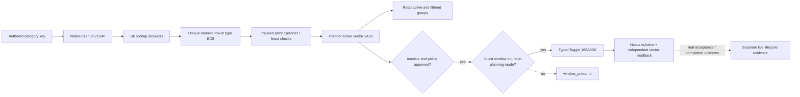
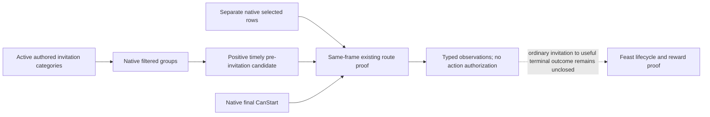
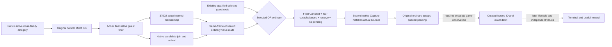
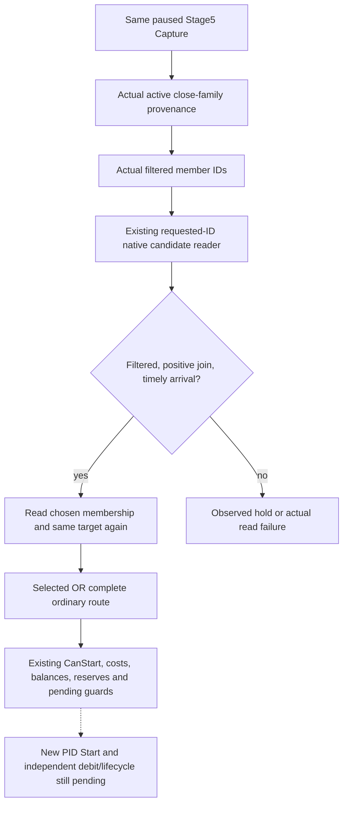
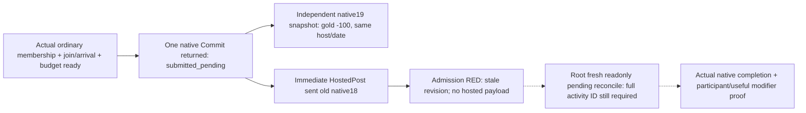
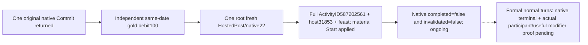
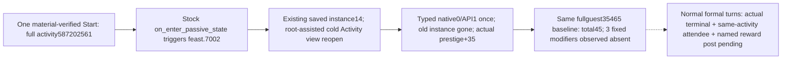
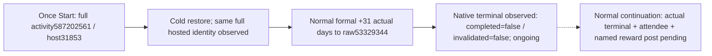
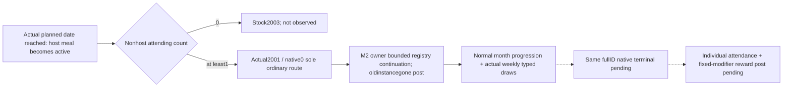
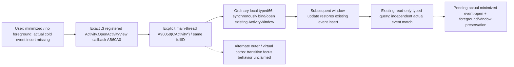

# Feast 宾客规则：1.20.0.2 原生迁移

本项是 `static-ready`：冻结 `1.20.0.2 Crozier`、Steam build `25588574`，EXE SHA-256
`AE1BA6FF060BA603842F6F4A2DED0AF4B7D3666B3DD271F75FB01B0DA8E81B2D`。
全部施工使用冻结文件与夹具，未查询进程、连接 pipe、注入或操作本地 CK3。
旧版 [宾客规则专题](activity-feast-guest-rule-toggle-1-19-0-6.md) 的实机结果保留其原有版本边界。

## 原生来源与版本差异

新版 `ActivityGuestListWindow.ToggleInviteFromRules` 的原生核心是 `0x165A9D0(window, ordered_row)`，
`IsInviteRuleActive` 是 `0x165AB90(window, ordered_row)`。窗口的 planning mode 从 `+0xF8`
移到 `+0xC8`，绑定 planner 从 `+0x100` 移到 `+0xD0`；handler 的当前 planner `+0x3C0`
及 guest window `+0x3F0` 保留。窗口 vtable 为 `module+0x457B1A0`。

字符串 key 的原生 resolver `0x3053BB0` 调用 DB getter `0x3057BC0`，再通过
`0x3F7E240` 对 key 的原始字节计算 hash，调用 `0x305A280(database, hash)`。
DB singleton 是 `module+0x5D33EE8`，missing definition 是 `*(module+0x5D33F48)`；
DB main/sub vtable 分别是 `+0x48B2F20`、`+0x48B2EC0`。constructor `0x304947C`
及 parser `0x3057F22` 共同证明 definition 的 native key hash 仍是 `+0x14`。

`CActivityType` 的 ordered rows 是 `+0xBC8/+0xBD4`：getter `0x3118700` 返回该
vector，parser `0x31138BE` 对它与 `+0xBE0/+0xBEC` defaults 分别排序。
这是逐字段恢复的布局；不能按旧版 `+0xD20` 或其他字段套用统一位移。
每个 ordered row 为 16 字节，首字段为 definition 指针，匹配 authored key 后仍要求唯一 row。

原生 Toggle 要求 `window+0xC8 == -1`，并拒绝 definition 的 `+0x98` 特殊标记。
它把窗口 active rows 复制进 `planner+0x1A50/+0x1A5C`，调用 `0x11B8050` 刷新
`planner+0x15C8/+0x15D4` filtered groups。调用后原生 getter 与复制出的 active vector
必须一致，才能返回 `activated`。只读查询直接读取 planner active vector，不要求额外打开 guest-list 窗口。

## 已接入的消费链

`activity_feast_guest_rule_toggle_v1.cpp` 按 admitted EXE SHA 分派旧版与新版的 ABI、
布局、hash/lookup/getter/toggle。新 `ck3_12002_activity_feast_guest_transport.hpp/.cpp`
提供宾客 candidate、指定 target、route proof、规则读取/切换/provenance 与宾客好感的
真实 application-main executors，复用现有 DTO、serializer 和 mailbox stamp 检查。
它接收显式 module base、SHA 和当前 `GameAdapter` 的 snapshot callback；不创建旧版 `Bindings`。
好感读口复用新版 `ReadCharacterOpinion12002`，方向为 guest 对 actor，不要求 gift modifier 存在。

## 验证与保留边界

新增 `ck3_12002_activity_feast_guest_rule_test.cpp` 覆盖真实 reader/toggle 的 inactive、
active、policy deny、已激活不重复调用、未绑定窗口、重复 definition、失败 postcondition 与
错误 build/入口字节。新旧两组 fixture 均以 MSVC `/Od` 与 `/O2 /W4 /WX` 通过；
新 transport 在开启 provenance 分支时以相同配置编译通过。
记录位于 `Z:\ck3_mod_rewrite\artifacts\g2-offline-2026-10-01\feast\guest-transport\build\result.json`。

新增 `ck3_12002_activity_feast_guest_wire_test.cpp` 调用真实 serializers，并与实际
reader、slot-12、diagnostic、core 和 total-opinion provider 一起链接；`/Od`、`/O2 /W4 /WX`
均通过。它修正了指定目标已经被选中时 route-proof 仍输出
`candidate_selected_membership=false` 的具体错误，覆盖 selected / unselected / unavailable 三态、
target 独立成员回读和 signed/null opinion。结果位于同一 artifact 根目录的
`wire-build/result.json`；首次测试 harness 的依赖文件命名与缺少链接对象 RED 保留在
`wire-build/harness-failures.json`，没有把它们算作能力 RED。

原生证据冻结在 [ABI manifest](../../ck3_autonomous_player/native_bridge/research/ck3_12002_feast_guest_rule_abi.json)；
[只读 verifier](../../ck3_autonomous_player/native_bridge/research/verify_ck3_12002_feast_guest_rule_abi.py)
检查冻结 EXE SHA 和 18 个函数/调用链锚点。fixture 和编译不代表新版实机验收。
仍需新版 paused snapshot 验证 guest-list 绑定、有价值 category 的单次切换、独立回读，以及后续
Feast Start、终局与可见收益。`activated` 仅表示 category 切换及回读，不能当作宾客接受或活动完成。

## 2026-10-02：1.20.0.3 真实 rule_unavailable 与窄原因读回

本次 G2 使用 `1.20.0.3`、Steam build `25652598`，EXE SHA-256
`94B55397ABB687A3DCD436805A5D885E6BE90FA6C693FEB44A9E3BBEEADE02A6`。
root 已在 v4 新 PID `69040`、actor `29829`、raw `53172768` 完成正确 Stage1
选项、一次 Confirm、独立 Stage2 回读及 Province `2619` 选择，进入 Stage5。
真实 full-cost 与 Start-inputs 同帧读到 `final_can_start=true`、Gold 费用
`10000000` raw / 100 Gold，其他三项费用为零，但 selected-nonhost / positive-join
均为零，正式策略 hold 为 `native_guest_route_unqualified`。没有 Start 或扣款。

随后只读 `activity_invite_rule_vassals` 在 `native:9` / public revision `2` 返回
`rule_unavailable`、`invoked=false`，没有 activation。原始包是
`resume-12003/m6-feast/attempt03/live/typed-phases/run-20261001T203654413017Z-rule.json`，
SHA-256 `1d29d09637bd1bd25fa3ee9f9a41a1d92f21a3acd621e724bc36c27a3be5c54f`。
当前 stock `feast.txt:736` 与 `activity_invite_rules.txt:194` 都使用同一 authored
key；它满足现有 key 校验，不能改名来绕开失败。已有 .2→.3 guest-rule ABI comparison
对 18 个 byte anchors、15 个完整函数与 unwind 均 PASS，包含数据库 main/sub vtable
constructor 的 `+0/+0x38`、hash/getter/lookup 和 ordered-row parser；本项不重新扩展 ABI。

真实失败证明需要补充窄原因观测：既有生产 Bind 把数据库绑定/缺失 sentinel、
lookup null/sentinel 和当前活动 ordered rows 无匹配都映射成 `rule_unavailable`。
serializer 在这些分支统一输出 null hash/count，单靠该包不能识别实际分支；
重复同一 typed read 不能提供缺失信息。root 因此授权在现有 result/Bind/serializer
增加 `unavailable_reason`，不打开完整 planner diagnostic、增加 flag 或修改动作。
数据库原有 read 顺序和判定不变，只分别标明 read failure、未初始化或 vtable mismatch；
lookup 标明 `lookup_returned_null` / `lookup_returned_missing`；ordered rows 标明
`ordered_definition_not_found`。仅 `rule_unavailable` 输出静态原因字符串，其他状态为 null。
同一字段不发布原生地址，不把 null active/hash/count 改成合法零值。

Python 的现有 parser 确实要求 exact key set，因此仅接受旧 exact fields 或它们加
该 nullable string；全部 actor/frame、status、counts、invoked 与动作验证保留。
直接调用真实 reader 再调用真实 serializer 的 `/O2 /W4 /WX` fixture 覆盖三个
失败大分支和 observed 的 null reason；Python 原有 transport 加新字段兼容共四项测试
均 GREEN。第一次手动 fixture harness 错列了不存在的辅助 `.cpp`，该编译 RED 已保留，
移除该 harness 参数后通过；没有把它算作能力失败。

测试与稳定源 hash 位于 `resume-12003/m6-feast/guest-rule-reason-build/` 和
`guest-rule-reason-source.json`。组合 v5 DLL 增量编译 GREEN，耗时 10.41 秒，
SHA-256 `ac638ca992d97144594236f499c73379574f8c5831ea2d9c53aacded1bc7eaa3`，
包为 `resume-12003/binaries/native-nonwar-12003-law-feast-v5`，原 `61 ON / 4 OFF`
与 cache 未改。原因字段当前为 **static-ready**，待组合 v5 新 PID
重建合法 Stage5 后单次只读 rule 验收；现有可玩里程碑仅为 Stage1/Stage2/location
的 production-live primitive。宾客规则/route、预算、Start、terminal 与 M6 complete
尚未完成。当前预算还读到 active-war `1` 与 `war_cash_reserve_raw=null`；即使宾客
route 随后合格，也仍须依既有 fresh budget 判定，不得据 CanStart=true 提交 Start。

### v5 实际原因与 v6 nullable missing 修复

组合 v5 的新 PID `95588` 在 raw `53173752`、actor `29829`、`native:8` /
public revision `2` 返回真实 `unavailable_reason=missing_definition_not_initialized`。
DB slot、main/secondary vtable 与 missing-slot 读取均已通过；仅因读到 missing
fallback 为零而提前返回，native hash/lookup 和 ordered-row 匹配尚未执行。
没有 activation。实际包为
`attempt04/live/typed-phases/run-20261001T211420139973Z-rule.json`，SHA-256
`2c0df486839c435b58598e5e71fd7f2691ca69bb554b4e6552aa4f2e4e21fb46`。

只检查既有 guest-rule DB 的三个 exact `.3` 冻结函数即可闭合此假设：
`0x305A37E` 判断查得 row 是否是 sentinel；有效 row 在 `0x305A384` 直接返回
`[row+0x10]`，跳到 `0x305A391`，不读取 missing fallback。仅未命中分支
`0x305A38A` 读取 `module+0x5D33F48`；函数不要求它非零。DB getter `0x3057BC0`
也没有 missing 非零前置。实际 v5 的正常 DB 身份与零 fallback，结合有效 lookup
的独立返回路径，证明我们的非零前置假设会错误阻断正常查找；不是当前 authored
key 错误，也不能据此更改整个 TypeDB 布局。

root 授权的最小 v6 修改只删除 `missing==0` 提前拒绝。保留 missing slot 的
`ReadAt`、DB slot/两 vtable、`definition==0 || definition==missing`、当前活动
唯一 ordered row、actor/frame/stage 与动作约束。零 fallback 下失败 lookup 仍由
`definition==0` 拒绝；非零 fallback 的 sentinel 比较也保留。没有修改 header、
serializer、Python、ABI 或 flags。

既有 focused fixture 直接走生产 reader/serializer：missing `0`、有效 lookup、
唯一 ordered row 返回 `observed_inactive` 且未 invoke；同一零 fallback 下 lookup
返回 `0` 仍为 `lookup_returned_null`；非零 sentinel 仍为 `lookup_returned_missing`。
`/O2 /W4 /WX` 编译执行与四项 Python compatibility tests 均 GREEN。
源码 `activity_feast_guest_rule_toggle_v1.cpp` SHA-256 为
`e7e707ba983fb40e7eaf5918545ab2b2a36a9272ae46f82c71ccc6256af14147`，
fixture SHA-256 为 `82e84f6830f1fa2f8e1779b4029fbdbc0a38c608ed3fa7d2b54c71c04efb3e5d`。
材料位于 `resume-12003/m6-feast/guest-rule-nullable-missing/` 的
`exact-12003-nullable-missing.json/.txt`、`actual-v5-rule-proof.json`、
`source-and-validation.json` 与 `build/result.json`。v6 修复当前仅 **static-ready**，
等待 root 组合 DLL、新 PID paused 实际 lookup/ordered-row/active-state 读回；
fixture 不证明当前 G2 的规则状态、宾客接受、Feast Start 或 M6 完成。

### v6 新 PID 规则回读 GREEN；当前宾客 route 仍 hold

root 使用 exact source `dcd61a5b` 的组合 v6，在新 PID `97800`、actor `29829`、
raw `53174952` 读到 `activity_invite_rule_vassals` 为 `observed_active`：
`active=true`、`unavailable_reason=null`、`invoked=false`，native hash `1267957912`，
ordered rules `21`、active rules `16`、filtered groups `6`、filtered characters `24`。
queried/post snapshot 均为 `native:8`，public revision `2`。没有重发 activation。
该实际生产读回闭合 nullable-missing 修复；规则读取可标为
**production-live primitive**，不表示宾客已接受或宴会已开始。

规则包 `attempt05/live/typed-phases/run-20261001T215434821321Z-rule.json`
SHA-256 `b1232a9b22a9e4f4915a559d385409d931daa8a65b511792a27770d77866c2c2`；
随后 fresh Stage5 包 `run-20261001T215506714179Z-stage5.json` SHA-256
`75e60b4552dbe788f4ea1a6e9bb332fcf700fad696baa8adafc479174b01c517`。
后者在 `native:9` / public revision `2` 读到 CanStart true、成本 100 Gold、
余额 `148384115` raw、Piety `-103410000` raw，但 `guest_join_status=observed`、
selected-nonhost/positive/timely-positive 均为 `0`，native route 为 false，正式
hold 仍是 `native_guest_route_unqualified`。pending/resolved Start ledger 均为 null。
精简证据位于 `attempt05/rule-live-proof.json` 与 `attempt05/stage5-hold-proof.json`。

原生过滤 groups `planner+15C8/+15D4` 与已选 rows `+16B0/+16BC` 是不同来源：
24 个 filtered IDs 不能自动当作已选、positive join 或及时到达。当前 blocker 应
沿现有 guest candidate/target/provenance 查询和普通邀请语义继续查明，不能重发
已 active 的 vassals rule 或据 CanStart true 越过 guest/cost/budget 守卫。
本帧正式 budget 为 `observed` / `exclusive_paused_activity_lane`，四项 reserve
均为零、`peaceful_spend_allowed=true`、Gold floor 200；active-war `1` 与 war-cash
reserve null 没有成为额外 policy blocker。尚无 Start、扣款、terminal 或 M6 完成。

### 真实正接受度候选与既有只读 route-proof 的正式 MCP 接线

root 的单次正式 SDK candidate 查询在同 PID `97800`、actor `29829`、raw
`53174952`、`native:10` / public revision `2` 返回 `status=observed`，
`native_filtered_pre_invitation=true`。候选 full ID `37502` 的 signed
`planner_join_raw=200000`，travel 19 天，arrival `53175408`，planned start
`53178696`；arrival 早于计划开始 137 天。normal refresh `39560`，fingerprint
`0x0d076f0ca1863ab3`，queried/post snapshot 均为 `native:10`，实际身份是
`1.20.0.3` 与本专题冻结 EXE SHA。实包为
`guest-route-next/candidate-live-01/004-ck3_query_activity_feast_guest_candidate_private_v1.json`。
这是 **production-live primitive** 的有价值 pre-invitation candidate，不能当作
已选列表或宴会启动证据。

现有 stock `window_activity_guest_list.gui` 的普通邀请走 category
`ToggleInviteFromRules`；个人 `CharacterListItem.OnClick('select_special_guest')`
只在 `IsSelectingSpecialGuest` 时可见。普通候选不需要捏造个人 Select 操作，
已 active 的 vassals category 也不需要再次 Toggle。既有 native candidate reader
从 filtered groups 排除 host 与已选角色后查 native join/arrival；已选列表则
来自 planner `+0x16B0/+0x16BC`。因此当前 positive candidate 与 selected-nonhost
零可以同时成立。既有 [Start 专题](ck3-1.20.0.2-feast-start.md) 已证明无 retained
confirmation rows 时 Stage5 progress 仍走原生 accept 分支；零已选不等于原生
CanStart 拒绝，当前我方 hold 保持原样。

为在同一次 typed read 中取得 candidate、selected rows 与 final CanStart 的
真实区别，本次只在正式 `mcp_server.py` 接线既有
`query_activity_feast_guest_route_proof_private_v1` transport，并复用
`--private-activity-feast-queries` 设置既有 allow 属性。新正式工具是
`ck3_query_activity_feast_guest_route_proof_private_v1(expected_revision)`，
标为只读；没有新增 CLI flag、native flag、DLL、动作或策略放宽。
既有 native step `query-activity-feast-stage5-guest-route-proof-v1-private`
在当前 guest router 已编译，复用同一 `.3` 身份接入及既有 .2→.3 guest ABI
comparison PASS；Python transport 根据 actual hello 绑定 `.3` SHA，没有 `.2`
独占身份限制。候选与已选状态分开输出，`authored_rule_membership=null` 与
`native_guest_route_qualified=false` 仍保持既有合同，不凭候选生成 route 授权。

定向官方 SDK 与现有 parser 共六项测试 GREEN：新工具的只读 discovery、
默认关闭不注册、实际 SDK→既有 typed transport→本地 exact envelope、public
revision 到 native revision/date/actor/Stage5 的请求绑定、`.3` provenance，以及
空 selected 与 unavailable 合同。此处 endpoint 为无游戏的确定性 fixture，
接线状态为 **static-ready**；测试不冒充 `.3` route-proof live。源 pin、测试
receipt、candidate 精简 proof 与 root 单次配置在
`resume-12003/m6-feast/guest-route-next/`。root 须 commit/freeze/rebind 后用新
Python runtime 在 fresh 合法 paused Stage5 读取一次；无需等待同一候选或配置
选人，不热改当前 immutable runtime。此查询不消费 Start-inputs、不提交 Start。

### 普通 route 的生产 selected-only 阻点与具名成员读口

当前实际候选正 join / 准时、CanStart true 而 selected-nonhost 为零，不仅是
route-proof DTO 的常量边界。`.3` Start producer
`ck3_12002_activity_feast_private_transport_v1.cpp:347` 只调用
`IsActivityFeastSelectedGuestRouteQualifiedV1`；其生产 core
`activity_feast_stage5_start_v1.cpp:139-145` 要求 selected-nonhost 和 selected
timely-positive 均大于零。Start core 在提交 capture 后重复该谓词，Python
formal consumer 也默认用 selected timely count 作宾客价值。普通 category 使用
filtered groups，个人 Select 控件仅为 special guest；原生零 confirmation-row
仍会调用普通 accept。因此只改 Python 或将 route-proof 的 false 改成 true 都
不能修复这个真实普通路线缺口。费用、预算、原生 final CanStart、pending、
独立活动身份/扣款/terminal 验证不是本次缺口，均应保留。

现有具名规则 provenance 已有真实原生实现，并非长期 null schema：
`RecordActivityGuestRuleEffectReturnV1` 只捕获自然原版 effect 的返回 ID 列表，
匹配当前 active rule definition/hash；`FinishActivityGuestRuleRefreshV1` 将其
与同 priority 的实际 final native filter 取交集；
`ReadActivityGuestRuleProvenanceV1` 再绑定当前 planner、actor/date/thread、active
rule/group fingerprint 与唯一 hash，返回 `candidate_membership` 和具名规则
filtered ID 列表。它不为检查而执行 effect，不以同 priority group 代替具名来源。
当前 v6 manifest 的 `G2_ACTIVITY_FEAST_GUEST_RULE_PROVENANCE_PRIVATE_V1` 已 ON，
现有 `.3` adapter 经 reviewed Crozier ABI 绑定已比较的布局和自然 observer；
无须为发布这项已有观测新增 DLL 或 flag。

本次在同一正式 `mcp_server.py` 再接入现有
`ck3_query_activity_feast_guest_rule_provenance_private_v1(expected_revision,
authored_rule_key, candidate_character_id)`，仍复用 Feast opt-in。具名 key 可选
当前活动真实 authored category，候选必须为 full CharacterID。定向官方 SDK
真实调用现有 transport，验证 `.3` provenance、正/负成员布尔值、原 native
revision/date/actor/key/fullID 请求及只读 discovery，默认关闭不注册；连同原
route-proof 和两个现有 parser 模块共 11 项测试 GREEN。接线仍为
**static-ready**，没有新的游戏 query、Start 或 native guard 放宽。

root 下一冻结后同 client 先 fresh candidate，再将该 fullID 绑定到
`activity_invite_rule_vassals` provenance。`candidate_membership=false` 是完整
负观测，不能改成 true；若具名规则确有 filtered IDs，可再用现有 target 口
读取其中一个实际 fullID 的 join/arrival，或用同一 provenance 参数查询另一
当前 authored active category，不需要新协议。当前 root 已保存 h619/raw
`53175192`；此前 raw `53174952` 候选不能替代这次 fresh 资格。

有效 native 修复方案仍待 root 依据 fresh 成员实包授权：保留 selected 路线，
增加同帧、原生过滤、具名 active rule 成员、正 join 且准时的普通 route；将这
组真实数据纳入 native Start 再 capture 和 Python guest value，不能让 caller bool
替代 native 观测。精确源触点与配置已保存在
`guest-route-next/ordinary-route-diagnosis.json`、
`candidate-provenance-calls.json`。本次没有修改 Start/header/producer 或 bridge.cpp。

### v7 具名 provenance 实机 GREEN，但 vassals 成员是完整负观测

正式 v7 在新 PID `111460`、actor `29829`、raw `53175192`，同 client 的
candidate 和具名 vassals provenance 都在 `native:7` / public revision `2`
返回 `observed`，queried/post frame 一致且绑定 actual `.3` EXE SHA。候选仍为
`37502`，join raw `200000`、travel 19 天、arrival `53175648`、planned start
`53178936`，提前 137 天。vassals 规则为 `observed_active=true`，hash
`1267957912`，但原 effect raw IDs 为 `7`，post-filter IDs 为 `0` / `[]`，
`candidate_membership=false`。这是完整、可用的负观测，不是 unavailable，
不能把旧或本帧 basic `filtered_character_count=24` 冒称该具名规则人数。

实包目录为 `guest-route-next/candidate-provenance-v7-live-01`；candidate 包
SHA-256 `1fd650bbbcde30f556c16e32988c0bed626c3c5ef5f93da8cd3e64bf2a133e56`，
named 包 SHA-256 `4c406264fc791b00db7904cebe4c8b1c9f700893f5b67de3a598154e46b4474c`。
精简 proof 为 `guest-route-next/v7-candidate-vassals-negative-proof.json`。
具名规则读口现为 **production-live primitive**；尚无普通 route 的正成员、
Start、扣款、terminal 或 M6 完成。

下一窄只读配置 `close-family-37502-calls.json` 对同一 fullID 请求
`activity_invite_rule_close_family`。当前 stock Feast 将它列为 priority 1 default，
规则的 authored effect 为 `every_close_family_member`；37502 在既有主头衔
继承候选材料中，因此优先检查该来源。继承候选和 authored default 都不代替
真实 active/member 布尔值；查询自身应保留 true / false / unavailable 区别。
本次不重复 candidate 或 Start-inputs，不切换规则、不选择个人、不修改 native
Start 生产源；当前 vassals 负成员不能通过放宽现有守卫变成正成员。

### v7 close-family 正成员闭合与普通路线施工输入

root 后续单次正式 provenance 在同 PID `111460`、actor `29829`、raw
`53175192`、`native:11` / public revision `2` 读到
`activity_invite_rule_close_family` 为 `observed_active` / active true，native
hash `3893157043`，原 effect raw 38 人、post-filter 19 人，实际 fullID 列表包含
`37502` 且 `candidate_membership=true`，queried/post frame 一致并绑定 `.3`。
实包为 `guest-route-next/close-family-v7-live-01/004-ck3_query_activity_feast_guest_rule_provenance_private_v1.json`。
此前同 actor/date 的 fresh candidate 原生 join `200000`、travel 19 天、arrival
不晚于 planned start；独立 Stage5 native CanStart true、100 Gold、余额约
1483.84 Gold，正式预算 floor 200、reserve 全零。vassals 的完整负成员不变。

这组实际材料确定了当前有价值普通邀请路线；各只读 query 的 native revision
不同，仍不能直接当作提交资格。生产 Capture 必须在一次 application-main
paused execution 内重新读 candidate、同一 authored close-family active state 和
自然 effect / post-filter provenance，保持相同 planner/frame/source；native Start
还要重复 Capture 并核对两次实际普通来源。原生普通 accept、configured costs、
预算、pending、独立活动 identity/debit 与 terminal 验证全部保留。正成员和预测
不是实际邀请、接受、Start 或收益，本包施工前仍无 Start。

本次最小普通路线首先支持此实际闭合的 close-family category，candidate 从当前
native-filtered groups 读取，不硬编码 37502、hash、member 或 join 值。其他 category
仍可通过既有具名参数观测，尚未自动纳入此 Start 分支。构建与 fixture 后状态最多为
static-ready，必须 root 新 DLL / source freeze 后 fresh paused 验收才能标 live。

### Ordinary route implementation and focused verification (awaiting v8 live)

The actual close-family positive packet is pinned as SHA-256
`58e857ff20ab3e6b1b1ea8753869e23724c8facdeaa1c475d599adc947b6fbfd`;
`guest-route-next/v7-close-family-positive-proof.json` preserves its full DTO.
The bounded source change reads the current native filtered candidate and its
actual active close-family category membership inside the existing Stage5
Capture. A shared read-only leaf reads the original natural-effect/post-filter
provenance without a nested mailbox, Toggle or manufactured normal refresh.
Capture rereads the candidate to detect configuration changes. Candidate/cost
normal-refresh sequences must match; provenance retains its own independent
real refresh sequence.

`IsActivityFeastGuestRouteQualifiedV1` accepts the retained selected route OR
the fully observed ordinary route: active rule, actual membership, positive
native join, nonnegative travel, and arrival no later than planned start.
Start recaptures and compares the complete ordinary candidate, rule and
provenance sources in `Same(first, final)`. Final CanStart, configured costs,
balances/reserves, pending, original commit and independent identity/debit/
lifecycle checks remain. Selected counts stay 0 when that is the actual source;
prediction and membership never become an invitation or acceptance receipt.

Production serialization publishes `ordinary_guest_route` with actual source
statuses, candidate/frame/refresh/fingerprint, active rule/hash, provenance
membership/counts and computed qualification. Observed negative membership is
observed/false; missing provenance is unavailable/null. Python DTO verifies
the actual fields. The existing formal consumer counts one qualified current
ordinary candidate as one expected non-host invite route without altering
selected counts. Zero-cost resource balances do not enter its spend projection;
the actual negative Piety balance remains in the typed inputs, ledger and post.
Every positive-cost balance and budget guard remains. The existing active-war
cash-reserve guard still holds when war count >0 and reserve is null; the older
guest hold returned before that guard and did not establish final budget ready.

File-only verification is GREEN: four production adapters compile under the
existing v7 61 ON /4 OFF, with no CMake/CLI/flag changes; the production Start
core submits selected=0 ordinary membership and rejects negative membership,
late arrival, missing refresh, failed final gate, insufficient reserve, pending,
and changed second-capture source fingerprint. Retained selected and legacy
fixtures pass. Production serializer output goes through the official
`create_server()` MCP SDK, real driver wrapper, DTO and formal assessment;
positive/negative/unavailable remain distinct. The focused Python suite is
34 tests GREEN, including retained pending, independent debit, cold/lifecycle
and disabled discovery. Receipts are `guest-route-next/ordinary-production-build/result.json`,
`ordinary-start-wire-build/result.json` and `ordinary-python-tests.json`.
Wire SHA-256 is `d4886cb6404494c55eb3a5e5d41d4352c28cc3452c26f06a58139a1f0b6ce28e`.
The initial fixture int64-to-int32 compiler warning RED remains in
`ordinary-start-core-build`; only explicit fixture casts changed before the
final production-core compile/run GREEN.

Readiness is **static-ready**, awaiting a normal root commit/freeze and v8 new
PID. Root must read fresh Stage5 ordinary qualification and decide using fresh
budget, then independently read hosted identity and exact debit. A war seed
with unknown reserve may hold; a separate peaceful Murchad seed does not merge
same-episode G2 credit. No Start/debit/terminal/useful-reward live proof exists
for this source yet; M6 and G2 credit remain unchanged.

### Murchad v8 actual category intersection and v9 selection fix

The separate peaceful Murchad episode `native-31853-af642d76cb41`, actor
31853, PID74800, .3 EXE SHA above, remained paused at raw53328360. v8
Stage5 native27/public2 had CanStart true, configured Gold cost100,
Gold623.05241, floor200, war0, observed reserves0 and peaceful spending true.
Its sole policy hold was `native_guest_route_unqualified`: the global first
native-filtered candidate39761 had join5900000, travel21 days and timely
arrival53328864 <= planned53330544, but was not in the active close-family
category. That category had raw3/filtered1. No Start or debit occurred.
The packet is `m6-feast/murchad-feast/attempt01/live/run-20261001T235658331451Z-stage5.json`,
SHA-256 `c6a60c0dcb4f7dac27c53576446085b6ddc608c3013f836b4e18ecef2e15f8a4`.

Root's existing named provenance SDK query, native30/public2 at the same
actor/date, returned the actual unique filtered member35465, active true,
hash3893157043, provenance refresh2, raw3/filtered1 and membership false for
39761. Source:
`resume-12003/murchad-v8-close-family-provenance-01/004-ck3_query_activity_feast_guest_rule_provenance_private_v1.json`,
SHA-256 `bc7b531a28c288d258b596e8ddb133f3a7ecdc0943dd2b15212b7ceb286785fd`.
Root then used the existing requested-ID target query for35465. Native33/public2
observed actual native-filtered membership true, selected-member false,
join6900000, travel22 days, arrival53328888 <= planned53330544 and CanStart true.
Its refresh46893 and source fingerprint `0xbb308ca1111275d4` are actual values;
they are not copied into the next capture. Source:
`resume-12003/murchad-v8-close-family-target-01/004-ck3_query_activity_feast_guest_target_private_v1.json`,
SHA-256 `e03c5ec0d842e5987b6ebb0a9c4c45f6bb011c0a510d0faded1c605c528c0ac9`.
The target query itself still reports authored membership null and route
qualification false: it is a narrow observation, not a Start receipt.

The actual blocker is v8's global-first selection, not native close-family
eligibility. The bounded v9 change uses only the current close-family provenance
filtered IDs inside the existing Capture. An internal selection leaf calls the
existing requested-ID native candidate reader and chooses the first member
which is also native-filtered, has positive join, nonnegative travel and timely
arrival. It rereads named provenance for the chosen full ID and rereads that
same target, rather than comparing it with the global first again. No character
ID is a production constant; no new category, transport, protocol or toggle is
added. An observed empty/nonqualifying intersection retains a hold.

Focused file verification is GREEN: the existing production-memory candidate
fixture in Debug and Release now puts a qualifying out-of-category candidate
first and a category member later, and tests selection of the actual member,
same target reread, absent native member, negative join and late arrival.
The single changed production adapter compiles `/W4 /WX` under the actual v8
61 ON /4 OFF. Receipts:
`m6-feast/murchad-feast/selection-native-fixture/result.json` and
`selection-producer-build/result.json`. DTO, budget policy and Start/debit/
pending/lifecycle guards are unchanged; the already GREEN34 Python cases are
not repeated. This selection fix is **static-ready**, awaiting normal root
freeze/rebind, new PID current-checkpoint continuation and fresh Stage5 proof.
It does not establish Start, useful reward, M6 or same-episode G2 credit.

### Formal nonwar follow-up seam after v10

Root's v10 Murchad continuation later reached raw53328600 with a natural modal
and no retained native Stage5 window; the next actual planner route must start
from fresh Begin/Stage1/location materials. Old raw53328360 qualification is
historical. The prepared `attempt02/lifecycle-commands.json` includes direct
`stage5-fresh`/`start-fresh` typed reads for an actually restored Stage5; those
commands neither invent a destination receipt nor reopen a disappeared window.
Pending or resolved intents still take precedence over another Start.

The source gap was concrete: normal formal execution uses
`GameplayBridgeService.plan_nonwar_turn`/`auto_nonwar_turn`, whereas the existing
durable Feast helper was called only by general `plan_turn`. The following-turn
consumer was called only by the separate `native_auto_run` loop. Enabling the
existing Feast query opt-in therefore did not track a Feast through the actual
nonwar formal caller. The bounded fix now invokes the existing lifecycle
reconciliation and following-turn consumer after the actual paused snapshot,
only with the existing opt-in and managed state. Their material results are
attached to the plan before existing early returns. It does not change the
selected step, family/event/Council branches, action permissions or CLI flags.
An untracked ledger causes no native query; an unresolved intent never resubmits.

Two new focused cases exercise that real service caller: `auto_nonwar_turn`
delegates to the actual nonwar plan and persists native terminal/following-turn
once; independent hosted identity/debit resolves a pending intent before an
existing natural-event early return without another submit. Both are GREEN;
15 retained Start/lifecycle cases passed in the initial run. The two initial
new-fixture failures (reused mutable plan mock; missing existing guest
qualification in pending fixture setup) are preserved and corrected only in
those fixtures; only those two cases were rerun. Receipt:
`m6-feast/murchad-feast/nonwar-lifecycle-source/result.json`.
This is **static-ready** until normal freeze/rebind and a real Start/lifecycle
run. The current native terminal/counter consumer still keeps
`benefit_verified=false`; its counters are observations, not attributed rewards.

The actual Steam .3 stock Feast/effects files are byte-identical to the frozen
.2 inputs: `00_activity_effects.txt` SHA
`d5c594f8746b923d34b13a67db881821e12f08ce1ab4e6e3f83933419c9e2d38`,
`activities/activity_types/feast.txt` SHA
`fbc2e6e3f74bc8c2db1bb1eb01609aa7cf50e9546671a12617301f175be84598`.
Source receipt:
`resume-12003/m2-events/actual-v10-turn004/existing-feast-resource-pins.json`.
The repository's separate old game-reference tree is not the current source.
Existing exact .3 Gift/Sway modifier ABI reuse already covers the named
definition/full actor opinion group/active row/native decay-aware sum chain.
Useful reward observation preparation must preserve the stock recipient
branches: attending courtly vassals can get `hosted_feast_opinion` or
`hosted_mediocre_feast_opinion`; other attending nonhosts use
`impressed_opinion`. A planning candidate is not proof of attendance, and an
absent courtly-only modifier does not establish no payoff. The minimum existing
reader reuse and actual attendance/reward association are still being prepared;
no new reward flag, modifier result or completed activity is claimed here.

### 2026-10-02 .3 Murchad attempt03: Commit returned, gold debit observed, immediate post query stale

The actual v11 `ad614bfa` paused episode `native-31853-af642d76cb41` is an independent ordinary Murchad campaign, not G2 rogue same-episode credit. On PID 46800/raw53328600/native18, fresh generic Stage5 qualification admitted ordinary close-family full CharacterID 35465 with actual active authored membership, positive join and timely arrival; CanStart=true, cost100gold, actor623.05241gold, floor200, war0. The one actual Start request returned `submitted=true`, `native_status=submitted_pending`, empty failure. Production `StartActivityFeastStage5V1` sets this status only after its admitted Commit callback returns true.

The independent ordinary snapshot then published native19/public3 on the same actor/date, paused map, with gold523.05241: actual debit100gold; piety859.85500 remained unchanged. The immediately submitted independent HostedPost read still sent native18 and was rejected by native admission as `nonwar private snapshot revision is stale or malformed`. It emitted no typed hosted payload, so this packet does not demonstrate a hosted data/ABI failure. Durable intent `feast-start-07cd5255f6e643209776088f338c4271` retained `post_pending`; full hosted activity ID and combined independent material postcondition remain unresolved. Do not send another Start. Root saves the real post-Start scene and performs one fresh existing lifecycle/reconcile readonly read. Native attendance, completion and useful benefit remain uncredited.

Frozen packets and compact read-only proof: `artifacts/g2-maintainer-2026-10-02/resume-12003/m6-feast/murchad-feast/attempt03/start-post-read-red-proof/REPORT.json`. The original `run-20261002T013013290569Z-start.json`/sent/received and pending ledger copy are retained. The separate external bad select-out path FileNotFound happened before native query and stays a harness RED. No guard, Start implementation or actual managed state was modified by this analysis.

### 2026-10-02 .3 Murchad attempt03: fresh independent post resolved one actual Feast Start

Root's one existing readonly lifecycle call `run-20261002T014225055826Z-lifecycle.json` read paused PID46800/native22/raw53328600 on host31853 and recovered full hosted ActivityID **587202561**, type `activity_feast`, with terminal flags independently observed: completed=false, invalidated=false, hence **ongoing**. Independent hosted balances retain gold523.05241 versus actual pre623.05241 (exact100gold debit), piety859.85500 unchanged; the durable ledger changed pending→null/resolved→applied, `postcondition_verified=true`. This closes the material Start primitive without another Start. At that read, following-turn consumption remained false because the date had not advanced. Counter/readiness observations stay uncredited: actual attendance, native terminal and useful named-modifier benefit have not yet been demonstrated. This independent ordinary Murchad episode is not G2 rogue same-episode credit.

The actual immediate-post failure is repaired in the production Feast formal consumer at the successful ACK seam: after persisting `post_pending`, read the current cached snapshot; only when it still has the submitted `source_snapshot_id`, call the driver's existing `wait_for_change` **once**, using its existing command timeout, before the original HostedPost reconcile. No Start or read retry loop is added; already fresh snapshots do not wait, and later/cold pending reconciliation does not compare an old process revision. All native qualification, cost, budget, exact material debit/host/type/full-ID checks remain unchanged. This Python fix is static-ready; the above actual recovery used v11 before this change and must not be labeled live proof of the new wait seam.

The focused regression uses the actual .3 native18→19 cached-post pattern, host31853/raw53328600, measured100gold debit and ActivityID587202561. It executes the production `NativeHeadlessGameplayDriver.wait_for_change` method with fixture-owned publication, checks one wait and exactly one Start plus one HostedPost, and preserves ongoing rather than completion. The two existing material-read/new-PID recovery tests passed in the same one focused run; no old broad Feast suites were rerun.

Exact recovery packet, one durable ledger read and source/test pins are recorded in `artifacts/g2-maintainer-2026-10-02/resume-12003/m6-feast/murchad-feast/attempt03/fresh-lifecycle-recovery-proof/REPORT.json`; the original immediate post RED remains linked there.

### 2026-10-02 .3 Murchad v13: natural passive arrival event and actual fixed-modifier baseline

The one accepted and independently material-verified ordinary Start of full ActivityID587202561/host31853 is the source of the passive-phase event chain. Current Steam stock `feast.txt` (SHA `FBC2E6E3F74BC8C2DB1BB1EB01609AA7CF50E9546671A12617301F175BE84598`) lines4980–4982 runs `on_enter_passive_state → trigger_event=feast.7002`. Saved h2046 already contained instance14/`feast.7002` before the v13 cold/query/selection. Root's source-bound review reused the onceStart receipt and stock trigger; no console or forced event was reported. Full activity identity remains the separate independent Feast DTO; the current event's generic `activity`/`province` typed identities remain honestly unavailable and are not populated with that external ID.

Root assisted reopening the existing map Feast Activity view after cold restore. The v13 actual typed event read found shown/enabled native0 (API option1), which was selected once on PID8600/raw53328600; independent paused native4→5 snapshots removed old instance14 and changed host prestige112231420→115731420, actual+3500000/raw scale100000 (**+35 prestige**), matching the source-reviewed `add_prestige=miniscule_prestige_gain` branch. h2052 saved SHA `a5a9b6f616c23545daead4da7764cdf4cf9e6f36dcf8d2f475ad8246fbf4294b`. This demonstrates visible partial Feast value and a source-bound single-option event material primitive; it is not two multioption samples, M2 completion, automatic cold Activity presentation or full M6 terminal credit. Original helper natural/live/material credit defaults stay false, and both earlier modal/read RED packages remain retained.

The new fixed reward reader is now production-live primitive evidence through the existing formal SDK: `murchad-v13-feast-guest-baseline-01/004-ck3_query_activity_feast_guest_opinion_private_v1.json`, PID8600/native8/public2/raw53328600, paused same episode/actor31853/full guest35465, queried/post snapshot both `native:8`, exact .3 EXE SHA `94B55397ABB687A3DCD436805A5D885E6BE90FA6C693FEB44A9E3BBEEADE02A6`. Guest total opinion toward host is **45**. All three fixed keys—`hosted_feast_opinion`, `hosted_mediocre_feast_opinion`, `impressed_opinion`—return **observed / present=false / value=null**: three actual legal absences, zero read_failed rows. h2055 saved SHA `c026a90b684770d095288f73d2b8002fa3f0e067ec82b61fdbe453822e9ade87`. No time or new Start was used. This baseline is after Start/passive-event selection but before activity completion; it is not a pre-Start modifier baseline, attendance evidence or an earned modifier.

The formal next-turn/lifecycle consumer continues to track full ActivityID587202561. Actual native terminal, same-activity participation and useful named-modifier payoff remain pending. A subsequent same-full-guest query must retain observed absence/read_failed distinctions and must not substitute candidate membership for attendance. Compact source/provenance, event material and all three actual modifier fields are frozen in `artifacts/g2-maintainer-2026-10-02/resume-12003/m6-feast/murchad-feast/attempt03/passive-event-and-guest-baseline-proof/REPORT.json`; its pure-query post config derives guest35465 from the real SDK baseline rather than a historical hardcoded candidate.

### 2026-10-02 .3 Murchad v13: same hosted full ID after 31 normal days

Root completed a normal formal advance from raw53328600 to raw53329344: **31 actual natural days**, without another Start. The closed existing SDK `murchad-v13-post31-sway-feast-01/016-ck3_query_activity_feast_hosted_post_private_v1.json` observes PID8600/native23/public2 on exact .3 EXE SHA `94B55397ABB687A3DCD436805A5D885E6BE90FA6C693FEB44A9E3BBEEADE02A6`, queried/post snapshot both `native:23`. It independently retains full ActivityID587202561, host31853 and `activity_feast`. `terminal_flags_observed=true`, `native_completed=false`, `native_invalidated=false`: the activity is **ongoing**, and the false flags are real observed values. The same hosted identity has survived the earlier cold restore and normal elapsed time; cold presentation still has the previously recorded root-assisted Activity view boundary.

Current balances/outcomes are gold52561770, piety85985500, prestige115811220, stress80, reveler absent with XP null. Ordinary elapsed-time gold/prestige differences are not assigned to Feast completion or named rewards. Initial/final are paused, map-ready and the same living actor31853/episode `native-31853-af642d76cb41`; saved h2065 SHA `10dcc21d87143aff4d50aea447d61906eeef8a54946100f27f7d8160ff2fc455` at the same date. The previously observed planning date53330784 is still 60 days away. This read requires normal continuation, not another Start; terminal, actual same-activity attendance and useful named-modifier post evidence remain pending. Compact checks and the exact packet SHA are in `artifacts/g2-maintainer-2026-10-02/resume-12003/m6-feast/murchad-feast/attempt03/post31-lifecycle-proof/REPORT.json`.

### 2026-10-02 .3 Murchad v14: naturally reached ordinary meal start and next observation

Root reports normal formal continuation reaching the original planned raw53330784, with existing typed instance15/`feast.2001`, root=host31853 and sole enabled native0/rendered0/API1. Its activity/province payload identities remain opaque. The event is not registered and no option was submitted; h2097 preserves this actual node (SHA `f5849b3a9a17d0d1e9006a06b96479535665dbab963075121b6a5eff62e5ebf0`). This child did not repeat the current typed query or reparse the root packet.

Current stock `feast.txt:4376-4442` enters the host meal phase and requests progression after one calendar month. The actual nonhost attending-count branch chooses `feast.2003` for zero other attendees and `feast.2001` otherwise. The latter provides source-linked evidence of at least one nonhost attendee; it does not identify guest35465 as an attendee. `feast_events.txt:601-927` (SHA `F5820211444E7DBAF0A318ADF65BEBF4CA581D3A4E9F381ADD63D3BF02AAF77E`) requires the root to be the activity host. Ordinary option0 at809-816 is gated by `is_murder_feast=no`, marked exclusive, and contains only a custom tooltip, no gameplay effect and no `ai_chance`. There is no common after block. The four other authored options retain their actual murder-related state effects and weights; they must not be described as effectless. Immediate music/conditional saved roles/list setup has already occurred before selection.

The M2 owner is preparing the bounded actual ordinary2001 registry continuation. It must preserve all authored branches while selecting only the actual source/typed ordinary variant; independent success is old instance15 gone on the same living paused host/date, with no invented material gain. Current registry covers7002 but lacks2001; future2003/7101/7151 and random weekly events are not registered speculatively. Host weekly pulse uses `feast_new_event_selection_tombola` (`feast.txt:4541-4553`), so the next key is taken from actual typed observation. Ordinary completion queues7101 and disburses rewards at5013-5014;7101 option at1460-1468 only performs the reveler rank-up check and shows the already-disbursed rewards as tooltip.

Normal formal lifecycle reconciliation is already present before other paused domains in `service.py:729-742`. Existing HostedPost retains terminal flags for full587202561, and the existing fixed-key opinion leaf observes guest35465 independently. The file-only next observe config requests just these two queries, with fresh public revisions and the real guest baseline45/three absences. Completion, individual attendance and useful named reward remain unclosed. The exact input ledger, source blocks, ordinary continuation handoff and config are under `artifacts/g2-maintainer-2026-10-02/resume-12003/m6-feast/murchad-feast/next-natural-terminal-readiness/`. No Start, live query, ABI recheck or fixture rerun was performed.

### 2026-10-02 .3 Feast cold Activity presentation without foreground

The user requires CK3 to run minimized without taking foreground focus. Root's closed `minimized-execution-probe-01/window-state-after.json` reports `IsIconic=true`, foreground PID29436 distinct from CK3 PID63520 and zero window mutation; paused root typed query and native checkpoint h2109 passed on the same 151-day baseline. This is **production-live primitive background query/save evidence**. It is not live evidence that a cold Feast Activity view or event insert can be restored in that state. The existing cold-view gap remains an actual saved event with `event_window_not_materialized`; historical cup-assisted openings retain their manual presentation boundary.

The exact target is Steam CK3 **1.20.0.3 / build25652598**, EXE SHA `94B55397ABB687A3DCD436805A5D885E6BE90FA6C693FEB44A9E3BBEEADE02A6`; the research uses the current 0c09a305 Python freeze and unchanged reviewed native inputs. Stock HUD obtains `GetPlayer -> Character.GetInvolvedActivity` (`gui/hud.gui:2617-2618`) and calls `Activity.OpenActivityView` at7468. The map participant button calls the same method (`gui/map_icon_layer.gui:4327,4341`). The activity window obtains `ActivityWindow.GetActivity`, then its event widget uses `ActivityWindow.GetEventWindowInsert -> EventWindowViewInsert.GetOpenEvent` (`gui/window_activity.gui:8-11,1122-1124`). These three actual stock file SHA pins are respectively `77d0beedefe23eee22b24c1c0b160ae5ee8ec938868d3f4b7ae76296347a6ac6`, `b6dae8583b043134a04d09dec1aaf92ac7a8c7154a58858eff55d01b4b27ea8a`, and `b57338cd4ed9613b54b5b2fade3f761b0b538f635eda36d6842f223523247798`.

Exact PE registration binds the `OpenActivityView` literal RVA0x44B8260 through0x38A90/0x38B11 to callback0xAB60A0. That callback checks a nonnull `CActivity*` receiver, calls member leaf **0xA90050**, and then returns its own boolean true. The candidate is an explicit owning-main-thread presentation action `void(*)(void* activity)` using the currently resolved full-generation hosted model; the original GUI callback's true is not an opened/readiness result. Ordinary local activity handling reaches0xAFF3A0(handler*,Activity*), copies Activity+8 fullID and Activity+3A0 type, and for type+3CEC<=0 uses typed ActivityID view0x66.0xAF39E0 first synchronously invokes0xAF3950: handler+98+66*8 resolves the existing ActivityWindow at+3C8, slot+90/0x17FA630 generation-resolves the fullID, and slot+98/0x17FA700 checks the bound ID. If native widget-visible+38 is false, slot+18/0x1640BC0 opens the game-internal window. Same-ID visible branches skip opening and do not toggle it closed.

Opening clears the old selected insert at window+188; subsequent window update0x17FA0E0 repopulates it from the existing Activity event rows. Therefore the separate existing typed reader must independently observe the current event after dispatch. Its present implementation only copies the selected insert and open byte; it does not invoke the mutating GUI getter or repair presentation secretly. The proposed `open-current-activity-view-v1-private` operation is explicit, does not Begin/Create a new activity or Start again, and must report invocation/presentation pending rather than count an ACK as ready. A currently available typed event needs no new open; missing typed presentation with a native-visible window remains unresolved rather than a blind open/close loop.

Fourteen reviewed function/fragment pins and the exact receiver/dispatch tree are frozen in `artifacts/g2-maintainer-2026-10-02/resume-12003/m6-feast/cold-view-headless/native-readiness/REPORT.json` (SHA `947b5c1b17cfc5ed16dd43ba18d39dd0e58cd0ca71d74d9f4e2f53567466ece7`), with `README.md` SHA `ce194e9cb7152192d97442c335ca4f113facc51199848fdaa378eb9aaa3b1fa6`. Companion `stock-readiness.json`, `stock-bindings.json` and `existing-hosted-fullid-resolver-source.json` retain source contexts and reuse of the already live hosted-manager fullID/host/type profile. Reviewed bodies contain no direct OS foreground/window call; alternate locale paths and normal virtual callees are not asserted transitively focus-free. Actual minimized presentation, independent typed materialization and foreground/window preservation remain **pending**, as do Feast terminal, individual guest attendance and named reward credit. This work performed no game/client/pipe/UI/state/Git operation or fixture/ABI rerun.

