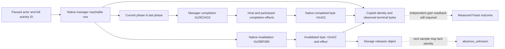

# Hosted Feast identity and terminal sources in CK3 1.20.0.2

The existing `ReadActivityHostedIdentityV1` and
`ReadActivityFeastResourceBalancesV1` production readers now select the
1.20.0.2 layout by the admitted executable SHA-256 while retaining their
1.19.0.6 profile. The new profile is **static-ready**, with copied-memory
production-reader fixtures. This work did not query, attach to, start, stop,
or send input to CK3. It does not qualify a live Feast lifecycle or a benefit.

The exact executable is CK3 1.20.0.2 Crozier, Steam build 25588574,
101,039,736 bytes, SHA-256
`AE1BA6FF060BA603842F6F4A2DED0AF4B7D3666B3DD271F75FB01B0DA8E81B2D`.
The checked source map is
[`ck3_12002_activity_hosted_abi.json`](../../ck3_autonomous_player/native_bridge/research/ck3_12002_activity_hosted_abi.json).
The historical profile and earlier creation-only boundary remain documented in
[`activity-hosted-identity-readback-1.19.0.6.md`](activity-hosted-identity-readback-1.19.0.6.md).

## Native manager and copied identity

`CGameData` construction at `0x2ADD8EE` selects its activity manager at
`+0x22CB8`, reached through the game-state pointer at RVA `0x5C68C50` and
game state `+0xA0`. The manager's storage retains the existing layout:
initialized byte `+0x10`, chunk pointer `+0x20`, chunk count `+0x2C`,
index-table pointer `+0x38`, capacity `+0x44`, highest live index `+0x50`,
and active count `+0x54`. Activity slots have changed from `0x5F0` to
**`0x628`** bytes; `0x29C2E97` advances by that stride and the chunk allocator
allocates `0x18A000` bytes for 1024 slots.

The activity primary vtable is RVA `0x472E130`, verified by its
`CActivity` RTTI and constructors. The payload copy at `0x23F0185..0x23F019C`
still stores type pointer `+0x3A0` and host's complete CharacterID `+0x3A8`.
The activity ID is `uint32 +0x08`; low 24 bits select a slot and high 8 bits
identify its generation. `CActivityType` has primary vtable RVA `0x48BFE50`
and a copied stable-key string at `+0x18`.

The reader uses the existing application-main paused frame and resolves the
actor through the 1.20 character storage at RVA `0x5C67568`, fallback slot
`0x5C67570`, and full CharacterID equality at character `+0x18`. It does
not read the obsolete 1.19 UI-selected CharacterID global. Every non-null
index row must match its exact chunk slot and low-ID index; the total is
checked against the native active count. Only copied IDs, type keys, host IDs,
and terminal flags leave this call. Manager and frame re-sampling retain the
existing reader contract.

## Completion, invalidation, and absence

The native final-phase check at `0x29BFAA2` compares current phase `+0x3E0`
with phase count `+0x3D4` minus one. Its completed-phase branch calls manager
`0x29C0410`, which calls activity completion `0x23F69A0`. The completion
routine runs the phase end/type completion effects for the host and
participants through `0x23F6D90`; the type completion effect is at
type `+0x8E0`. Only after these callbacks return does `0x23F6D5B` set
**activity `+0x421 = 1`** and copy the completion time at `+0x408`.

Invalidation has a separate path. `0x29BF680` checks and sets
**activity `+0x422 = 1`**, invokes the type invalidation effect at `+0x520`,
cleans participant state, and calls storage release `0x29C28E0`. A normal
later paused sample may therefore have no object left from which to copy the
invalidation flag. This reader cannot reconstruct an invalidation after its
object has been released.

The copied row adds three fields for the new profile:

| Field | Meaning |
| --- | --- |
| `terminal_flags_observed` | Both native bytes were copied from this manager-reachable full activity ID. |
| `native_completed` | Native `+0x421` was set. The completion callback returned. |
| `native_invalidated` | Native `+0x422` was set. This is distinct from completion. |

Legacy rows keep these fields false and do not claim terminal observation.
A missing activity ID is **`absence_unknown`**. It proves neither completion
nor invalidation. The creation receipt must retain the complete activity ID,
type, and host before following these fields across later observations.



The stock `_activity_type.info` describes `on_complete` as effects run after
the last phase and limits completed AI-only activities to one extra day of
persistence. `feast.txt` has a separate host conclusion branch that queues
`feast.7101` and invokes `disburse_feast_activity_rewards`; the normal and
murder-feast reward branches differ. `window_activity.gui` uses
`Activity.IsComplete` to show the conclusion view. These source facts explain
why creation, native completion, a queued conclusion event, and measured
prestige/opinion rewards are separate observations. The reader exposes no
general religion data or policy.

## Resource balances and useful scope

The four existing Feast cost slots are `gold`, `treasury`, `piety`, and
`barter_goods`, all signed Q100000. The new character resource extension is
`Character +0x1B0`, with gold at extension `+0x100` and piety at `+0x110`.
The gold source is copied by `0xC86121/0xC86146`; the piety getter at
`0x28BE010` follows that extension and stores the `+0x110` value into its
output argument. The existing double-sample balance reader now selects this
layout and preserves its field availability vector
`[true, false, true, false]`.

Treasury and barter balances remain unavailable here. A zero-cost slot does
not require a balance; a nonzero treasury/barter cost still requires its own
native balance source before affordability can be claimed. No positive
balance or terminal result is substituted for an unavailable value. This
bounded implementation serves the existing ordinary Feast path without
expanding into other activity types or government adapters.

## Reproduction and current evidence

The file-only verifier checks 17 instruction anchors, both RTTI vtables,
and hashes of the three stock sources. From a repository root:

```console
python ck3_autonomous_player/native_bridge/research/verify_ck3_12002_activity_hosted.py --game-root <frozen-installation> --output <artifact-dir>/abi-verification.json
python ck3_autonomous_player/native_bridge/research/run_ck3_12002_activity_hosted_tests.py --build-root <artifact-dir>/build
```

MSVC `/W4 /WX` passed both `/Od` and `/O2`: eight new-profile fixture cases
and the five historical-profile regression cases per configuration. The new
cases cover copied identity/terminal flags, stale activity and actor IDs,
observed empty host sets, changed frames, completion versus invalidation,
and actual gold/piety source fields. Artifacts for this work are under
`artifacts/g2-offline-2026-10-01/feast/hosted/`, including
`abi-verification.json` and `build/result.json`.

Remaining live work is a paused snapshot of the real manager and balances,
then a legitimate Start and later observation of the retained completed ID,
its next-turn/cold-restore consumer, and an independent useful reward. G2 M6
is not complete from this file-only evidence.
