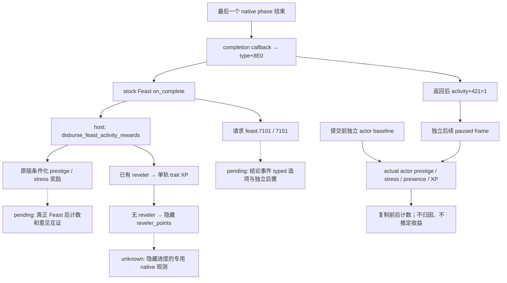

# CK3 1.20.0.2：Feast 参与者实际计数观测

2026-10-01 后台迁移，资格为 **`static-ready`**。本包从冻结 EXE 与原版脚本闭合玩家 prestige、stress 和已有 `lifestyle_reveler` 特质 XP 的只读来源，并运行实际 reader → 实际生产 C++ serializer 的离线夹具。没有读取、注入、占用或操作本地 CK3；这些结果不能记为实机 Feast 收益、M6 完成或 G2 增量。

冻结版本是 **1.20.0.2 Crozier / Steam25588574**，EXE SHA-256 **AE1BA6FF060BA603842F6F4A2DED0AF4B7D3666B3DD271F75FB01B0DA8E81B2D**，磁盘来源为 `artifacts/migrations/2026-09-30/post-update-1.20.0.2/installation`。机器账本见 [counter ABI](../../ck3_autonomous_player/native_bridge/research/ck3_12002_feast_outcome_values_abi.json)，生命周期终态来源沿用 [hosted lifecycle](ck3-1.20.0.2-feast-hosted-lifecycle.md)，trait/XP 复用 [新版 phase-character 叶子](ck3-1.20.0.2-phase-character.md)。

## 原版收益入口

同一冻结安装的 `game/common/activities/activity_types/feast.txt:4992` 定义 `on_complete`。普通 Feast 的 host 分支在 `5013` 请求 `feast.7101` 结论事件，并在 `5014` 调用 `disburse_feast_activity_rewards`；guest 分支在 `5127` 调用 `disburse_feast_reveler_rewards`，随后请求 `feast.7151`。这条脚本链说明实际收益应观测哪些输入，不证明某一帧已发生收益。

`game/common/scripted_effects/00_activity_effects.txt:3052` 是 host 奖励定义。课程、菜品、court amenities 和参与者条件选择不同意见/威望奖励，prestige 分支可见于 `3294/3355/3422` 附近；`3749` 请求 reveler 奖励，`3773–3844` 根据 food/traits 请求 `stress_and_fulfillment_impact`。本包保留实际计数，不提前计算固定净收益或把 activity log 字段当已写入角色的钱包。

该文件 `4169–4238` 的 reveler 奖励先判断已有 `lifestyle_reveler`，课程/菜品决定加 `15/10/5` XP。尚无该特质的分支调用 `reveler_points_gain_effect`；它使用独立隐藏进度变量，不能由 trait XP 的零或缺失重建。原版 `game/common/traits/00_traits.txt:1063/1076` 给 `lifestyle_reveler` 定义一个 unnamed track，因此可复用现有空 track key 的单轨读口。



`+421` 证明 native completion callback 已返回；它与收益计数、结论事件是否应用、某人的好感改变分别观测。`+422` 是另一条 invalidation 分支，manager 中找不到旧 full ActivityID 仍是 `absence_unknown`，详见 hosted 专题。前后计数变化可能同时包含其他游戏事件，本包不把变化归因于 Feast。

## 1.20 实际角色字段

| 值 | actual exact-build 来源 | 输出与合法零 |
| --- | --- | --- |
| prestige | leaf `0x28BE040` 读 `Character+0x1B0 → extension+0x130`；最终 affordability 的 prestige ordinal 1 在 `0x310E820/0x310E82C` 独立读取相同字段 | signed int64，Q100000；native extension 空时 getter 写零 |
| stress | leaf `0x28BC580` 读 `Character+0x1B0 → extension+0x2F8` | signed int32，**普通整数点数**；extension 空时 EAX 为零 |
| stress 单位互证 | `0x28BC6C0` 从相同字段 `movsxd`，`0x28BC6C7` 乘 `100000` 后调用 native stress level converter | 不能把原字段再次除以 `100000` |
| reveler presence | `0x89E5B0` trait database，定义表 `+0x50/+0x5C` 唯一解析 `lifestyle_reveler`，`0x28BB1F0` native HasTrait | 可用 `false` 与无法读取的 `null` 区分 |
| reveler XP | `0x28BB0F0` 返回 `{int64* data, int32 count}`；count 在 **`+0x08`**，不是 `+0x0C`；定义 `+0x29C == 1` 时读取唯一 unnamed track | signed int64，Q100000；只有已知 trait 存在且原生读口成功才输出值 |

角色从新 CharacterStorage `0x5C67568` 解析 full-generation CharacterID，检查 storage slot 与角色 `+0x18`；前后再核对同一 actor、resource extension 和同一 paused owning-thread frame。没有沿用旧 `Character+0x1A8` resource component 或旧 UI-selected ID 全局。

## Provider 与现有私有 wire

[ck3_12002_feast_outcome_values.hpp](../../ck3_autonomous_player/native_bridge/include/xar_bridge/ck3_12002_feast_outcome_values.hpp) 定义 `xar::bridge::FeastOutcomeValuesV1` 和 `ReadFeastOutcomeValues12002(FeastOutcomeEnvironmentV1, expected_frame)`，对应 [实际实现](../../ck3_autonomous_player/native_bridge/src/ck3_12002_feast_outcome_values.cpp)。trait 读口默认绑定已有 1.20 leaf，也允许 fixture/SEH owner 注入相同 native callback。

玩家 prestige/stress 可在 trait database 或定义无法读取时独立保持可用。已知无 reveler 时是 `reveler_available=true / reveler_present=false / reveler_xp_available=false`，因此 XP 为 `null`；未发现 trait 的隐藏 progress 没有被伪造为 XP 零。已有 trait 但 native span 为空时，现有原生叶子所表示的合法零 XP 保持可观测。

父工作包把该 DTO 放入同一 Stage5 inputs baseline 和独立 `hosted_post`，复用既有 schema 中可选的 `outcome_values`：

```json
{"prestige_raw":9500000,"stress_points":28,"reveler_present":true,"reveler_xp_raw":7000000}
```

四项均为实际 availability 控制的 typed value/null；如果没有任何实际值，则省略该对象。baseline 是提交前读到的计数；后续 post 是另一个被核验的 frame。父包的 [durable lifecycle](ck3-1.20.0.2-feast-durable-lifecycle.md) 保留 baseline 和 explicit terminal 后置，不以 command ACK、仅新活动 ID、manager absence 或计数差自动宣称 Feast 获益。

## 离线验证与材料

`verify_ck3_12002_feast_outcome_values.py` 已从磁盘通过 **6 项新 counter anchors、9 项已复用 trait anchors、3 份 stock 文件哈希**。回执为 `artifacts/g2-offline-2026-10-01/feast/hosted/outcome-abi-verification.json`。

MSVC `/W4 /WX` 的 Debug `/Od` 与 Release `/O2` 均通过 **8 项**原生 fixture：prestige/stress/XP 实际来源、trait 缺失的 null、独立前后值、trait 数据缺失时可用计数、native null-extension 合法零、actor/frame readback、旧 profile 不准入，以及 actual provider → production serializer 的连续 trace。正式回执为 `artifacts/g2-offline-2026-10-01/feast/hosted/outcome-wire-build-canonical-indices/result.json`；之前纯 counter 7 项回执保留为历史初始覆盖。

actual serializer 源来自父包 `parent-wire-counters/production-serializer.cpp`，是当前 `SerializeActivityFeastStage5PrivateV1` 与 helper 的实际 C++ 提取；SHA-256 `919bcdb73a821f5acc48f0bf9115a6038830e5efe685fd23750e69fea00a6129`。夹具读 actor/hosted/balances 的生产 reader 后，复制 DTO 再调用该生产 serializer。它没有调用 Stage5 planner；baseline 的 cost/CanStart/guest metadata 只是 wrapper fixture 数据，不能用于声称 Stage5 native preview 已验。

可提交的 [wire trace](../../ck3_autonomous_player/native_bridge/research/fixtures/ck3_12002_feast_outcome_values_wire.json)，SHA-256 `32f9a6efcb07a0f173f0518c763ce91f327e49bbf774e73ff5afa027f12fb780`，为四项 actual `hosted_post`：

| row | 实际内存夹具状态 | copied 计数 |
| --- | --- | --- |
| 0 ongoing_before | full ActivityID `33554437`、host `29829`、`+421=0/+422=0` | prestige `-500000`、stress `48`、presence `true`、XP `6500000` |
| 1 completed_after | 同一 fullID 保留，`+421=1/+422=0` | prestige `9500000`、stress `28`、presence `true`、XP `7000000` |
| 2 nonreveler_ongoing | 当前 fixture branch 设为未完成、已知 trait 不存在 | prestige `9500000`、stress `28`、presence `false`、XP `null` |
| 3 released | manager 当前观测为空；没有伪造 completed/invalidated row | 仍独立读同一 actor 的实际计数 |

row 2 是单独 trait-absence 分支样本，不表示真实完成后倒回 ongoing；row 3 证明 identity absence 与当前 actor 计数是两件事。Debug/Release wire 字节相同。[preStart baseline](../../ck3_autonomous_player/native_bridge/research/fixtures/ck3_12002_feast_outcome_values_wire_baseline.json) SHA-256 为 `144592aaa8a20ab12b2c09a14330302e3a36ca5d5bb8873869685e3b8a9770f9`。

复现 counter ABI：

```cmd
tools\.venv\Scripts\python.exe ck3_autonomous_player\native_bridge\research\verify_ck3_12002_feast_outcome_values.py --game-root artifacts\migrations\2026-09-30\post-update-1.20.0.2\installation
```

复现 actual reader/wire 夹具时，`run_ck3_12002_feast_outcome_tests.py --build-root <output> --serializer-source <production-serializer.cpp> --wire-fixture ck3_autonomous_player\native_bridge\research\fixtures\ck3_12002_feast_outcome_values_wire.json`。serializer 源可由现有 `run_ck3_12002_feast_wire_test.py --build-dir <wire-output>` 从当前生产实现提取，或直接复用以上冻结材料。

剩余必要工作是中央新版 DLL 联编/现有私有 transport 接线，然后在获准的真实 paused 帧核对 actor 计数、实际 Feast complete、独立意见或计数收益、后继 turn 与规定 cold 恢复。queued conclusion 的 typed handling 及无 trait 时的隐藏 reveler_points 保持明确缺口；本包不扩张通用活动、宗教域或其他政府资源研究。
