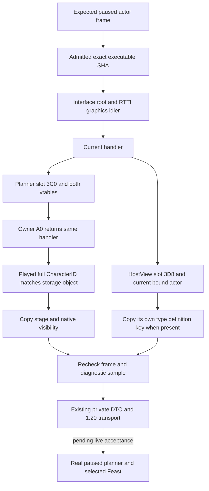

# CK3 1.20.0.2 Feast planner identity

Status: `static-ready`. This migration reads the frozen on-disk image and
caller-owned test memory. It has not queried, injected, launched, paused,
closed or restarted local CK3. It does not qualify a Feast Start or completion.

The exact executable is CK3 `1.20.0.2`, Steam build `25588574`, SHA-256
`AE1BA6FF060BA603842F6F4A2DED0AF4B7D3666B3DD271F75FB01B0DA8E81B2D`.
The existing `ActivityPlannerDiagEnvironmentV1`, copied diagnostic DTO and
Stage1/Stage2 DTOs remain the protocol contract. The diagnostic now selects
one of two explicit ABI profiles by admitted SHA; the 1.19.0.6 profile remains.

## Native ownership and copied values

| Source | 1.20.0.2 evidence | Published meaning |
| --- | --- | --- |
| Global interface root | `0x5C6A520`, idler `+0x10`; RTTI source/target descriptors `0x5514438` / `0x5514460` | Current graphics idler |
| Idler and handler | Vtables `0x44BC408` / `0x44BA890`; idler handler `+0x88` | Current interface handler |
| Planner install | `0xB0AB39` calls constructor `0x11B2810`; `0xB0AB48` stores handler `+0x3C0` | Current planner; this slot is unchanged |
| HostView install | `0xB0AEF1` installs HostView primary vtable; `0xB0AF25` stores handler `+0x3D8` | Current HostView; this slot is unchanged |
| Planner vtables | Primary `0x45325C8`, secondary `0x45326A0`, secondary object offset `+0x10` | `CActivityPlanner` identity |
| Planner owner | Constructor write at `0x11B2885`, planner `+0xA0` | Handler round trip |
| Widget and stage | Native visibility `0x21603A0` reads widget `+0x60`; `0x11B8693` reads stage `+0x1AE8` | Attached/visible and current planning stage |
| Selected type | Getter `0x11B64C0` reads planner `+0x1500` | Operation-local selected activity type |
| HostView identity | Vtables `0x457A138` / `0x457A110`; owner `+0xA0`; character scope starts `+0xC8`, bound ID `+0xD0` | HostView belongs to the current actor |
| HostView type | Constructor write `0xB0AF0D` and getter `0x1643A70`, type pointer `+0x238` | HostView's own current type |
| Type stable key | `CActivityType` vtable `0x48BFE50`; constructor `0x3110394` initializes MSVC string `+0x18`, capacity write at `0x31103B2` | Copied definition key, including `activity_feast` |

The HostView's current type can be absent or belong to an earlier actor even
when the planner exists. That produces an absent HostView key; it does not
invent a Feast key from the planner or treat an older activity as the current
configuration. Actions separately verify the selected planner type.

`ResolveActivityPlannerIdentityV1` refreshes the same native identity for each
operation and returns actor, handler, planner, selected type and stage only
inside the callback. The existing diagnostic serializer persists copied
booleans, stage and definition key; it never serializes these addresses.

## Verification and migration correction

`research/verify_ck3_12002_feast_planner_identity.py` checked 23 exact bytes,
vtable targets and RTTI complete-object-locator identities against the frozen
EXE. Receipt:
`artifacts/g2-offline-2026-10-01/feast/planner/planner-identity-abi-proof.json`.

The final production diagnostic and identity resolver fixtures passed MSVC
`/Od`, `/O2`, `/W4 /WX` for both supported versions, four executions in total.
Receipt:
`artifacts/g2-offline-2026-10-01/feast/planner/diag-final-fixtures/result.json`.
The runner is
`research/run_ck3_12002_feast_planner_diag_tests.py`; it runs fixture executables
without a game executable argument or native process connection.

During migration an unrelated window ID was initially interpreted as the
planner/HostView slot. Constructor stores proved that `+0x3C0` and `+0x3D8`
remain unchanged. The earlier `diag-fixtures/` mock result used that incorrect
layout and is retained only as a superseded attempt. The final result above
uses the actual constructor-derived slots. A passing mock alone did not prove
the image layout.

The [Open/Stage1 topic](ck3-1.20.0.2-feast-stage1-open.md) records the actual
typed event `0x65` producer and the new option's script-ID parser. Option `+8`
stores the resolved script ID; new `+0x18` stores a row ordinal. These meanings
are distinct and were recovered from the native parser, not inferred from a
fixture. Its 39 exact byte/pointer proofs and six new/legacy executions passed.

The [Stage2 location/confirm topic](ck3-1.20.0.2-feast-stage2-location-confirm.md)
records its separate fields, final gate and bounded transition proofs. New
private transports receive the new adapter's snapshot callback and script-ID
resolver; they reuse old DTO serializers while never reading the inherited
1.19 `Bindings`. Real paused reads, Start, payment, hosted identity, subsequent
date and terminal Feast outcome still require live acceptance.
