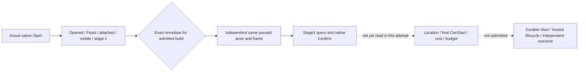

# Feast planner Open: actual 1.20 envelope compatibility

The first R10 qualification attempt ran on 2026-10-01 at 15:42 UTC, PID 107976,
actor 29829, native revision 97, date raw 53170080. It used the frozen
1.20.0.2 EXE SHA-256
`AE1BA6FF060BA603842F6F4A2DED0AF4B7D3666B3DD271F75FB01B0DA8E81B2D`.

The actual native Open succeeded: `ok=true`, `accepted=true`, `open_status=opened`,
`native_dispatch_invoked=true`, selected Feast verified, widget attached and
visible, planning stage 1. The existing Python helper independently observed the
same paused actor/date/snapshot before and after. Its strict legacy envelope check
nevertheless returned `StepPostconditionError: private feast planner open RED:
opened`, because the new production envelope omits the legacy `same_frame` key.
Qualification stopped at Open; it did not query final CanStart or cost, and did
not submit Start. This is a consumer compatibility failure, not a native
eligibility or affordability failure.

The production `_open_private_activity_feast_planner_once` now accepts the actual
eight-key envelope for that exact EXE identity while retaining the legacy
`same_frame=true` shape. The native payload checks and the independent current
before/after frame check remain unchanged. No DLL change or additional action
flag is required.

One file-only reproduction feeds the unchanged actual command result through the
existing production leaf and now returns `gui_open_observed` with independent
`same_frame=true`. The fixture supplies the admitted exact-build hello identity
that `_compact_binding` normally reads from capabilities; the public captured
source frame intentionally omits that field. Its first attempt lacked that
private identity and was a fixture RED, retained in the reproduction receipt.
This correction has not yet been run in the new R11 managed session.

Frozen actual evidence remains under
`Z:\ck3_mod_rewrite\artifacts\g2-offline-2026-10-01\m6-feast-live-next\typed-phases`:

- `phase-001-begin-result.json`: actual failed consumer attempt and native receipt;
  SHA-256 `2fc5e4f035dccf6725334ea5e8aaf17efb9bcc9b30ebbc11a783559c893d20da`.
- `run-20261001T154210051533Z-qualify.json`: full original qualification report;
  no history or original packet was rewritten.
- `wire-20261001T154210051533Z-sent.json` and corresponding received JSON:
  actual production request and command result.

The external root helper now prints a compact status and the full artifact path,
rather than dumping snapshots and restored command history. It can continue
Stage1 from the retained actual Open report without dispatching Open again. That
continuation still queries and validates the current native Stage1; the retained
Open receipt does not imply current CanStart, guest acceptance or completion.

See [planner migration](ck3-1.20.0.2-feast-stage1-open.md),
[formal lifecycle](ck3-1.20.0.2-feast-durable-lifecycle.md), and the external
`m6-feast-live-next/actual-open-wire-reproduction.json` and
`compact-stdout-check.json` for the focused checks. The broader Feast lifecycle
remains incomplete until actual Start, terminal, independent outcomes, next turn
and cold restore are observed.
