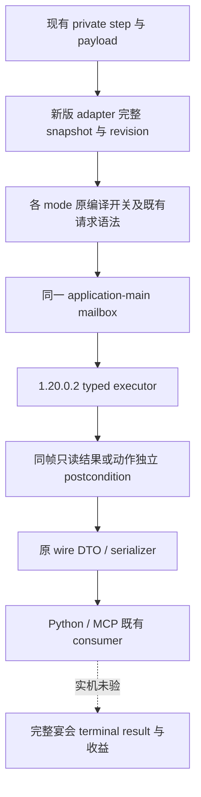

# 1.20.0.2 宴会私有请求接线

本轮只做后台源码迁移与离线 caller fixture，不连接、注入、查询或操作本地 CK3。游戏版本为 `1.20.0.2 Crozier`，EXE SHA-256 为 `AE1BA6FF060BA603842F6F4A2DED0AF4B7D3666B3DD271F75FB01B0DA8E81B2D`。原生字段、最终判定与动作的研究输入见本轮宴会 planner、guest、cost、Start 的独立专题；本文记录它们如何进入现有私有 wire 请求。

`native_bridge/src/ck3_12002_activity_feast_router.{hpp,cpp}` 提供 `IsActivityFeastPrivateStep12002` 和 `HandleActivityFeastPrivate12002`。协调线程将所选新版 `GameAdapter`、已发布完整 snapshot、revision 和同一个 application-main mailbox 传入。每个 query 的 snapshot 回调都调用该 adapter；新版 query 不读取继承 DTO 中的旧版 `Bindings`，router 不调用旧版 `BindCurrentProcess`。

| 请求组 | 新版 executor | wire 结果 key |
|---|---|---|
| planner 诊断 | `ExecuteActivityPlannerDiagPrivate12002QueryV1` | `activity_planner_diag` |
| 打开宴会 planner | `ExecuteActivityFeastPlannerOpenPrivate12002V1` | `activity_feast_planner_open` |
| Stage 1 选项、确认；Stage 2 选项、gate、location | `ExecuteActivityStage1OptionReadPrivate12002V1` | `activity_stage1_option`、`activity_stage1_confirm`、`activity_stage2_option`、`activity_stage2_gate`、`activity_stage2_location` |
| Stage 2 目的地选择 | `ExecuteActivityStage2DestinationSelectPrivate12002V1` | `activity_stage2_destination_select` |
| Stage 2 确认 | `ExecuteActivityStage2ConfirmPrivate12002V1` | `activity_stage2_confirm` |
| Stage 5 最终 CanStart | `ExecuteActivityStage5CanStartPrivate12002V1` | `activity_stage5_canstart` |
| Gold、四种资源最终费用 | 新版 `ExecuteActivityStage5GoldCostPrivateV1`、`ExecuteActivityStage5FeastFullCostPrivateV1` | `activity_stage5_gold_cost`、`activity_stage5_feast_full_cost` |
| Stage 5 Start 输入、typed Start、hosted post | `ExecuteActivityFeastStage5Private12002V1` | `activity_feast_stage5_start_inputs`、`activity_feast_stage5_start`、`activity_feast_hosted_post` |
| guest 候选、指定目标、route proof | 新版 `ExecuteActivityFeastGuestCandidatePrivateV1` | `activity_feast_guest_candidate`、`activity_feast_guest_target`、`activity_feast_guest_route_proof` |
| guest opinion | 新版 `ExecuteActivityFeastGuestOpinionPrivateV1` | `activity_feast_guest_opinion` |
| guest rule 读取、启用、provenance | 新版 `ExecuteActivityFeastGuestRulePrivateV1` | `activity_feast_guest_rule`、`activity_feast_guest_rule_provenance` |
| normal slot12 原始缓存 | 直接读取已有 passive observer 的拷贝 | `activity_cost_slot12_raw` |

原有步骤名与私有编译开关保持不变。Stage 1 确认、Stage 2 选项、gate、location 各自保留独立开关；仅打开 Stage 1 reader 不会同时开放这些动作。新 `confirm-activity-feast-stage2-v1-private` 使用现有 Stage 2 destination 私有开关和独立 mailbox executor。默认发布树仍不宣告这些私有能力。

请求解析复用既有 `JsonUnsignedField`、`JsonStringField`、`JsonBooleanField` 和 Stage 2 candidate-ID parser。要求的 actor、date、planning stage、activity/option key、reserve 与原请求契约一致。进入 mailbox 前重新读取所选 adapter 的 snapshot；executor 完成后，只读结果再次核对同帧。Start 调用已发生时保留 `submitted` 和 `submission_outcome_unknown`，不得因 reclaim 失败把已发生的动作报告成未提交。Start ACK 与 hosted identity 都不表示宴会已完成。

ScriptIdentifier 名称回调复用已经迁移的 campaign/pending/feature 同一 `ScriptIdentifier::GetName` 来源 `0x3F4F900`，不读取旧表地址。费用来自正常刷新后已有的 `ActivityCostSlot12ObserverV1`；router 不主动触发重新计价、planning progression 或 Start。新版 raw 诊断明确记录 `normal_slot12_return_0x11B5B5F`。冷帧尚无正常刷新时报告不可用，不能用零费用或 net income 替代 configured cost。

离线编译 artifact：`Z:\ck3_mod_rewrite\artifacts\g2-offline-2026-10-01\feast\router\build`。默认开关全 OFF 与全部宴会私有开关 ON 的两个 object target，均以 MSVC `19.51.36257.0`、`/O2 /W4 /WX` 编译通过。

`src/ck3_12002_activity_feast_router_test.cpp` 把真实 production router、真实 main-thread mailbox、线程 profile 和 protocol 连到 fixture-owned native memory；CanStart/Start typed executor 与内部 DTO serializer 明确使用 fixture。`/Od`、`/O2` 两种 `/W4 /WX` 编译及执行均 GREEN，共执行 4 个请求，mailbox failure flags 为 0。覆盖同一 adapter 的完整快照回调、owner dispatch/reclaim、domain-unavailable 诊断转发、请求语法、四种 reserve 顺序、Start pending 与独立 hosted-post 路由。结果及 source/binary hash 在 `Z:\ck3_mod_rewrite\artifacts\g2-offline-2026-10-01\feast\router-tests\result.json`。测试只开放 CanStart 与 Stage 5 Start 两个私有开关，同时核对未开放的 Gold 路由不能匹配。

这些证据只证明静态接线与 fixture 语义，不升级为 paused snapshot、原生 gameplay executor 资格、生产 OODA 或 M6 complete。后续实机需要同一新版候选 DLL 的自然 planner/guest/cost snapshot、typed Start 与 terminal result，但本轮不占用游戏。
