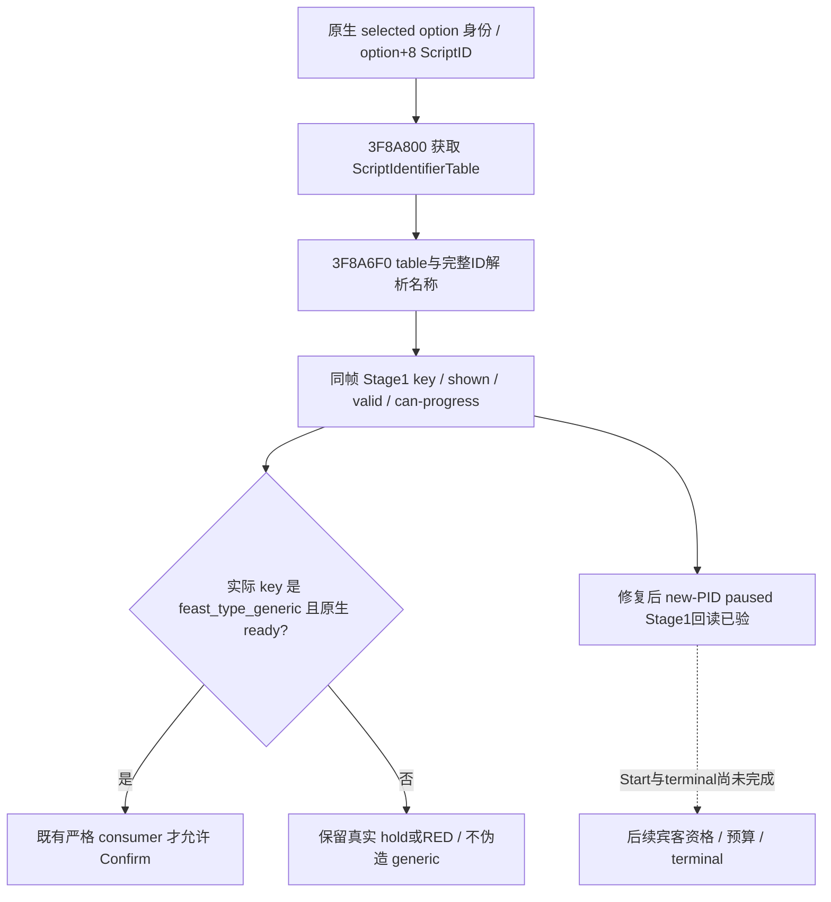
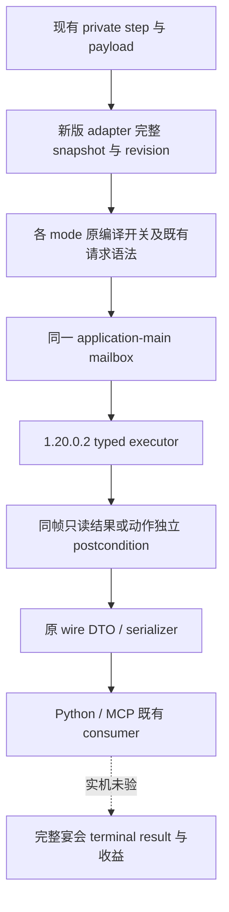

# 1.20.0.2 宴会私有请求接线

本轮只做后台源码迁移与离线 caller fixture，不连接、注入、查询或操作本地 CK3。游戏版本为 `1.20.0.2 Crozier`，EXE SHA-256 为 `AE1BA6FF060BA603842F6F4A2DED0AF4B7D3666B3DD271F75FB01B0DA8E81B2D`。原生字段、最终判定与动作的研究输入见本轮宴会 planner、guest、cost、Start 的独立专题；本文记录它们如何进入现有私有 wire 请求。

`native_bridge/src/ck3_12002_activity_feast_router.{hpp,cpp}` 提供 `IsActivityFeastPrivateStep12002` 和 `HandleActivityFeastPrivate12002`。协调线程将所选新版 `GameAdapter`、已发布完整 snapshot、revision 和同一个 application-main mailbox 传入。每个 query 的 snapshot 回调都调用该 adapter；新版 query 不读取继承 DTO 中的旧版 `Bindings`，router 不调用旧版 `BindCurrentProcess`。

| 请求组 | 新版 executor | wire 结果 key |
|---|---|---|
| planner 诊断 | `ExecuteActivityPlannerDiagPrivate12002QueryV1` | `activity_planner_diag` |
| 打开宴会 planner | `ExecuteActivityFeastPlannerOpenPrivate12002V1` | `activity_feast_planner_open` |
| Stage 1 选项、确认；Stage 2 选项、gate、location | `ExecuteActivityStage1OptionReadPrivate12002V1` | `activity_stage1_option`、`activity_stage1_confirm`、`activity_stage2_option`、`activity_stage2_gate`、`activity_stage2_location` |
| Stage 2 目的地选择 | `ExecuteActivityStage2DestinationSelectPrivate12002V1` | `activity_stage2_destination_select` |
| Stage 2 确认 | `ExecuteActivityStage2ConfirmPrivate12002V1` | `activity_stage2_confirm` |
| Stage 5 最终 CanStart | `ExecuteActivityStage5CanStartPrivate12002V1` | `activity_stage5_canstart` |
| Gold、四种资源最终费用 | 新版 `ExecuteActivityStage5GoldCostPrivateV1`、`ExecuteActivityStage5FeastFullCostPrivateV1` | `activity_stage5_gold_cost`、`activity_stage5_feast_full_cost` |
| Stage 5 Start 输入、typed Start、hosted post | `ExecuteActivityFeastStage5Private12002V1` | `activity_feast_stage5_start_inputs`、`activity_feast_stage5_start`、`activity_feast_hosted_post` |
| guest 候选、指定目标、route proof | 新版 `ExecuteActivityFeastGuestCandidatePrivateV1` | `activity_feast_guest_candidate`、`activity_feast_guest_target`、`activity_feast_guest_route_proof` |
| guest opinion | 新版 `ExecuteActivityFeastGuestOpinionPrivateV1` | `activity_feast_guest_opinion` |
| guest rule 读取、启用、provenance | 新版 `ExecuteActivityFeastGuestRulePrivateV1` | `activity_feast_guest_rule`、`activity_feast_guest_rule_provenance` |
| normal slot12 原始缓存 | 直接读取已有 passive observer 的拷贝 | `activity_cost_slot12_raw` |

原有步骤名与私有编译开关保持不变。Stage 1 确认、Stage 2 选项、gate、location 各自保留独立开关；仅打开 Stage 1 reader 不会同时开放这些动作。新 `confirm-activity-feast-stage2-v1-private` 使用现有 Stage 2 destination 私有开关和独立 mailbox executor。默认发布树仍不宣告这些私有能力。

请求解析复用既有 `JsonUnsignedField`、`JsonStringField`、`JsonBooleanField` 和 Stage 2 candidate-ID parser。要求的 actor、date、planning stage、activity/option key、reserve 与原请求契约一致。进入 mailbox 前重新读取所选 adapter 的 snapshot；executor 完成后，只读结果再次核对同帧。Start 调用已发生时保留 `submitted` 和 `submission_outcome_unknown`，不得因 reclaim 失败把已发生的动作报告成未提交。Start ACK 与 hosted identity 都不表示宴会已完成。

ScriptIdentifier 名称回调必须使用该 ID 所属的 ScriptIdentifierTable：先调用 `0x3F8A800()`，再调用 `0x3F8A6F0(table, ID)`。原迁移接线曾误用 campaign 的 `0x3F4F900(ID)`；它解析的是 generic type 名称域，不能用于 option+8 的 ScriptID。2026-10-02 的真实 Stage1 RED 与修复证据见下节。费用来自正常刷新后已有的 `ActivityCostSlot12ObserverV1`；router 不主动触发重新计价、planning progression 或 Start。新版 raw 诊断明确记录 `normal_slot12_return_0x11B5B5F`。冷帧尚无正常刷新时报告不可用，不能用零费用或 net income 替代 configured cost。

## 2026-10-02：1.20.0.3 Stage1 实机 RED 与最小修复

本次目标是 CK3 `1.20.0.3 Crozier`、Steam build `25652598`，EXE SHA-256
`94B55397ABB687A3DCD436805A5D885E6BE90FA6C693FEB44A9E3BBEEADE02A6`。
真实 G2 场景的 typed Open 已通过：actor `29829`、raw `53172768`，原生
dispatch 已调用，Feast 已选中、widget attached/visible、stage `1`。随后
Stage1 查询的原生 envelope 为 `ok=true / accepted=true / available`，同一
paused actor/date/native revision `283`，但 `selected_option_key=cisalpine_opinion`，
shown/valid/can-progress 均为 true，`generic_feast_confirm_ready=false`。
Python 按既有 `feast_type_generic` 合同拒绝，报告 `invalid_native_readback`；没有
Confirm 或 Start。root 约六分钟后只读重查仍得到相同错误 key，排除了初次 UI
尚未稳定的解释；失败与重查均保留。root 随后正式保存并停止旧 PID，最新基线
为 h395/raw `53172768`。当时本次修复后的 new-PID paused 验收尚待执行；
随后 v4 的实际验收见下节。

确切 PE 证明定位到本 router 的名称域混用，而不是 option offset 或原版定义：

| 原生证据 | exact .3 RVA 与含义 |
|---|---|
| option ScriptID 生产 | `284ACAA` 调 `3F8A800`；`284ACBC` 查询 `3F8A4B0(table, out ID, name)`；`284ACCF` 写入 option+8 |
| 游戏自己的 option 名称读取 | `3110168` 读 `[rdx+8]`；`311016B` 调 `3F8A800`；`3110175` 调 `3F8A6F0(table, ID)` |
| 另一 option 名称调用者 | `3115A0F` 读 `[rcx+8]`；`3115A12` 调 `3F8A800`；`3115A1C` 调 `3F8A6F0(table, ID)` |
| 正确名称域 | `3F8A6F0` 使用 table 参数，取 ID 低 24 位并在 table 字符串数组中解析 |
| 误用名称域 | `3F4F900` 只收一个 ID，索引 global generic type registry；既有 event header 已把两个域分别命名 |

十个相关 bounded PE 块与冻结 `.2` 字节一致；option+8 和既有 ABI 无需调整。
当前 `.3` 原版 `common/activities/activity_types/feast.txt` 仍定义默认
`feast_type_generic`；activity 文件中没有 `cisalpine_opinion`。原版默认值不
替代当前原生选中状态，修复后仍须 fresh read 证明真正的 key。

最小源修改只涉及 `ck3_12002_activity_feast_router.cpp` 的本地 callback：复用
既有 event header 的 `EventGetRegistry` / `EventResolveIdentifierName` 和上述
table/name 两入口，保留 reviewed-build、SEH、key 长度检查及同帧 mailbox 调用链。
不修改 campaign 全局 resolver、option 成员、Python generic 判断、DTO、动作或
`61 ON / 4 OFF` 编译配置。修复后源文件 SHA-256 为
`d75972214297fc8a9478263e7aedf6e25ef4b810b4aabae3295c1f61b956175f`。

证据位于
`artifacts/g2-maintainer-2026-10-02/resume-12003/m6-feast/`：
`stage1-native-review/READOUT.md`、`exact-12003-name-disassembly.json/.txt`；
`attempt02/live/typed-phases/run-20261001T201001563479Z-stage1.json`；
`stage1-requery-01/{result,sent,received}.json`；
`stage1-identifier-source-fix.json` 记录唯一源文件 before/after SHA。
本项不增加镜像常量测试；验证采用已冻结原生调用链、组合 DLL 编译，以及 root
新 PID 的实际 paused Stage1 查询。组合
`resume-12003/binaries/native-nonwar-12003-law-feast-v4` 增量编译 **GREEN**，
耗时 7.79 秒；DLL SHA-256
`94872a6793f4a928c36961966db4be0e7c921e62e255d792eb0b7472d3eeb386`，
原 `61 ON / 4 OFF` 与 cache 保持。该编译本身只证明 **static-ready**；
后续 production-live primitive 证据如下。

### v4 新 PID 的 Stage1 实际回读与单次 Confirm

root 在已 commit/push 的 `19a0e94510e8a41e0a7ee83e709a9dd914c5dc30`
及上述 v4 DLL 下完成 fresh paused 读回：PID `69040`，actor `29829`，
raw `53172768`，snapshot `native:5` / native revision `5` / public revision `2`。
Stage1 原生 envelope 为 `ok=true / accepted=true / available`；实际 key 为
`feast_type_generic`，shown/valid/can-progress 与 `generic_feast_confirm_ready`
均为 true，Python 的严格 generic 判断通过。该结果修复了旧 PID 稳定返回
`cisalpine_opinion` 的 namespace 错误，未放宽选项判断。

同帧仅一次正式 Confirm，request ID
`activity-stage1-confirm-336912585b054774b175e62a30cd8de3`，结果为
`stage_two_verified`、`submitted=true`、`stage_two_visible=true`、
`selected_option_retained=true`、`planning_stage_after=2`。独立 Stage2 查询
又读到 stage `2` 与 `generic_feast_selected=true`。Confirm 前后 Gold 均为
`147435992` raw，`snapshot_unchanged=true`，原生 Start state 为
`not_started_immediate`；没有用 Confirm ACK 当作活动已开始。

实际包为 `attempt03/live/typed-phases/run-20261001T203425637647Z-stage1.json`，
SHA-256 `0e17b141eb0771efa655cdef57f103d96ac7834141477fb4212a2efa9ba59dc0`；
精简可复核材料为 `attempt03/stage1-live-proof.json`。本项可标为
**production-live primitive**：正确 option 身份读取、一次 Confirm 与独立 Stage2
回读已验。随后 root 已完成真实 location 候选与 Province `2619` 选择进入 Stage5；
当前 Stage5 hold 为 `native_guest_route_unqualified`，规则只读结果为
`rule_unavailable`。尚无 Start、Gold debit、完整 lifecycle 或 M6 complete。

离线编译 artifact：`Z:\ck3_mod_rewrite\artifacts\g2-offline-2026-10-01\feast\router\build`。默认开关全 OFF 与全部宴会私有开关 ON 的两个 object target，均以 MSVC `19.51.36257.0`、`/O2 /W4 /WX` 编译通过。

`src/ck3_12002_activity_feast_router_test.cpp` 把真实 production router、真实 main-thread mailbox、线程 profile 和 protocol 连到 fixture-owned native memory；CanStart/Start typed executor 与内部 DTO serializer 明确使用 fixture。`/Od`、`/O2` 两种 `/W4 /WX` 编译及执行均 GREEN，共执行 4 个请求，mailbox failure flags 为 0。覆盖同一 adapter 的完整快照回调、owner dispatch/reclaim、domain-unavailable 诊断转发、请求语法、四种 reserve 顺序、Start pending 与独立 hosted-post 路由。结果及 source/binary hash 在 `Z:\ck3_mod_rewrite\artifacts\g2-offline-2026-10-01\feast\router-tests\result.json`。测试只开放 CanStart 与 Stage 5 Start 两个私有开关，同时核对未开放的 Gold 路由不能匹配。

这些证据只证明静态接线与 fixture 语义，不升级为 paused snapshot、原生 gameplay executor 资格、生产 OODA 或 M6 complete。后续实机需要同一新版候选 DLL 的自然 planner/guest/cost snapshot、typed Start 与 terminal result，但本轮不占用游戏。
