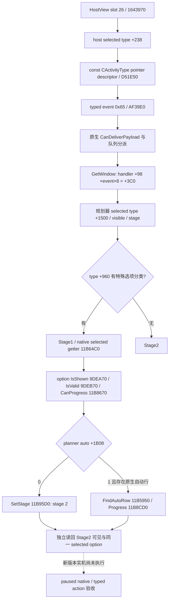

# CK3 1.20.0.2：宴会规划器开启与 Stage1

2026-10-01 的后台迁移将已有 `activity_feast_planner_open_v1` 和
`activity_stage1_option_read_v1` 接到 exact 1.20.0.2 原生对象与函数；原有
1.19.0.6 路径及公开 DTO 保留。当前最高状态为 **static-ready**。
本项没有访问 CK3 进程、管道、桌面或存档，没有新版本 paused/live 证据。

本项沿[原生 AI 索引](README.md)与已有规划器专题施工，身份布局见
[新版规划器身份](ck3-1.20.0.2-feast-planner-identity.md)，后续地点阶段见
[新版 Stage2](ck3-1.20.0.2-feast-stage2-location-confirm.md)。没有调整自动玩家策略。

## exact build 与原生调用树

冻结文件：`artifacts/migrations/2026-09-30/post-update-1.20.0.2/installation/binaries/ck3.exe`。
版本为 Crozier 1.20.0.2、Steam build 25588574，SHA-256：
`AE1BA6FF060BA603842F6F4A2DED0AF4B7D3666B3DD271F75FB01B0DA8E81B2D`。
地址均为 RVA；迁移依据是新文件的调用者、构造器与虚表，不采用统一偏移推算。

Stock HostView 在 `1643A17` 明确写入事件 **0x65**，于 `1643A1F` 调用
`AF39E0`。`B0F21E` 读取 `handler+0x98+event*8`，因此规划器物理槽位仍为
**+0x3C0**。不能把枚举或相邻窗口推算成 +0x3E0。新分派器在入队前增加
原生 `CanDeliverPayload` 判定；移植调用该原生分派函数，保留这条行为。
`CPdxAny` 的 descriptor 为 `54D76F0`、虚表 `44E6F38`，copy/move 槽均指向
`878290`；payload 使用原生 const `CActivityType*`。

## 关键布局与原生入口

| 含义 | 1.19.0.6 | 1.20.0.2 | 新版证据 |
|---|---:|---:|---|
| handler planner | +3C0 | +3C0 | B0F21E；规划器工厂写入 |
| planner selected type | +1530 | +1500 | 11B64C0 |
| type special category | +A88 | +960 | 11B64C7 |
| option rows / count | +1560 / +156C | +1598 / +15A4 | 11B64D3 / 11B64DA |
| selected option row | +1AC8 | +1B00 | 11B9817 写入；与 active location row 区分 |
| active location row | +1AC0 | +1AF8 | 地点选择与自动行路径，详见 Stage2 |
| automatic location flag | +1AD0 | +1B08 | 11B8CFC |
| TypeDB entries / count | +68 / +74 | +50 / +5C | stock HostView 1642F05–1642F0E |
| type stable string | +18 | +18 | type ctor 3110394 |
| option ScriptID | +8 | +8 | parser 284ACCF，copy 3124DD4–3124DD7 |
| option shown / valid trigger | +18 / +F8 | +20 / +F0 | option ctor 311C8CA / 311C8FE |

Option row stride 为 0x10，category 位于 row+0、option 位于 row+8；地点配置
row stride 为 0x38。TypeDB 的 pointer array stride 为 8。初始 type 全局从
`57BFF28` 迁到 `5D1FB40`，TypeDB 全局从 `570BE98` 迁到 `5C67208`。

| 原生函数 | 旧 RVA | 新 RVA |
|---|---:|---:|
| GetSelectedOption | 10AEAE0 | 11B64C0 |
| IsShown / IsValid | 971270 / 971370 | 9DEA70 / 9DEB70 |
| CanProgress | 10B0DA0 | 11B8670 |
| SetStage | 10B1BD0 | 11B95D0 |
| FindAutoRow / ProgressPlanningStage | 10ADFA0 / 10B1330 | 11B5950 / 11B8CD0 |
| Stage notification (planner VT+C8) | 10AEC20 | 11B6550 |
| Descriptor provider / typed dispatch | CAF920 / A79700 | D51E50 / AF39E0 |

`SetStage` 新函数使用 0xA0 栈帧，完整入口 guard 为
`40 53 48 81 EC A0 00 00 00 8B 81 E8 1A 00 00`；直接复用旧入口字节会拒绝
有效的新对象。stage 为 +1AE8、previous stage 为 +1AEC，通知仍调用 VT+C8。

### Option ScriptID 的生产者证明

不能把 option ctor 的序号当作脚本 ID。`3115870` 的 category parser 构造
option 后，经 `31159D8` 调用 option VT slot 3（`284AC70`）；该 parser 于
`284ACAA` 取得 ScriptIdentifierTable（`3F8A800`），于 `284ACBC` 查询
ScriptID（`3F8A4B0`），最终 `284ACCF` 的 `89 47 08` 写入 **option+8**。
`311C89E` 初始化该字段为 -1；constructor 输入的分类内 ordinal 则由
`311C8C7` 写入 **+18**。copy 的 `3124DD4–3124DD7` 再次保留 +8。
因此 bridge 的 option key callback 继续接受 +8 的 ScriptID，有真实原生生产路径依据。

Type constructor `3110394` 初始化 +18 的 MSVC string，随后安装新虚表
`48BFE50`。对应 SSO size/capacity 仍为 +28/+30；`activity_feast` 按稳定字符串
查找，不依赖数据库排序。Option 新虚表为 `48BFD18`。

## 实现与验证

版本与布局选择统一复用 `ck3_12002_feast_planner.hpp`；新版 reader 从共同
身份解析器取得 actor/handler/planner/type/stage。Stage1 在原生 selected getter、
实际分类 row、option 虚表与 ScriptID 一致后读取 shown/valid/can-progress；确认后
独立读回可见 Stage2 与原 option 保留。Open 从新版 TypeDB 查找唯一宴会 type，
使用原生 typed dispatch，独立核对 selected type、visible 和打开阶段。

可复现只读文件校验入口为
[`tools/verify_ck3_12002_feast_stage1_open_abi.py`](../../tools/verify_ck3_12002_feast_stage1_open_abi.py)，
参数 `--executable <frozen-exe> --output <receipt>`。已执行结果为
**34 个 exact 字节证明 + 5 个原生指针证明 GREEN**。

MSVC `/std:c++20 /EHsc /W4 /WX` 实际执行 **6 个夹具运行 GREEN**：

- 新版 Stage1 fixture：`/Od`、`/O2`。
- 新版 Open fixture：`/Od`、`/O2`。
- 既有 1.19.0.6 Stage1 与 Open fixture：各 `/O2`。

第一轮两个新版 Stage1 夹具出现 harness RED：夹具仍种入旧长度 setter guard，
生产路径返回 `stage_setter_abi_mismatch`。将种入字节修正为新版本真实的 15 字节
后，仅重跑这两个失败夹具，均 GREEN；四个已通过的运行直接复用。这是夹具迁移错误，
不是新版 capability 的实机失败。首次错误保留在 `fixture-attempts.json` 文本记录；
原始逐运行日志已被同目录重跑覆盖，不能声称仍有原始 RED log。

证据目录：`artifacts/g2-offline-2026-10-01/feast/planner/stage1/`：
`abi-proof.json`、`final-receipt.json`、`fixture-attempts.json`，以及
`build-tests/<fixture>-<optimization>/compile.log`、`run.log`、`fixture.exe`。
最终 receipt 绑定六个实际夹具二进制、日志、所有本项源文件与共同依赖的 SHA-256。

## 仍需实机的部分

新版尚需受控 new-PID cold/paused 身份读回、合法 typed OpenFeast、Stage1
确认及独立物质后置；ACK、PE proof 和夹具不能代替这些结果。默认关闭的 private
入口及正式 consumer 的发布状态由组合迁移包统一管理。本项未注入候选 DLL、
未启用游戏 transport，也未执行保存或推进日期。新版本的完整宴会 OODA/连续游玩
资格仍等待实际运行证据。
