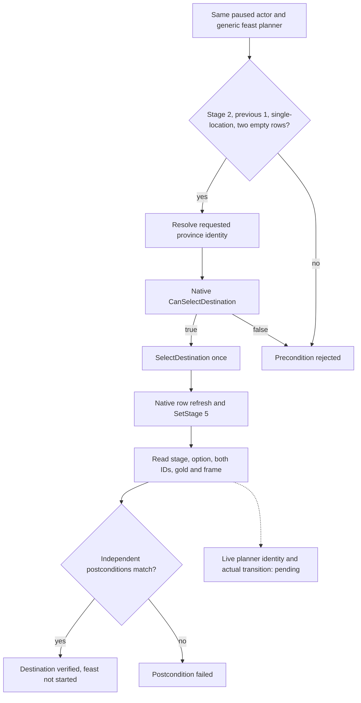

# CK3 1.20.0.2 feast: location and stage confirmation

Status: `static-ready`, not live-qualified. This work reads the frozen PE file
and exercises simulated memory; it does not contact the running game. The exact
build is 1.20.0.2 Crozier, Steam build 25588574, EXE SHA-256
`AE1BA6FF060BA603842F6F4A2DED0AF4B7D3666B3DD271F75FB01B0DA8E81B2D`.

This ports the existing bounded generic-feast destination and confirmation
operations. The 1.19.0.6 ABI remains supported. It does not introduce another
activity framework, use the full map-icon click wrapper, or claim that a feast
has started or completed.

## Native inputs and transitions

The new image has several independent layout changes. In particular, planner
configuration and selected-option rows move forward by 0x38 while the activity
type pointer moves backward by 0x30. Applying one displacement to the old
object or old functions is incorrect.

| Native value or route | 1.20.0.2 | Direct evidence |
|---|---:|---|
| Selected activity type | planner +0x1500 | `0x11B6CB0`, `0x11B64C0` |
| Configuration rows/count | planner +0x15B0/+0x15BC | `0x11B86DF` |
| Configuration row stride/province ID | 0x38/+8 | `0x11B86ED`, `0x11B8700` |
| Active location row | planner +0x1AF8 | `0x11B6CA0` |
| Current/previous stage | planner +0x1AE8/+0x1AEC | `0x11B8693`, `0x11B95F1`, `0x11B95F7` |
| Automatic location selection flag | planner +0x1B08 | `0x11B8CFC` |
| Single-location activity flag | type +0x3BED | `0x11B6CD3` |
| Phase kind/active byte | phase +0x1160/+0x69C | `0x11B5978`, `0x11B5981` |
| Selected special-option category | type +0x960 | `0x11B64C7` |
| Special-option rows/count | planner +0x1598/+0x15A4 | `0x11B64D3`, `0x11B64DA` |
| Final destination predicate | `0x11B6F50` | stage 1/2 predicate and native location inputs |
| Native destination setter | `0x11B6C80` | active-row province ID store at `0x11B6CB7` |
| Final stage-progress predicate | `0x11B8670` | stage switch and row-zero branch |
| Original progress route | `0x11B8CD0` | stage 2 enters stage 5 at `0x11B8D53` |
| Typed stage setter | `0x11B95D0` | stage/previous writes and virtual notification |
| Stage notification | primary vtable +0xC8 → `0x11B6550` | `0x11B960A` and PE vtable |

`CanSelectDestination(planner*, province*, reason=nullptr)` is the final native
read-only predicate. The bounded action calls
`SelectDestination(planner*, province*)` once after that predicate succeeds.
The destination function copies province +0x10 into the active row +8. Its
single-location branch reads the previous stage; for the existing generic
feast contract with previous stage 1 it clears the active row, refreshes the
configuration, and calls `SetStage(planner*, 5)` at `0x11B6D59`. Other branches
are not admitted by this action.

The existing action still requires exactly two initially empty configuration
rows, one current row, stage 2, previous stage 1, and the selected
`feast_type_generic` option. That is a bounded operation precondition, not a
claim that every feast configuration in every save always has two rows.

The stage-2 `CanProgress` branch walks every 0x38 row and returns false when a
row's province ID is zero. It does not infer legality from a script phase name
or from a phase-kind integer. Location reads expose the phase kind as a raw
integer and the active marker as the actual native byte.

## Source and verification

The four existing production implementations now select their exact byte
guards and layouts by admitted executable identity:

- `activity_stage2_gate_read_v1.cpp`
- `activity_stage2_location_read_v1.cpp`
- `activity_stage2_destination_select_v1.cpp`
- `activity_stage2_confirm_v1.cpp`

The new-build readers use the shared planner identity resolver and the native
selected-option getter. The confirmation route retains its existing
independent option, gold and paused-frame receipt. It does not substitute an
ACK for observed stage-5 state.

`tools/verify_ck3_12002_feast_stage2_abi.py` verifies 26 exact field and route
proofs from an explicitly provided executable file. Its first successful
receipt is
`artifacts/g2-offline-2026-10-01/feast/planner/stage2/exact-abi-proof.json`.
`ck3_12002_feast_stage2_test.cpp` exercises the actual production readers and
actions against the new layout: zero-row stage gate, legal location candidate,
one destination transition with row readback, ready stage gate, retained-option
confirmation, and a changed-gold postcondition failure. Compiler and fixture
results are frozen in
`artifacts/g2-offline-2026-10-01/feast/planner/stage2/fixture-result.json`:
MSVC C++20 `/W4 /WX /Od` and `/W4 /WX /O2` both compiled and passed. The
result pins all seven compiled source files. The first fixture attempt failed
to compile because the new fixture omitted its namespace import; that harness
attempt is retained as `fixture-attempt-20261001-*.json`. It was corrected
before the successful runs and did not execute a game capability.

The location provider reads the native phase-active byte and widens it into
the existing integer DTO. The new fixture supplies exactly that one byte;
reading an integer at the field would read unrelated adjacent state and fail
this production-path fixture.

The existing 1.19.0.6 location fixture (including the stage gate), destination
fixture and confirmation fixture also compiled and passed under `/Od` and
`/O2`, with `/W4 /WX /UNDEBUG` and the Stage2 action switches enabled: all six
runs were GREEN. Their one-time regression receipt, production source and
common-header hashes, executable hashes and compiler logs are in
`artifacts/g2-offline-2026-10-01/feast/planner/stage2/legacy-regression/result.json`.

The remaining live boundary is a real paused generic-feast planner on this
exact build, positive/negative native destination qualification, and actual
stage transition with independent readback. These primitives do not satisfy
the M6 feast start, completion or benefit outcome requirements by themselves.
