# Feast Stage 5 Start migration — CK3 1.20.0.2

Status: `static-ready`. This work reads the frozen EXE and stock files and
executes fixture-owned C++ objects. It does not query or operate local CK3.
The exact executable is 1.20.0.2 Crozier, Steam build 25588574, SHA-256
`AE1BA6FF060BA603842F6F4A2DED0AF4B7D3666B3DD271F75FB01B0DA8E81B2D`.

## Original final gate and submission

The planner's existing `CanProgressPlanningStage` final evaluator is now
RVA `0x11B8670`. It reads the planning stage at `+0x1AE8`. Its Stage 5
branch, `0x11B88E8`, copies the configured payload from planner `+0x1500`
and constructs a temporary `CStartActivityCommand`. Primary vtable
`0x476BAA0`, slot 6 `0x297D080`, forwards payload `+0x20` to the final
validator `0x23FC990`. The copied native failure string retains the existing
32-byte MSVC layout; the new game string destructor is `0x856050`.
Display text is a human explanation and supplies no guessed stable key.

The Stage 5 progress branch `0x11B9310` filters the selected native guest
rows. With no retained confirmation rows it calls the original accept branch
`0x11B8D90` at `0x11B94D9`. The confirmation accept callback
`0x11B92C0` reaches the same branch, while its enabled callback
`0x11B92D0` repeats visibility and final `0x11B8670` evaluation.

The 1.20 accept branch differs from the old stack-only queue path. It first
refreshes guest/configuration state (`0x11B8DA7 -> 0x11B8050`), copies the
configured payload via `0x11B89B0`, constructs the Start command, creates
the submission object via its native virtual slot, and submits at
`0x11B8E85 -> 0x37F06F0` with player flags `0x0E`. It closes the planner
without inspecting command application. The new action invokes this exact
original accept branch; it does not construct an old-version command.

```mermaid
flowchart LR
  A[Paused actor and configured feast Stage 5] --> B[Native final CanStart]
  B -- false --> H[Copy explanation and hold]
  B -- true --> C[Four named native costs and relevant balances]
  C --> D[Selected guests: native positive join and timely arrival]
  D --> E[Same-frame policy approval and original accept branch]
  E --> Q[Native queue submission: pending]
  Q --> R[Independent new hosted ID and resource debit]
  R --> P[Retain activity identity through later turns]
  P --> T[Native completion or invalidation flags]
  T --> V[Independent prestige / stress / Reveler XP counters]
  V --> O[Retained before/after values and signed differences]
  O -. causal reward attribution remains unqualified .-> G[Verified benefit]
```

## Existing request path

`ActivityFeastStage5StartV1` and `ReadActivityStage5CanStartV1` retain
their portable V1 DTOs. They select independent exact-build anchors by the
admitted SHA; 1.19.0.6 remains supported. The original typed Start core still
requires final native legality, native named costs, relevant balances and
reserve, one qualified guest route, matching frame and refresh sequence,
and no unresolved previous submission. The submitted result stays pending.

The new `ck3_12002_activity_feast_private_transport_v1` and
`ck3_12002_activity_stage5_canstart_private_transport_v1` executors receive
an explicit module base, exact SHA, and a full-snapshot callback from the
1.20 adapter. They never dereference inherited legacy `Bindings`.
They resolve a fresh planner and generic option and invoke the new native
callbacks on application main. Their serializers reuse the existing wire
schemas. A missing installed normal cost observer remains unavailable.

The hosted reader now copies the real completion/invalidation flags. Modern
hosted rows add the three optional booleans `terminal_flags_observed`,
`native_completed`, and `native_invalidated`; legacy rows retain their
existing field set. Completed and invalidated are independent native bits;
the transport does not invent an exclusivity rule. A missing activity row
is `absence_unknown`, never an inferred terminal result.

The same existing Start-input and hosted-post requests now also sample the
actor's independent outcome counters. The optional `outcome_values` object
contains signed `prestige_raw` and `reveler_xp_raw` in Q100000 units,
integer `stress_points`, and `reveler_present`. Unknown values stay `null`;
an absent Reveler trait has a known false presence and an inapplicable `null`
XP value. The exact provider reuses the new trait database/presence/track
reader and the resource getter semantics (`0x28BE040`, prestige `+0x130`;
`0x28BC580`, stress `+0x2F8`). Start retains these values as a baseline.
These reads supply observable changes without attributing every change to
the Feast or treating a completion flag as a numerical benefit.

The frame-free `ReadActorResourceBalances12002` leaf supplies the admitted
1.20 public Snapshot with actual gold, prestige, piety and stress. It reads
the full Character ID before the resource extension and does not call
Snapshot recursively. A native null extension is a legal zero; a failed
memory read remains a failed read. Gold/prestige/piety are signed Q100000,
while stress is a plain integer.

## Verification and remaining live work

`research/verify_ck3_12002_activity_feast_start.py` checks the pinned SHA,
12 instruction/vtable anchors, final Stage 5 payload and queue branch.
The new production Start and final-gate fixtures passed MSVC `/W4 /WX`
in both `/Od /RTC1` and `/O2`; their legacy regressions passed `/O2`.
`research/run_ck3_12002_feast_start_tests.py` reproduces these fixtures.
The new tests cover the same actual
Start/readback core used by the executors, including final false, selected
type/stage, configured resource reserve, unknown nonzero resource balance,
guest arrival, independent creation/debit and frame changes.

The hosted wire fixture compiles the exact serializer blocks copied from
the current production C++ source. Its input is synthetic, and its three
outputs exercise ongoing/completed/invalidated row fields. The extraction
receipt records production source and serializer hashes. This is a C++
serializer-to-Python fixture, not a paused native observation. Reproduce it
with `research/run_ck3_12002_feast_wire_test.py --build-dir <artifact-dir>`.

The outcome trace additionally executes the actual production hosted,
balance and outcome readers over fixture-owned native storage, then the
current production serializer. Both `/Od` and `/O2` passed eight
cases with identical output. The tracked
`research/fixtures/ck3_12002_feast_outcome_values_wire.json` trace and its
`_baseline.json` input contain retained-ID ongoing/completed frames, an
absent Reveler trait with null XP, and a released Activity row. The receipt
is `artifacts/g2-offline-2026-10-01/feast/hosted/outcome-wire-build-canonical-indices/result.json`.
The separate actual resource leaf passed four `/O2 /W4 /WX` cases: signed
values, full-ID generation mismatch, legal null extension and failed read.
These are offline provider fixtures, not game observations.

The actual Stage 1/2/5, selected guest, costs and terminal flag qualifications
must be repeated on a later owned paused 1.20 session. A legal and valuable
Start, material creation and debit, subsequent turn, matched cold restore,
and complete native lifecycle with independently observed value remain
live requirements. Existing negative 1.19 evidence remains historical;
none of these offline fixtures changes the G2 M6 completion denominator.

Related native sources and consumers:

- [Planner identity and stage bindings](ck3-1.20.0.2-feast-planner-identity.md).
- [Named costs and normal refresh](ck3-1.20.0.2-feast-costs.md).
- [Guest observation](ck3-1.20.0.2-feast-guest-observation.md).
- [Hosted identity and terminal effects](ck3-1.20.0.2-feast-hosted-lifecycle.md).
- [Actual outcome counter sources](ck3-1.20.0.2-feast-outcome-values.md).
- [Durable lifecycle and independent values](ck3-1.20.0.2-feast-durable-lifecycle.md).
- [Python private transport](ck3-1.20.0.2-feast-python-private-transport.md).
