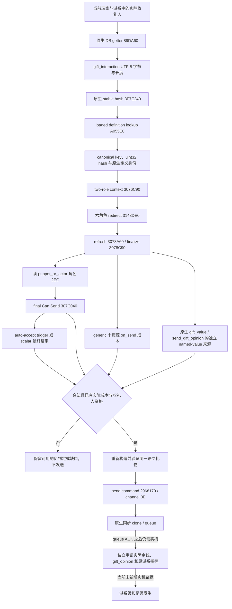

# CK3 1.20.0.2：礼物互动的原生 context、实际付款角色与提交路径

本专题为 G2 M4 派系缓和礼物链迁移提供新版的实际原生入口。证据全部来自冻结 EXE 和原版脚本的离线读取；状态为 **static-ready**，没有启动、查询、注入或操作本地 CK3，也没有新增 paused live 证据。旧版礼物流程与持久化 receipt 继续复用，不能因本页的 ABI 校验通过就把礼物效果或派系改善记作完成。

冻结构建为 **1.20.0.2 Crozier / Steam build 25588574**，EXE 为 101,039,736 字节，SHA-256 为 `AE1BA6FF060BA603842F6F4A2DED0AF4B7D3666B3DD271F75FB01B0DA8E81B2D`。可重放的 byte manifest 为 [ck3_12002_gift_context_abi.json](../../ck3_autonomous_player/native_bridge/research/ck3_12002_gift_context_abi.json)，校验器为 [verify_ck3_12002_gift_context.py](../../ck3_autonomous_player/native_bridge/research/verify_ck3_12002_gift_context.py)。所有下列地址都是该 EXE 的 RVA。

## 新版原生树



`gift_value` 与 `send_gift_opinion` 的 named-value 接收器由同轮礼物值来源施工负责。本 manifest 证明 context 与提交路径，不把 generic 成本槽替代它们。通用信仰、教义、礼制和 holy order 不属于本工作包；原版礼物的宗教附加效果不在这里展开研究。

## 定义解析与 context ABI

| 原生入口 | RVA | 参数与实际证据 |
|---|---|---|
| Interaction DB getter | `0x89DA60` | 无参，返回原生数据库；`0x89DA64` 读全局指针槽 `0x5C67538`。 |
| Stable key hash | `0x3F7E240` | `uint32(database, bytes, length)`；首参数不参与结果，函数将 seed 清为零。block accumulator 为 `0x3F7E100`。 |
| Loaded definition lookup | `0xA055E0` | `definition*(database, int32 stable_hash)`；`0xA81191 → 0xA811CC → 0xA811D6` 是真实 getter、hash、lookup 调用链。 |
| Two-role context ctor | `0x3076C90` | `(storage, definition, int32 actor, int32 recipient, extra_scope*, redirect_roles_bool)`；保留原来的六参数签名。 |
| Refresh / finalize | `0x3078A60` / `0x3078C90` | 重建 named scopes 与 option 状态；refresh 的第二参数仍为 bool。 |
| Final Can Send | `0x307C040` | `(context, optional native reason output)`；false 是已观测的合法负结果。 |
| Destroy context | `0x30773A0` | 销毁 caller-owned context，大小 `0x338`。 |

`gift_interaction` 的零 seed stable hash 为 **`0x776D7835`**。校验器的 Python 翻译以 EXE 中的 Murmur3 x86/32 指令链为依据，并用既有 `gift_opinion = 0xCA82155B` 与 `send_gift_opinion = 0xF8A1F946` 做参考向量。该翻译供离线互证；生产解析仍调用绑定的原生 hash 与 lookup。

定义的 runtime ordinal、uint32 stable hash 与 canonical MSVC string 分别位于 `+0x10`、`+0x14`、`+0x18`。字符串 size/capacity 位于定义 `+0x28` / `+0x30`，native kind 位于 `+0x38`。这些是新版 definition constructor 的直接 store/LEA 证据：`0x3144A05`、`0x3144A21`、`0x3144A24`、`0x3144A42`、`0x3144A57`。缺失定义的原生 fallback 指针槽为 `0x5D1DD28`；不能只因 lookup 返回非空就接受 sentinel 为真实礼物定义。

新版 lookup 的表 rows/mask 分别为 DB `+0x180` / `+0x18C`，旧版为 `+0x198` / `+0x1A4`。生产直接调用原生 lookup，不自行复制 probe 与锁实现。

构造器把 actor / recipient 写入 context `+0x2D8` / `+0x2DC`，把 secondary actor、secondary recipient、intermediary 初始化为 `-1`。新的第六角色位于 `+0x2EC`，初值是 actor；`redirect_roles_bool` 为 true 时，原生 redirect 可以更新全部六个角色。这里的 **two-role 构造器** 与已迁移的 **all-role 构造器 `0x3076E50`** 是两个不同入口，不能因为后者新增角色就修改本入口的参数数量。

## 实际费用在 on_accept，付款人是 puppet_or_actor

冻结原版 `game/common/character_interactions/00_gift.txt` SHA-256 为 `D62A80DD8ED0F666A1223BA5BA68EA4362A8259E54C795C4D215C5EB7D0DF0F2`。

脚本 lines 89–102 的最终资金合法性是 `scope:puppet_or_actor.gold >= gift_value`；lines 167–174 在 **on_accept** 内执行 `pay_short_term_gold`，金额是 `gift_value`，目标是 recipient。因此 definition `+0x40` 的 generic 十资源 **on_send** 成本不能被当作礼物实际金额。零值 generic gold 槽并不证明礼物免费，Can Send true 也不提供完整金额。

context `+0x2EC` 的含义已经由新版直接闭合：

1. `0xEB24` 取字符串 `puppet_or_actor`（RVA `0x449EA60`），`0xEB55` 取 named-scope key 的全局槽 `0x5D4C0D0`，并注册二者。
2. `0x3078B4D` 读 context `+0x2EC`，`0x3078B57` 读同一个 key 槽，`0x3078B6C` 把角色发布到 scope 中。
3. 紧接的 `0x3078B77` / `0x3078B7C` 检查该角色是否存在、是否与 actor 不同，供 puppet-action 条件使用。

普通玩家礼物 receipt 若使用玩家钱包，必须在原生 redirect 与 finalize 后确认 `puppet_or_actor` 仍是该玩家；否则付款角色和资金来源需要单独观测，不能继续将玩家 gold 当实际 payer 的资源。本工作包不扩展 puppet 控制策略。

## 提交与独立结果

新版通用 UI validate-and-send 为 `0x10E9200`，对应旧版 `0xFE5190`。实际调用顺序为 `0x10E9218` final validator、条件分支、`0x10E9229` send constructor、`0x10E922F` channel `0x0E`、`0x10E9237` submit wrapper `0x9E16B0`、`0x10E9242` 销毁命令内的 copied context。

这里的 submit wrapper 采用新版 `(command, channel)` 参数顺序。我方复用已迁移的 `SubmitCommandCopy(ContextBindings.commands, command, 0x0E)` 及原生 clone/queue 所有权路径；不沿用旧版的 command-manager 三参数调用。send command 大小 `0x368`，其 primary / secondary vtable 分别是 `0x448BCE0` / `0x448BCB0`，命令内复制的 context 位于 `+0x20`。

队列 ACK 只说明已提交。正式礼物结果必须继续复用已有 receipt，以实际 payer 金钱、recipient 的真实 `gift_opinion` 与原派系的最新 power/discontent 进行独立检查。不能以 gift ACK 宣称收礼完成，更不能以好感提升推定派系威胁消失。

## 离线验收

在 cmd 中执行；路径仅指定冻结的文件，不会枚举或触碰游戏进程：

```bat
Z:\ck3_mod_rewrite\tools\.venv\Scripts\python.exe ck3_autonomous_player\native_bridge\research\verify_ck3_12002_gift_context.py --exe Z:\ck3_mod_rewrite\artifacts\migrations\2026-09-30\post-update-1.20.0.2\installation\binaries\ck3.exe --stock-root Z:\ck3_mod_rewrite\artifacts\migrations\2026-09-30\post-update-1.20.0.2\installation\game --output Z:\ck3_mod_rewrite\artifacts\g2-offline-2026-10-01\gift\context-abi-verification.json
```

manifest 包含 19 个唯一 byte anchors、6 个 native span hash、62 条指令/调用或 RIP-target 证据、4 个生产绑定常量与 2 个命令 vtable 前缀。校验器同时验证 stock 文件、hash 参考向量和 rel32 receiver 解码；只报告 **static-ready**。实际 gift preview、发送后效果及派系缓和验收仍需要未来可用的 exact-build paused 游戏场景。

2026-10-01 14:45（Asia/Shanghai）上述离线校验实际 **GREEN**；3 个 hash 向量和 2 个 rel32 receiver case 也已通过。结果文件为 `Z:\ck3_mod_rewrite\artifacts\g2-offline-2026-10-01\gift\context-abi-verification.json`，SHA-256 `a344c6f368de9c040a4c8f3253608c8c76c57386ceb55c554a90271ed9165e26`，其中明确 `live_verified=false`。
