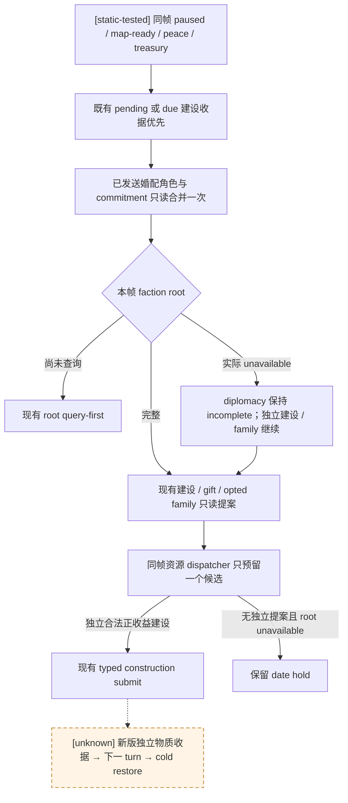

# CK3 1.20.0.2：JOINT 后台消费修复

状态：**static-ready**。本包只运行 Python 正式消费者的确定性回归；没有查询、启动、连接或操作本地 CK3，没有桌面操作，也没有准备 profile、同步工坊或改动真实存档。新版 native provider 的实机资格另记，不以本包的离线输入代替。

## 交接输入与既有原生树

按 [2026-09-30 非战争休假交接](../handover/2026-09-30-nonwar-maintainer-vacation-handoff.md)继续 LIFE → ECON → FAMILY，JOINT 并行。用户指定的冻结版本是 [46ca368](https://github.com/XenoAmess/ck3_eternal_recurrence/blob/46ca368cebfaff64cf09c29dd6d8b0de206c661c/docs/handover/2026-09-30-nonwar-maintainer-vacation-handoff.md)。源码施工基线为 master `c69260e`，目标游戏是 1.20.0.2，EXE SHA-256 `AE1BA6FF060BA603842F6F4A2DED0AF4B7D3666B3DD271F75FB01B0DA8E81B2D`。

本包复用 [直辖建设原生树](domain-construction-ai.md)、[婚配与联盟树](marriage-and-alliance.md)、[pending 家族资源承诺](m5-pending-family-claims-c79-2026-09-27.md)和 [R0399 pending/checkpoint 消费问题](m5-outbound-marriage-pending-readback-2026-09-27.md)。没有新增建设评分、婚姻收益、联盟概率或战争模型；建设仍由原有同帧 final legality、原生成本、正的著录收入及 200 金储备合同决定。

交接中的 R0406/R0407 及本专题引用的 R0259–R0399 都属于 **1.19.0.6 历史实机**。它们说明已有语义与实际故障背景，不构成新版 private provider 的 paused 实机证据。R0407 的成年 measure 14、threshold 16、`complete_can_send=false` 是正常负结果；query ACK 不表示婚配已接受。

## 两个正式路径缺口及修复

1. `plan_m5_formal_query_only` 在同帧 faction root 实际返回 `unavailable` 后直接把 `selected_step` 置空；`query_m5_peacetime_proposal_sources_v1` 也在读取独立建设机会前抛错。因此未闭合的 diplomacy 比较阻断了一个本可独立执行的和平建设。
2. first-heir pending ledger 只在 `allow_private_family_marriage_formal_trial=true` 时被读取。新提交开关关闭后，已经发送的 proposal 仍存在，其角色承诺却从 M5 资源集合中消失。Guy 的 pending 读取已经独立于提交开关；现将 first-heir 对齐到同一持久资源语义。

两个缺口都由正式生产函数、合法既有 ledger/查询结构直接复现。修复后的 producer 将本帧不可用的 faction root 记为 `producer_faction_status="same_frame_root_unavailable"`、`incomplete_domains=["diplomacy"]`，继续读取独立建设及已启用的 family 提案。dispatcher 仍只预留一个候选；有合法正收益建设时走现有 `private-submit-player-construction-v1` 消费者。

缺少尚未执行的 root 查询时，原有 query-first 顺序保留；未读到任何独立可执行提案时，仍保留原 date hold。修改不把未知 faction count 当作零，也不解除旧战争日期阻点。现有 war、receipt 或 checkpoint 步骤始终先走自己的既有消费者，不被联合机会替换。

first-heir 与 Guy 的 pending 都只读，资源占用使用集合合并：保留 subject/candidate/recipient、已有联盟尝试角色和各自 commitment key 一次；不占用整个玩家 actor。`on_send` 已支付资源已体现在当前 treasury 中，不重复预留同一笔现金；新建设只额外预留其实际金币成本。关闭 family submit 开关仍不进行新的 family 查询或提交。已完成 proposal 的 pending 清除后，临时角色占用照既有路径释放。



## 离线证据

[冻结结果索引](Z:/ck3_mod_rewrite/artifacts/nonwar-offline/2026-10-01/joint/joint-offline-result.json) SHA-256 `62ed2b6f28a5ad17b20c43bc0a6a434fb748f48fa8f06156daaac59eab587ebf` 记录源码与测试 SHA、原始 RED、最终 GREEN、实际命令的测试模块和新版 EXE 身份。输入是确定性消费者 fixture，明确不标为 native paused artifact。

| 检查 | 结果 |
| --- | --- |
| 新增正式 planner 复现：修复前 | 5 项中 2 failure / 1 error；保留 `before-fix.json/.log` |
| first-heir 提交 OFF 后承诺缺失：修复前 | 1/1 RED；保留 `pending-before-fix.json/.log` |
| 最终 M5 聚焦回归 | **111/111 GREEN** |
| 同一回归 `python -O` | **111/111 GREEN** |
| 本地 CK3 / pipe / desktop / profile / Workshop 操作 | **0** |

新测试涵盖：root unavailable 时独立建设照常进入 typed 消费者；没有建设阳性则不释放日期；root 未查询仍先查询；Guy 与 first-heir pending 在 submit OFF 时保留一次角色占用、ledger 字节不改、既有支付不重复预留；已有 war/receipt 步骤保留优先级。其余回归复用旧 M5 shortlist、selector、dispatcher、formal collector 和 war cash 的正式 API。

可用 artifact 中保留的 [离线回归入口](Z:/ck3_mod_rewrite/artifacts/nonwar-offline/2026-10-01/joint/run_offline_regression.py) 对任意源码 checkout 重放相同模块，不调用 CK3。示例：

```text
py Z:/ck3_mod_rewrite/artifacts/nonwar-offline/2026-10-01/joint/run_offline_regression.py Z:/ck3_mod_rewrite/.task-tmp/nw12002 repeat-normal
py -O Z:/ck3_mod_rewrite/artifacts/nonwar-offline/2026-10-01/joint/run_offline_regression.py Z:/ck3_mod_rewrite/.task-tmp/nw12002 repeat-optimized
```

[建设正式消费者 replay](Z:/ck3_mod_rewrite/artifacts/nonwar-offline/2026-10-01/joint/independent-peace-construction-production-replay.json) 是实际调用结果：1 次 source read、1 次建设只读 query、0 次 faction read，一个 building reservation，typed submit 仅作为计划输出。它不声称已扣款、开工或产生收入。

[战争现金合同 replay](Z:/ck3_mod_rewrite/artifacts/nonwar-offline/2026-10-01/joint/incomplete-war-cash-production-contract.json) 使用原 `observe_active_war_cash_resource_v1`：未来 upper、risk、horizon 和 shared pending 缺项保持 `null`。这些缺项阻断相关 active-war 联合花费/比较；没有 active war 的独立和平 construction 继续按自身成本与储备合同工作。当前本金、净月收入或 troop count 不被转成未来战争成本。

`open_kaishek` 预验为 **not-applicable**：此次只改变 Python 同帧消费者的域依赖和持久 pending 读取；没有 Paradox script、vanilla effect 或有限运行时语义变更。

## 仍需实机的最小入口

合入新版匹配 provider 后，在一个合法和平 paused frame 读取建设机会；若该帧 faction root unavailable，确认正式报告保留 diplomacy 缺口，建设仍只提交一次，再独立读回同槽施工与实际资源变化、下一 turn 消费及新 PID cold restore。本轮用户禁止占用本地 CK3，因此未执行此步骤。

旧 `m5_joint_intake` / `summarize_m5_alliance_readback` 的分析 inventory 仍绑定 1.19.0.6，没有仅扩版本字符串来广告新版 native 资格。它们不是当前 peacetime 正式消费链；完整 common utility、战争远期现金、长期婚配义务及 general religion 继续按原边界记账。G2 3/8、百年 0/1、首整局 0/1 和两独立种子 0/2 不因本包的测试数或计划输出提升。
