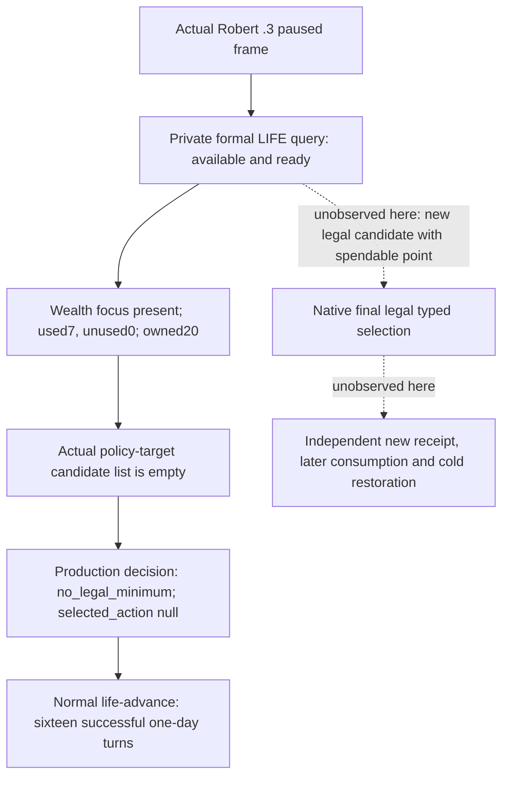
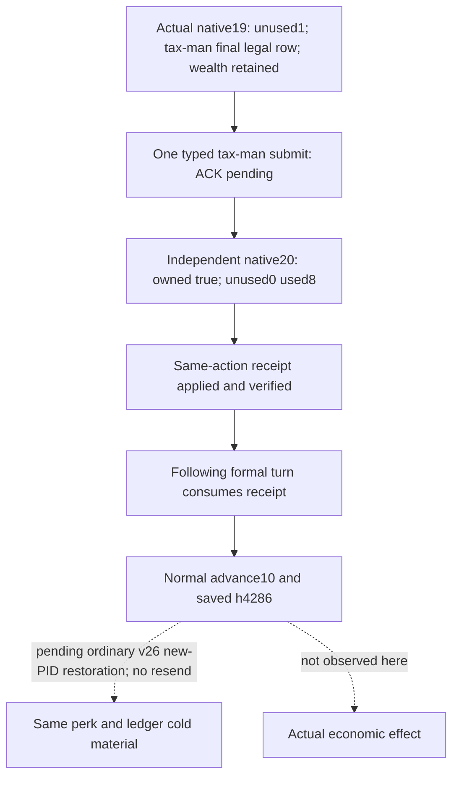

# CK3 1.20.0.2 LIFE migration

The original **1.20.0.2** migration package below is historical **static-ready** evidence. On 2026-10-03, the integrated **1.20.0.3** provider produced actual Robert current-state queries and normal zero-point no-op decisions, then a new timely `tax_man_perk` typed selection with an independent applied receipt and successful following formal consumption. The final sections distinguish those packages. Post-selection cold restoration remains pending. The original offline package reads the frozen executable and authored game data only.

The migration input is the [2026-09-30 nonwar handoff](../handover/2026-09-30-nonwar-maintainer-vacation-handoff.md). The existing LIFE policy, pending receipt consumption, education routing and target order remain its authority. An already valid focus is retained; zero unused points is a valid no-op. The old Robert 3,153-day record and R0407 private observation remain historical 1.19 evidence, not 1.20 gameplay.

Exact image: **1.20.0.2 Crozier**, SHA-256 `AE1BA6FF060BA603842F6F4A2DED0AF4B7D3666B3DD271F75FB01B0DA8E81B2D`. The former 1.19 image SHA is `2D00FF3101EF70B566F2FCBAE292F09263199C80E9DC8F139B82D7D96F83DB86`.

```mermaid
flowchart TD
    F[Published paused frame: player, date, revision] --> R[Resolve played CharacterID through 1.20 storage]
    R --> S[Read focus, lifestyle XP, points, owned perks, education/personality]
    S --> D[Repeat source sample and compare frame]
    D --> V[Existing LIFE policy retains valid focus and permits zero-point no-op]
    V --> T[Resolve an existing policy target from the exact definition database]
    T --> L[Construct stock typed command and evaluate native final legality twice]
    L --> A[For an explicitly requested legal selection: native clone and queue once]
    A --> P[ACK: verification pending]
    P --> Q[Later independent focus / owned-perk / XP / points observation]
    Q --> C[Existing receipt consumer]
    S -. unknown: 1.20 paused artifact not yet sampled .-> U[1.20 live verification pending]
```

The DLL exports a version-specific provider using the existing private wire DTOs. No strategy preference or public protocol is changed. Full GUI-window enumeration is not required for the existing fixed-target windowless LIFE policy. The final native boolean, rather than script inference or queue ACK, supplies target legality; independent post-state supplies applied status.

Confirmed getter RVAs from normalized old/new instruction matches are `GetFocus=0x29194D0`, `GetLifestyle=0x29193E0`, unused points `0x2918BD0`, used points `0x2918C50`, XP `0x2918D50`, owned perk span `0x2919360` and `HasPerk=0x2919070`. New field locations are focus→lifestyle `+0x7F8`, lifestyle XP threshold `+0x130`, perk→lifestyle `+0x440`; these replace old `+0x880/+0x138/+0x468`. XP remains signed Q100000. Definitions keep their MSVC stable key at `+0x18`; database pointer/count move to `+0x50/+0x5C`.

The existing native decision tree is [lifestyle-focus-perk-ai.md](lifestyle-focus-perk-ai.md). This migration follows its observed current-state and final validator path. It does not redesign vanilla AI preference weights or expand religious strategy.

## Native provider and integration

The version-specific [header](../../ck3_autonomous_player/native_bridge/include/xar_bridge/ck3_12002_lifestyle.hpp) supplies `xar::ck3_12002::lifestyle::PlayerLifestyleFormalWireContext12002V1`, derived from the existing master wire DTO. Its initializer accepts new `CoreBindings`, the real published `game::Snapshot`, revision, episode and existing mode. The executor keeps slot43's application-main execution stamp and old JSON shape. Native work is split across state, focus, perk, command, action and wire implementations; no old native binder, old GUI owner or old native submission wrapper is called.

| Native seam | 1.20 binding |
| --- | --- |
| Played full CharacterID | Global `0x54DBC00`; storage `0x5C67568`, Character identity `+0x18` |
| Focus definitions | DB slot `0x5C67188`; span `+0xF08/+0xF10/+0xF14` |
| Perk definitions | Getter `0x8FCD40`; span `+0x50/+0x58/+0x5C` |
| Education/personality | Trait DB getter `0x89E5B0`, span `+0x50/+0x5C`, HasTrait `0x28BB1F0`; five education families, ranks1–5, seven existing personality keys |
| Final focus legality | Validator `0x288A890`; primary/secondary vtables `0x4760B80/0x4760B50` |
| Final perk legality | Validator `0x288AE20`; primary/secondary vtables `0x47609F0/0x47609C0` |
| Typed command | Focus `0x38` bytes, perk `0x30`; player `+0x20`, definition `+0x28`, focus current-player `+0x30`, channel flags `0x0E` |
| Native ownership | Existing 1.20 `SubmitCommandCopy`: embedded manager `0x5CC1240`, owned queue `0x37F06F0`, synchronous clone through primary vtable `+0x40` |

The new native wrapper `0x9E16B0` returns no reliable queue boolean and accepts different arguments from the old wrapper. Substituting its address into the old bool callback would be incorrect. A version-specific adapter uses the already migrated clone/owned-queue helper and retains pending-ACK semantics. It never applies focus/perk by mutating Character fields or executing a script effect.

Existing LIFE policy targets remain the stewardship parent chain `cutting_corners → professional_workforce → centralization → tax_man`, diplomacy `thoughtful` and martial `serve_the_crown`; stock focus targets remain wealth, foreign affairs and authority. This is a targeted native database projection, not a complete GUI candidate enumeration. The plain DTOs and existing Python private step names are unchanged. The generic version route must select this provider; old 1.19 live evidence does not establish 1.20 readiness.

## Offline verification and evidence

The [action ABI](../../ck3_autonomous_player/native_bridge/research/ck3_12002_lifestyle_actions_map.json) freezes 23 bounded native regions, 19 semantic instructions and six validator/clone/executor vtable slots. The [current-state ABI](../../ck3_autonomous_player/native_bridge/research/ck3_12002_lifestyle_state_abi.json) adds nine bounded getter regions and 11 field instructions. The [verifier](../../ck3_autonomous_player/native_bridge/research/verify_ck3_12002_lifestyle.py) matches the exact image SHA and all **68** checks; failure uses explicit exceptions, including under optimized Python.

The [native fixture](../../ck3_autonomous_player/native_bridge/src/ck3_12002_lifestyle_test.cpp) and [MSVC runner](../../ck3_autonomous_player/native_bridge/research/run_ck3_12002_lifestyle_tests.py) pass three suites in both `/Od` and `/O2`, with `/W4 /WX`. They exercise the production native field reader against fixture-owned memory, held education/personality, explicit absent focus, XP/used/zero-unused points, real target-database layout, two native legality samples, focus/perk command layout and exactly one dispatch. The action/receipt suite rejects repeated valid focus, accepts zero-point no-op, retains pending ACK and requires a later independently captured frame for applied status. These are offline source fixtures, not game observations.

Frozen local evidence: [delivery.json](Z:/ck3_mod_rewrite/artifacts/nonwar-1.20.0.2/2026-10-01/lifestyle/delivery.json), [exact-abi.json](Z:/ck3_mod_rewrite/artifacts/nonwar-1.20.0.2/2026-10-01/lifestyle/exact-abi.json), [final native fixture result](Z:/ck3_mod_rewrite/artifacts/nonwar-1.20.0.2/2026-10-01/lifestyle/life-native-fixtures-delivery/result.json). The actual new provider's [serializer fixture](../../ck3_autonomous_player/native_bridge/research/fixtures/ck3_12002_lifestyle_state_zero_points.json) is byte-identical across `/Od` and `/O2`, SHA-256 `a0bbeef670e4092692c20fb93ada51061bc283250e5f9da00cd2a7adcdd24a16`; it comes from fixture-owned memory, including seven held perks, and is not a paused game artifact. The earlier fixture failures are retained separately: the first expected generic command flags7 instead of LIFE flags14, and the second omitted the fixture's `same_frame_ready` bit. Both were harness-fixture REDs; neither touched the game.

Reproduce using a frozen compatible EXE and a writable output directory:

```text
python ck3_autonomous_player/native_bridge/research/verify_ck3_12002_lifestyle.py --exe <frozen-ck3.exe> --output <artifact-dir>/exact-abi.json
python ck3_autonomous_player/native_bridge/research/run_ck3_12002_lifestyle_tests.py --output <artifact-dir>/native-fixtures
```

The native fixture executable accepts no arguments for ordinary tests. Its optional single argument is a **JSON output path**, not a game executable input; the dedicated Python runner passes `<artifact-dir>/<mode>/native-lifestyle-state.json`. On 2026-10-01 at 11:46:29 local time, the central generic fixture harness instead passed the frozen `ck3.exe` as that output argument and replaced it with the 1,168-byte serializer fixture. This is a central harness RED. The coordinator preserved the overwritten JSON and restored the original frozen image with its exact SHA. The central harness now needs target-specific arguments; the provider, fixture contract and dedicated runner are unchanged.

The original 68-check report and its frozen copy were both written at **11:34:30.242528**, and `delivery.json` was frozen at **11:45:21.870401**, before that overwrite. Those results retain their qualification as historical verification against the exact original image; they do not establish the availability of the later damaged input. [The incident sidecar](Z:/ck3_mod_rewrite/artifacts/nonwar-1.20.0.2/2026-10-01/lifestyle/central-harness-output-incident.json) records report hashes, timestamps and the mistaken argument contract separately, without rewriting historical delivery evidence.

## Historical 1.20.0.2 boundary

The only unfinished LIFE migration checks require CK3: a paused actual current-state/target-legality query; one legal typed focus/perk change with independent post-state receipt; normal next-turn consumption and checkpoint/cold restoration without repeating a prior selection. They must use the newly frozen integrated binary and official selected runtime. No LIFE gameplay, two-year objective, new perk income, natural inheritance or Robert mainline progress is claimed by this offline package.

Version1.20 event scripts introduce `stress_and_fulfillment_impact`. This provider has no stress/fulfillment preference term and does not reuse old event consequence profiles as evidence for that new effect. Event consequence migration remains the event registry owner's work; no extra religion or health policy is introduced here.

## 1.20.0.3 actual Robert observation and normal no-op, 2026-10-03

The official finite formal owner used `run_formal_nonwar_finite.py --allow-private-lifestyle-formal-trial` before its first read. This sets the existing production driver boolean and requires no new MCP parser, native build, window opening or forced perk. The exact current runtime is CK3 **1.20.0.3 / Steam25652598**, EXE SHA-256 `94B55397ABB687A3DCD436805A5D885E6BE90FA6C693FEB44A9E3BBEEADE02A6`, Python source `82c03174`, adopted native/environment `6c87`/v24. ROOT ran both closed packages with Robert **29829**, episode `native-29829-2bc2d599f7f9`, PID **38520**. The [bounded actual report](Z:/ck3_mod_rewrite/artifacts/g2-maintainer-2026-10-02/resume-12003/m4-lifestyle/actual-closed/REPORT-FIELDS.json) records input byte pins; the opt-in boolean alone is not the evidence.

| Closed package | Actual `private-query-player-lifestyle-formal-v1` observations | Actual boundary |
| --- | --- | --- |
| `travel1000-following-life-normal30-82c-v24-actual-01` | Four available/ready queries; first three at native7/raw53222952, last at native11/raw53223216 | Partial/error package; ROOT separately saved h4201/raw53223240 after 12 actual days. Its terminal read failure was already recovered by ROOT and is not reanalyzed here. |
| `normal30-after-finalread-recovered-82c-v24-actual-01` | Sixteen available/ready queries, each bound to its recorded pre-submit frame; first native19/raw53223240, last native64/raw53223600 | Sixteen executed `life-advance` turns, each one actual day; turn-budget boundary, final native67/raw53223624 and saved h4235. |

All 20 query snapshots report the current `stewardship_wealth_focus` as present, current stewardship progress as present, and the same 20 owned perk keys. Stewardship used points remain **7** and unspent points **0**. Its Q100000 XP changes from **83750000 (837.5)** to **86875000 (868.75)** in the second package's last two queries. This is an observed progress change, not a newly selected perk or income result. The current-state object publishes stewardship progress only; the total owned-key count does not supply martial, diplomacy, intrigue or learning point balances. The observed actor traits are `education_martial_5`, `greedy` and `ambitious`.

Current focus, progress, owned perks, policy-target perk candidates and same-frame readiness are true. `legal_perk_candidates` is actually `available`, with `scope=policy_target` and `items=[]`; zero points is the normal no-op input. The generic `legal_focus_candidates` collection is `unavailable` with `lifestyle_window_unavailable`, and its readiness is false. This does not block retaining the already valid focus. No explicit raw `canAdd` or per-target `native_legal` boolean is published in these zero-candidate objects, so neither is filled with a fabricated false value. The Python public revision and the wire native proof stamp are recorded separately: the second batch starts with Python PUBLIC2/native19 and its last query binds Python PUBLIC47/native64.

The production plan records `lifestyle_decision.status=no_legal_minimum` and `selected_action=null`, then continues normal play. There are **zero new LIFE submits and zero new LIFE receipts** in either package. The reused `centralization_perk` receipt belongs to action `life-perk-55de749aa64b48bf8a39f5ad5627f516`, post native4/raw53215920, earlier than both packages. Its existing owned/postcondition fields must not be counted as a new action, new independent material or new cold proof. The sixteen successful later formal turns demonstrate the current zero-point consumer continuing normally; they do not make a new focus/perk action loop complete.



The new qualification is **production-live readonly primitive plus normal no-op consumer evidence** for this actor and episode. A new legal focus/perk selection, its independent result, and post-selection cold restoration remain unobserved in these two packages. The existing formal consumer can continue with the same LIFE permission; when fresh observed points and native candidate legality permit an action, it owns the normal select/receipt/next-turn path. This extraction adds no source patch or tests and grants no new M4 completion, perk benefit, construction or two-year credit.

## 1.20.0.3 timely tax-man action and normal receipt consumption, 2026-10-03

ROOT's next closed `resume-12003/m7-robert/v25-a588-following-normal4-awaiting-patches-01` contains an actual new **`tax_man_perk`**, action **`life-perk-cd2744b39fca4bc2b0142031aadb54da`**. It uses published Python `a5882a56`, the existing typed native provider and formal consumer, actor29829/episode `native-29829-2bc2d599f7f9`, actual PID95636. Startup hello binds expected CK3 **1.20.0.3** and EXE94B55397…ADE02A6; native/environment f9-v25 is ROOT's runtime context. No script grant, forced point, replayed old perk or new policy is used.

The first observed opportunity in this package is available/ready `life-query-f7cae186b2804fe7a43267914b3aa8bb` at **raw53224560 / Python PUBLIC2 / native19 / proof19**. The final native `legal_perk_candidates` collection is available, `scope=policy_target`, and includes the exact `tax_man_perk/stewardship_lifestyle` row. Current wealth focus, current progress, owned perks, final perk collection and same-frame readiness are true. The generic focus-window collection is still unavailable and does not block this fixed-target perk action. Explicit raw `canAdd/can_add` is not published, so final legal membership is recorded without inventing that boolean. The recorded policy reason is `active_collect_taxes_effectiveness_plus_25_percent`; it is not a measured income increase.

| Actual LIFE material | Pre-submit native19 | Independent post-submit native20 |
| --- | --- | --- |
| Q100000 `xp_total_raw` | 110000000 (1100) | 10000000 (100) |
| Q100000 `xp_within_level_raw` | 10000000 (100) | 10000000 (100) |
| Unspent / used points | **1 / 7** | **0 / 8** |
| Owned key count | **20** | **21** |
| `tax_man_perk` owned | false | **true** |
| Current focus | `stewardship_wealth_focus` | same valid wealth focus |
| Final policy-target perk collection | tax-man row present | available, empty |

`xp_per_level=1000`; these are the actual current native values, not a claimed lifetime XP counter. The owned-key difference is exactly added `tax_man_perk`, removed none. No other lifestyle balance is inferred from the owned count. This demonstrates one available point consumed, without claiming the exact earlier game tick at which that point was earned.

Turn1 selects `private-select-player-lifestyle-perk-v1` **once**; its matching ACK/pending has `native_command_submitted=true` and `submitted_verification_pending`. Turn2 selects `private-query-player-lifestyle-receipt-v1`; the later independently published **native20/Python PUBLIC3** snapshot at the same raw53224560 reports **applied, post_target_perk_owned=true, postcondition_verified=true**, same new action and episode. The private receipt field `post_public_revision=20` is the native stamp and is kept distinct from Python PUBLIC3. A later normal query `life-query-1f856b633ba6413a9b914d79cdd157de` on native20/proof20 independently supplies the post-state in the table. ACK supplies none of the applied credit.

Turn3's `plan.lifestyle_receipt_consumed` names this same new verified action, then normal `life-advance` succeeds for **10 actual days** to raw53224800/native24/Python PUBLIC7. The closed saved frame is native25/PUBLIC8 at the same date. The packet's actual10 agrees with turn day sum **0+0+10**; these are ordinary continuation days. The older centralization receipt at raw53215920 is separate and contributes no new tax-man credit. There is no second select or resend.

Normal checkpoint JSON records **saved/materialized**, actor/episode/date matching, history/full4286, save bytes **86972943**, SHA-256 `95612e4cdc848778c269931bcc7dac7bdd22520ffb13cc12040af3ae068017a4`. Recorded driver archive metadata has **51430901** bytes, SHA-256 `53b067d27420bc827973661c377df10a95b149019fe3959006a2e3d773b0ae55`, preserved history length4286. These match ROOT's save h4286 anchors. This offline extraction reads the pinned JSON metadata and reuses ROOT's physical-file evidence rather than reopening or rehashing the large save/driver bytes.

The original NW-LIFE machine contract remains an in-progress contract with timely formal consumption open; it does not define a `warming` enum. The existing production applied consumer requires a successful/applied row, same episode, `postcondition_verified=true` and the owned target (`lifestyle_formal_consumer.py:53–82`); normal service exposes `plan.lifestyle_receipt_consumed`. It does not require a new PID or extra time gate before consuming an already applied receipt. **This new opportunity qualifies for the current warming/timely normal action: native-ready → one typed selection → independent applied material → next successful formal consumption.** This is an evidence qualification, not a new machine-contract field or gate.

The original handoff still calls for paired restoration after a new action. **Post-selection new-PID cold evidence is pending** ROOT's next ordinary v26 recovery of this same action/ledger; it must not submit the perk again. The normal OODA chain is closed, while the complete LIFE restoration/loop remains open. No actual tax income outcome, new construction benefit, whole-M4 completion or two-year objective completion is claimed here.



Bounded new evidence: [REPORT-FIELDS.json](Z:/ck3_mod_rewrite/artifacts/g2-maintainer-2026-10-02/resume-12003/m4-lifestyle/v25-timely-action-01/REPORT-FIELDS.json), `actual-parser/{FIELDS.json,REPORT.md,SOURCEPINS.json}` and `contract-mapping/{FIELDS.json,REPORT.md,SOURCEPINS.json}`. The actual child pins ten new closed-package inputs; contract mapping reuses the original contract and production consumer without rereading prior20 zero-point observations or earlier economic tuples. No production code change, new tests, SDK/game/pipe/live-state/Git operation or new gate is added by this record.
