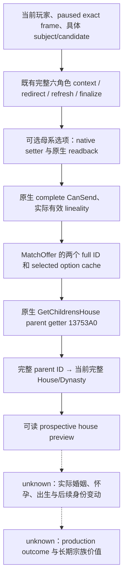

# CK3 1.20.0.2：具体婚配的原生子代 House 预览

2026-10-01 后台静态施工；EXE `1.20.0.2 (Crozier)` / Steam `25588574`，SHA-256
`AE1BA6FF060BA603842F6F4A2DED0AF4B7D3666B3DD271F75FB01B0DA8E81B2D`。本页没有新增实机证据。
现有 FAMILY48 已覆盖当前双方 House/Dynasty 与实际婚配操作的有效 lineality；本次新增原生 `MatchOffer.GetChildrensHouse`
所使用的父母选择结果，给出具体提案的 prospective House/Dynasty。它不是已经出生的子女、出生概率或宗族延续收益。

## Exact-build 原生来源

| 链路 | 新版证据 |
|---|---|
| 方法注册 | `0x1DB770` 用 `movups` 从 `0x454CF60` 拷贝 `GetChildrensHouse` 名称；`0x1DB7FB` 注册 callback `0x137A820` |
| UI formatter | callback `0x137A833` 调用 `0x13746C0`；`0x13746E8` 调用 offer vtable `+0x10`，`0x13746EE` 取该角色 House `+0x158` |
| 婚配 offer vtable | `0x454E460` 的第三项为 `0x13753A0`，原生 constructor `0x1378945` 写该 vtable |
| offer 的婚配双方 | initializer `0x1373307/0x1373318` 把 context `+0x2E0` 拷贝到 offer `+0x28`；`0x137331C/0x1373323` 将 `+0x2E4` 拷贝至 `+0x2C` |
| 选项缓存 | `0x1373C35..0x1373C43` 读取原生 matrilineal option 并存 offer `+0x80` |
| 具体 parent 选择 | `0x13753A0..0x1375475` 按完整 generation ID 解析双方；offer `+8` 空时读取缓存 `+0x80`，与 subject selector `+0x1A1` 比较；相等返回 subject，否则返回 candidate |
| House 与 Dynasty | 复用已迁移 `family_value::ReadCharacterLineage`；当前 House `+0x158` → 完整 House `+0x2C` Dynasty，合法 `-1` 保留 |

此前只有 lineality 位，不能直接把候选当前宗族称为未来子代宗族。本实现直接调用上述原生 preview getter；输入来自既有
完整 finalized pair context，并把原生 UI 所要求的两个完整 ID 和实际 selected option 拷贝至 disposable `0x88` bytes offer。
`+8` 空指针明确选择原生无窗口缓存分支；不实例化 GUI、不调用 offer initializer 的联盟数组施工、也没有命令提交。
查询同时保留 `selected_matrilineal_option` 与 `effective_matrilineal_if_accepted`，同 selector 组合下两者可能不同，不能混写。

## 能力边界与后续

查询能独立区分默认父系与选中母系提案的原生 House 预览，也能保留 native CanSend=false 的可观察负路径。不对不合法提案
赋予可执行 readiness，不从预览、接受分数或生育率构造统一效用分数。宗教仍只通过既有婚姻最终合法性结果作为 opaque 条件。
实际接受后的婚姻/婚约、出生子女及其最终 House/Dynasty 必须由随后实际状态读回；当前 preview 不升级 G2 M5 完成状态。

源码 `ck3_12002_family_obligations_lineage.hpp/.cpp`。精确 EXE 验证 **7 个 native spans、17 条语义指令、3 项 vtable** 全部 GREEN；
ABI 合同 SHA-256 `fcee71b1725c717d9711a9a35c57e74a5e4f5dac184b157a0b820197478853b9`，旁证
`artifacts/g2-offline-2026-10-01/family-obligations/lineage/abi-result.json`。

实际生产 reader 与真实 full-generation lineage helper 在 MSVC `/Od`、`/O2`、`/W4 /WX` 两种模式均 GREEN，记录为
`artifacts/g2-offline-2026-10-01/family-obligations/lineage/build/result.json`。夹具覆盖两种原生 selector × 两种选项、明确母系请求、
selected 与 effective lineality 的独立值、原生负合法性、合法无 House、真实过期 House generation、原生返回父母身份及 context
成对销毁。首次日期漂移夹具因沿用上一个测试的 getter 次数，导致 before 已经漂移而无法覆盖读取中变化；修正该夹具初始化后
上述新增用例 GREEN。首个 runner 的原始返回文本保留于工具记录，并摘录保存为本域
`lineage/attempt-01-harness-red.json`；不涉及游戏或 native ABI 改动。

后续实机由协调者在获得游戏使用窗口后执行，本次没有游戏进程操作。
