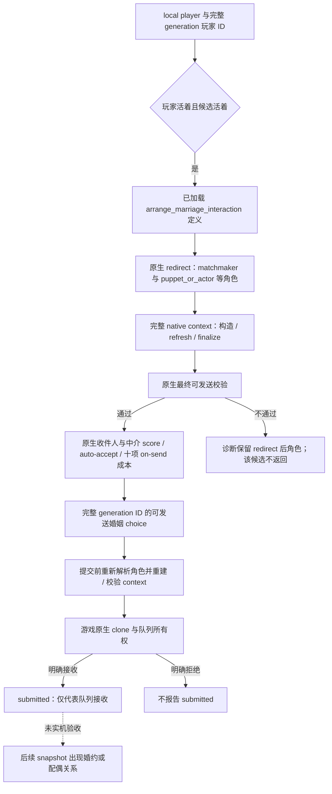

# CK3 1.20.0.2：婚姻与角色关系迁移

本页是 2026-10-01 后台静态迁移的新版本账本。构建固定为 `1.20.0.2 (Crozier)`、Steam build `25588574`，EXE SHA-256
`AE1BA6FF060BA603842F6F4A2DED0AF4B7D3666B3DD271F75FB01B0DA8E81B2D`。所有地址都是 RVA。
当前状态是 **static-ready + offline fixture**；本次没有读正在运行的游戏内存，没有注入、输入、暂停、关闭或重启游戏。

冻结文件：`artifacts/migrations/2026-09-30/post-update-1.20.0.2/installation/binaries/ck3.exe`。
同一冻结安装的 `game/common/character_interactions/00_marriage_interactions.txt` SHA-256 为
`9481FD44A078F2D06034DD4A2107FE183F231D2B49D8B90F106C1D54F7A501F0`。
ABI 和源码常量见 `ck3_autonomous_player/native_bridge/research/ck3_1_20_0_2_context.json`，实现为
`ck3_12002_context.hpp/.cpp`，使用版本无关的 `ArrangeMarriageChoice` 与诊断 DTO。

## 已闭合的原生路径

| 输入或对象 | 1.20.0.2 证据 | 迁移结果 |
|---|---|---|
| 角色家庭数据 | `0x1B971C5` 读取 `CCharacter+0x1A8` | 替换旧 `+0x1A0` |
| 婚约 | `0x1B971D6` 读取 family `+0x10`，随后完整 generation ID 解析 | 保留原生 absent 与有效角色的区分 |
| 主配偶 | `0x1B9727E` 读取 family `+0x14` | 同样验证完整 generation ID |
| 配偶数组 | `0x137598C..0x13759BB` 使用 family `+0x20`，数组指针 `+0`、count `+0x0C`、int32 stride | 枚举所有有效配偶，过滤过期 ID |
| 互动数据库 | getter `0x89DA60` 读取 slot `0x5C67538` | 私有绑定直接读取已加载数据库 |
| 安排婚姻定义 | `0x3214C90` 引用字符串 `0x470E200`，`0x3214C9E` 写 database `+0xF30` | 替换旧 `+0xF48` |
| redirect | `0x3148DE0`，原生婚姻 caller `0x1AA80CD..0x1AA810D` | **新增第六个角色指针**，旧函数签名不能复用 |
| 完整角色 context | `0x3076E50`，原生婚姻 caller `0x1AA8151` | 仍为 `0x338` bytes，使用 redirect 后角色 |
| scope 刷新和 finalize | `0x3078A60`、`0x3078C90` | 对每个查询和提交重新构造完整 native context |
| 最终可发送校验 | `0x307C040` | 直接调用原生合法性和支付能力检查 |
| 接受度 | 收件人 `0x307C460`；中介 `0x307C360` | 读取原生定点 score，scale `100000`；不把 score 说成概率 |
| 发送成本 | definition `+0x40`、scope `context+0x08`，evaluator `0x310CEE0` | 零初始化十项原生成本并调用 evaluator；保留 native 结果 |
| auto-accept | definition trigger `+0x2290`，scalar `+0x2718`；`0x372DF30` 执行 trigger | 区分原生自动接受判定与最终配偶关系 |
| 发送命令 | constructor `0x2968170`，primary/secondary vtable `0x448BCE0/0x448BCB0` | `0x368` bytes，复制 context 到 `+0x20`，两项 score 在 `+0x358/+0x360` |
| 销毁 | context destructor `0x30773A0` | source context 与命令复制的 context 各自销毁；队列独立拥有 clone |

新原版文件第 94 行开始的 redirect 直接使用 `puppet_or_actor` scope。静态 caller/callee 已证明新增第六个角色输出指针，
但尚未把该指针的标签单独绑定到 string registry，不能仅因 stock 出现新 scope 就给它臆定名称。
原生婚姻 caller 把新增输出 ID 初始化为 `-1`，传入七参数 redirect，再调用普通 all-role constructor；本实现遵循这条
确切调用链，不依赖猜测新增标签。不能把旧五个角色输出指针的函数类型仅替换成新地址。

十项成本顺序由新 formatter `0x310B460` 的十分支和 render loop `0x310C1C0` 共同证明，仍是
`gold / prestige / piety / renown / influence / herd / treasury / treasury_or_gold / merit / barter_goods`。
render loop 每次同步增加 formatter ordinal 与 `0xF0` 大小的 compiled cost 行，终止于 10；新增的
spiritual-fulfillment 状态不是第十一项成本。slot 7 仍是原生路由类别，不能直接当成独立余额。

## 原生判定与本模块的状态树

本模块没有改自动玩家策略。原版文件明确指出婚姻特殊 AI 分支会用 `ai_accept` 决定是否向玩家提出婚姻；stock
`ai_accept` 调用 `marriage_ai_accept_modifier`。候选查询调用原生最终校验，观察原生最终 score，避免自己重算这些权重。
婚姻有效目标脚本包含必要的信仰判定；它们只通过上述原生结果参与此婚姻调用，本次没有展开 faith、doctrine、tenet、
fervor、改宗或 holy order 专题。

`MarriageCandidateEvaluation12002` 提供合法候选的角色、接受度、auto-accept 与十项发送成本。保留现有查询契约时可以只返回
`ArrangeMarriageChoice`；需要这些观测时传入 evaluation 输出数组，读取失败会使该次完整查询不可用，不用 `null` 伪造完成。
接受度、auto-accept、合法性、队列 ACK 都不等于已经结婚；成功结果仍以随后关系快照为准。

## 离线验证与实机边界

- Manifest 固定 **16 个唯一签名、2 组 vtable 前缀、26 条关键指令、16 个源码常量**。签名与 vtable 从新冻结 EXE
  提取，角色新增参数由实际 native caller 和 callee 共同支持。
- MSVC 19.51 / C++20 直接构建 `ck3_12002.cpp`、`ck3_12002_commands.cpp`、`ck3_12002_context.cpp` 和
  `ck3_12002_context_test.cpp`。夹具进程只有自身数组和测试函数，执行输出
  `PASS 1.20.0.2 offline relationships, redirected marriage legality/cost/acceptance and command ownership`。
- 夹具覆盖旧 family 和 database offset 的非空诱饵、新死亡 offset、过期 generation、完整配偶数组、新增角色参数、
  redirect 后角色、原生合法候选和无合法候选、成本 evaluator 零初始化、负接受度、命令 clone、队列拒绝、命令
  vtable 不匹配及 context 成对销毁。
- Artifact：`artifacts/migrations/2026-09-30/post-update-1.20.0.2/build-context-msvc/context_test.exe`；旁证反汇编为
  `marriage-context-constructors.txt`。测试与源码 hash 保存在同目录的 `context-binding-result.json`。

剩余仅能由新构建实机完成的本域验收：在 owning-thread paused frame 读取真实角色关系和原生婚姻候选；选一个真实合法
候选后验证发送命令、付款和婚约/配偶后置关系。当前用户正在游戏中，本域实现没有执行这些步骤，也没有把旧版本 live
artifact 作为新版本的验收结果。
